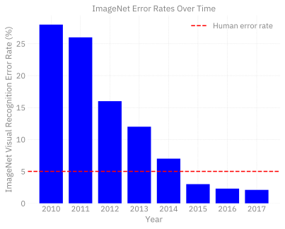
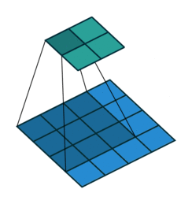
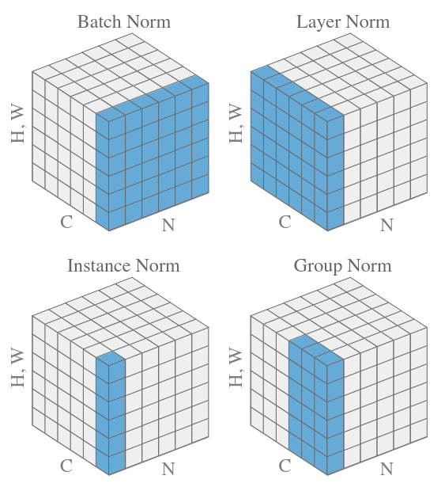
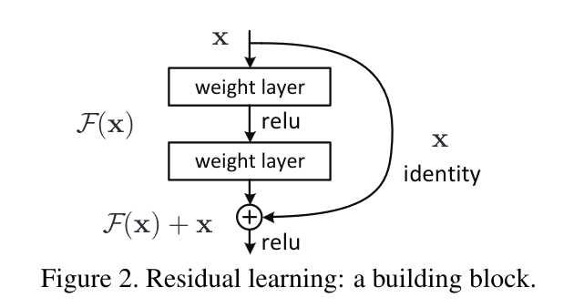
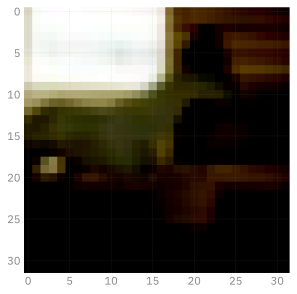
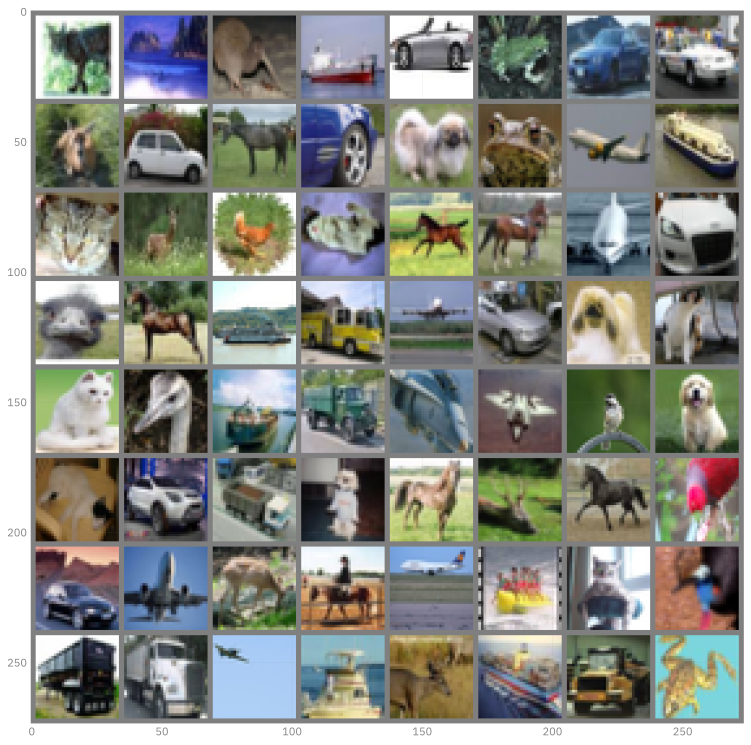
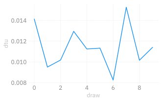
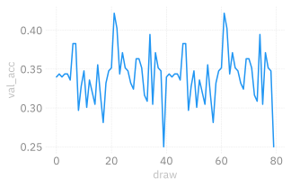

# Convolutional Neural Networks
Sam Foreman, Huihuo Zheng, Corey Adams, Bethany Lusch
2025-07-22

<link rel="preconnect" href="https://fonts.googleapis.com">

- [Convolutional Networks: A brief historical
  context](#convolutional-networks-a-brief-historical-context)
- [Convolutional Building Blocks](#convolutional-building-blocks)
  - [Convolutions](#convolutions)
  - [Normalization](#normalization)
  - [Downsampling (And upsampling)](#downsampling-and-upsampling)
  - [Residual Connections](#residual-connections)
- [Building a ConvNet](#building-a-convnet)
- [Training for Multiple Epochs](#training-for-multiple-epochs)
- [Homework 1:](#homework-1)

[](https://colab.research.google.com/github/saforem2/intro-hpc-bootcamp-2025/blob/main/docs/01-neural-networks/3-conv-nets/index.ipynb)

Up until transformers, convolutions were *the* state of the art in
computer vision.

In many ways and applications they still are!

Large Language Models, which are what we’ll focus on the rest of the
series after this lecture, are really good at ordered, \*tokenized data.
But there is lots of data that isn’t *implicitly* ordered like `images`,
and their more general cousins `graphs`.

Today’s lecture focuses on computer vision models, and particularly on
convolutional neural networks. There are a ton of applications you can
do with these, and not nearly enough time to get into them. Check out
the extra references file to see some publications to get you started if
you want to learn more.

Tip: this notebook is much faster on the GPU!

## Convolutional Networks: A brief historical context

Performance on ImageNet over time[^1]

``` python
%load_ext autoreload
%autoreload 2
%matplotlib inline
# settings for jupyter book: svg for html version, high-resolution png for pdf
import matplotlib_inline.backend_inline
matplotlib_inline.backend_inline.set_matplotlib_formats('retina', 'svg', 'png')
import matplotlib as mpl
# mpl.rcParams['figure.dpi'] = 400
```

``` python
import ambivalent
import ezpz
import matplotlib.pyplot as plt
import seaborn as sns

logger = ezpz.get_logger(__name__)
if logger.hasHandlers():
    logger.handlers.clear()

for child in logger.getChildren():
    if child.hasHandlers():
        child.handlers.clear()

logger.propagate = True

sns.set_context("notebook")
sns.set(rc={"figure.dpi": 400, "savefig.dpi": 400})
plt.style.use(ambivalent.STYLES["ambivalent"])
plt.rcParams["figure.figsize"] = [6.4, 4.8]
plt.rcParams["figure.facecolor"] = "none"
```

    [2025-07-25 15:26:34,499021][I][ezpz/__init__:265:ezpz] Setting logging level to 'INFO' on 'RANK == 0'
    [2025-07-25 15:26:34,500844][I][ezpz/__init__:266:ezpz] Setting logging level to 'CRITICAL' on all others 'RANK != 0'

``` python
# Data
data = {2010: 28, 2011: 26, 2012: 16, 2013: 12, 2014: 7, 2015: 3, 2016: 2.3, 2017: 2.1}
human_error_rate = 5

# Create bar plot
plt.bar(list(data.keys()), list(data.values()), color="blue")

# Add human error rate line
plt.axhline(y=human_error_rate, color="red", linestyle="--", label="Human error rate")

# Labels and title
plt.xlabel("Year")
plt.ylabel("ImageNet Visual Recognition Error Rate (%)")
plt.title("ImageNet Error Rates Over Time")
plt.legend()

# Display plot
plt.show()
```



## Convolutional Building Blocks

``` python
import torch
import torchvision
```

We’re going to go through some examples of building blocks for
convolutional networks. To help illustate some of these, let’s use an
image for examples:

``` python
from PIL import Image

# wget line useful in Google Colab
! wget https://raw.githubusercontent.com/argonne-lcf/ai-science-training-series/main/03_advanced_neural_networks/ALCF-Staff.jpg 2>&1 >/dev/null
alcf_image = Image.open("ALCF-Staff.jpg")
```

``` python
from matplotlib import pyplot as plt

fx, fy = plt.rcParamsDefault["figure.figsize"]
figure = plt.figure(figsize=(1.5 * fx, 1.5 * fy))
_ = plt.imshow(alcf_image)
```


### Convolutions

Convolutions are a restriction of - and a specialization of - dense
linear layers. A convolution of an image produces another image, and
each output pixel is a function of only it’s local neighborhood of
points. This is called an *inductive bias* and is a big reason why
convolutions work for image data: neighboring pixels are correlated and
you can operate on just those pixels at a time.

See examples of convolutions
[here](https://github.com/vdumoulin/conv_arithmetic)




``` python
# Let's apply a convolution to the ALCF Staff photo:
alcf_tensor = torchvision.transforms.ToTensor()(alcf_image)

# Reshape the tensor to have a batch size of 1:
alcf_tensor = alcf_tensor.reshape((1,) + alcf_tensor.shape)

# Create a random convolution:
# shape is: (channels_in, channels_out, kernel_x, kernel_y)
conv_random = torch.rand((3, 3, 15, 15))

alcf_rand = torch.nn.functional.conv2d(alcf_tensor, conv_random)
alcf_rand = (1.0 / alcf_rand.max()) * alcf_rand
logger.info(alcf_rand.shape)
alcf_rand = alcf_rand.reshape(alcf_rand.shape[1:])

logger.info(alcf_tensor.shape)

rand_image = alcf_rand.permute((1, 2, 0)).cpu()
fx, fy = plt.rcParamsDefault["figure.figsize"]
figure = plt.figure(figsize=(1.5 * fx, 1.5 * fy))
_ = plt.imshow(rand_image)
```

    [2025-07-25 15:31:07,476785][I][ipykernel_67898/3575795754:13:__main__] torch.Size([1, 3, 1111, 1986])
    [2025-07-25 15:31:07,480626][I][ipykernel_67898/3575795754:16:__main__] torch.Size([1, 3, 1125, 2000])


### Normalization

 Reference:
[Normalizations](https://arxiv.org/pdf/1903.10520.pdf)

Normalization is the act of transforming the mean and moment of your
data to standard values (usually 0.0 and 1.0). It’s particularly useful
in machine learning since it stabilizes training, and allows higher
learning rates.


Reference: [Batch Norm](https://arxiv.org/pdf/1502.03167.pdf)

``` python
# Let's apply a normalization to the ALCF Staff photo:
alcf_tensor = torchvision.transforms.ToTensor()(alcf_image)

# Reshape the tensor to have a batch size of 1:
alcf_tensor = alcf_tensor.reshape((1,) + alcf_tensor.shape)


alcf_rand = torch.nn.functional.normalize(alcf_tensor)
alcf_rand = alcf_rand.reshape(alcf_rand.shape[1:])

logger.info(alcf_tensor.shape)

rand_image = alcf_rand.permute((1, 2, 0)).cpu()

fx, fy = plt.rcParamsDefault["figure.figsize"]
figure = plt.figure(figsize=(1.5 * fx, 1.5 * fy))
_ = plt.imshow(rand_image)
```

    [2025-07-25 15:31:11,181565][I][ipykernel_67898/378276982:11:__main__] torch.Size([1, 3, 1125, 2000])


### Downsampling (And upsampling)

Downsampling is a critical component of convolutional and many vision
models. Because of the local-only nature of convolutional filters,
learning large-range features can be too slow for convergence.
Downsampling of layers can bring information from far away closer,
effectively changing what it means to be “local” as the input to a
convolution.


[Reference](https://www.researchgate.net/publication/333593451_Application_of_Transfer_Learning_Using_Convolutional_Neural_Network_Method_for_Early_Detection_of_Terry's_Nail)

``` python
# Let's apply a normalization to the ALCF Staff photo:
alcf_tensor = torchvision.transforms.ToTensor()(alcf_image)

# Reshape the tensor to have a batch size of 1:
alcf_tensor = alcf_tensor.reshape((1,) + alcf_tensor.shape)


alcf_rand = torch.nn.functional.max_pool2d(alcf_tensor, 2)
alcf_rand = alcf_rand.reshape(alcf_rand.shape[1:])

logger.info(alcf_tensor.shape)

rand_image = alcf_rand.permute((1, 2, 0)).cpu()

fx, fy = plt.rcParamsDefault["figure.figsize"]
figure = plt.figure(figsize=(1.5 * fx, 1.5 * fy))
_ = plt.imshow(rand_image)
```

    [2025-07-25 15:31:14,206298][I][ipykernel_67898/2241832520:11:__main__] torch.Size([1, 3, 1125, 2000])


### Residual Connections

One issue, quickly encountered when making convolutional networks deeper
and deeper, is the “Vanishing Gradients” problem. As layers were stacked
on top of each other, the size of updates dimished at the earlier layers
of a convolutional network. The paper “Deep Residual Learning for Image
Recognition” solved this by introduction “residual connections” as skip
layers.

Reference: [Deep Residual Learning for Image
Recognition](https://arxiv.org/pdf/1512.03385.pdf)



Compare the performance of the models before and after the introduction
of these layers:


If you have time to read only one paper on computer vision, make it this
one! Resnet was the first model to beat human accuracy on ImageNet and
is one of the most impactful papers in AI ever published.

## Building a ConvNet

In this section we’ll build and apply a conv net to the mnist dataset.
The layers here are loosely based off of the ConvNext architecture. Why?
Because we’re getting into LLM’s soon, and this ConvNet uses LLM
features. ConvNext is an update to the ResNet architecture that
outperforms it.

[ConvNext](https://arxiv.org/abs/2201.03545)

The dataset here is CIFAR-10 - slightly harder than MNIST but still
relatively easy and computationally tractable.

``` python
batch_size = 256


from torchvision import transforms

transform = transforms.Compose(
    [
        transforms.ToTensor(),
        transforms.Normalize((0.5, 0.5, 0.5), (0.5, 0.5, 0.5))
    ],
)

training_data = torchvision.datasets.CIFAR10(
    # Polaris: root="/lus/eagle/projects/datasets/CIFAR-10/",
    # Polaris: download=False,
    root="data",
    download=True,
    train=True,
    transform=transform,
)

test_data = torchvision.datasets.CIFAR10(
    # Polaris: root="/lus/eagle/projects/datasets/CIFAR-10/",
    # Polaris: download=False,
    root="data",
    download=True,
    train=False,
    transform=transform,
    # transform=v2.Compose(
    #     [
    #         torchvision.transforms.ToTensor(),
    #         v2.ConvertImageDtype(torch.bfloat16),
    #     ]
    # )
)

training_data, validation_data = torch.utils.data.random_split(
    training_data,
    [0.8, 0.2],
    generator=torch.Generator().manual_seed(55)
)


# The dataloader makes our dataset iterable
train_dataloader = torch.utils.data.DataLoader(
    training_data,
    batch_size=batch_size,
    pin_memory=True,
    shuffle=True,
    num_workers=0,
)
val_dataloader = torch.utils.data.DataLoader(
    validation_data,
    batch_size=batch_size,
    pin_memory=True,
    shuffle=False,
    num_workers=0,
)
classes = (
    'plane',
    'car',
    'bird',
    'cat',
    'deer',
    'dog',
    'frog',
    'horse',
    'ship',
    'truck'
)
```

``` python
batch, (X, Y) = next(enumerate(train_dataloader))
plt.imshow(X[0].cpu().permute((1, 2, 0)))
plt.show()
```

    [2025-07-25 16:03:17,843841][W][matplotlib/image:661] Clipping input data to the valid range for imshow with RGB data ([0..1] for floats or [0..255] for integers). Got range [-0.6..0.52156866].



``` python
import numpy as np

def imshow(img):
    img = img / 2 + 0.5     # unnormalize
    npimg = img.numpy()
    plt.imshow(np.transpose(npimg, (1, 2, 0)))
    plt.show()


# get some random training images
images, labels = next(iter(train_dataloader))

fx, fy= plt.rcParamsDefault['figure.figsize']
fig = plt.figure(figsize=(2 * fx, 4 * fy))
# show images
imshow(torchvision.utils.make_grid(images))
# print labels
logger.info("\n" + " ".join(f"{classes[labels[j]]:5s}" for j in range(batch_size)))
```



    [2025-07-25 16:03:26,019789][I][ipykernel_67898/2917342340:18:__main__] 
    car   car   bird  ship  horse ship  truck horse horse deer  dog   horse truck cat   ship  frog  ship  bird  dog   horse horse deer  car   ship  plane horse bird  plane ship  deer  frog  ship  truck bird  ship  bird  ship  truck dog   horse ship  plane deer  truck cat   ship  horse dog   horse ship  bird  truck ship  frog  deer  dog   frog  plane car   car   horse dog   cat   deer  horse frog  deer  deer  deer  frog  dog   dog   frog  car   truck dog   car   cat   frog  horse frog  horse plane truck plane deer  dog   horse cat   frog  deer  cat   truck truck plane bird  cat   dog   horse car   truck deer  car   bird  truck truck car   ship  horse ship  plane dog   plane frog  deer  bird  plane ship  cat   car   cat   deer  cat   truck deer  cat   car   horse dog   horse bird  truck bird  cat   horse plane bird  car   plane horse ship  frog  cat   plane truck truck car   truck frog  horse car   cat   plane frog  horse horse cat   cat   truck bird  cat   bird  ship  ship  dog   frog  frog  deer  car   horse truck plane cat   plane deer  ship  dog   frog  frog  cat   bird  ship  dog   truck frog  dog   horse bird  deer  bird  car   dog   ship  horse ship  car   ship  deer  car   truck truck dog   deer  horse deer  plane cat   plane cat   ship  truck cat   truck cat   bird  horse cat   ship  dog   horse horse truck deer  frog  ship  plane dog   cat   car   truck horse frog  horse plane ship  truck frog  horse plane car   plane cat   dog   bird  car   ship  ship  deer  horse truck deer  horse plane deer  dog   horse

This code below is important as our models get bigger: this is wrapping
the pytorch data loaders to put the data onto the GPU!

``` python
dev = torch.device("cuda") if torch.cuda.is_available() else torch.device("cpu")

def preprocess(x, y):
    # CIFAR-10 is *color* images so 3 layers!
    x = x.view(-1, 3, 32, 32)
    #  y = y.to(dtype)
    return (
        x.to(dev),
        y.to(dev)
    )

class WrappedDataLoader:
    def __init__(self, dl, func):
        self.dl = dl
        self.func = func

    def __len__(self):
        return len(self.dl)

    def __iter__(self):
        for b in self.dl:
            yield (self.func(*b))

train_dataloader = WrappedDataLoader(train_dataloader, preprocess)
val_dataloader = WrappedDataLoader(val_dataloader, preprocess)
```

``` python
from typing import Optional

from torch import nn

class Downsampler(nn.Module):
    def __init__(self, in_channels, out_channels, shape, stride=2):
        super(Downsampler, self).__init__()
        self.norm = nn.LayerNorm([in_channels, *shape])
        self.downsample = nn.Conv2d(
            in_channels=in_channels,
            out_channels=out_channels,
            kernel_size=stride,
            stride=stride,
        )

    def forward(self, inputs):
        return self.downsample(self.norm(inputs))


class ConvNextBlock(nn.Module):
    """This block of operations is loosely based on this paper:"""

    def __init__(
        self, in_channels, shape, kernel_size: Optional[None] = None,
    ):
        super(ConvNextBlock, self).__init__()
        # Depthwise, seperable convolution with a large number of output filters:
        kernel_size = [7, 7] if kernel_size is None else kernel_size
        self.conv1 = nn.Conv2d(
            in_channels=in_channels,
            out_channels=in_channels,
            groups=in_channels,
            kernel_size=kernel_size,
            padding="same",
        )
        self.norm = nn.LayerNorm([in_channels, *shape])
        # Two more convolutions:
        self.conv2 = nn.Conv2d(
            in_channels=in_channels, out_channels=4 * in_channels, kernel_size=1
        )
        self.conv3 = nn.Conv2d(
            in_channels=4 * in_channels, out_channels=in_channels, kernel_size=1
        )

    def forward(self, inputs):
        x = self.conv1(inputs)
        # The normalization layer:
        x = self.norm(x)
        x = self.conv2(x)
        # The non-linear activation layer:
        x = torch.nn.functional.gelu(x)
        x = self.conv3(x)
        # This makes it a residual network:
        return x + inputs


class Classifier(nn.Module):
    def __init__(
        self,
        n_initial_filters,
        n_stages,
        blocks_per_stage,
        kernel_size: Optional[None] = None,
    ):
        super(Classifier, self).__init__()
        # This is a downsampling convolution that will produce patches of output.
        # This is similar to what vision transformers do to tokenize the images.
        self.stem = nn.Conv2d(
            in_channels=3,
            out_channels=n_initial_filters,
            kernel_size=1,
            stride=1
        )
        current_shape = [32, 32]
        self.norm1 = nn.LayerNorm([n_initial_filters, *current_shape])
        # self.norm1 = WrappedLayerNorm()
        current_n_filters = n_initial_filters
        self.layers = nn.Sequential()
        for i, n_blocks in enumerate(range(n_stages)):
            # Add a convnext block series:
            for _ in range(blocks_per_stage):
                self.layers.append(
                    ConvNextBlock(
                        in_channels=current_n_filters,
                        shape=current_shape,
                        kernel_size=kernel_size,
                    )
                )
            # Add a downsampling layer:
            if i != n_stages - 1:
                # Skip downsampling if it's the last layer!
                self.layers.append(
                    Downsampler(
                        in_channels=current_n_filters,
                        out_channels=2 * current_n_filters,
                        shape=current_shape,
                    )
                )
                # Double the number of filters:
                current_n_filters = 2 * current_n_filters
                # Cut the shape in half:
                current_shape = [cs // 2 for cs in current_shape]
        self.head = nn.Sequential(
            nn.Flatten(),
            nn.LayerNorm(current_n_filters),
            nn.Linear(current_n_filters, 10),
        )
        # self.norm2 = nn.InstanceNorm2d(current_n_filters)
        # # This brings it down to one channel / class
        # self.bottleneck = nn.Conv2d(in_channels=current_n_filters, out_channels=10,
        #                                   kernel_size=1, stride=1)

    def forward(self, x):
        x = self.stem(x)
        # Apply a normalization after the initial patching:
        x = self.norm1(x)
        # Apply the main chunk of the network:
        x = self.layers(x)
        # Normalize and readout:
        x = nn.functional.avg_pool2d(x, x.shape[2:])
        x = self.head(x)
        return x

        # x = self.norm2(x)
        # x = self.bottleneck(x)

        # # Average pooling of the remaining spatial dimensions (and reshape) makes this label-like:
        # return nn.functional.avg_pool2d(x, kernel_size=x.shape[-2:]).reshape((-1,10))
```

``` python
!pip install torchinfo # if not on Polaris
```

``` python
model = Classifier(32, 4, 2, kernel_size=(4, 4))
#model = model.to(dtype)
model.to(device=dev)
# model.to(torch.bfloat16)

from torchinfo import summary

logger.info(f"\n{summary(model, input_size=(batch_size, 3, 32, 32))}")
```

    [2025-07-25 16:08:28,414533][I][ipykernel_67898/1906784419:8:__main__] 
    ==========================================================================================
    Layer (type:depth-idx)                   Output Shape              Param #
    ==========================================================================================
    Classifier                               [256, 10]                 --
    ├─Conv2d: 1-1                            [256, 32, 32, 32]         128
    ├─LayerNorm: 1-2                         [256, 32, 32, 32]         65,536
    ├─Sequential: 1-3                        [256, 256, 4, 4]          --
    │    └─ConvNextBlock: 2-1                [256, 32, 32, 32]         --
    │    │    └─Conv2d: 3-1                  [256, 32, 32, 32]         544
    │    │    └─LayerNorm: 3-2               [256, 32, 32, 32]         65,536
    │    │    └─Conv2d: 3-3                  [256, 128, 32, 32]        4,224
    │    │    └─Conv2d: 3-4                  [256, 32, 32, 32]         4,128
    │    └─ConvNextBlock: 2-2                [256, 32, 32, 32]         --
    │    │    └─Conv2d: 3-5                  [256, 32, 32, 32]         544
    │    │    └─LayerNorm: 3-6               [256, 32, 32, 32]         65,536
    │    │    └─Conv2d: 3-7                  [256, 128, 32, 32]        4,224
    │    │    └─Conv2d: 3-8                  [256, 32, 32, 32]         4,128
    │    └─Downsampler: 2-3                  [256, 64, 16, 16]         --
    │    │    └─LayerNorm: 3-9               [256, 32, 32, 32]         65,536
    │    │    └─Conv2d: 3-10                 [256, 64, 16, 16]         8,256
    │    └─ConvNextBlock: 2-4                [256, 64, 16, 16]         --
    │    │    └─Conv2d: 3-11                 [256, 64, 16, 16]         1,088
    │    │    └─LayerNorm: 3-12              [256, 64, 16, 16]         32,768
    │    │    └─Conv2d: 3-13                 [256, 256, 16, 16]        16,640
    │    │    └─Conv2d: 3-14                 [256, 64, 16, 16]         16,448
    │    └─ConvNextBlock: 2-5                [256, 64, 16, 16]         --
    │    │    └─Conv2d: 3-15                 [256, 64, 16, 16]         1,088
    │    │    └─LayerNorm: 3-16              [256, 64, 16, 16]         32,768
    │    │    └─Conv2d: 3-17                 [256, 256, 16, 16]        16,640
    │    │    └─Conv2d: 3-18                 [256, 64, 16, 16]         16,448
    │    └─Downsampler: 2-6                  [256, 128, 8, 8]          --
    │    │    └─LayerNorm: 3-19              [256, 64, 16, 16]         32,768
    │    │    └─Conv2d: 3-20                 [256, 128, 8, 8]          32,896
    │    └─ConvNextBlock: 2-7                [256, 128, 8, 8]          --
    │    │    └─Conv2d: 3-21                 [256, 128, 8, 8]          2,176
    │    │    └─LayerNorm: 3-22              [256, 128, 8, 8]          16,384
    │    │    └─Conv2d: 3-23                 [256, 512, 8, 8]          66,048
    │    │    └─Conv2d: 3-24                 [256, 128, 8, 8]          65,664
    │    └─ConvNextBlock: 2-8                [256, 128, 8, 8]          --
    │    │    └─Conv2d: 3-25                 [256, 128, 8, 8]          2,176
    │    │    └─LayerNorm: 3-26              [256, 128, 8, 8]          16,384
    │    │    └─Conv2d: 3-27                 [256, 512, 8, 8]          66,048
    │    │    └─Conv2d: 3-28                 [256, 128, 8, 8]          65,664
    │    └─Downsampler: 2-9                  [256, 256, 4, 4]          --
    │    │    └─LayerNorm: 3-29              [256, 128, 8, 8]          16,384
    │    │    └─Conv2d: 3-30                 [256, 256, 4, 4]          131,328
    │    └─ConvNextBlock: 2-10               [256, 256, 4, 4]          --
    │    │    └─Conv2d: 3-31                 [256, 256, 4, 4]          4,352
    │    │    └─LayerNorm: 3-32              [256, 256, 4, 4]          8,192
    │    │    └─Conv2d: 3-33                 [256, 1024, 4, 4]         263,168
    │    │    └─Conv2d: 3-34                 [256, 256, 4, 4]          262,400
    │    └─ConvNextBlock: 2-11               [256, 256, 4, 4]          --
    │    │    └─Conv2d: 3-35                 [256, 256, 4, 4]          4,352
    │    │    └─LayerNorm: 3-36              [256, 256, 4, 4]          8,192
    │    │    └─Conv2d: 3-37                 [256, 1024, 4, 4]         263,168
    │    │    └─Conv2d: 3-38                 [256, 256, 4, 4]          262,400
    ├─Sequential: 1-4                        [256, 10]                 --
    │    └─Flatten: 2-12                     [256, 256]                --
    │    └─LayerNorm: 2-13                   [256, 256]                512
    │    └─Linear: 2-14                      [256, 10]                 2,570
    ==========================================================================================
    Total params: 2,015,434
    Trainable params: 2,015,434
    Non-trainable params: 0
    Total mult-adds (Units.GIGABYTES): 19.63
    ==========================================================================================
    Input size (MB): 3.15
    Forward/backward pass size (MB): 2072.53
    Params size (MB): 8.06
    Estimated Total Size (MB): 2083.74
    ==========================================================================================

``` python
def evaluate(dataloader, model, loss_fn, val_bar):
    # Set the model to evaluation mode - some NN pieces behave differently during training
    # Unnecessary in this situation but added for best practices
    model.eval()
    size = len(dataloader)
    num_batches = len(dataloader)
    loss, correct = 0, 0

    # We can save computation and memory by not calculating gradients here - we aren't optimizing
    with torch.no_grad():
        # loop over all of the batches
        for X, y in dataloader:
            pred = model(X.to(DTYPE))
            loss += loss_fn(pred, y).item()
            # how many are correct in this batch? Tracking for accuracy
            correct += (pred.argmax(1) == y).type(torch.float).sum().item()
            val_bar.update()

    loss /= num_batches
    correct /= size * batch_size

    accuracy = 100 * correct
    return accuracy, loss
```

``` python
import time
from torch import nn

DTYPE = torch.bfloat16
DEVICE = ezpz.get_torch_device_type()

loss_fn = nn.CrossEntropyLoss()
optimizer = torch.optim.AdamW(model.parameters(), lr=2.5e-4)

def eval_step(x, y):
    with torch.no_grad():
        t0 = time.perf_counter()
        pred = model(x.to(DTYPE))
        t1 = time.perf_counter()
        loss = loss_fn(pred, y).item()
        correct = (pred.argmax(1) == y).type(torch.float).sum().item()
        t2 = time.perf_counter()
    return {
        "loss": loss,
        "acc": correct / y.shape[0],
        "dtf": t1 - t0,
        "dtm": t2 - t1,
    }

def train_step(x, y):
    t0 = time.perf_counter()
    # Forward pass
    with torch.autocast(dtype=DTYPE, device_type=DEVICE):
        pred = model(x.to(DTYPE))
    loss = loss_fn(pred, y)
    t1 = time.perf_counter()

    # Backward pass
    loss.backward()
    t2 = time.perf_counter()

    # Update weights
    optimizer.step()
    t3 = time.perf_counter()

    # Reset gradients
    optimizer.zero_grad()
    t4 = time.perf_counter()

    return loss.item(), {
        "dtf": t1 - t0,
        "dtb": t2 - t1,
        "dtu": t3 - t2,
        "dtz": t4 - t3,
    }


def train_one_epoch(
    dataloader, model, loss_fn, optimizer, progress_bar, history: ezpz.History | None
):
    model.train()
    t0 = time.perf_counter()
    batch_metrics = {}
    for batch, (X, y) in enumerate(dataloader):
        loss, metrics = train_step(x, y)
        progress_bar.update()
        metrics = {"bidx": batch, "loss": loss, **metrics}
        batch_metrics[batch] = metrics
        if history is not None:
            logger.info(history.update(metrics))
    t1 = time.perf_counter()
    batch_metrics |= {"dt_batch": t1 - t0}
    # if history is not None:
    #     _ = history.update({"dt_batch": t1 - t0})
    return batch_metrics

def train_one_epoch1(
    dataloader, model, loss_fn, optimizer, progress_bar, history: ezpz.History | None
):
    model.train()
    t0 = time.perf_counter()
    batch_metrics = {}
    for batch, (X, y) in enumerate(dataloader):
        _t0 = time.perf_counter()
        # forward pass
        pred = model(X)
        _t1 = time.perf_counter()
        loss = loss_fn(pred, y)
        _t2 = time.perf_counter()
        # backward pass calculates gradients
        loss.backward()
        _t3 = time.perf_counter()
        # take one step with these gradients
        optimizer.step()
        _t4 = time.perf_counter()
        # resets the gradients
        optimizer.zero_grad()
        _t5 = time.perf_counter()
        progress_bar.update()
        metrics = {
            "bidx": batch,
            "loss": loss.item(),
            "dtf": (_t1 - _t0),
            "dtl": (_t2 - _t1),
            "dtb": (_t3 - _t2),
            "dto": (_t4 - _t3),
            "dtz": (_t5 - _t4),
        }
        batch_metrics[batch] = metrics
        if history is not None:
            summary = history.update(metrics)
    t1 = time.perf_counter()
    batch_metrics |= {
        "dt_batch": t1 - t0,
    }
    return batch_metrics
```

``` python
model.to(DTYPE)
```

    Classifier(
      (stem): Conv2d(3, 32, kernel_size=(1, 1), stride=(1, 1))
      (norm1): LayerNorm((32, 32, 32), eps=1e-05, elementwise_affine=True)
      (layers): Sequential(
        (0): ConvNextBlock(
          (conv1): Conv2d(32, 32, kernel_size=(4, 4), stride=(1, 1), padding=same, groups=32)
          (norm): LayerNorm((32, 32, 32), eps=1e-05, elementwise_affine=True)
          (conv2): Conv2d(32, 128, kernel_size=(1, 1), stride=(1, 1))
          (conv3): Conv2d(128, 32, kernel_size=(1, 1), stride=(1, 1))
        )
        (1): ConvNextBlock(
          (conv1): Conv2d(32, 32, kernel_size=(4, 4), stride=(1, 1), padding=same, groups=32)
          (norm): LayerNorm((32, 32, 32), eps=1e-05, elementwise_affine=True)
          (conv2): Conv2d(32, 128, kernel_size=(1, 1), stride=(1, 1))
          (conv3): Conv2d(128, 32, kernel_size=(1, 1), stride=(1, 1))
        )
        (2): Downsampler(
          (norm): LayerNorm((32, 32, 32), eps=1e-05, elementwise_affine=True)
          (downsample): Conv2d(32, 64, kernel_size=(2, 2), stride=(2, 2))
        )
        (3): ConvNextBlock(
          (conv1): Conv2d(64, 64, kernel_size=(4, 4), stride=(1, 1), padding=same, groups=64)
          (norm): LayerNorm((64, 16, 16), eps=1e-05, elementwise_affine=True)
          (conv2): Conv2d(64, 256, kernel_size=(1, 1), stride=(1, 1))
          (conv3): Conv2d(256, 64, kernel_size=(1, 1), stride=(1, 1))
        )
        (4): ConvNextBlock(
          (conv1): Conv2d(64, 64, kernel_size=(4, 4), stride=(1, 1), padding=same, groups=64)
          (norm): LayerNorm((64, 16, 16), eps=1e-05, elementwise_affine=True)
          (conv2): Conv2d(64, 256, kernel_size=(1, 1), stride=(1, 1))
          (conv3): Conv2d(256, 64, kernel_size=(1, 1), stride=(1, 1))
        )
        (5): Downsampler(
          (norm): LayerNorm((64, 16, 16), eps=1e-05, elementwise_affine=True)
          (downsample): Conv2d(64, 128, kernel_size=(2, 2), stride=(2, 2))
        )
        (6): ConvNextBlock(
          (conv1): Conv2d(128, 128, kernel_size=(4, 4), stride=(1, 1), padding=same, groups=128)
          (norm): LayerNorm((128, 8, 8), eps=1e-05, elementwise_affine=True)
          (conv2): Conv2d(128, 512, kernel_size=(1, 1), stride=(1, 1))
          (conv3): Conv2d(512, 128, kernel_size=(1, 1), stride=(1, 1))
        )
        (7): ConvNextBlock(
          (conv1): Conv2d(128, 128, kernel_size=(4, 4), stride=(1, 1), padding=same, groups=128)
          (norm): LayerNorm((128, 8, 8), eps=1e-05, elementwise_affine=True)
          (conv2): Conv2d(128, 512, kernel_size=(1, 1), stride=(1, 1))
          (conv3): Conv2d(512, 128, kernel_size=(1, 1), stride=(1, 1))
        )
        (8): Downsampler(
          (norm): LayerNorm((128, 8, 8), eps=1e-05, elementwise_affine=True)
          (downsample): Conv2d(128, 256, kernel_size=(2, 2), stride=(2, 2))
        )
        (9): ConvNextBlock(
          (conv1): Conv2d(256, 256, kernel_size=(4, 4), stride=(1, 1), padding=same, groups=256)
          (norm): LayerNorm((256, 4, 4), eps=1e-05, elementwise_affine=True)
          (conv2): Conv2d(256, 1024, kernel_size=(1, 1), stride=(1, 1))
          (conv3): Conv2d(1024, 256, kernel_size=(1, 1), stride=(1, 1))
        )
        (10): ConvNextBlock(
          (conv1): Conv2d(256, 256, kernel_size=(4, 4), stride=(1, 1), padding=same, groups=256)
          (norm): LayerNorm((256, 4, 4), eps=1e-05, elementwise_affine=True)
          (conv2): Conv2d(256, 1024, kernel_size=(1, 1), stride=(1, 1))
          (conv3): Conv2d(1024, 256, kernel_size=(1, 1), stride=(1, 1))
        )
      )
      (head): Sequential(
        (0): Flatten(start_dim=1, end_dim=-1)
        (1): LayerNorm((256,), eps=1e-05, elementwise_affine=True)
        (2): Linear(in_features=256, out_features=10, bias=True)
      )
    )

``` python
_x, _y = next(iter(val_dataloader))
logger.info(f"{eval_step(_x.to(DTYPE), _y)}")
```

    [2025-07-25 16:10:48,954772][I][ipykernel_67898/1550865217:2:__main__] {'loss': 2.4375, 'acc': 0.08984375, 'dtf': 1.3937692500185221, 'dtm': 0.006061082938686013}

``` python
mods = list(model.modules())
m = mods[0]
m.layers[0].conv1.weight.dtype
```

    torch.bfloat16

``` python
import ezpz
from tqdm.notebook import tqdm

history = ezpz.History()
model.train()
for i in range(50):
    t0 = time.perf_counter()
    # with torch.autocast(dtype=dtype, device_type=ezpz.get_torch_device_type()):
    x, y = next(iter(train_dataloader))
    t1 = time.perf_counter()
    loss, dt = train_step(x, y)
    if i % 1 == 0:
        
        logger.info("\n" +
            history.update(
                {
                    "train/iter": i,
                    "train/loss": loss,
                    "train/dtd": t1 - t0,
                    **{f"train/{k}": v for k, v in dt.items()},
                },
            ).replace("/", ".")
        )
```

    [2025-07-25 16:12:56,128498][I][ipykernel_67898/587244271:13:__main__] 
    train.iter=0 train.loss=2.484375 train.dtd=0.024490 train.dtf=1.432345 train.dtb=11.115532 train.dtu=0.019517 train.dtz=0.000435
    [2025-07-25 16:13:07,680308][I][ipykernel_67898/587244271:13:__main__] 
    train.iter=1 train.loss=2.531250 train.dtd=0.028146 train.dtf=1.602640 train.dtb=9.906646 train.dtu=0.009997 train.dtz=0.000779
    19,460064][I][ipykernel_67898/587244271:13:__main__] 
    train.iter=1 train.loss=2.531250 train.dtd=0.028146 train.dtf=1.602640 train.dtb=9.906646 train.dtu=0.009997 train.dtz=0.000779

    train.iter=2 train.loss=2.390625 train.dtd=0.017980 train.dtf=1.301329 train.dtb=10.419813 train.dtu=0.035567 train.dtz=0.002696
    [2025-07-25 16:13:31,484096][I][ipykernel_67898/587244271:13:__main__] =2.531250 train.dtd=0.028146 train.dtf=1.602640 train.dtb=9.906646 train.dtu=0.009997 train.dtz=0.000779

    train.iter=2 train.loss=2.390625 train.dtd=0.017980 train.dtf=1.301329 train.dtb=10.419813 train.dtu=0.035567 train.dtz=0.002696

    train.iter=3 train.loss=2.234375 train.dtd=0.023278 train.dtf=1.456378 train.dtb=10.517263 train.dtu=0.013112 train.dtz=0.000596
    42,388669][I][ipykernel_67898/587244271:13:__main__] =2.531250 train.dtd=0.028146 train.dtf=1.602640 train.dtb=9.906646 train.dtu=0.009997 train.dtz=0.000779

    train.iter=2 train.loss=2.390625 train.dtd=0.017980 train.dtf=1.301329 train.dtb=10.419813 train.dtu=0.035567 train.dtz=0.002696

    train.iter=3 train.loss=2.234375 train.dtd=0.023278 train.dtf=1.456378 train.dtb=10.517263 train.dtu=0.013112 train.dtz=0.000596

    train.iter=4 train.loss=2.234375 train.dtd=0.016922 train.dtf=1.299828 train.dtb=9.575038 train.dtu=0.009346 train.dtz=0.001203
    [2025-07-25 16:13:53,324214][I][ipykernel_67898/587244271:13:__main__] [0m=0.028146 train.dtf=1.602640 train.dtb=9.906646 train.dtu=0.009997 train.dtz=0.000779

    train.iter=2 train.loss=2.390625 train.dtd=0.017980 train.dtf=1.301329 train.dtb=10.419813 train.dtu=0.035567 train.dtz=0.002696

    train.iter=3 train.loss=2.234375 train.dtd=0.023278 train.dtf=1.456378 train.dtb=10.517263 train.dtu=0.013112 train.dtz=0.000596

    train.iter=4 train.loss=2.234375 train.dtd=0.016922 train.dtf=1.299828 train.dtb=9.575038 train.dtu=0.009346 train.dtz=0.001203

    train.iter=5 train.loss=2.234375 train.dtd=0.017019 train.dtf=1.308216 train.dtb=9.597561 train.dtu=0.010874 train.dtz=0.000742
    4:04,443205][I][ipykernel_67898/587244271:13:__main__] [0m=0.028146 train.dtf=1.602640 train.dtb=9.906646 train.dtu=0.009997 train.dtz=0.000779

    train.iter=2 train.loss=2.390625 train.dtd=0.017980 train.dtf=1.301329 train.dtb=10.419813 train.dtu=0.035567 train.dtz=0.002696

    train.iter=3 train.loss=2.234375 train.dtd=0.023278 train.dtf=1.456378 train.dtb=10.517263 train.dtu=0.013112 train.dtz=0.000596

    train.iter=4 train.loss=2.234375 train.dtd=0.016922 train.dtf=1.299828 train.dtb=9.575038 train.dtu=0.009346 train.dtz=0.001203

    train.iter=5 train.loss=2.234375 train.dtd=0.017019 train.dtf=1.308216 train.dtb=9.597561 train.dtu=0.010874 train.dtz=0.000742

    train.iter=6 train.loss=2.171875 train.dtd=0.015302 train.dtf=1.309560 train.dtb=9.780431 train.dtu=0.011015 train.dtz=0.001556
    [2025-07-25 16:14:15,397988][I][ipykernel_67898/587244271:13:__main__] =1.602640 train.dtb=9.906646 train.dtu=0.009997 train.dtz=0.000779

    train.iter=2 train.loss=2.390625 train.dtd=0.017980 train.dtf=1.301329 train.dtb=10.419813 train.dtu=0.035567 train.dtz=0.002696

    train.iter=3 train.loss=2.234375 train.dtd=0.023278 train.dtf=1.456378 train.dtb=10.517263 train.dtu=0.013112 train.dtz=0.000596

    train.iter=4 train.loss=2.234375 train.dtd=0.016922 train.dtf=1.299828 train.dtb=9.575038 train.dtu=0.009346 train.dtz=0.001203

    train.iter=5 train.loss=2.234375 train.dtd=0.017019 train.dtf=1.308216 train.dtb=9.597561 train.dtu=0.010874 train.dtz=0.000742

    train.iter=6 train.loss=2.171875 train.dtd=0.015302 train.dtf=1.309560 train.dtb=9.780431 train.dtu=0.011015 train.dtz=0.001556

    train.iter=7 train.loss=2.187500 train.dtd=0.017555 train.dtf=1.306062 train.dtb=9.618384 train.dtu=0.010146 train.dtz=0.001433
    26,269775][I][ipykernel_67898/587244271:13:__main__] =1.602640 train.dtb=9.906646 train.dtu=0.009997 train.dtz=0.000779

    train.iter=2 train.loss=2.390625 train.dtd=0.017980 train.dtf=1.301329 train.dtb=10.419813 train.dtu=0.035567 train.dtz=0.002696

    train.iter=3 train.loss=2.234375 train.dtd=0.023278 train.dtf=1.456378 train.dtb=10.517263 train.dtu=0.013112 train.dtz=0.000596

    train.iter=4 train.loss=2.234375 train.dtd=0.016922 train.dtf=1.299828 train.dtb=9.575038 train.dtu=0.009346 train.dtz=0.001203

    train.iter=5 train.loss=2.234375 train.dtd=0.017019 train.dtf=1.308216 train.dtb=9.597561 train.dtu=0.010874 train.dtz=0.000742

    train.iter=6 train.loss=2.171875 train.dtd=0.015302 train.dtf=1.309560 train.dtb=9.780431 train.dtu=0.011015 train.dtz=0.001556

    train.iter=7 train.loss=2.187500 train.dtd=0.017555 train.dtf=1.306062 train.dtb=9.618384 train.dtu=0.010146 train.dtz=0.001433

    train.iter=8 train.loss=2.171875 train.dtd=0.016442 train.dtf=1.302922 train.dtb=9.540729 train.dtu=0.009466 train.dtz=0.000812
    [2025-07-25 16:14:37,302913][I][ipykernel_67898/587244271:13:__main__] [0m=9.906646 train.dtu=0.009997 train.dtz=0.000779

    train.iter=2 train.loss=2.390625 train.dtd=0.017980 train.dtf=1.301329 train.dtb=10.419813 train.dtu=0.035567 train.dtz=0.002696

    train.iter=3 train.loss=2.234375 train.dtd=0.023278 train.dtf=1.456378 train.dtb=10.517263 train.dtu=0.013112 train.dtz=0.000596

    train.iter=4 train.loss=2.234375 train.dtd=0.016922 train.dtf=1.299828 train.dtb=9.575038 train.dtu=0.009346 train.dtz=0.001203

    train.iter=5 train.loss=2.234375 train.dtd=0.017019 train.dtf=1.308216 train.dtb=9.597561 train.dtu=0.010874 train.dtz=0.000742

    train.iter=6 train.loss=2.171875 train.dtd=0.015302 train.dtf=1.309560 train.dtb=9.780431 train.dtu=0.011015 train.dtz=0.001556

    train.iter=7 train.loss=2.187500 train.dtd=0.017555 train.dtf=1.306062 train.dtb=9.618384 train.dtu=0.010146 train.dtz=0.001433

    train.iter=8 train.loss=2.171875 train.dtd=0.016442 train.dtf=1.302922 train.dtb=9.540729 train.dtu=0.009466 train.dtz=0.000812

    train.iter=9 train.loss=2.078125 train.dtd=0.016107 train.dtf=1.477175 train.dtb=9.528106 train.dtu=0.009435 train.dtz=0.000633
    48,335749][I][ipykernel_67898/587244271:13:__main__] [0m=9.906646 train.dtu=0.009997 train.dtz=0.000779

    train.iter=2 train.loss=2.390625 train.dtd=0.017980 train.dtf=1.301329 train.dtb=10.419813 train.dtu=0.035567 train.dtz=0.002696

    train.iter=3 train.loss=2.234375 train.dtd=0.023278 train.dtf=1.456378 train.dtb=10.517263 train.dtu=0.013112 train.dtz=0.000596

    train.iter=4 train.loss=2.234375 train.dtd=0.016922 train.dtf=1.299828 train.dtb=9.575038 train.dtu=0.009346 train.dtz=0.001203

    train.iter=5 train.loss=2.234375 train.dtd=0.017019 train.dtf=1.308216 train.dtb=9.597561 train.dtu=0.010874 train.dtz=0.000742

    train.iter=6 train.loss=2.171875 train.dtd=0.015302 train.dtf=1.309560 train.dtb=9.780431 train.dtu=0.011015 train.dtz=0.001556

    train.iter=7 train.loss=2.187500 train.dtd=0.017555 train.dtf=1.306062 train.dtb=9.618384 train.dtu=0.010146 train.dtz=0.001433

    train.iter=8 train.loss=2.171875 train.dtd=0.016442 train.dtf=1.302922 train.dtb=9.540729 train.dtu=0.009466 train.dtz=0.000812

    train.iter=9 train.loss=2.078125 train.dtd=0.016107 train.dtf=1.477175 train.dtb=9.528106 train.dtu=0.009435 train.dtz=0.000633

    train.iter=10 train.loss=2.078125 train.dtd=0.016117 train.dtf=1.462501 train.dtb=9.544228 train.dtu=0.008660 train.dtz=0.000227
    [2025-07-25 16:14:59,458915][I][ipykernel_67898/587244271:13:__main__] 0m=0.009997 train.dtz=0.000779

    train.iter=2 train.loss=2.390625 train.dtd=0.017980 train.dtf=1.301329 train.dtb=10.419813 train.dtu=0.035567 train.dtz=0.002696

    train.iter=3 train.loss=2.234375 train.dtd=0.023278 train.dtf=1.456378 train.dtb=10.517263 train.dtu=0.013112 train.dtz=0.000596

    train.iter=4 train.loss=2.234375 train.dtd=0.016922 train.dtf=1.299828 train.dtb=9.575038 train.dtu=0.009346 train.dtz=0.001203

    train.iter=5 train.loss=2.234375 train.dtd=0.017019 train.dtf=1.308216 train.dtb=9.597561 train.dtu=0.010874 train.dtz=0.000742

    train.iter=6 train.loss=2.171875 train.dtd=0.015302 train.dtf=1.309560 train.dtb=9.780431 train.dtu=0.011015 train.dtz=0.001556

    train.iter=7 train.loss=2.187500 train.dtd=0.017555 train.dtf=1.306062 train.dtb=9.618384 train.dtu=0.010146 train.dtz=0.001433

    train.iter=8 train.loss=2.171875 train.dtd=0.016442 train.dtf=1.302922 train.dtb=9.540729 train.dtu=0.009466 train.dtz=0.000812

    train.iter=9 train.loss=2.078125 train.dtd=0.016107 train.dtf=1.477175 train.dtb=9.528106 train.dtu=0.009435 train.dtz=0.000633

    train.iter=10 train.loss=2.078125 train.dtd=0.016117 train.dtf=1.462501 train.dtb=9.544228 train.dtu=0.008660 train.dtz=0.000227

    train.iter=11 train.loss=2.093750 train.dtd=0.017514 train.dtf=1.317774 train.dtb=9.775683 train.dtu=0.010217 train.dtz=0.000928
    5:10,366421][I][ipykernel_67898/587244271:13:__main__] 0m=0.009997 train.dtz=0.000779

    train.iter=2 train.loss=2.390625 train.dtd=0.017980 train.dtf=1.301329 train.dtb=10.419813 train.dtu=0.035567 train.dtz=0.002696

    train.iter=3 train.loss=2.234375 train.dtd=0.023278 train.dtf=1.456378 train.dtb=10.517263 train.dtu=0.013112 train.dtz=0.000596

    train.iter=4 train.loss=2.234375 train.dtd=0.016922 train.dtf=1.299828 train.dtb=9.575038 train.dtu=0.009346 train.dtz=0.001203

    train.iter=5 train.loss=2.234375 train.dtd=0.017019 train.dtf=1.308216 train.dtb=9.597561 train.dtu=0.010874 train.dtz=0.000742

    train.iter=6 train.loss=2.171875 train.dtd=0.015302 train.dtf=1.309560 train.dtb=9.780431 train.dtu=0.011015 train.dtz=0.001556

    train.iter=7 train.loss=2.187500 train.dtd=0.017555 train.dtf=1.306062 train.dtb=9.618384 train.dtu=0.010146 train.dtz=0.001433

    train.iter=8 train.loss=2.171875 train.dtd=0.016442 train.dtf=1.302922 train.dtb=9.540729 train.dtu=0.009466 train.dtz=0.000812

    train.iter=9 train.loss=2.078125 train.dtd=0.016107 train.dtf=1.477175 train.dtb=9.528106 train.dtu=0.009435 train.dtz=0.000633

    train.iter=10 train.loss=2.078125 train.dtd=0.016117 train.dtf=1.462501 train.dtb=9.544228 train.dtu=0.008660 train.dtz=0.000227

    train.iter=11 train.loss=2.093750 train.dtd=0.017514 train.dtf=1.317774 train.dtb=9.775683 train.dtu=0.010217 train.dtz=0.000928

    train.iter=12 train.loss=2.062500 train.dtd=0.015937 train.dtf=1.357692 train.dtb=9.522867 train.dtu=0.009089 train.dtz=0.000926
    [2025-07-25 16:15:22,336703][I][ipykernel_67898/587244271:13:__main__] [0m=0.000779

    train.iter=2 train.loss=2.390625 train.dtd=0.017980 train.dtf=1.301329 train.dtb=10.419813 train.dtu=0.035567 train.dtz=0.002696

    train.iter=3 train.loss=2.234375 train.dtd=0.023278 train.dtf=1.456378 train.dtb=10.517263 train.dtu=0.013112 train.dtz=0.000596

    train.iter=4 train.loss=2.234375 train.dtd=0.016922 train.dtf=1.299828 train.dtb=9.575038 train.dtu=0.009346 train.dtz=0.001203

    train.iter=5 train.loss=2.234375 train.dtd=0.017019 train.dtf=1.308216 train.dtb=9.597561 train.dtu=0.010874 train.dtz=0.000742

    train.iter=6 train.loss=2.171875 train.dtd=0.015302 train.dtf=1.309560 train.dtb=9.780431 train.dtu=0.011015 train.dtz=0.001556

    train.iter=7 train.loss=2.187500 train.dtd=0.017555 train.dtf=1.306062 train.dtb=9.618384 train.dtu=0.010146 train.dtz=0.001433

    train.iter=8 train.loss=2.171875 train.dtd=0.016442 train.dtf=1.302922 train.dtb=9.540729 train.dtu=0.009466 train.dtz=0.000812

    train.iter=9 train.loss=2.078125 train.dtd=0.016107 train.dtf=1.477175 train.dtb=9.528106 train.dtu=0.009435 train.dtz=0.000633

    train.iter=10 train.loss=2.078125 train.dtd=0.016117 train.dtf=1.462501 train.dtb=9.544228 train.dtu=0.008660 train.dtz=0.000227

    train.iter=11 train.loss=2.093750 train.dtd=0.017514 train.dtf=1.317774 train.dtb=9.775683 train.dtu=0.010217 train.dtz=0.000928

    train.iter=12 train.loss=2.062500 train.dtd=0.015937 train.dtf=1.357692 train.dtb=9.522867 train.dtu=0.009089 train.dtz=0.000926

    train.iter=13 train.loss=2.062500 train.dtd=0.018012 train.dtf=1.348779 train.dtb=10.585765 train.dtu=0.015131 train.dtz=0.001114
    34,200932][I][ipykernel_67898/587244271:13:__main__] [0m=0.000779

    train.iter=2 train.loss=2.390625 train.dtd=0.017980 train.dtf=1.301329 train.dtb=10.419813 train.dtu=0.035567 train.dtz=0.002696

    train.iter=3 train.loss=2.234375 train.dtd=0.023278 train.dtf=1.456378 train.dtb=10.517263 train.dtu=0.013112 train.dtz=0.000596

    train.iter=4 train.loss=2.234375 train.dtd=0.016922 train.dtf=1.299828 train.dtb=9.575038 train.dtu=0.009346 train.dtz=0.001203

    train.iter=5 train.loss=2.234375 train.dtd=0.017019 train.dtf=1.308216 train.dtb=9.597561 train.dtu=0.010874 train.dtz=0.000742

    train.iter=6 train.loss=2.171875 train.dtd=0.015302 train.dtf=1.309560 train.dtb=9.780431 train.dtu=0.011015 train.dtz=0.001556

    train.iter=7 train.loss=2.187500 train.dtd=0.017555 train.dtf=1.306062 train.dtb=9.618384 train.dtu=0.010146 train.dtz=0.001433

    train.iter=8 train.loss=2.171875 train.dtd=0.016442 train.dtf=1.302922 train.dtb=9.540729 train.dtu=0.009466 train.dtz=0.000812

    train.iter=9 train.loss=2.078125 train.dtd=0.016107 train.dtf=1.477175 train.dtb=9.528106 train.dtu=0.009435 train.dtz=0.000633

    train.iter=10 train.loss=2.078125 train.dtd=0.016117 train.dtf=1.462501 train.dtb=9.544228 train.dtu=0.008660 train.dtz=0.000227

    train.iter=11 train.loss=2.093750 train.dtd=0.017514 train.dtf=1.317774 train.dtb=9.775683 train.dtu=0.010217 train.dtz=0.000928

    train.iter=12 train.loss=2.062500 train.dtd=0.015937 train.dtf=1.357692 train.dtb=9.522867 train.dtu=0.009089 train.dtz=0.000926

    train.iter=13 train.loss=2.062500 train.dtd=0.018012 train.dtf=1.348779 train.dtb=10.585765 train.dtu=0.015131 train.dtz=0.001114

    train.iter=14 train.loss=2.062500 train.dtd=0.020446 train.dtf=1.653757 train.dtb=10.175246 train.dtu=0.010203 train.dtz=0.001276
    [2025-07-25 16:15:45,068578][I][ipykernel_67898/587244271:13:__main__] =2 train.loss=2.390625 train.dtd=0.017980 train.dtf=1.301329 train.dtb=10.419813 train.dtu=0.035567 train.dtz=0.002696

    train.iter=3 train.loss=2.234375 train.dtd=0.023278 train.dtf=1.456378 train.dtb=10.517263 train.dtu=0.013112 train.dtz=0.000596

    train.iter=4 train.loss=2.234375 train.dtd=0.016922 train.dtf=1.299828 train.dtb=9.575038 train.dtu=0.009346 train.dtz=0.001203

    train.iter=5 train.loss=2.234375 train.dtd=0.017019 train.dtf=1.308216 train.dtb=9.597561 train.dtu=0.010874 train.dtz=0.000742

    train.iter=6 train.loss=2.171875 train.dtd=0.015302 train.dtf=1.309560 train.dtb=9.780431 train.dtu=0.011015 train.dtz=0.001556

    train.iter=7 train.loss=2.187500 train.dtd=0.017555 train.dtf=1.306062 train.dtb=9.618384 train.dtu=0.010146 train.dtz=0.001433

    train.iter=8 train.loss=2.171875 train.dtd=0.016442 train.dtf=1.302922 train.dtb=9.540729 train.dtu=0.009466 train.dtz=0.000812

    train.iter=9 train.loss=2.078125 train.dtd=0.016107 train.dtf=1.477175 train.dtb=9.528106 train.dtu=0.009435 train.dtz=0.000633

    train.iter=10 train.loss=2.078125 train.dtd=0.016117 train.dtf=1.462501 train.dtb=9.544228 train.dtu=0.008660 train.dtz=0.000227

    train.iter=11 train.loss=2.093750 train.dtd=0.017514 train.dtf=1.317774 train.dtb=9.775683 train.dtu=0.010217 train.dtz=0.000928

    train.iter=12 train.loss=2.062500 train.dtd=0.015937 train.dtf=1.357692 train.dtb=9.522867 train.dtu=0.009089 train.dtz=0.000926

    train.iter=13 train.loss=2.062500 train.dtd=0.018012 train.dtf=1.348779 train.dtb=10.585765 train.dtu=0.015131 train.dtz=0.001114

    train.iter=14 train.loss=2.062500 train.dtd=0.020446 train.dtf=1.653757 train.dtb=10.175246 train.dtu=0.010203 train.dtz=0.001276

    train.iter=15 train.loss=2.078125 train.dtd=0.016014 train.dtf=1.296542 train.dtb=9.541296 train.dtu=0.009571 train.dtz=0.002962
    56,031400][I][ipykernel_67898/587244271:13:__main__] =2 train.loss=2.390625 train.dtd=0.017980 train.dtf=1.301329 train.dtb=10.419813 train.dtu=0.035567 train.dtz=0.002696

    train.iter=3 train.loss=2.234375 train.dtd=0.023278 train.dtf=1.456378 train.dtb=10.517263 train.dtu=0.013112 train.dtz=0.000596

    train.iter=4 train.loss=2.234375 train.dtd=0.016922 train.dtf=1.299828 train.dtb=9.575038 train.dtu=0.009346 train.dtz=0.001203

    train.iter=5 train.loss=2.234375 train.dtd=0.017019 train.dtf=1.308216 train.dtb=9.597561 train.dtu=0.010874 train.dtz=0.000742

    train.iter=6 train.loss=2.171875 train.dtd=0.015302 train.dtf=1.309560 train.dtb=9.780431 train.dtu=0.011015 train.dtz=0.001556

    train.iter=7 train.loss=2.187500 train.dtd=0.017555 train.dtf=1.306062 train.dtb=9.618384 train.dtu=0.010146 train.dtz=0.001433

    train.iter=8 train.loss=2.171875 train.dtd=0.016442 train.dtf=1.302922 train.dtb=9.540729 train.dtu=0.009466 train.dtz=0.000812

    train.iter=9 train.loss=2.078125 train.dtd=0.016107 train.dtf=1.477175 train.dtb=9.528106 train.dtu=0.009435 train.dtz=0.000633

    train.iter=10 train.loss=2.078125 train.dtd=0.016117 train.dtf=1.462501 train.dtb=9.544228 train.dtu=0.008660 train.dtz=0.000227

    train.iter=11 train.loss=2.093750 train.dtd=0.017514 train.dtf=1.317774 train.dtb=9.775683 train.dtu=0.010217 train.dtz=0.000928

    train.iter=12 train.loss=2.062500 train.dtd=0.015937 train.dtf=1.357692 train.dtb=9.522867 train.dtu=0.009089 train.dtz=0.000926

    train.iter=13 train.loss=2.062500 train.dtd=0.018012 train.dtf=1.348779 train.dtb=10.585765 train.dtu=0.015131 train.dtz=0.001114

    train.iter=14 train.loss=2.062500 train.dtd=0.020446 train.dtf=1.653757 train.dtb=10.175246 train.dtu=0.010203 train.dtz=0.001276

    train.iter=15 train.loss=2.078125 train.dtd=0.016014 train.dtf=1.296542 train.dtb=9.541296 train.dtu=0.009571 train.dtz=0.002962

    train.iter=16 train.loss=2.046875 train.dtd=0.016319 train.dtf=1.339488 train.dtb=9.595085 train.dtu=0.010588 train.dtz=0.000178
    [2025-07-25 16:16:07,229913][I][ipykernel_67898/587244271:13:__main__] [36m.390625 train.dtd=0.017980 train.dtf=1.301329 train.dtb=10.419813 train.dtu=0.035567 train.dtz=0.002696

    train.iter=3 train.loss=2.234375 train.dtd=0.023278 train.dtf=1.456378 train.dtb=10.517263 train.dtu=0.013112 train.dtz=0.000596

    train.iter=4 train.loss=2.234375 train.dtd=0.016922 train.dtf=1.299828 train.dtb=9.575038 train.dtu=0.009346 train.dtz=0.001203

    train.iter=5 train.loss=2.234375 train.dtd=0.017019 train.dtf=1.308216 train.dtb=9.597561 train.dtu=0.010874 train.dtz=0.000742

    train.iter=6 train.loss=2.171875 train.dtd=0.015302 train.dtf=1.309560 train.dtb=9.780431 train.dtu=0.011015 train.dtz=0.001556

    train.iter=7 train.loss=2.187500 train.dtd=0.017555 train.dtf=1.306062 train.dtb=9.618384 train.dtu=0.010146 train.dtz=0.001433

    train.iter=8 train.loss=2.171875 train.dtd=0.016442 train.dtf=1.302922 train.dtb=9.540729 train.dtu=0.009466 train.dtz=0.000812

    train.iter=9 train.loss=2.078125 train.dtd=0.016107 train.dtf=1.477175 train.dtb=9.528106 train.dtu=0.009435 train.dtz=0.000633

    train.iter=10 train.loss=2.078125 train.dtd=0.016117 train.dtf=1.462501 train.dtb=9.544228 train.dtu=0.008660 train.dtz=0.000227

    train.iter=11 train.loss=2.093750 train.dtd=0.017514 train.dtf=1.317774 train.dtb=9.775683 train.dtu=0.010217 train.dtz=0.000928

    train.iter=12 train.loss=2.062500 train.dtd=0.015937 train.dtf=1.357692 train.dtb=9.522867 train.dtu=0.009089 train.dtz=0.000926

    train.iter=13 train.loss=2.062500 train.dtd=0.018012 train.dtf=1.348779 train.dtb=10.585765 train.dtu=0.015131 train.dtz=0.001114

    train.iter=14 train.loss=2.062500 train.dtd=0.020446 train.dtf=1.653757 train.dtb=10.175246 train.dtu=0.010203 train.dtz=0.001276

    train.iter=15 train.loss=2.078125 train.dtd=0.016014 train.dtf=1.296542 train.dtb=9.541296 train.dtu=0.009571 train.dtz=0.002962

    train.iter=16 train.loss=2.046875 train.dtd=0.016319 train.dtf=1.339488 train.dtb=9.595085 train.dtu=0.010588 train.dtz=0.000178

    train.iter=17 train.loss=2.000000 train.dtd=0.018822 train.dtf=1.523093 train.dtb=9.643459 train.dtu=0.010476 train.dtz=0.000863
    18,246357][I][ipykernel_67898/587244271:13:__main__] [36m.390625 train.dtd=0.017980 train.dtf=1.301329 train.dtb=10.419813 train.dtu=0.035567 train.dtz=0.002696

    train.iter=3 train.loss=2.234375 train.dtd=0.023278 train.dtf=1.456378 train.dtb=10.517263 train.dtu=0.013112 train.dtz=0.000596

    train.iter=4 train.loss=2.234375 train.dtd=0.016922 train.dtf=1.299828 train.dtb=9.575038 train.dtu=0.009346 train.dtz=0.001203

    train.iter=5 train.loss=2.234375 train.dtd=0.017019 train.dtf=1.308216 train.dtb=9.597561 train.dtu=0.010874 train.dtz=0.000742

    train.iter=6 train.loss=2.171875 train.dtd=0.015302 train.dtf=1.309560 train.dtb=9.780431 train.dtu=0.011015 train.dtz=0.001556

    train.iter=7 train.loss=2.187500 train.dtd=0.017555 train.dtf=1.306062 train.dtb=9.618384 train.dtu=0.010146 train.dtz=0.001433

    train.iter=8 train.loss=2.171875 train.dtd=0.016442 train.dtf=1.302922 train.dtb=9.540729 train.dtu=0.009466 train.dtz=0.000812

    train.iter=9 train.loss=2.078125 train.dtd=0.016107 train.dtf=1.477175 train.dtb=9.528106 train.dtu=0.009435 train.dtz=0.000633

    train.iter=10 train.loss=2.078125 train.dtd=0.016117 train.dtf=1.462501 train.dtb=9.544228 train.dtu=0.008660 train.dtz=0.000227

    train.iter=11 train.loss=2.093750 train.dtd=0.017514 train.dtf=1.317774 train.dtb=9.775683 train.dtu=0.010217 train.dtz=0.000928

    train.iter=12 train.loss=2.062500 train.dtd=0.015937 train.dtf=1.357692 train.dtb=9.522867 train.dtu=0.009089 train.dtz=0.000926

    train.iter=13 train.loss=2.062500 train.dtd=0.018012 train.dtf=1.348779 train.dtb=10.585765 train.dtu=0.015131 train.dtz=0.001114

    train.iter=14 train.loss=2.062500 train.dtd=0.020446 train.dtf=1.653757 train.dtb=10.175246 train.dtu=0.010203 train.dtz=0.001276

    train.iter=15 train.loss=2.078125 train.dtd=0.016014 train.dtf=1.296542 train.dtb=9.541296 train.dtu=0.009571 train.dtz=0.002962

    train.iter=16 train.loss=2.046875 train.dtd=0.016319 train.dtf=1.339488 train.dtb=9.595085 train.dtu=0.010588 train.dtz=0.000178

    train.iter=17 train.loss=2.000000 train.dtd=0.018822 train.dtf=1.523093 train.dtb=9.643459 train.dtu=0.010476 train.dtz=0.000863

    train.iter=18 train.loss=2.000000 train.dtd=0.016758 train.dtf=1.326725 train.dtb=9.660324 train.dtu=0.010885 train.dtz=0.000636
    [2025-07-25 16:16:29,267349][I][ipykernel_67898/587244271:13:__main__] 36m.017980 train.dtf=1.301329 train.dtb=10.419813 train.dtu=0.035567 train.dtz=0.002696

    train.iter=3 train.loss=2.234375 train.dtd=0.023278 train.dtf=1.456378 train.dtb=10.517263 train.dtu=0.013112 train.dtz=0.000596

    train.iter=4 train.loss=2.234375 train.dtd=0.016922 train.dtf=1.299828 train.dtb=9.575038 train.dtu=0.009346 train.dtz=0.001203

    train.iter=5 train.loss=2.234375 train.dtd=0.017019 train.dtf=1.308216 train.dtb=9.597561 train.dtu=0.010874 train.dtz=0.000742

    train.iter=6 train.loss=2.171875 train.dtd=0.015302 train.dtf=1.309560 train.dtb=9.780431 train.dtu=0.011015 train.dtz=0.001556

    train.iter=7 train.loss=2.187500 train.dtd=0.017555 train.dtf=1.306062 train.dtb=9.618384 train.dtu=0.010146 train.dtz=0.001433

    train.iter=8 train.loss=2.171875 train.dtd=0.016442 train.dtf=1.302922 train.dtb=9.540729 train.dtu=0.009466 train.dtz=0.000812

    train.iter=9 train.loss=2.078125 train.dtd=0.016107 train.dtf=1.477175 train.dtb=9.528106 train.dtu=0.009435 train.dtz=0.000633

    train.iter=10 train.loss=2.078125 train.dtd=0.016117 train.dtf=1.462501 train.dtb=9.544228 train.dtu=0.008660 train.dtz=0.000227

    train.iter=11 train.loss=2.093750 train.dtd=0.017514 train.dtf=1.317774 train.dtb=9.775683 train.dtu=0.010217 train.dtz=0.000928

    train.iter=12 train.loss=2.062500 train.dtd=0.015937 train.dtf=1.357692 train.dtb=9.522867 train.dtu=0.009089 train.dtz=0.000926

    train.iter=13 train.loss=2.062500 train.dtd=0.018012 train.dtf=1.348779 train.dtb=10.585765 train.dtu=0.015131 train.dtz=0.001114

    train.iter=14 train.loss=2.062500 train.dtd=0.020446 train.dtf=1.653757 train.dtb=10.175246 train.dtu=0.010203 train.dtz=0.001276

    train.iter=15 train.loss=2.078125 train.dtd=0.016014 train.dtf=1.296542 train.dtb=9.541296 train.dtu=0.009571 train.dtz=0.002962

    train.iter=16 train.loss=2.046875 train.dtd=0.016319 train.dtf=1.339488 train.dtb=9.595085 train.dtu=0.010588 train.dtz=0.000178

    train.iter=17 train.loss=2.000000 train.dtd=0.018822 train.dtf=1.523093 train.dtb=9.643459 train.dtu=0.010476 train.dtz=0.000863

    train.iter=18 train.loss=2.000000 train.dtd=0.016758 train.dtf=1.326725 train.dtb=9.660324 train.dtu=0.010885 train.dtz=0.000636

    train.iter=19 train.loss=2.093750 train.dtd=0.017480 train.dtf=1.315961 train.dtb=9.676368 train.dtu=0.008834 train.dtz=0.001277
    40,058906][I][ipykernel_67898/587244271:13:__main__] 36m.017980 train.dtf=1.301329 train.dtb=10.419813 train.dtu=0.035567 train.dtz=0.002696

    train.iter=3 train.loss=2.234375 train.dtd=0.023278 train.dtf=1.456378 train.dtb=10.517263 train.dtu=0.013112 train.dtz=0.000596

    train.iter=4 train.loss=2.234375 train.dtd=0.016922 train.dtf=1.299828 train.dtb=9.575038 train.dtu=0.009346 train.dtz=0.001203

    train.iter=5 train.loss=2.234375 train.dtd=0.017019 train.dtf=1.308216 train.dtb=9.597561 train.dtu=0.010874 train.dtz=0.000742

    train.iter=6 train.loss=2.171875 train.dtd=0.015302 train.dtf=1.309560 train.dtb=9.780431 train.dtu=0.011015 train.dtz=0.001556

    train.iter=7 train.loss=2.187500 train.dtd=0.017555 train.dtf=1.306062 train.dtb=9.618384 train.dtu=0.010146 train.dtz=0.001433

    train.iter=8 train.loss=2.171875 train.dtd=0.016442 train.dtf=1.302922 train.dtb=9.540729 train.dtu=0.009466 train.dtz=0.000812

    train.iter=9 train.loss=2.078125 train.dtd=0.016107 train.dtf=1.477175 train.dtb=9.528106 train.dtu=0.009435 train.dtz=0.000633

    train.iter=10 train.loss=2.078125 train.dtd=0.016117 train.dtf=1.462501 train.dtb=9.544228 train.dtu=0.008660 train.dtz=0.000227

    train.iter=11 train.loss=2.093750 train.dtd=0.017514 train.dtf=1.317774 train.dtb=9.775683 train.dtu=0.010217 train.dtz=0.000928

    train.iter=12 train.loss=2.062500 train.dtd=0.015937 train.dtf=1.357692 train.dtb=9.522867 train.dtu=0.009089 train.dtz=0.000926

    train.iter=13 train.loss=2.062500 train.dtd=0.018012 train.dtf=1.348779 train.dtb=10.585765 train.dtu=0.015131 train.dtz=0.001114

    train.iter=14 train.loss=2.062500 train.dtd=0.020446 train.dtf=1.653757 train.dtb=10.175246 train.dtu=0.010203 train.dtz=0.001276

    train.iter=15 train.loss=2.078125 train.dtd=0.016014 train.dtf=1.296542 train.dtb=9.541296 train.dtu=0.009571 train.dtz=0.002962

    train.iter=16 train.loss=2.046875 train.dtd=0.016319 train.dtf=1.339488 train.dtb=9.595085 train.dtu=0.010588 train.dtz=0.000178

    train.iter=17 train.loss=2.000000 train.dtd=0.018822 train.dtf=1.523093 train.dtb=9.643459 train.dtu=0.010476 train.dtz=0.000863

    train.iter=18 train.loss=2.000000 train.dtd=0.016758 train.dtf=1.326725 train.dtb=9.660324 train.dtu=0.010885 train.dtz=0.000636

    train.iter=19 train.loss=2.093750 train.dtd=0.017480 train.dtf=1.315961 train.dtb=9.676368 train.dtu=0.008834 train.dtz=0.001277

    train.iter=20 train.loss=1.960938 train.dtd=0.015773 train.dtf=1.307810 train.dtb=9.456932 train.dtu=0.009677 train.dtz=0.000304
    [2025-07-25 16:16:50,778712][I][ipykernel_67898/587244271:13:__main__] 6m.301329 train.dtb=10.419813 train.dtu=0.035567 train.dtz=0.002696

    train.iter=3 train.loss=2.234375 train.dtd=0.023278 train.dtf=1.456378 train.dtb=10.517263 train.dtu=0.013112 train.dtz=0.000596

    train.iter=4 train.loss=2.234375 train.dtd=0.016922 train.dtf=1.299828 train.dtb=9.575038 train.dtu=0.009346 train.dtz=0.001203

    train.iter=5 train.loss=2.234375 train.dtd=0.017019 train.dtf=1.308216 train.dtb=9.597561 train.dtu=0.010874 train.dtz=0.000742

    train.iter=6 train.loss=2.171875 train.dtd=0.015302 train.dtf=1.309560 train.dtb=9.780431 train.dtu=0.011015 train.dtz=0.001556

    train.iter=7 train.loss=2.187500 train.dtd=0.017555 train.dtf=1.306062 train.dtb=9.618384 train.dtu=0.010146 train.dtz=0.001433

    train.iter=8 train.loss=2.171875 train.dtd=0.016442 train.dtf=1.302922 train.dtb=9.540729 train.dtu=0.009466 train.dtz=0.000812

    train.iter=9 train.loss=2.078125 train.dtd=0.016107 train.dtf=1.477175 train.dtb=9.528106 train.dtu=0.009435 train.dtz=0.000633

    train.iter=10 train.loss=2.078125 train.dtd=0.016117 train.dtf=1.462501 train.dtb=9.544228 train.dtu=0.008660 train.dtz=0.000227

    train.iter=11 train.loss=2.093750 train.dtd=0.017514 train.dtf=1.317774 train.dtb=9.775683 train.dtu=0.010217 train.dtz=0.000928

    train.iter=12 train.loss=2.062500 train.dtd=0.015937 train.dtf=1.357692 train.dtb=9.522867 train.dtu=0.009089 train.dtz=0.000926

    train.iter=13 train.loss=2.062500 train.dtd=0.018012 train.dtf=1.348779 train.dtb=10.585765 train.dtu=0.015131 train.dtz=0.001114

    train.iter=14 train.loss=2.062500 train.dtd=0.020446 train.dtf=1.653757 train.dtb=10.175246 train.dtu=0.010203 train.dtz=0.001276

    train.iter=15 train.loss=2.078125 train.dtd=0.016014 train.dtf=1.296542 train.dtb=9.541296 train.dtu=0.009571 train.dtz=0.002962

    train.iter=16 train.loss=2.046875 train.dtd=0.016319 train.dtf=1.339488 train.dtb=9.595085 train.dtu=0.010588 train.dtz=0.000178

    train.iter=17 train.loss=2.000000 train.dtd=0.018822 train.dtf=1.523093 train.dtb=9.643459 train.dtu=0.010476 train.dtz=0.000863

    train.iter=18 train.loss=2.000000 train.dtd=0.016758 train.dtf=1.326725 train.dtb=9.660324 train.dtu=0.010885 train.dtz=0.000636

    train.iter=19 train.loss=2.093750 train.dtd=0.017480 train.dtf=1.315961 train.dtb=9.676368 train.dtu=0.008834 train.dtz=0.001277

    train.iter=20 train.loss=1.960938 train.dtd=0.015773 train.dtf=1.307810 train.dtb=9.456932 train.dtu=0.009677 train.dtz=0.000304

    train.iter=21 train.loss=2.062500 train.dtd=0.015496 train.dtf=1.287431 train.dtb=9.405478 train.dtu=0.009586 train.dtz=0.000779
    7:01,794252][I][ipykernel_67898/587244271:13:__main__] 6m.301329 train.dtb=10.419813 train.dtu=0.035567 train.dtz=0.002696

    train.iter=3 train.loss=2.234375 train.dtd=0.023278 train.dtf=1.456378 train.dtb=10.517263 train.dtu=0.013112 train.dtz=0.000596

    train.iter=4 train.loss=2.234375 train.dtd=0.016922 train.dtf=1.299828 train.dtb=9.575038 train.dtu=0.009346 train.dtz=0.001203

    train.iter=5 train.loss=2.234375 train.dtd=0.017019 train.dtf=1.308216 train.dtb=9.597561 train.dtu=0.010874 train.dtz=0.000742

    train.iter=6 train.loss=2.171875 train.dtd=0.015302 train.dtf=1.309560 train.dtb=9.780431 train.dtu=0.011015 train.dtz=0.001556

    train.iter=7 train.loss=2.187500 train.dtd=0.017555 train.dtf=1.306062 train.dtb=9.618384 train.dtu=0.010146 train.dtz=0.001433

    train.iter=8 train.loss=2.171875 train.dtd=0.016442 train.dtf=1.302922 train.dtb=9.540729 train.dtu=0.009466 train.dtz=0.000812

    train.iter=9 train.loss=2.078125 train.dtd=0.016107 train.dtf=1.477175 train.dtb=9.528106 train.dtu=0.009435 train.dtz=0.000633

    train.iter=10 train.loss=2.078125 train.dtd=0.016117 train.dtf=1.462501 train.dtb=9.544228 train.dtu=0.008660 train.dtz=0.000227

    train.iter=11 train.loss=2.093750 train.dtd=0.017514 train.dtf=1.317774 train.dtb=9.775683 train.dtu=0.010217 train.dtz=0.000928

    train.iter=12 train.loss=2.062500 train.dtd=0.015937 train.dtf=1.357692 train.dtb=9.522867 train.dtu=0.009089 train.dtz=0.000926

    train.iter=13 train.loss=2.062500 train.dtd=0.018012 train.dtf=1.348779 train.dtb=10.585765 train.dtu=0.015131 train.dtz=0.001114

    train.iter=14 train.loss=2.062500 train.dtd=0.020446 train.dtf=1.653757 train.dtb=10.175246 train.dtu=0.010203 train.dtz=0.001276

    train.iter=15 train.loss=2.078125 train.dtd=0.016014 train.dtf=1.296542 train.dtb=9.541296 train.dtu=0.009571 train.dtz=0.002962

    train.iter=16 train.loss=2.046875 train.dtd=0.016319 train.dtf=1.339488 train.dtb=9.595085 train.dtu=0.010588 train.dtz=0.000178

    train.iter=17 train.loss=2.000000 train.dtd=0.018822 train.dtf=1.523093 train.dtb=9.643459 train.dtu=0.010476 train.dtz=0.000863

    train.iter=18 train.loss=2.000000 train.dtd=0.016758 train.dtf=1.326725 train.dtb=9.660324 train.dtu=0.010885 train.dtz=0.000636

    train.iter=19 train.loss=2.093750 train.dtd=0.017480 train.dtf=1.315961 train.dtb=9.676368 train.dtu=0.008834 train.dtz=0.001277

    train.iter=20 train.loss=1.960938 train.dtd=0.015773 train.dtf=1.307810 train.dtb=9.456932 train.dtu=0.009677 train.dtz=0.000304

    train.iter=21 train.loss=2.062500 train.dtd=0.015496 train.dtf=1.287431 train.dtb=9.405478 train.dtu=0.009586 train.dtz=0.000779

    train.iter=22 train.loss=1.992188 train.dtd=0.015095 train.dtf=1.327778 train.dtb=9.659989 train.dtu=0.009307 train.dtz=0.002135
    [2025-07-25 16:17:12,741823][I][ipykernel_67898/587244271:13:__main__] [36m.419813 train.dtu=0.035567 train.dtz=0.002696

    train.iter=3 train.loss=2.234375 train.dtd=0.023278 train.dtf=1.456378 train.dtb=10.517263 train.dtu=0.013112 train.dtz=0.000596

    train.iter=4 train.loss=2.234375 train.dtd=0.016922 train.dtf=1.299828 train.dtb=9.575038 train.dtu=0.009346 train.dtz=0.001203

    train.iter=5 train.loss=2.234375 train.dtd=0.017019 train.dtf=1.308216 train.dtb=9.597561 train.dtu=0.010874 train.dtz=0.000742

    train.iter=6 train.loss=2.171875 train.dtd=0.015302 train.dtf=1.309560 train.dtb=9.780431 train.dtu=0.011015 train.dtz=0.001556

    train.iter=7 train.loss=2.187500 train.dtd=0.017555 train.dtf=1.306062 train.dtb=9.618384 train.dtu=0.010146 train.dtz=0.001433

    train.iter=8 train.loss=2.171875 train.dtd=0.016442 train.dtf=1.302922 train.dtb=9.540729 train.dtu=0.009466 train.dtz=0.000812

    train.iter=9 train.loss=2.078125 train.dtd=0.016107 train.dtf=1.477175 train.dtb=9.528106 train.dtu=0.009435 train.dtz=0.000633

    train.iter=10 train.loss=2.078125 train.dtd=0.016117 train.dtf=1.462501 train.dtb=9.544228 train.dtu=0.008660 train.dtz=0.000227

    train.iter=11 train.loss=2.093750 train.dtd=0.017514 train.dtf=1.317774 train.dtb=9.775683 train.dtu=0.010217 train.dtz=0.000928

    train.iter=12 train.loss=2.062500 train.dtd=0.015937 train.dtf=1.357692 train.dtb=9.522867 train.dtu=0.009089 train.dtz=0.000926

    train.iter=13 train.loss=2.062500 train.dtd=0.018012 train.dtf=1.348779 train.dtb=10.585765 train.dtu=0.015131 train.dtz=0.001114

    train.iter=14 train.loss=2.062500 train.dtd=0.020446 train.dtf=1.653757 train.dtb=10.175246 train.dtu=0.010203 train.dtz=0.001276

    train.iter=15 train.loss=2.078125 train.dtd=0.016014 train.dtf=1.296542 train.dtb=9.541296 train.dtu=0.009571 train.dtz=0.002962

    train.iter=16 train.loss=2.046875 train.dtd=0.016319 train.dtf=1.339488 train.dtb=9.595085 train.dtu=0.010588 train.dtz=0.000178

    train.iter=17 train.loss=2.000000 train.dtd=0.018822 train.dtf=1.523093 train.dtb=9.643459 train.dtu=0.010476 train.dtz=0.000863

    train.iter=18 train.loss=2.000000 train.dtd=0.016758 train.dtf=1.326725 train.dtb=9.660324 train.dtu=0.010885 train.dtz=0.000636

    train.iter=19 train.loss=2.093750 train.dtd=0.017480 train.dtf=1.315961 train.dtb=9.676368 train.dtu=0.008834 train.dtz=0.001277

    train.iter=20 train.loss=1.960938 train.dtd=0.015773 train.dtf=1.307810 train.dtb=9.456932 train.dtu=0.009677 train.dtz=0.000304

    train.iter=21 train.loss=2.062500 train.dtd=0.015496 train.dtf=1.287431 train.dtb=9.405478 train.dtu=0.009586 train.dtz=0.000779

    train.iter=22 train.loss=1.992188 train.dtd=0.015095 train.dtf=1.327778 train.dtb=9.659989 train.dtu=0.009307 train.dtz=0.002135

    train.iter=23 train.loss=1.992188 train.dtd=0.017967 train.dtf=1.325965 train.dtb=9.591390 train.dtu=0.009080 train.dtz=0.001406
    24,838310][I][ipykernel_67898/587244271:13:__main__] [36m.419813 train.dtu=0.035567 train.dtz=0.002696

    train.iter=3 train.loss=2.234375 train.dtd=0.023278 train.dtf=1.456378 train.dtb=10.517263 train.dtu=0.013112 train.dtz=0.000596

    train.iter=4 train.loss=2.234375 train.dtd=0.016922 train.dtf=1.299828 train.dtb=9.575038 train.dtu=0.009346 train.dtz=0.001203

    train.iter=5 train.loss=2.234375 train.dtd=0.017019 train.dtf=1.308216 train.dtb=9.597561 train.dtu=0.010874 train.dtz=0.000742

    train.iter=6 train.loss=2.171875 train.dtd=0.015302 train.dtf=1.309560 train.dtb=9.780431 train.dtu=0.011015 train.dtz=0.001556

    train.iter=7 train.loss=2.187500 train.dtd=0.017555 train.dtf=1.306062 train.dtb=9.618384 train.dtu=0.010146 train.dtz=0.001433

    train.iter=8 train.loss=2.171875 train.dtd=0.016442 train.dtf=1.302922 train.dtb=9.540729 train.dtu=0.009466 train.dtz=0.000812

    train.iter=9 train.loss=2.078125 train.dtd=0.016107 train.dtf=1.477175 train.dtb=9.528106 train.dtu=0.009435 train.dtz=0.000633

    train.iter=10 train.loss=2.078125 train.dtd=0.016117 train.dtf=1.462501 train.dtb=9.544228 train.dtu=0.008660 train.dtz=0.000227

    train.iter=11 train.loss=2.093750 train.dtd=0.017514 train.dtf=1.317774 train.dtb=9.775683 train.dtu=0.010217 train.dtz=0.000928

    train.iter=12 train.loss=2.062500 train.dtd=0.015937 train.dtf=1.357692 train.dtb=9.522867 train.dtu=0.009089 train.dtz=0.000926

    train.iter=13 train.loss=2.062500 train.dtd=0.018012 train.dtf=1.348779 train.dtb=10.585765 train.dtu=0.015131 train.dtz=0.001114

    train.iter=14 train.loss=2.062500 train.dtd=0.020446 train.dtf=1.653757 train.dtb=10.175246 train.dtu=0.010203 train.dtz=0.001276

    train.iter=15 train.loss=2.078125 train.dtd=0.016014 train.dtf=1.296542 train.dtb=9.541296 train.dtu=0.009571 train.dtz=0.002962

    train.iter=16 train.loss=2.046875 train.dtd=0.016319 train.dtf=1.339488 train.dtb=9.595085 train.dtu=0.010588 train.dtz=0.000178

    train.iter=17 train.loss=2.000000 train.dtd=0.018822 train.dtf=1.523093 train.dtb=9.643459 train.dtu=0.010476 train.dtz=0.000863

    train.iter=18 train.loss=2.000000 train.dtd=0.016758 train.dtf=1.326725 train.dtb=9.660324 train.dtu=0.010885 train.dtz=0.000636

    train.iter=19 train.loss=2.093750 train.dtd=0.017480 train.dtf=1.315961 train.dtb=9.676368 train.dtu=0.008834 train.dtz=0.001277

    train.iter=20 train.loss=1.960938 train.dtd=0.015773 train.dtf=1.307810 train.dtb=9.456932 train.dtu=0.009677 train.dtz=0.000304

    train.iter=21 train.loss=2.062500 train.dtd=0.015496 train.dtf=1.287431 train.dtb=9.405478 train.dtu=0.009586 train.dtz=0.000779

    train.iter=22 train.loss=1.992188 train.dtd=0.015095 train.dtf=1.327778 train.dtb=9.659989 train.dtu=0.009307 train.dtz=0.002135

    train.iter=23 train.loss=1.992188 train.dtd=0.017967 train.dtf=1.325965 train.dtb=9.591390 train.dtu=0.009080 train.dtz=0.001406

    train.iter=24 train.loss=1.937500 train.dtd=0.017526 train.dtf=1.327373 train.dtb=10.707327 train.dtu=0.041676 train.dtz=0.001022
    [2025-07-25 16:17:36,602936][I][ipykernel_67898/587244271:13:__main__] 36m.035567 train.dtz=0.002696

    train.iter=3 train.loss=2.234375 train.dtd=0.023278 train.dtf=1.456378 train.dtb=10.517263 train.dtu=0.013112 train.dtz=0.000596

    train.iter=4 train.loss=2.234375 train.dtd=0.016922 train.dtf=1.299828 train.dtb=9.575038 train.dtu=0.009346 train.dtz=0.001203

    train.iter=5 train.loss=2.234375 train.dtd=0.017019 train.dtf=1.308216 train.dtb=9.597561 train.dtu=0.010874 train.dtz=0.000742

    train.iter=6 train.loss=2.171875 train.dtd=0.015302 train.dtf=1.309560 train.dtb=9.780431 train.dtu=0.011015 train.dtz=0.001556

    train.iter=7 train.loss=2.187500 train.dtd=0.017555 train.dtf=1.306062 train.dtb=9.618384 train.dtu=0.010146 train.dtz=0.001433

    train.iter=8 train.loss=2.171875 train.dtd=0.016442 train.dtf=1.302922 train.dtb=9.540729 train.dtu=0.009466 train.dtz=0.000812

    train.iter=9 train.loss=2.078125 train.dtd=0.016107 train.dtf=1.477175 train.dtb=9.528106 train.dtu=0.009435 train.dtz=0.000633

    train.iter=10 train.loss=2.078125 train.dtd=0.016117 train.dtf=1.462501 train.dtb=9.544228 train.dtu=0.008660 train.dtz=0.000227

    train.iter=11 train.loss=2.093750 train.dtd=0.017514 train.dtf=1.317774 train.dtb=9.775683 train.dtu=0.010217 train.dtz=0.000928

    train.iter=12 train.loss=2.062500 train.dtd=0.015937 train.dtf=1.357692 train.dtb=9.522867 train.dtu=0.009089 train.dtz=0.000926

    train.iter=13 train.loss=2.062500 train.dtd=0.018012 train.dtf=1.348779 train.dtb=10.585765 train.dtu=0.015131 train.dtz=0.001114

    train.iter=14 train.loss=2.062500 train.dtd=0.020446 train.dtf=1.653757 train.dtb=10.175246 train.dtu=0.010203 train.dtz=0.001276

    train.iter=15 train.loss=2.078125 train.dtd=0.016014 train.dtf=1.296542 train.dtb=9.541296 train.dtu=0.009571 train.dtz=0.002962

    train.iter=16 train.loss=2.046875 train.dtd=0.016319 train.dtf=1.339488 train.dtb=9.595085 train.dtu=0.010588 train.dtz=0.000178

    train.iter=17 train.loss=2.000000 train.dtd=0.018822 train.dtf=1.523093 train.dtb=9.643459 train.dtu=0.010476 train.dtz=0.000863

    train.iter=18 train.loss=2.000000 train.dtd=0.016758 train.dtf=1.326725 train.dtb=9.660324 train.dtu=0.010885 train.dtz=0.000636

    train.iter=19 train.loss=2.093750 train.dtd=0.017480 train.dtf=1.315961 train.dtb=9.676368 train.dtu=0.008834 train.dtz=0.001277

    train.iter=20 train.loss=1.960938 train.dtd=0.015773 train.dtf=1.307810 train.dtb=9.456932 train.dtu=0.009677 train.dtz=0.000304

    train.iter=21 train.loss=2.062500 train.dtd=0.015496 train.dtf=1.287431 train.dtb=9.405478 train.dtu=0.009586 train.dtz=0.000779

    train.iter=22 train.loss=1.992188 train.dtd=0.015095 train.dtf=1.327778 train.dtb=9.659989 train.dtu=0.009307 train.dtz=0.002135

    train.iter=23 train.loss=1.992188 train.dtd=0.017967 train.dtf=1.325965 train.dtb=9.591390 train.dtu=0.009080 train.dtz=0.001406

    train.iter=24 train.loss=1.937500 train.dtd=0.017526 train.dtf=1.327373 train.dtb=10.707327 train.dtu=0.041676 train.dtz=0.001022

    train.iter=25 train.loss=1.960938 train.dtd=0.030242 train.dtf=1.549227 train.dtb=10.169439 train.dtu=0.010300 train.dtz=0.000944
    47,577169][I][ipykernel_67898/587244271:13:__main__] 36m.035567 train.dtz=0.002696

    train.iter=3 train.loss=2.234375 train.dtd=0.023278 train.dtf=1.456378 train.dtb=10.517263 train.dtu=0.013112 train.dtz=0.000596

    train.iter=4 train.loss=2.234375 train.dtd=0.016922 train.dtf=1.299828 train.dtb=9.575038 train.dtu=0.009346 train.dtz=0.001203

    train.iter=5 train.loss=2.234375 train.dtd=0.017019 train.dtf=1.308216 train.dtb=9.597561 train.dtu=0.010874 train.dtz=0.000742

    train.iter=6 train.loss=2.171875 train.dtd=0.015302 train.dtf=1.309560 train.dtb=9.780431 train.dtu=0.011015 train.dtz=0.001556

    train.iter=7 train.loss=2.187500 train.dtd=0.017555 train.dtf=1.306062 train.dtb=9.618384 train.dtu=0.010146 train.dtz=0.001433

    train.iter=8 train.loss=2.171875 train.dtd=0.016442 train.dtf=1.302922 train.dtb=9.540729 train.dtu=0.009466 train.dtz=0.000812

    train.iter=9 train.loss=2.078125 train.dtd=0.016107 train.dtf=1.477175 train.dtb=9.528106 train.dtu=0.009435 train.dtz=0.000633

    train.iter=10 train.loss=2.078125 train.dtd=0.016117 train.dtf=1.462501 train.dtb=9.544228 train.dtu=0.008660 train.dtz=0.000227

    train.iter=11 train.loss=2.093750 train.dtd=0.017514 train.dtf=1.317774 train.dtb=9.775683 train.dtu=0.010217 train.dtz=0.000928

    train.iter=12 train.loss=2.062500 train.dtd=0.015937 train.dtf=1.357692 train.dtb=9.522867 train.dtu=0.009089 train.dtz=0.000926

    train.iter=13 train.loss=2.062500 train.dtd=0.018012 train.dtf=1.348779 train.dtb=10.585765 train.dtu=0.015131 train.dtz=0.001114

    train.iter=14 train.loss=2.062500 train.dtd=0.020446 train.dtf=1.653757 train.dtb=10.175246 train.dtu=0.010203 train.dtz=0.001276

    train.iter=15 train.loss=2.078125 train.dtd=0.016014 train.dtf=1.296542 train.dtb=9.541296 train.dtu=0.009571 train.dtz=0.002962

    train.iter=16 train.loss=2.046875 train.dtd=0.016319 train.dtf=1.339488 train.dtb=9.595085 train.dtu=0.010588 train.dtz=0.000178

    train.iter=17 train.loss=2.000000 train.dtd=0.018822 train.dtf=1.523093 train.dtb=9.643459 train.dtu=0.010476 train.dtz=0.000863

    train.iter=18 train.loss=2.000000 train.dtd=0.016758 train.dtf=1.326725 train.dtb=9.660324 train.dtu=0.010885 train.dtz=0.000636

    train.iter=19 train.loss=2.093750 train.dtd=0.017480 train.dtf=1.315961 train.dtb=9.676368 train.dtu=0.008834 train.dtz=0.001277

    train.iter=20 train.loss=1.960938 train.dtd=0.015773 train.dtf=1.307810 train.dtb=9.456932 train.dtu=0.009677 train.dtz=0.000304

    train.iter=21 train.loss=2.062500 train.dtd=0.015496 train.dtf=1.287431 train.dtb=9.405478 train.dtu=0.009586 train.dtz=0.000779

    train.iter=22 train.loss=1.992188 train.dtd=0.015095 train.dtf=1.327778 train.dtb=9.659989 train.dtu=0.009307 train.dtz=0.002135

    train.iter=23 train.loss=1.992188 train.dtd=0.017967 train.dtf=1.325965 train.dtb=9.591390 train.dtu=0.009080 train.dtz=0.001406

    train.iter=24 train.loss=1.937500 train.dtd=0.017526 train.dtf=1.327373 train.dtb=10.707327 train.dtu=0.041676 train.dtz=0.001022

    train.iter=25 train.loss=1.960938 train.dtd=0.030242 train.dtf=1.549227 train.dtb=10.169439 train.dtu=0.010300 train.dtz=0.000944

    train.iter=26 train.loss=2.000000 train.dtd=0.016525 train.dtf=1.431249 train.dtb=9.513670 train.dtu=0.010391 train.dtz=0.001095
    [2025-07-25 16:17:58,641258][I][ipykernel_67898/587244271:13:__main__] 6m.002696

    train.iter=3 train.loss=2.234375 train.dtd=0.023278 train.dtf=1.456378 train.dtb=10.517263 train.dtu=0.013112 train.dtz=0.000596

    train.iter=4 train.loss=2.234375 train.dtd=0.016922 train.dtf=1.299828 train.dtb=9.575038 train.dtu=0.009346 train.dtz=0.001203

    train.iter=5 train.loss=2.234375 train.dtd=0.017019 train.dtf=1.308216 train.dtb=9.597561 train.dtu=0.010874 train.dtz=0.000742

    train.iter=6 train.loss=2.171875 train.dtd=0.015302 train.dtf=1.309560 train.dtb=9.780431 train.dtu=0.011015 train.dtz=0.001556

    train.iter=7 train.loss=2.187500 train.dtd=0.017555 train.dtf=1.306062 train.dtb=9.618384 train.dtu=0.010146 train.dtz=0.001433

    train.iter=8 train.loss=2.171875 train.dtd=0.016442 train.dtf=1.302922 train.dtb=9.540729 train.dtu=0.009466 train.dtz=0.000812

    train.iter=9 train.loss=2.078125 train.dtd=0.016107 train.dtf=1.477175 train.dtb=9.528106 train.dtu=0.009435 train.dtz=0.000633

    train.iter=10 train.loss=2.078125 train.dtd=0.016117 train.dtf=1.462501 train.dtb=9.544228 train.dtu=0.008660 train.dtz=0.000227

    train.iter=11 train.loss=2.093750 train.dtd=0.017514 train.dtf=1.317774 train.dtb=9.775683 train.dtu=0.010217 train.dtz=0.000928

    train.iter=12 train.loss=2.062500 train.dtd=0.015937 train.dtf=1.357692 train.dtb=9.522867 train.dtu=0.009089 train.dtz=0.000926

    train.iter=13 train.loss=2.062500 train.dtd=0.018012 train.dtf=1.348779 train.dtb=10.585765 train.dtu=0.015131 train.dtz=0.001114

    train.iter=14 train.loss=2.062500 train.dtd=0.020446 train.dtf=1.653757 train.dtb=10.175246 train.dtu=0.010203 train.dtz=0.001276

    train.iter=15 train.loss=2.078125 train.dtd=0.016014 train.dtf=1.296542 train.dtb=9.541296 train.dtu=0.009571 train.dtz=0.002962

    train.iter=16 train.loss=2.046875 train.dtd=0.016319 train.dtf=1.339488 train.dtb=9.595085 train.dtu=0.010588 train.dtz=0.000178

    train.iter=17 train.loss=2.000000 train.dtd=0.018822 train.dtf=1.523093 train.dtb=9.643459 train.dtu=0.010476 train.dtz=0.000863

    train.iter=18 train.loss=2.000000 train.dtd=0.016758 train.dtf=1.326725 train.dtb=9.660324 train.dtu=0.010885 train.dtz=0.000636

    train.iter=19 train.loss=2.093750 train.dtd=0.017480 train.dtf=1.315961 train.dtb=9.676368 train.dtu=0.008834 train.dtz=0.001277

    train.iter=20 train.loss=1.960938 train.dtd=0.015773 train.dtf=1.307810 train.dtb=9.456932 train.dtu=0.009677 train.dtz=0.000304

    train.iter=21 train.loss=2.062500 train.dtd=0.015496 train.dtf=1.287431 train.dtb=9.405478 train.dtu=0.009586 train.dtz=0.000779

    train.iter=22 train.loss=1.992188 train.dtd=0.015095 train.dtf=1.327778 train.dtb=9.659989 train.dtu=0.009307 train.dtz=0.002135

    train.iter=23 train.loss=1.992188 train.dtd=0.017967 train.dtf=1.325965 train.dtb=9.591390 train.dtu=0.009080 train.dtz=0.001406

    train.iter=24 train.loss=1.937500 train.dtd=0.017526 train.dtf=1.327373 train.dtb=10.707327 train.dtu=0.041676 train.dtz=0.001022

    train.iter=25 train.loss=1.960938 train.dtd=0.030242 train.dtf=1.549227 train.dtb=10.169439 train.dtu=0.010300 train.dtz=0.000944

    train.iter=26 train.loss=2.000000 train.dtd=0.016525 train.dtf=1.431249 train.dtb=9.513670 train.dtu=0.010391 train.dtz=0.001095

    train.iter=27 train.loss=1.929688 train.dtd=0.016541 train.dtf=1.315263 train.dtb=9.718378 train.dtu=0.010303 train.dtz=0.001848
    8:09,968734][I][ipykernel_67898/587244271:13:__main__] 6m.002696

    train.iter=3 train.loss=2.234375 train.dtd=0.023278 train.dtf=1.456378 train.dtb=10.517263 train.dtu=0.013112 train.dtz=0.000596

    train.iter=4 train.loss=2.234375 train.dtd=0.016922 train.dtf=1.299828 train.dtb=9.575038 train.dtu=0.009346 train.dtz=0.001203

    train.iter=5 train.loss=2.234375 train.dtd=0.017019 train.dtf=1.308216 train.dtb=9.597561 train.dtu=0.010874 train.dtz=0.000742

    train.iter=6 train.loss=2.171875 train.dtd=0.015302 train.dtf=1.309560 train.dtb=9.780431 train.dtu=0.011015 train.dtz=0.001556

    train.iter=7 train.loss=2.187500 train.dtd=0.017555 train.dtf=1.306062 train.dtb=9.618384 train.dtu=0.010146 train.dtz=0.001433

    train.iter=8 train.loss=2.171875 train.dtd=0.016442 train.dtf=1.302922 train.dtb=9.540729 train.dtu=0.009466 train.dtz=0.000812

    train.iter=9 train.loss=2.078125 train.dtd=0.016107 train.dtf=1.477175 train.dtb=9.528106 train.dtu=0.009435 train.dtz=0.000633

    train.iter=10 train.loss=2.078125 train.dtd=0.016117 train.dtf=1.462501 train.dtb=9.544228 train.dtu=0.008660 train.dtz=0.000227

    train.iter=11 train.loss=2.093750 train.dtd=0.017514 train.dtf=1.317774 train.dtb=9.775683 train.dtu=0.010217 train.dtz=0.000928

    train.iter=12 train.loss=2.062500 train.dtd=0.015937 train.dtf=1.357692 train.dtb=9.522867 train.dtu=0.009089 train.dtz=0.000926

    train.iter=13 train.loss=2.062500 train.dtd=0.018012 train.dtf=1.348779 train.dtb=10.585765 train.dtu=0.015131 train.dtz=0.001114

    train.iter=14 train.loss=2.062500 train.dtd=0.020446 train.dtf=1.653757 train.dtb=10.175246 train.dtu=0.010203 train.dtz=0.001276

    train.iter=15 train.loss=2.078125 train.dtd=0.016014 train.dtf=1.296542 train.dtb=9.541296 train.dtu=0.009571 train.dtz=0.002962

    train.iter=16 train.loss=2.046875 train.dtd=0.016319 train.dtf=1.339488 train.dtb=9.595085 train.dtu=0.010588 train.dtz=0.000178

    train.iter=17 train.loss=2.000000 train.dtd=0.018822 train.dtf=1.523093 train.dtb=9.643459 train.dtu=0.010476 train.dtz=0.000863

    train.iter=18 train.loss=2.000000 train.dtd=0.016758 train.dtf=1.326725 train.dtb=9.660324 train.dtu=0.010885 train.dtz=0.000636

    train.iter=19 train.loss=2.093750 train.dtd=0.017480 train.dtf=1.315961 train.dtb=9.676368 train.dtu=0.008834 train.dtz=0.001277

    train.iter=20 train.loss=1.960938 train.dtd=0.015773 train.dtf=1.307810 train.dtb=9.456932 train.dtu=0.009677 train.dtz=0.000304

    train.iter=21 train.loss=2.062500 train.dtd=0.015496 train.dtf=1.287431 train.dtb=9.405478 train.dtu=0.009586 train.dtz=0.000779

    train.iter=22 train.loss=1.992188 train.dtd=0.015095 train.dtf=1.327778 train.dtb=9.659989 train.dtu=0.009307 train.dtz=0.002135

    train.iter=23 train.loss=1.992188 train.dtd=0.017967 train.dtf=1.325965 train.dtb=9.591390 train.dtu=0.009080 train.dtz=0.001406

    train.iter=24 train.loss=1.937500 train.dtd=0.017526 train.dtf=1.327373 train.dtb=10.707327 train.dtu=0.041676 train.dtz=0.001022

    train.iter=25 train.loss=1.960938 train.dtd=0.030242 train.dtf=1.549227 train.dtb=10.169439 train.dtu=0.010300 train.dtz=0.000944

    train.iter=26 train.loss=2.000000 train.dtd=0.016525 train.dtf=1.431249 train.dtb=9.513670 train.dtu=0.010391 train.dtz=0.001095

    train.iter=27 train.loss=1.929688 train.dtd=0.016541 train.dtf=1.315263 train.dtb=9.718378 train.dtu=0.010303 train.dtz=0.001848

    train.iter=28 train.loss=1.960938 train.dtd=0.016112 train.dtf=1.383241 train.dtb=9.915920 train.dtu=0.010128 train.dtz=0.000915
    [2025-07-25 16:18:21,124662][I][ipykernel_67898/587244271:13:__main__]  train.loss=2.234375 train.dtd=0.023278 train.dtf=1.456378 train.dtb=10.517263 train.dtu=0.013112 train.dtz=0.000596

    train.iter=4 train.loss=2.234375 train.dtd=0.016922 train.dtf=1.299828 train.dtb=9.575038 train.dtu=0.009346 train.dtz=0.001203

    train.iter=5 train.loss=2.234375 train.dtd=0.017019 train.dtf=1.308216 train.dtb=9.597561 train.dtu=0.010874 train.dtz=0.000742

    train.iter=6 train.loss=2.171875 train.dtd=0.015302 train.dtf=1.309560 train.dtb=9.780431 train.dtu=0.011015 train.dtz=0.001556

    train.iter=7 train.loss=2.187500 train.dtd=0.017555 train.dtf=1.306062 train.dtb=9.618384 train.dtu=0.010146 train.dtz=0.001433

    train.iter=8 train.loss=2.171875 train.dtd=0.016442 train.dtf=1.302922 train.dtb=9.540729 train.dtu=0.009466 train.dtz=0.000812

    train.iter=9 train.loss=2.078125 train.dtd=0.016107 train.dtf=1.477175 train.dtb=9.528106 train.dtu=0.009435 train.dtz=0.000633

    train.iter=10 train.loss=2.078125 train.dtd=0.016117 train.dtf=1.462501 train.dtb=9.544228 train.dtu=0.008660 train.dtz=0.000227

    train.iter=11 train.loss=2.093750 train.dtd=0.017514 train.dtf=1.317774 train.dtb=9.775683 train.dtu=0.010217 train.dtz=0.000928

    train.iter=12 train.loss=2.062500 train.dtd=0.015937 train.dtf=1.357692 train.dtb=9.522867 train.dtu=0.009089 train.dtz=0.000926

    train.iter=13 train.loss=2.062500 train.dtd=0.018012 train.dtf=1.348779 train.dtb=10.585765 train.dtu=0.015131 train.dtz=0.001114

    train.iter=14 train.loss=2.062500 train.dtd=0.020446 train.dtf=1.653757 train.dtb=10.175246 train.dtu=0.010203 train.dtz=0.001276

    train.iter=15 train.loss=2.078125 train.dtd=0.016014 train.dtf=1.296542 train.dtb=9.541296 train.dtu=0.009571 train.dtz=0.002962

    train.iter=16 train.loss=2.046875 train.dtd=0.016319 train.dtf=1.339488 train.dtb=9.595085 train.dtu=0.010588 train.dtz=0.000178

    train.iter=17 train.loss=2.000000 train.dtd=0.018822 train.dtf=1.523093 train.dtb=9.643459 train.dtu=0.010476 train.dtz=0.000863

    train.iter=18 train.loss=2.000000 train.dtd=0.016758 train.dtf=1.326725 train.dtb=9.660324 train.dtu=0.010885 train.dtz=0.000636

    train.iter=19 train.loss=2.093750 train.dtd=0.017480 train.dtf=1.315961 train.dtb=9.676368 train.dtu=0.008834 train.dtz=0.001277

    train.iter=20 train.loss=1.960938 train.dtd=0.015773 train.dtf=1.307810 train.dtb=9.456932 train.dtu=0.009677 train.dtz=0.000304

    train.iter=21 train.loss=2.062500 train.dtd=0.015496 train.dtf=1.287431 train.dtb=9.405478 train.dtu=0.009586 train.dtz=0.000779

    train.iter=22 train.loss=1.992188 train.dtd=0.015095 train.dtf=1.327778 train.dtb=9.659989 train.dtu=0.009307 train.dtz=0.002135

    train.iter=23 train.loss=1.992188 train.dtd=0.017967 train.dtf=1.325965 train.dtb=9.591390 train.dtu=0.009080 train.dtz=0.001406

    train.iter=24 train.loss=1.937500 train.dtd=0.017526 train.dtf=1.327373 train.dtb=10.707327 train.dtu=0.041676 train.dtz=0.001022

    train.iter=25 train.loss=1.960938 train.dtd=0.030242 train.dtf=1.549227 train.dtb=10.169439 train.dtu=0.010300 train.dtz=0.000944

    train.iter=26 train.loss=2.000000 train.dtd=0.016525 train.dtf=1.431249 train.dtb=9.513670 train.dtu=0.010391 train.dtz=0.001095

    train.iter=27 train.loss=1.929688 train.dtd=0.016541 train.dtf=1.315263 train.dtb=9.718378 train.dtu=0.010303 train.dtz=0.001848

    train.iter=28 train.loss=1.960938 train.dtd=0.016112 train.dtf=1.383241 train.dtb=9.915920 train.dtu=0.010128 train.dtz=0.000915

    train.iter=29 train.loss=1.984375 train.dtd=0.017622 train.dtf=1.365658 train.dtb=9.755264 train.dtu=0.013589 train.dtz=0.002384
    32,230294][I][ipykernel_67898/587244271:13:__main__]  train.loss=2.234375 train.dtd=0.023278 train.dtf=1.456378 train.dtb=10.517263 train.dtu=0.013112 train.dtz=0.000596

    train.iter=4 train.loss=2.234375 train.dtd=0.016922 train.dtf=1.299828 train.dtb=9.575038 train.dtu=0.009346 train.dtz=0.001203

    train.iter=5 train.loss=2.234375 train.dtd=0.017019 train.dtf=1.308216 train.dtb=9.597561 train.dtu=0.010874 train.dtz=0.000742

    train.iter=6 train.loss=2.171875 train.dtd=0.015302 train.dtf=1.309560 train.dtb=9.780431 train.dtu=0.011015 train.dtz=0.001556

    train.iter=7 train.loss=2.187500 train.dtd=0.017555 train.dtf=1.306062 train.dtb=9.618384 train.dtu=0.010146 train.dtz=0.001433

    train.iter=8 train.loss=2.171875 train.dtd=0.016442 train.dtf=1.302922 train.dtb=9.540729 train.dtu=0.009466 train.dtz=0.000812

    train.iter=9 train.loss=2.078125 train.dtd=0.016107 train.dtf=1.477175 train.dtb=9.528106 train.dtu=0.009435 train.dtz=0.000633

    train.iter=10 train.loss=2.078125 train.dtd=0.016117 train.dtf=1.462501 train.dtb=9.544228 train.dtu=0.008660 train.dtz=0.000227

    train.iter=11 train.loss=2.093750 train.dtd=0.017514 train.dtf=1.317774 train.dtb=9.775683 train.dtu=0.010217 train.dtz=0.000928

    train.iter=12 train.loss=2.062500 train.dtd=0.015937 train.dtf=1.357692 train.dtb=9.522867 train.dtu=0.009089 train.dtz=0.000926

    train.iter=13 train.loss=2.062500 train.dtd=0.018012 train.dtf=1.348779 train.dtb=10.585765 train.dtu=0.015131 train.dtz=0.001114

    train.iter=14 train.loss=2.062500 train.dtd=0.020446 train.dtf=1.653757 train.dtb=10.175246 train.dtu=0.010203 train.dtz=0.001276

    train.iter=15 train.loss=2.078125 train.dtd=0.016014 train.dtf=1.296542 train.dtb=9.541296 train.dtu=0.009571 train.dtz=0.002962

    train.iter=16 train.loss=2.046875 train.dtd=0.016319 train.dtf=1.339488 train.dtb=9.595085 train.dtu=0.010588 train.dtz=0.000178

    train.iter=17 train.loss=2.000000 train.dtd=0.018822 train.dtf=1.523093 train.dtb=9.643459 train.dtu=0.010476 train.dtz=0.000863

    train.iter=18 train.loss=2.000000 train.dtd=0.016758 train.dtf=1.326725 train.dtb=9.660324 train.dtu=0.010885 train.dtz=0.000636

    train.iter=19 train.loss=2.093750 train.dtd=0.017480 train.dtf=1.315961 train.dtb=9.676368 train.dtu=0.008834 train.dtz=0.001277

    train.iter=20 train.loss=1.960938 train.dtd=0.015773 train.dtf=1.307810 train.dtb=9.456932 train.dtu=0.009677 train.dtz=0.000304

    train.iter=21 train.loss=2.062500 train.dtd=0.015496 train.dtf=1.287431 train.dtb=9.405478 train.dtu=0.009586 train.dtz=0.000779

    train.iter=22 train.loss=1.992188 train.dtd=0.015095 train.dtf=1.327778 train.dtb=9.659989 train.dtu=0.009307 train.dtz=0.002135

    train.iter=23 train.loss=1.992188 train.dtd=0.017967 train.dtf=1.325965 train.dtb=9.591390 train.dtu=0.009080 train.dtz=0.001406

    train.iter=24 train.loss=1.937500 train.dtd=0.017526 train.dtf=1.327373 train.dtb=10.707327 train.dtu=0.041676 train.dtz=0.001022

    train.iter=25 train.loss=1.960938 train.dtd=0.030242 train.dtf=1.549227 train.dtb=10.169439 train.dtu=0.010300 train.dtz=0.000944

    train.iter=26 train.loss=2.000000 train.dtd=0.016525 train.dtf=1.431249 train.dtb=9.513670 train.dtu=0.010391 train.dtz=0.001095

    train.iter=27 train.loss=1.929688 train.dtd=0.016541 train.dtf=1.315263 train.dtb=9.718378 train.dtu=0.010303 train.dtz=0.001848

    train.iter=28 train.loss=1.960938 train.dtd=0.016112 train.dtf=1.383241 train.dtb=9.915920 train.dtu=0.010128 train.dtz=0.000915

    train.iter=29 train.loss=1.984375 train.dtd=0.017622 train.dtf=1.365658 train.dtb=9.755264 train.dtu=0.013589 train.dtz=0.002384

    train.iter=30 train.loss=1.960938 train.dtd=0.028296 train.dtf=1.358164 train.dtb=9.698871 train.dtu=0.010066 train.dtz=0.001086
    [2025-07-25 16:18:43,092193][I][ipykernel_67898/587244271:13:__main__]  train.dtd=0.023278 train.dtf=1.456378 train.dtb=10.517263 train.dtu=0.013112 train.dtz=0.000596

    train.iter=4 train.loss=2.234375 train.dtd=0.016922 train.dtf=1.299828 train.dtb=9.575038 train.dtu=0.009346 train.dtz=0.001203

    train.iter=5 train.loss=2.234375 train.dtd=0.017019 train.dtf=1.308216 train.dtb=9.597561 train.dtu=0.010874 train.dtz=0.000742

    train.iter=6 train.loss=2.171875 train.dtd=0.015302 train.dtf=1.309560 train.dtb=9.780431 train.dtu=0.011015 train.dtz=0.001556

    train.iter=7 train.loss=2.187500 train.dtd=0.017555 train.dtf=1.306062 train.dtb=9.618384 train.dtu=0.010146 train.dtz=0.001433

    train.iter=8 train.loss=2.171875 train.dtd=0.016442 train.dtf=1.302922 train.dtb=9.540729 train.dtu=0.009466 train.dtz=0.000812

    train.iter=9 train.loss=2.078125 train.dtd=0.016107 train.dtf=1.477175 train.dtb=9.528106 train.dtu=0.009435 train.dtz=0.000633

    train.iter=10 train.loss=2.078125 train.dtd=0.016117 train.dtf=1.462501 train.dtb=9.544228 train.dtu=0.008660 train.dtz=0.000227

    train.iter=11 train.loss=2.093750 train.dtd=0.017514 train.dtf=1.317774 train.dtb=9.775683 train.dtu=0.010217 train.dtz=0.000928

    train.iter=12 train.loss=2.062500 train.dtd=0.015937 train.dtf=1.357692 train.dtb=9.522867 train.dtu=0.009089 train.dtz=0.000926

    train.iter=13 train.loss=2.062500 train.dtd=0.018012 train.dtf=1.348779 train.dtb=10.585765 train.dtu=0.015131 train.dtz=0.001114

    train.iter=14 train.loss=2.062500 train.dtd=0.020446 train.dtf=1.653757 train.dtb=10.175246 train.dtu=0.010203 train.dtz=0.001276

    train.iter=15 train.loss=2.078125 train.dtd=0.016014 train.dtf=1.296542 train.dtb=9.541296 train.dtu=0.009571 train.dtz=0.002962

    train.iter=16 train.loss=2.046875 train.dtd=0.016319 train.dtf=1.339488 train.dtb=9.595085 train.dtu=0.010588 train.dtz=0.000178

    train.iter=17 train.loss=2.000000 train.dtd=0.018822 train.dtf=1.523093 train.dtb=9.643459 train.dtu=0.010476 train.dtz=0.000863

    train.iter=18 train.loss=2.000000 train.dtd=0.016758 train.dtf=1.326725 train.dtb=9.660324 train.dtu=0.010885 train.dtz=0.000636

    train.iter=19 train.loss=2.093750 train.dtd=0.017480 train.dtf=1.315961 train.dtb=9.676368 train.dtu=0.008834 train.dtz=0.001277

    train.iter=20 train.loss=1.960938 train.dtd=0.015773 train.dtf=1.307810 train.dtb=9.456932 train.dtu=0.009677 train.dtz=0.000304

    train.iter=21 train.loss=2.062500 train.dtd=0.015496 train.dtf=1.287431 train.dtb=9.405478 train.dtu=0.009586 train.dtz=0.000779

    train.iter=22 train.loss=1.992188 train.dtd=0.015095 train.dtf=1.327778 train.dtb=9.659989 train.dtu=0.009307 train.dtz=0.002135

    train.iter=23 train.loss=1.992188 train.dtd=0.017967 train.dtf=1.325965 train.dtb=9.591390 train.dtu=0.009080 train.dtz=0.001406

    train.iter=24 train.loss=1.937500 train.dtd=0.017526 train.dtf=1.327373 train.dtb=10.707327 train.dtu=0.041676 train.dtz=0.001022

    train.iter=25 train.loss=1.960938 train.dtd=0.030242 train.dtf=1.549227 train.dtb=10.169439 train.dtu=0.010300 train.dtz=0.000944

    train.iter=26 train.loss=2.000000 train.dtd=0.016525 train.dtf=1.431249 train.dtb=9.513670 train.dtu=0.010391 train.dtz=0.001095

    train.iter=27 train.loss=1.929688 train.dtd=0.016541 train.dtf=1.315263 train.dtb=9.718378 train.dtu=0.010303 train.dtz=0.001848

    train.iter=28 train.loss=1.960938 train.dtd=0.016112 train.dtf=1.383241 train.dtb=9.915920 train.dtu=0.010128 train.dtz=0.000915

    train.iter=29 train.loss=1.984375 train.dtd=0.017622 train.dtf=1.365658 train.dtb=9.755264 train.dtu=0.013589 train.dtz=0.002384

    train.iter=30 train.loss=1.960938 train.dtd=0.028296 train.dtf=1.358164 train.dtb=9.698871 train.dtu=0.010066 train.dtz=0.001086

    train.iter=31 train.loss=1.960938 train.dtd=0.016636 train.dtf=1.306409 train.dtb=9.526738 train.dtu=0.010004 train.dtz=0.001049
    54,004146][I][ipykernel_67898/587244271:13:__main__]  train.dtd=0.023278 train.dtf=1.456378 train.dtb=10.517263 train.dtu=0.013112 train.dtz=0.000596

    train.iter=4 train.loss=2.234375 train.dtd=0.016922 train.dtf=1.299828 train.dtb=9.575038 train.dtu=0.009346 train.dtz=0.001203

    train.iter=5 train.loss=2.234375 train.dtd=0.017019 train.dtf=1.308216 train.dtb=9.597561 train.dtu=0.010874 train.dtz=0.000742

    train.iter=6 train.loss=2.171875 train.dtd=0.015302 train.dtf=1.309560 train.dtb=9.780431 train.dtu=0.011015 train.dtz=0.001556

    train.iter=7 train.loss=2.187500 train.dtd=0.017555 train.dtf=1.306062 train.dtb=9.618384 train.dtu=0.010146 train.dtz=0.001433

    train.iter=8 train.loss=2.171875 train.dtd=0.016442 train.dtf=1.302922 train.dtb=9.540729 train.dtu=0.009466 train.dtz=0.000812

    train.iter=9 train.loss=2.078125 train.dtd=0.016107 train.dtf=1.477175 train.dtb=9.528106 train.dtu=0.009435 train.dtz=0.000633

    train.iter=10 train.loss=2.078125 train.dtd=0.016117 train.dtf=1.462501 train.dtb=9.544228 train.dtu=0.008660 train.dtz=0.000227

    train.iter=11 train.loss=2.093750 train.dtd=0.017514 train.dtf=1.317774 train.dtb=9.775683 train.dtu=0.010217 train.dtz=0.000928

    train.iter=12 train.loss=2.062500 train.dtd=0.015937 train.dtf=1.357692 train.dtb=9.522867 train.dtu=0.009089 train.dtz=0.000926

    train.iter=13 train.loss=2.062500 train.dtd=0.018012 train.dtf=1.348779 train.dtb=10.585765 train.dtu=0.015131 train.dtz=0.001114

    train.iter=14 train.loss=2.062500 train.dtd=0.020446 train.dtf=1.653757 train.dtb=10.175246 train.dtu=0.010203 train.dtz=0.001276

    train.iter=15 train.loss=2.078125 train.dtd=0.016014 train.dtf=1.296542 train.dtb=9.541296 train.dtu=0.009571 train.dtz=0.002962

    train.iter=16 train.loss=2.046875 train.dtd=0.016319 train.dtf=1.339488 train.dtb=9.595085 train.dtu=0.010588 train.dtz=0.000178

    train.iter=17 train.loss=2.000000 train.dtd=0.018822 train.dtf=1.523093 train.dtb=9.643459 train.dtu=0.010476 train.dtz=0.000863

    train.iter=18 train.loss=2.000000 train.dtd=0.016758 train.dtf=1.326725 train.dtb=9.660324 train.dtu=0.010885 train.dtz=0.000636

    train.iter=19 train.loss=2.093750 train.dtd=0.017480 train.dtf=1.315961 train.dtb=9.676368 train.dtu=0.008834 train.dtz=0.001277

    train.iter=20 train.loss=1.960938 train.dtd=0.015773 train.dtf=1.307810 train.dtb=9.456932 train.dtu=0.009677 train.dtz=0.000304

    train.iter=21 train.loss=2.062500 train.dtd=0.015496 train.dtf=1.287431 train.dtb=9.405478 train.dtu=0.009586 train.dtz=0.000779

    train.iter=22 train.loss=1.992188 train.dtd=0.015095 train.dtf=1.327778 train.dtb=9.659989 train.dtu=0.009307 train.dtz=0.002135

    train.iter=23 train.loss=1.992188 train.dtd=0.017967 train.dtf=1.325965 train.dtb=9.591390 train.dtu=0.009080 train.dtz=0.001406

    train.iter=24 train.loss=1.937500 train.dtd=0.017526 train.dtf=1.327373 train.dtb=10.707327 train.dtu=0.041676 train.dtz=0.001022

    train.iter=25 train.loss=1.960938 train.dtd=0.030242 train.dtf=1.549227 train.dtb=10.169439 train.dtu=0.010300 train.dtz=0.000944

    train.iter=26 train.loss=2.000000 train.dtd=0.016525 train.dtf=1.431249 train.dtb=9.513670 train.dtu=0.010391 train.dtz=0.001095

    train.iter=27 train.loss=1.929688 train.dtd=0.016541 train.dtf=1.315263 train.dtb=9.718378 train.dtu=0.010303 train.dtz=0.001848

    train.iter=28 train.loss=1.960938 train.dtd=0.016112 train.dtf=1.383241 train.dtb=9.915920 train.dtu=0.010128 train.dtz=0.000915

    train.iter=29 train.loss=1.984375 train.dtd=0.017622 train.dtf=1.365658 train.dtb=9.755264 train.dtu=0.013589 train.dtz=0.002384

    train.iter=30 train.loss=1.960938 train.dtd=0.028296 train.dtf=1.358164 train.dtb=9.698871 train.dtu=0.010066 train.dtz=0.001086

    train.iter=31 train.loss=1.960938 train.dtd=0.016636 train.dtf=1.306409 train.dtb=9.526738 train.dtu=0.010004 train.dtz=0.001049

    train.iter=32 train.loss=1.937500 train.dtd=0.015903 train.dtf=1.330479 train.dtb=9.551765 train.dtu=0.010755 train.dtz=0.001982
    [2025-07-25 16:19:05,031366][I][ipykernel_67898/587244271:13:__main__] train.dtf=1.456378 train.dtb=10.517263 train.dtu=0.013112 train.dtz=0.000596

    train.iter=4 train.loss=2.234375 train.dtd=0.016922 train.dtf=1.299828 train.dtb=9.575038 train.dtu=0.009346 train.dtz=0.001203

    train.iter=5 train.loss=2.234375 train.dtd=0.017019 train.dtf=1.308216 train.dtb=9.597561 train.dtu=0.010874 train.dtz=0.000742

    train.iter=6 train.loss=2.171875 train.dtd=0.015302 train.dtf=1.309560 train.dtb=9.780431 train.dtu=0.011015 train.dtz=0.001556

    train.iter=7 train.loss=2.187500 train.dtd=0.017555 train.dtf=1.306062 train.dtb=9.618384 train.dtu=0.010146 train.dtz=0.001433

    train.iter=8 train.loss=2.171875 train.dtd=0.016442 train.dtf=1.302922 train.dtb=9.540729 train.dtu=0.009466 train.dtz=0.000812

    train.iter=9 train.loss=2.078125 train.dtd=0.016107 train.dtf=1.477175 train.dtb=9.528106 train.dtu=0.009435 train.dtz=0.000633

    train.iter=10 train.loss=2.078125 train.dtd=0.016117 train.dtf=1.462501 train.dtb=9.544228 train.dtu=0.008660 train.dtz=0.000227

    train.iter=11 train.loss=2.093750 train.dtd=0.017514 train.dtf=1.317774 train.dtb=9.775683 train.dtu=0.010217 train.dtz=0.000928

    train.iter=12 train.loss=2.062500 train.dtd=0.015937 train.dtf=1.357692 train.dtb=9.522867 train.dtu=0.009089 train.dtz=0.000926

    train.iter=13 train.loss=2.062500 train.dtd=0.018012 train.dtf=1.348779 train.dtb=10.585765 train.dtu=0.015131 train.dtz=0.001114

    train.iter=14 train.loss=2.062500 train.dtd=0.020446 train.dtf=1.653757 train.dtb=10.175246 train.dtu=0.010203 train.dtz=0.001276

    train.iter=15 train.loss=2.078125 train.dtd=0.016014 train.dtf=1.296542 train.dtb=9.541296 train.dtu=0.009571 train.dtz=0.002962

    train.iter=16 train.loss=2.046875 train.dtd=0.016319 train.dtf=1.339488 train.dtb=9.595085 train.dtu=0.010588 train.dtz=0.000178

    train.iter=17 train.loss=2.000000 train.dtd=0.018822 train.dtf=1.523093 train.dtb=9.643459 train.dtu=0.010476 train.dtz=0.000863

    train.iter=18 train.loss=2.000000 train.dtd=0.016758 train.dtf=1.326725 train.dtb=9.660324 train.dtu=0.010885 train.dtz=0.000636

    train.iter=19 train.loss=2.093750 train.dtd=0.017480 train.dtf=1.315961 train.dtb=9.676368 train.dtu=0.008834 train.dtz=0.001277

    train.iter=20 train.loss=1.960938 train.dtd=0.015773 train.dtf=1.307810 train.dtb=9.456932 train.dtu=0.009677 train.dtz=0.000304

    train.iter=21 train.loss=2.062500 train.dtd=0.015496 train.dtf=1.287431 train.dtb=9.405478 train.dtu=0.009586 train.dtz=0.000779

    train.iter=22 train.loss=1.992188 train.dtd=0.015095 train.dtf=1.327778 train.dtb=9.659989 train.dtu=0.009307 train.dtz=0.002135

    train.iter=23 train.loss=1.992188 train.dtd=0.017967 train.dtf=1.325965 train.dtb=9.591390 train.dtu=0.009080 train.dtz=0.001406

    train.iter=24 train.loss=1.937500 train.dtd=0.017526 train.dtf=1.327373 train.dtb=10.707327 train.dtu=0.041676 train.dtz=0.001022

    train.iter=25 train.loss=1.960938 train.dtd=0.030242 train.dtf=1.549227 train.dtb=10.169439 train.dtu=0.010300 train.dtz=0.000944

    train.iter=26 train.loss=2.000000 train.dtd=0.016525 train.dtf=1.431249 train.dtb=9.513670 train.dtu=0.010391 train.dtz=0.001095

    train.iter=27 train.loss=1.929688 train.dtd=0.016541 train.dtf=1.315263 train.dtb=9.718378 train.dtu=0.010303 train.dtz=0.001848

    train.iter=28 train.loss=1.960938 train.dtd=0.016112 train.dtf=1.383241 train.dtb=9.915920 train.dtu=0.010128 train.dtz=0.000915

    train.iter=29 train.loss=1.984375 train.dtd=0.017622 train.dtf=1.365658 train.dtb=9.755264 train.dtu=0.013589 train.dtz=0.002384

    train.iter=30 train.loss=1.960938 train.dtd=0.028296 train.dtf=1.358164 train.dtb=9.698871 train.dtu=0.010066 train.dtz=0.001086

    train.iter=31 train.loss=1.960938 train.dtd=0.016636 train.dtf=1.306409 train.dtb=9.526738 train.dtu=0.010004 train.dtz=0.001049

    train.iter=32 train.loss=1.937500 train.dtd=0.015903 train.dtf=1.330479 train.dtb=9.551765 train.dtu=0.010755 train.dtz=0.001982

    train.iter=33 train.loss=1.906250 train.dtd=0.014864 train.dtf=1.340296 train.dtb=9.658271 train.dtu=0.011499 train.dtz=0.001063
    15,936302][I][ipykernel_67898/587244271:13:__main__] train.dtf=1.456378 train.dtb=10.517263 train.dtu=0.013112 train.dtz=0.000596

    train.iter=4 train.loss=2.234375 train.dtd=0.016922 train.dtf=1.299828 train.dtb=9.575038 train.dtu=0.009346 train.dtz=0.001203

    train.iter=5 train.loss=2.234375 train.dtd=0.017019 train.dtf=1.308216 train.dtb=9.597561 train.dtu=0.010874 train.dtz=0.000742

    train.iter=6 train.loss=2.171875 train.dtd=0.015302 train.dtf=1.309560 train.dtb=9.780431 train.dtu=0.011015 train.dtz=0.001556

    train.iter=7 train.loss=2.187500 train.dtd=0.017555 train.dtf=1.306062 train.dtb=9.618384 train.dtu=0.010146 train.dtz=0.001433

    train.iter=8 train.loss=2.171875 train.dtd=0.016442 train.dtf=1.302922 train.dtb=9.540729 train.dtu=0.009466 train.dtz=0.000812

    train.iter=9 train.loss=2.078125 train.dtd=0.016107 train.dtf=1.477175 train.dtb=9.528106 train.dtu=0.009435 train.dtz=0.000633

    train.iter=10 train.loss=2.078125 train.dtd=0.016117 train.dtf=1.462501 train.dtb=9.544228 train.dtu=0.008660 train.dtz=0.000227

    train.iter=11 train.loss=2.093750 train.dtd=0.017514 train.dtf=1.317774 train.dtb=9.775683 train.dtu=0.010217 train.dtz=0.000928

    train.iter=12 train.loss=2.062500 train.dtd=0.015937 train.dtf=1.357692 train.dtb=9.522867 train.dtu=0.009089 train.dtz=0.000926

    train.iter=13 train.loss=2.062500 train.dtd=0.018012 train.dtf=1.348779 train.dtb=10.585765 train.dtu=0.015131 train.dtz=0.001114

    train.iter=14 train.loss=2.062500 train.dtd=0.020446 train.dtf=1.653757 train.dtb=10.175246 train.dtu=0.010203 train.dtz=0.001276

    train.iter=15 train.loss=2.078125 train.dtd=0.016014 train.dtf=1.296542 train.dtb=9.541296 train.dtu=0.009571 train.dtz=0.002962

    train.iter=16 train.loss=2.046875 train.dtd=0.016319 train.dtf=1.339488 train.dtb=9.595085 train.dtu=0.010588 train.dtz=0.000178

    train.iter=17 train.loss=2.000000 train.dtd=0.018822 train.dtf=1.523093 train.dtb=9.643459 train.dtu=0.010476 train.dtz=0.000863

    train.iter=18 train.loss=2.000000 train.dtd=0.016758 train.dtf=1.326725 train.dtb=9.660324 train.dtu=0.010885 train.dtz=0.000636

    train.iter=19 train.loss=2.093750 train.dtd=0.017480 train.dtf=1.315961 train.dtb=9.676368 train.dtu=0.008834 train.dtz=0.001277

    train.iter=20 train.loss=1.960938 train.dtd=0.015773 train.dtf=1.307810 train.dtb=9.456932 train.dtu=0.009677 train.dtz=0.000304

    train.iter=21 train.loss=2.062500 train.dtd=0.015496 train.dtf=1.287431 train.dtb=9.405478 train.dtu=0.009586 train.dtz=0.000779

    train.iter=22 train.loss=1.992188 train.dtd=0.015095 train.dtf=1.327778 train.dtb=9.659989 train.dtu=0.009307 train.dtz=0.002135

    train.iter=23 train.loss=1.992188 train.dtd=0.017967 train.dtf=1.325965 train.dtb=9.591390 train.dtu=0.009080 train.dtz=0.001406

    train.iter=24 train.loss=1.937500 train.dtd=0.017526 train.dtf=1.327373 train.dtb=10.707327 train.dtu=0.041676 train.dtz=0.001022

    train.iter=25 train.loss=1.960938 train.dtd=0.030242 train.dtf=1.549227 train.dtb=10.169439 train.dtu=0.010300 train.dtz=0.000944

    train.iter=26 train.loss=2.000000 train.dtd=0.016525 train.dtf=1.431249 train.dtb=9.513670 train.dtu=0.010391 train.dtz=0.001095

    train.iter=27 train.loss=1.929688 train.dtd=0.016541 train.dtf=1.315263 train.dtb=9.718378 train.dtu=0.010303 train.dtz=0.001848

    train.iter=28 train.loss=1.960938 train.dtd=0.016112 train.dtf=1.383241 train.dtb=9.915920 train.dtu=0.010128 train.dtz=0.000915

    train.iter=29 train.loss=1.984375 train.dtd=0.017622 train.dtf=1.365658 train.dtb=9.755264 train.dtu=0.013589 train.dtz=0.002384

    train.iter=30 train.loss=1.960938 train.dtd=0.028296 train.dtf=1.358164 train.dtb=9.698871 train.dtu=0.010066 train.dtz=0.001086

    train.iter=31 train.loss=1.960938 train.dtd=0.016636 train.dtf=1.306409 train.dtb=9.526738 train.dtu=0.010004 train.dtz=0.001049

    train.iter=32 train.loss=1.937500 train.dtd=0.015903 train.dtf=1.330479 train.dtb=9.551765 train.dtu=0.010755 train.dtz=0.001982

    train.iter=33 train.loss=1.906250 train.dtd=0.014864 train.dtf=1.340296 train.dtb=9.658271 train.dtu=0.011499 train.dtz=0.001063

    train.iter=34 train.loss=1.898438 train.dtd=0.015336 train.dtf=1.352045 train.dtb=9.523989 train.dtu=0.011362 train.dtz=0.000749
    [2025-07-25 16:19:27,897373][I][ipykernel_67898/587244271:13:__main__] rain.dtb=10.517263 train.dtu=0.013112 train.dtz=0.000596

    train.iter=4 train.loss=2.234375 train.dtd=0.016922 train.dtf=1.299828 train.dtb=9.575038 train.dtu=0.009346 train.dtz=0.001203

    train.iter=5 train.loss=2.234375 train.dtd=0.017019 train.dtf=1.308216 train.dtb=9.597561 train.dtu=0.010874 train.dtz=0.000742

    train.iter=6 train.loss=2.171875 train.dtd=0.015302 train.dtf=1.309560 train.dtb=9.780431 train.dtu=0.011015 train.dtz=0.001556

    train.iter=7 train.loss=2.187500 train.dtd=0.017555 train.dtf=1.306062 train.dtb=9.618384 train.dtu=0.010146 train.dtz=0.001433

    train.iter=8 train.loss=2.171875 train.dtd=0.016442 train.dtf=1.302922 train.dtb=9.540729 train.dtu=0.009466 train.dtz=0.000812

    train.iter=9 train.loss=2.078125 train.dtd=0.016107 train.dtf=1.477175 train.dtb=9.528106 train.dtu=0.009435 train.dtz=0.000633

    train.iter=10 train.loss=2.078125 train.dtd=0.016117 train.dtf=1.462501 train.dtb=9.544228 train.dtu=0.008660 train.dtz=0.000227

    train.iter=11 train.loss=2.093750 train.dtd=0.017514 train.dtf=1.317774 train.dtb=9.775683 train.dtu=0.010217 train.dtz=0.000928

    train.iter=12 train.loss=2.062500 train.dtd=0.015937 train.dtf=1.357692 train.dtb=9.522867 train.dtu=0.009089 train.dtz=0.000926

    train.iter=13 train.loss=2.062500 train.dtd=0.018012 train.dtf=1.348779 train.dtb=10.585765 train.dtu=0.015131 train.dtz=0.001114

    train.iter=14 train.loss=2.062500 train.dtd=0.020446 train.dtf=1.653757 train.dtb=10.175246 train.dtu=0.010203 train.dtz=0.001276

    train.iter=15 train.loss=2.078125 train.dtd=0.016014 train.dtf=1.296542 train.dtb=9.541296 train.dtu=0.009571 train.dtz=0.002962

    train.iter=16 train.loss=2.046875 train.dtd=0.016319 train.dtf=1.339488 train.dtb=9.595085 train.dtu=0.010588 train.dtz=0.000178

    train.iter=17 train.loss=2.000000 train.dtd=0.018822 train.dtf=1.523093 train.dtb=9.643459 train.dtu=0.010476 train.dtz=0.000863

    train.iter=18 train.loss=2.000000 train.dtd=0.016758 train.dtf=1.326725 train.dtb=9.660324 train.dtu=0.010885 train.dtz=0.000636

    train.iter=19 train.loss=2.093750 train.dtd=0.017480 train.dtf=1.315961 train.dtb=9.676368 train.dtu=0.008834 train.dtz=0.001277

    train.iter=20 train.loss=1.960938 train.dtd=0.015773 train.dtf=1.307810 train.dtb=9.456932 train.dtu=0.009677 train.dtz=0.000304

    train.iter=21 train.loss=2.062500 train.dtd=0.015496 train.dtf=1.287431 train.dtb=9.405478 train.dtu=0.009586 train.dtz=0.000779

    train.iter=22 train.loss=1.992188 train.dtd=0.015095 train.dtf=1.327778 train.dtb=9.659989 train.dtu=0.009307 train.dtz=0.002135

    train.iter=23 train.loss=1.992188 train.dtd=0.017967 train.dtf=1.325965 train.dtb=9.591390 train.dtu=0.009080 train.dtz=0.001406

    train.iter=24 train.loss=1.937500 train.dtd=0.017526 train.dtf=1.327373 train.dtb=10.707327 train.dtu=0.041676 train.dtz=0.001022

    train.iter=25 train.loss=1.960938 train.dtd=0.030242 train.dtf=1.549227 train.dtb=10.169439 train.dtu=0.010300 train.dtz=0.000944

    train.iter=26 train.loss=2.000000 train.dtd=0.016525 train.dtf=1.431249 train.dtb=9.513670 train.dtu=0.010391 train.dtz=0.001095

    train.iter=27 train.loss=1.929688 train.dtd=0.016541 train.dtf=1.315263 train.dtb=9.718378 train.dtu=0.010303 train.dtz=0.001848

    train.iter=28 train.loss=1.960938 train.dtd=0.016112 train.dtf=1.383241 train.dtb=9.915920 train.dtu=0.010128 train.dtz=0.000915

    train.iter=29 train.loss=1.984375 train.dtd=0.017622 train.dtf=1.365658 train.dtb=9.755264 train.dtu=0.013589 train.dtz=0.002384

    train.iter=30 train.loss=1.960938 train.dtd=0.028296 train.dtf=1.358164 train.dtb=9.698871 train.dtu=0.010066 train.dtz=0.001086

    train.iter=31 train.loss=1.960938 train.dtd=0.016636 train.dtf=1.306409 train.dtb=9.526738 train.dtu=0.010004 train.dtz=0.001049

    train.iter=32 train.loss=1.937500 train.dtd=0.015903 train.dtf=1.330479 train.dtb=9.551765 train.dtu=0.010755 train.dtz=0.001982

    train.iter=33 train.loss=1.906250 train.dtd=0.014864 train.dtf=1.340296 train.dtb=9.658271 train.dtu=0.011499 train.dtz=0.001063

    train.iter=34 train.loss=1.898438 train.dtd=0.015336 train.dtf=1.352045 train.dtb=9.523989 train.dtu=0.011362 train.dtz=0.000749

    train.iter=35 train.loss=1.945312 train.dtd=0.016147 train.dtf=1.347030 train.dtb=10.585912 train.dtu=0.009167 train.dtz=0.001000
    39,727101][I][ipykernel_67898/587244271:13:__main__] rain.dtb=10.517263 train.dtu=0.013112 train.dtz=0.000596

    train.iter=4 train.loss=2.234375 train.dtd=0.016922 train.dtf=1.299828 train.dtb=9.575038 train.dtu=0.009346 train.dtz=0.001203

    train.iter=5 train.loss=2.234375 train.dtd=0.017019 train.dtf=1.308216 train.dtb=9.597561 train.dtu=0.010874 train.dtz=0.000742

    train.iter=6 train.loss=2.171875 train.dtd=0.015302 train.dtf=1.309560 train.dtb=9.780431 train.dtu=0.011015 train.dtz=0.001556

    train.iter=7 train.loss=2.187500 train.dtd=0.017555 train.dtf=1.306062 train.dtb=9.618384 train.dtu=0.010146 train.dtz=0.001433

    train.iter=8 train.loss=2.171875 train.dtd=0.016442 train.dtf=1.302922 train.dtb=9.540729 train.dtu=0.009466 train.dtz=0.000812

    train.iter=9 train.loss=2.078125 train.dtd=0.016107 train.dtf=1.477175 train.dtb=9.528106 train.dtu=0.009435 train.dtz=0.000633

    train.iter=10 train.loss=2.078125 train.dtd=0.016117 train.dtf=1.462501 train.dtb=9.544228 train.dtu=0.008660 train.dtz=0.000227

    train.iter=11 train.loss=2.093750 train.dtd=0.017514 train.dtf=1.317774 train.dtb=9.775683 train.dtu=0.010217 train.dtz=0.000928

    train.iter=12 train.loss=2.062500 train.dtd=0.015937 train.dtf=1.357692 train.dtb=9.522867 train.dtu=0.009089 train.dtz=0.000926

    train.iter=13 train.loss=2.062500 train.dtd=0.018012 train.dtf=1.348779 train.dtb=10.585765 train.dtu=0.015131 train.dtz=0.001114

    train.iter=14 train.loss=2.062500 train.dtd=0.020446 train.dtf=1.653757 train.dtb=10.175246 train.dtu=0.010203 train.dtz=0.001276

    train.iter=15 train.loss=2.078125 train.dtd=0.016014 train.dtf=1.296542 train.dtb=9.541296 train.dtu=0.009571 train.dtz=0.002962

    train.iter=16 train.loss=2.046875 train.dtd=0.016319 train.dtf=1.339488 train.dtb=9.595085 train.dtu=0.010588 train.dtz=0.000178

    train.iter=17 train.loss=2.000000 train.dtd=0.018822 train.dtf=1.523093 train.dtb=9.643459 train.dtu=0.010476 train.dtz=0.000863

    train.iter=18 train.loss=2.000000 train.dtd=0.016758 train.dtf=1.326725 train.dtb=9.660324 train.dtu=0.010885 train.dtz=0.000636

    train.iter=19 train.loss=2.093750 train.dtd=0.017480 train.dtf=1.315961 train.dtb=9.676368 train.dtu=0.008834 train.dtz=0.001277

    train.iter=20 train.loss=1.960938 train.dtd=0.015773 train.dtf=1.307810 train.dtb=9.456932 train.dtu=0.009677 train.dtz=0.000304

    train.iter=21 train.loss=2.062500 train.dtd=0.015496 train.dtf=1.287431 train.dtb=9.405478 train.dtu=0.009586 train.dtz=0.000779

    train.iter=22 train.loss=1.992188 train.dtd=0.015095 train.dtf=1.327778 train.dtb=9.659989 train.dtu=0.009307 train.dtz=0.002135

    train.iter=23 train.loss=1.992188 train.dtd=0.017967 train.dtf=1.325965 train.dtb=9.591390 train.dtu=0.009080 train.dtz=0.001406

    train.iter=24 train.loss=1.937500 train.dtd=0.017526 train.dtf=1.327373 train.dtb=10.707327 train.dtu=0.041676 train.dtz=0.001022

    train.iter=25 train.loss=1.960938 train.dtd=0.030242 train.dtf=1.549227 train.dtb=10.169439 train.dtu=0.010300 train.dtz=0.000944

    train.iter=26 train.loss=2.000000 train.dtd=0.016525 train.dtf=1.431249 train.dtb=9.513670 train.dtu=0.010391 train.dtz=0.001095

    train.iter=27 train.loss=1.929688 train.dtd=0.016541 train.dtf=1.315263 train.dtb=9.718378 train.dtu=0.010303 train.dtz=0.001848

    train.iter=28 train.loss=1.960938 train.dtd=0.016112 train.dtf=1.383241 train.dtb=9.915920 train.dtu=0.010128 train.dtz=0.000915

    train.iter=29 train.loss=1.984375 train.dtd=0.017622 train.dtf=1.365658 train.dtb=9.755264 train.dtu=0.013589 train.dtz=0.002384

    train.iter=30 train.loss=1.960938 train.dtd=0.028296 train.dtf=1.358164 train.dtb=9.698871 train.dtu=0.010066 train.dtz=0.001086

    train.iter=31 train.loss=1.960938 train.dtd=0.016636 train.dtf=1.306409 train.dtb=9.526738 train.dtu=0.010004 train.dtz=0.001049

    train.iter=32 train.loss=1.937500 train.dtd=0.015903 train.dtf=1.330479 train.dtb=9.551765 train.dtu=0.010755 train.dtz=0.001982

    train.iter=33 train.loss=1.906250 train.dtd=0.014864 train.dtf=1.340296 train.dtb=9.658271 train.dtu=0.011499 train.dtz=0.001063

    train.iter=34 train.loss=1.898438 train.dtd=0.015336 train.dtf=1.352045 train.dtb=9.523989 train.dtu=0.011362 train.dtz=0.000749

    train.iter=35 train.loss=1.945312 train.dtd=0.016147 train.dtf=1.347030 train.dtb=10.585912 train.dtu=0.009167 train.dtz=0.001000

    train.iter=36 train.loss=1.906250 train.dtd=0.015865 train.dtf=1.937747 train.dtb=9.859601 train.dtu=0.014571 train.dtz=0.000627
    [2025-07-25 16:19:50,602219][I][ipykernel_67898/587244271:13:__main__] rain.dtu=0.013112 train.dtz=0.000596

    train.iter=4 train.loss=2.234375 train.dtd=0.016922 train.dtf=1.299828 train.dtb=9.575038 train.dtu=0.009346 train.dtz=0.001203

    train.iter=5 train.loss=2.234375 train.dtd=0.017019 train.dtf=1.308216 train.dtb=9.597561 train.dtu=0.010874 train.dtz=0.000742

    train.iter=6 train.loss=2.171875 train.dtd=0.015302 train.dtf=1.309560 train.dtb=9.780431 train.dtu=0.011015 train.dtz=0.001556

    train.iter=7 train.loss=2.187500 train.dtd=0.017555 train.dtf=1.306062 train.dtb=9.618384 train.dtu=0.010146 train.dtz=0.001433

    train.iter=8 train.loss=2.171875 train.dtd=0.016442 train.dtf=1.302922 train.dtb=9.540729 train.dtu=0.009466 train.dtz=0.000812

    train.iter=9 train.loss=2.078125 train.dtd=0.016107 train.dtf=1.477175 train.dtb=9.528106 train.dtu=0.009435 train.dtz=0.000633

    train.iter=10 train.loss=2.078125 train.dtd=0.016117 train.dtf=1.462501 train.dtb=9.544228 train.dtu=0.008660 train.dtz=0.000227

    train.iter=11 train.loss=2.093750 train.dtd=0.017514 train.dtf=1.317774 train.dtb=9.775683 train.dtu=0.010217 train.dtz=0.000928

    train.iter=12 train.loss=2.062500 train.dtd=0.015937 train.dtf=1.357692 train.dtb=9.522867 train.dtu=0.009089 train.dtz=0.000926

    train.iter=13 train.loss=2.062500 train.dtd=0.018012 train.dtf=1.348779 train.dtb=10.585765 train.dtu=0.015131 train.dtz=0.001114

    train.iter=14 train.loss=2.062500 train.dtd=0.020446 train.dtf=1.653757 train.dtb=10.175246 train.dtu=0.010203 train.dtz=0.001276

    train.iter=15 train.loss=2.078125 train.dtd=0.016014 train.dtf=1.296542 train.dtb=9.541296 train.dtu=0.009571 train.dtz=0.002962

    train.iter=16 train.loss=2.046875 train.dtd=0.016319 train.dtf=1.339488 train.dtb=9.595085 train.dtu=0.010588 train.dtz=0.000178

    train.iter=17 train.loss=2.000000 train.dtd=0.018822 train.dtf=1.523093 train.dtb=9.643459 train.dtu=0.010476 train.dtz=0.000863

    train.iter=18 train.loss=2.000000 train.dtd=0.016758 train.dtf=1.326725 train.dtb=9.660324 train.dtu=0.010885 train.dtz=0.000636

    train.iter=19 train.loss=2.093750 train.dtd=0.017480 train.dtf=1.315961 train.dtb=9.676368 train.dtu=0.008834 train.dtz=0.001277

    train.iter=20 train.loss=1.960938 train.dtd=0.015773 train.dtf=1.307810 train.dtb=9.456932 train.dtu=0.009677 train.dtz=0.000304

    train.iter=21 train.loss=2.062500 train.dtd=0.015496 train.dtf=1.287431 train.dtb=9.405478 train.dtu=0.009586 train.dtz=0.000779

    train.iter=22 train.loss=1.992188 train.dtd=0.015095 train.dtf=1.327778 train.dtb=9.659989 train.dtu=0.009307 train.dtz=0.002135

    train.iter=23 train.loss=1.992188 train.dtd=0.017967 train.dtf=1.325965 train.dtb=9.591390 train.dtu=0.009080 train.dtz=0.001406

    train.iter=24 train.loss=1.937500 train.dtd=0.017526 train.dtf=1.327373 train.dtb=10.707327 train.dtu=0.041676 train.dtz=0.001022

    train.iter=25 train.loss=1.960938 train.dtd=0.030242 train.dtf=1.549227 train.dtb=10.169439 train.dtu=0.010300 train.dtz=0.000944

    train.iter=26 train.loss=2.000000 train.dtd=0.016525 train.dtf=1.431249 train.dtb=9.513670 train.dtu=0.010391 train.dtz=0.001095

    train.iter=27 train.loss=1.929688 train.dtd=0.016541 train.dtf=1.315263 train.dtb=9.718378 train.dtu=0.010303 train.dtz=0.001848

    train.iter=28 train.loss=1.960938 train.dtd=0.016112 train.dtf=1.383241 train.dtb=9.915920 train.dtu=0.010128 train.dtz=0.000915

    train.iter=29 train.loss=1.984375 train.dtd=0.017622 train.dtf=1.365658 train.dtb=9.755264 train.dtu=0.013589 train.dtz=0.002384

    train.iter=30 train.loss=1.960938 train.dtd=0.028296 train.dtf=1.358164 train.dtb=9.698871 train.dtu=0.010066 train.dtz=0.001086

    train.iter=31 train.loss=1.960938 train.dtd=0.016636 train.dtf=1.306409 train.dtb=9.526738 train.dtu=0.010004 train.dtz=0.001049

    train.iter=32 train.loss=1.937500 train.dtd=0.015903 train.dtf=1.330479 train.dtb=9.551765 train.dtu=0.010755 train.dtz=0.001982

    train.iter=33 train.loss=1.906250 train.dtd=0.014864 train.dtf=1.340296 train.dtb=9.658271 train.dtu=0.011499 train.dtz=0.001063

    train.iter=34 train.loss=1.898438 train.dtd=0.015336 train.dtf=1.352045 train.dtb=9.523989 train.dtu=0.011362 train.dtz=0.000749

    train.iter=35 train.loss=1.945312 train.dtd=0.016147 train.dtf=1.347030 train.dtb=10.585912 train.dtu=0.009167 train.dtz=0.001000

    train.iter=36 train.loss=1.906250 train.dtd=0.015865 train.dtf=1.937747 train.dtb=9.859601 train.dtu=0.014571 train.dtz=0.000627

    train.iter=37 train.loss=1.968750 train.dtd=0.017821 train.dtf=1.378094 train.dtb=9.465782 train.dtu=0.009037 train.dtz=0.001293
    20:01,733536][I][ipykernel_67898/587244271:13:__main__] rain.dtu=0.013112 train.dtz=0.000596

    train.iter=4 train.loss=2.234375 train.dtd=0.016922 train.dtf=1.299828 train.dtb=9.575038 train.dtu=0.009346 train.dtz=0.001203

    train.iter=5 train.loss=2.234375 train.dtd=0.017019 train.dtf=1.308216 train.dtb=9.597561 train.dtu=0.010874 train.dtz=0.000742

    train.iter=6 train.loss=2.171875 train.dtd=0.015302 train.dtf=1.309560 train.dtb=9.780431 train.dtu=0.011015 train.dtz=0.001556

    train.iter=7 train.loss=2.187500 train.dtd=0.017555 train.dtf=1.306062 train.dtb=9.618384 train.dtu=0.010146 train.dtz=0.001433

    train.iter=8 train.loss=2.171875 train.dtd=0.016442 train.dtf=1.302922 train.dtb=9.540729 train.dtu=0.009466 train.dtz=0.000812

    train.iter=9 train.loss=2.078125 train.dtd=0.016107 train.dtf=1.477175 train.dtb=9.528106 train.dtu=0.009435 train.dtz=0.000633

    train.iter=10 train.loss=2.078125 train.dtd=0.016117 train.dtf=1.462501 train.dtb=9.544228 train.dtu=0.008660 train.dtz=0.000227

    train.iter=11 train.loss=2.093750 train.dtd=0.017514 train.dtf=1.317774 train.dtb=9.775683 train.dtu=0.010217 train.dtz=0.000928

    train.iter=12 train.loss=2.062500 train.dtd=0.015937 train.dtf=1.357692 train.dtb=9.522867 train.dtu=0.009089 train.dtz=0.000926

    train.iter=13 train.loss=2.062500 train.dtd=0.018012 train.dtf=1.348779 train.dtb=10.585765 train.dtu=0.015131 train.dtz=0.001114

    train.iter=14 train.loss=2.062500 train.dtd=0.020446 train.dtf=1.653757 train.dtb=10.175246 train.dtu=0.010203 train.dtz=0.001276

    train.iter=15 train.loss=2.078125 train.dtd=0.016014 train.dtf=1.296542 train.dtb=9.541296 train.dtu=0.009571 train.dtz=0.002962

    train.iter=16 train.loss=2.046875 train.dtd=0.016319 train.dtf=1.339488 train.dtb=9.595085 train.dtu=0.010588 train.dtz=0.000178

    train.iter=17 train.loss=2.000000 train.dtd=0.018822 train.dtf=1.523093 train.dtb=9.643459 train.dtu=0.010476 train.dtz=0.000863

    train.iter=18 train.loss=2.000000 train.dtd=0.016758 train.dtf=1.326725 train.dtb=9.660324 train.dtu=0.010885 train.dtz=0.000636

    train.iter=19 train.loss=2.093750 train.dtd=0.017480 train.dtf=1.315961 train.dtb=9.676368 train.dtu=0.008834 train.dtz=0.001277

    train.iter=20 train.loss=1.960938 train.dtd=0.015773 train.dtf=1.307810 train.dtb=9.456932 train.dtu=0.009677 train.dtz=0.000304

    train.iter=21 train.loss=2.062500 train.dtd=0.015496 train.dtf=1.287431 train.dtb=9.405478 train.dtu=0.009586 train.dtz=0.000779

    train.iter=22 train.loss=1.992188 train.dtd=0.015095 train.dtf=1.327778 train.dtb=9.659989 train.dtu=0.009307 train.dtz=0.002135

    train.iter=23 train.loss=1.992188 train.dtd=0.017967 train.dtf=1.325965 train.dtb=9.591390 train.dtu=0.009080 train.dtz=0.001406

    train.iter=24 train.loss=1.937500 train.dtd=0.017526 train.dtf=1.327373 train.dtb=10.707327 train.dtu=0.041676 train.dtz=0.001022

    train.iter=25 train.loss=1.960938 train.dtd=0.030242 train.dtf=1.549227 train.dtb=10.169439 train.dtu=0.010300 train.dtz=0.000944

    train.iter=26 train.loss=2.000000 train.dtd=0.016525 train.dtf=1.431249 train.dtb=9.513670 train.dtu=0.010391 train.dtz=0.001095

    train.iter=27 train.loss=1.929688 train.dtd=0.016541 train.dtf=1.315263 train.dtb=9.718378 train.dtu=0.010303 train.dtz=0.001848

    train.iter=28 train.loss=1.960938 train.dtd=0.016112 train.dtf=1.383241 train.dtb=9.915920 train.dtu=0.010128 train.dtz=0.000915

    train.iter=29 train.loss=1.984375 train.dtd=0.017622 train.dtf=1.365658 train.dtb=9.755264 train.dtu=0.013589 train.dtz=0.002384

    train.iter=30 train.loss=1.960938 train.dtd=0.028296 train.dtf=1.358164 train.dtb=9.698871 train.dtu=0.010066 train.dtz=0.001086

    train.iter=31 train.loss=1.960938 train.dtd=0.016636 train.dtf=1.306409 train.dtb=9.526738 train.dtu=0.010004 train.dtz=0.001049

    train.iter=32 train.loss=1.937500 train.dtd=0.015903 train.dtf=1.330479 train.dtb=9.551765 train.dtu=0.010755 train.dtz=0.001982

    train.iter=33 train.loss=1.906250 train.dtd=0.014864 train.dtf=1.340296 train.dtb=9.658271 train.dtu=0.011499 train.dtz=0.001063

    train.iter=34 train.loss=1.898438 train.dtd=0.015336 train.dtf=1.352045 train.dtb=9.523989 train.dtu=0.011362 train.dtz=0.000749

    train.iter=35 train.loss=1.945312 train.dtd=0.016147 train.dtf=1.347030 train.dtb=10.585912 train.dtu=0.009167 train.dtz=0.001000

    train.iter=36 train.loss=1.906250 train.dtd=0.015865 train.dtf=1.937747 train.dtb=9.859601 train.dtu=0.014571 train.dtz=0.000627

    train.iter=37 train.loss=1.968750 train.dtd=0.017821 train.dtf=1.378094 train.dtb=9.465782 train.dtu=0.009037 train.dtz=0.001293

    train.iter=38 train.loss=1.898438 train.dtd=0.016044 train.dtf=1.354977 train.dtb=9.746925 train.dtu=0.010405 train.dtz=0.001879
    [2025-07-25 16:20:12,683577][I][ipykernel_67898/587244271:13:__main__]  train.dtz=0.000596

    train.iter=4 train.loss=2.234375 train.dtd=0.016922 train.dtf=1.299828 train.dtb=9.575038 train.dtu=0.009346 train.dtz=0.001203

    train.iter=5 train.loss=2.234375 train.dtd=0.017019 train.dtf=1.308216 train.dtb=9.597561 train.dtu=0.010874 train.dtz=0.000742

    train.iter=6 train.loss=2.171875 train.dtd=0.015302 train.dtf=1.309560 train.dtb=9.780431 train.dtu=0.011015 train.dtz=0.001556

    train.iter=7 train.loss=2.187500 train.dtd=0.017555 train.dtf=1.306062 train.dtb=9.618384 train.dtu=0.010146 train.dtz=0.001433

    train.iter=8 train.loss=2.171875 train.dtd=0.016442 train.dtf=1.302922 train.dtb=9.540729 train.dtu=0.009466 train.dtz=0.000812

    train.iter=9 train.loss=2.078125 train.dtd=0.016107 train.dtf=1.477175 train.dtb=9.528106 train.dtu=0.009435 train.dtz=0.000633

    train.iter=10 train.loss=2.078125 train.dtd=0.016117 train.dtf=1.462501 train.dtb=9.544228 train.dtu=0.008660 train.dtz=0.000227

    train.iter=11 train.loss=2.093750 train.dtd=0.017514 train.dtf=1.317774 train.dtb=9.775683 train.dtu=0.010217 train.dtz=0.000928

    train.iter=12 train.loss=2.062500 train.dtd=0.015937 train.dtf=1.357692 train.dtb=9.522867 train.dtu=0.009089 train.dtz=0.000926

    train.iter=13 train.loss=2.062500 train.dtd=0.018012 train.dtf=1.348779 train.dtb=10.585765 train.dtu=0.015131 train.dtz=0.001114

    train.iter=14 train.loss=2.062500 train.dtd=0.020446 train.dtf=1.653757 train.dtb=10.175246 train.dtu=0.010203 train.dtz=0.001276

    train.iter=15 train.loss=2.078125 train.dtd=0.016014 train.dtf=1.296542 train.dtb=9.541296 train.dtu=0.009571 train.dtz=0.002962

    train.iter=16 train.loss=2.046875 train.dtd=0.016319 train.dtf=1.339488 train.dtb=9.595085 train.dtu=0.010588 train.dtz=0.000178

    train.iter=17 train.loss=2.000000 train.dtd=0.018822 train.dtf=1.523093 train.dtb=9.643459 train.dtu=0.010476 train.dtz=0.000863

    train.iter=18 train.loss=2.000000 train.dtd=0.016758 train.dtf=1.326725 train.dtb=9.660324 train.dtu=0.010885 train.dtz=0.000636

    train.iter=19 train.loss=2.093750 train.dtd=0.017480 train.dtf=1.315961 train.dtb=9.676368 train.dtu=0.008834 train.dtz=0.001277

    train.iter=20 train.loss=1.960938 train.dtd=0.015773 train.dtf=1.307810 train.dtb=9.456932 train.dtu=0.009677 train.dtz=0.000304

    train.iter=21 train.loss=2.062500 train.dtd=0.015496 train.dtf=1.287431 train.dtb=9.405478 train.dtu=0.009586 train.dtz=0.000779

    train.iter=22 train.loss=1.992188 train.dtd=0.015095 train.dtf=1.327778 train.dtb=9.659989 train.dtu=0.009307 train.dtz=0.002135

    train.iter=23 train.loss=1.992188 train.dtd=0.017967 train.dtf=1.325965 train.dtb=9.591390 train.dtu=0.009080 train.dtz=0.001406

    train.iter=24 train.loss=1.937500 train.dtd=0.017526 train.dtf=1.327373 train.dtb=10.707327 train.dtu=0.041676 train.dtz=0.001022

    train.iter=25 train.loss=1.960938 train.dtd=0.030242 train.dtf=1.549227 train.dtb=10.169439 train.dtu=0.010300 train.dtz=0.000944

    train.iter=26 train.loss=2.000000 train.dtd=0.016525 train.dtf=1.431249 train.dtb=9.513670 train.dtu=0.010391 train.dtz=0.001095

    train.iter=27 train.loss=1.929688 train.dtd=0.016541 train.dtf=1.315263 train.dtb=9.718378 train.dtu=0.010303 train.dtz=0.001848

    train.iter=28 train.loss=1.960938 train.dtd=0.016112 train.dtf=1.383241 train.dtb=9.915920 train.dtu=0.010128 train.dtz=0.000915

    train.iter=29 train.loss=1.984375 train.dtd=0.017622 train.dtf=1.365658 train.dtb=9.755264 train.dtu=0.013589 train.dtz=0.002384

    train.iter=30 train.loss=1.960938 train.dtd=0.028296 train.dtf=1.358164 train.dtb=9.698871 train.dtu=0.010066 train.dtz=0.001086

    train.iter=31 train.loss=1.960938 train.dtd=0.016636 train.dtf=1.306409 train.dtb=9.526738 train.dtu=0.010004 train.dtz=0.001049

    train.iter=32 train.loss=1.937500 train.dtd=0.015903 train.dtf=1.330479 train.dtb=9.551765 train.dtu=0.010755 train.dtz=0.001982

    train.iter=33 train.loss=1.906250 train.dtd=0.014864 train.dtf=1.340296 train.dtb=9.658271 train.dtu=0.011499 train.dtz=0.001063

    train.iter=34 train.loss=1.898438 train.dtd=0.015336 train.dtf=1.352045 train.dtb=9.523989 train.dtu=0.011362 train.dtz=0.000749

    train.iter=35 train.loss=1.945312 train.dtd=0.016147 train.dtf=1.347030 train.dtb=10.585912 train.dtu=0.009167 train.dtz=0.001000

    train.iter=36 train.loss=1.906250 train.dtd=0.015865 train.dtf=1.937747 train.dtb=9.859601 train.dtu=0.014571 train.dtz=0.000627

    train.iter=37 train.loss=1.968750 train.dtd=0.017821 train.dtf=1.378094 train.dtb=9.465782 train.dtu=0.009037 train.dtz=0.001293

    train.iter=38 train.loss=1.898438 train.dtd=0.016044 train.dtf=1.354977 train.dtb=9.746925 train.dtu=0.010405 train.dtz=0.001879

    train.iter=39 train.loss=1.968750 train.dtd=0.015668 train.dtf=1.364354 train.dtb=9.558674 train.dtu=0.008612 train.dtz=0.001614
    23,749045][I][ipykernel_67898/587244271:13:__main__]  train.dtz=0.000596

    train.iter=4 train.loss=2.234375 train.dtd=0.016922 train.dtf=1.299828 train.dtb=9.575038 train.dtu=0.009346 train.dtz=0.001203

    train.iter=5 train.loss=2.234375 train.dtd=0.017019 train.dtf=1.308216 train.dtb=9.597561 train.dtu=0.010874 train.dtz=0.000742

    train.iter=6 train.loss=2.171875 train.dtd=0.015302 train.dtf=1.309560 train.dtb=9.780431 train.dtu=0.011015 train.dtz=0.001556

    train.iter=7 train.loss=2.187500 train.dtd=0.017555 train.dtf=1.306062 train.dtb=9.618384 train.dtu=0.010146 train.dtz=0.001433

    train.iter=8 train.loss=2.171875 train.dtd=0.016442 train.dtf=1.302922 train.dtb=9.540729 train.dtu=0.009466 train.dtz=0.000812

    train.iter=9 train.loss=2.078125 train.dtd=0.016107 train.dtf=1.477175 train.dtb=9.528106 train.dtu=0.009435 train.dtz=0.000633

    train.iter=10 train.loss=2.078125 train.dtd=0.016117 train.dtf=1.462501 train.dtb=9.544228 train.dtu=0.008660 train.dtz=0.000227

    train.iter=11 train.loss=2.093750 train.dtd=0.017514 train.dtf=1.317774 train.dtb=9.775683 train.dtu=0.010217 train.dtz=0.000928

    train.iter=12 train.loss=2.062500 train.dtd=0.015937 train.dtf=1.357692 train.dtb=9.522867 train.dtu=0.009089 train.dtz=0.000926

    train.iter=13 train.loss=2.062500 train.dtd=0.018012 train.dtf=1.348779 train.dtb=10.585765 train.dtu=0.015131 train.dtz=0.001114

    train.iter=14 train.loss=2.062500 train.dtd=0.020446 train.dtf=1.653757 train.dtb=10.175246 train.dtu=0.010203 train.dtz=0.001276

    train.iter=15 train.loss=2.078125 train.dtd=0.016014 train.dtf=1.296542 train.dtb=9.541296 train.dtu=0.009571 train.dtz=0.002962

    train.iter=16 train.loss=2.046875 train.dtd=0.016319 train.dtf=1.339488 train.dtb=9.595085 train.dtu=0.010588 train.dtz=0.000178

    train.iter=17 train.loss=2.000000 train.dtd=0.018822 train.dtf=1.523093 train.dtb=9.643459 train.dtu=0.010476 train.dtz=0.000863

    train.iter=18 train.loss=2.000000 train.dtd=0.016758 train.dtf=1.326725 train.dtb=9.660324 train.dtu=0.010885 train.dtz=0.000636

    train.iter=19 train.loss=2.093750 train.dtd=0.017480 train.dtf=1.315961 train.dtb=9.676368 train.dtu=0.008834 train.dtz=0.001277

    train.iter=20 train.loss=1.960938 train.dtd=0.015773 train.dtf=1.307810 train.dtb=9.456932 train.dtu=0.009677 train.dtz=0.000304

    train.iter=21 train.loss=2.062500 train.dtd=0.015496 train.dtf=1.287431 train.dtb=9.405478 train.dtu=0.009586 train.dtz=0.000779

    train.iter=22 train.loss=1.992188 train.dtd=0.015095 train.dtf=1.327778 train.dtb=9.659989 train.dtu=0.009307 train.dtz=0.002135

    train.iter=23 train.loss=1.992188 train.dtd=0.017967 train.dtf=1.325965 train.dtb=9.591390 train.dtu=0.009080 train.dtz=0.001406

    train.iter=24 train.loss=1.937500 train.dtd=0.017526 train.dtf=1.327373 train.dtb=10.707327 train.dtu=0.041676 train.dtz=0.001022

    train.iter=25 train.loss=1.960938 train.dtd=0.030242 train.dtf=1.549227 train.dtb=10.169439 train.dtu=0.010300 train.dtz=0.000944

    train.iter=26 train.loss=2.000000 train.dtd=0.016525 train.dtf=1.431249 train.dtb=9.513670 train.dtu=0.010391 train.dtz=0.001095

    train.iter=27 train.loss=1.929688 train.dtd=0.016541 train.dtf=1.315263 train.dtb=9.718378 train.dtu=0.010303 train.dtz=0.001848

    train.iter=28 train.loss=1.960938 train.dtd=0.016112 train.dtf=1.383241 train.dtb=9.915920 train.dtu=0.010128 train.dtz=0.000915

    train.iter=29 train.loss=1.984375 train.dtd=0.017622 train.dtf=1.365658 train.dtb=9.755264 train.dtu=0.013589 train.dtz=0.002384

    train.iter=30 train.loss=1.960938 train.dtd=0.028296 train.dtf=1.358164 train.dtb=9.698871 train.dtu=0.010066 train.dtz=0.001086

    train.iter=31 train.loss=1.960938 train.dtd=0.016636 train.dtf=1.306409 train.dtb=9.526738 train.dtu=0.010004 train.dtz=0.001049

    train.iter=32 train.loss=1.937500 train.dtd=0.015903 train.dtf=1.330479 train.dtb=9.551765 train.dtu=0.010755 train.dtz=0.001982

    train.iter=33 train.loss=1.906250 train.dtd=0.014864 train.dtf=1.340296 train.dtb=9.658271 train.dtu=0.011499 train.dtz=0.001063

    train.iter=34 train.loss=1.898438 train.dtd=0.015336 train.dtf=1.352045 train.dtb=9.523989 train.dtu=0.011362 train.dtz=0.000749

    train.iter=35 train.loss=1.945312 train.dtd=0.016147 train.dtf=1.347030 train.dtb=10.585912 train.dtu=0.009167 train.dtz=0.001000

    train.iter=36 train.loss=1.906250 train.dtd=0.015865 train.dtf=1.937747 train.dtb=9.859601 train.dtu=0.014571 train.dtz=0.000627

    train.iter=37 train.loss=1.968750 train.dtd=0.017821 train.dtf=1.378094 train.dtb=9.465782 train.dtu=0.009037 train.dtz=0.001293

    train.iter=38 train.loss=1.898438 train.dtd=0.016044 train.dtf=1.354977 train.dtb=9.746925 train.dtu=0.010405 train.dtz=0.001879

    train.iter=39 train.loss=1.968750 train.dtd=0.015668 train.dtf=1.364354 train.dtb=9.558674 train.dtu=0.008612 train.dtz=0.001614

    train.iter=40 train.loss=1.953125 train.dtd=0.016078 train.dtf=1.376093 train.dtb=9.660357 train.dtu=0.010320 train.dtz=0.001362
    [2025-07-25 16:20:34,986814][I][ipykernel_67898/587244271:13:__main__] 
    train.iter=4 train.loss=2.234375 train.dtd=0.016922 train.dtf=1.299828 train.dtb=9.575038 train.dtu=0.009346 train.dtz=0.001203

    train.iter=5 train.loss=2.234375 train.dtd=0.017019 train.dtf=1.308216 train.dtb=9.597561 train.dtu=0.010874 train.dtz=0.000742

    train.iter=6 train.loss=2.171875 train.dtd=0.015302 train.dtf=1.309560 train.dtb=9.780431 train.dtu=0.011015 train.dtz=0.001556

    train.iter=7 train.loss=2.187500 train.dtd=0.017555 train.dtf=1.306062 train.dtb=9.618384 train.dtu=0.010146 train.dtz=0.001433

    train.iter=8 train.loss=2.171875 train.dtd=0.016442 train.dtf=1.302922 train.dtb=9.540729 train.dtu=0.009466 train.dtz=0.000812

    train.iter=9 train.loss=2.078125 train.dtd=0.016107 train.dtf=1.477175 train.dtb=9.528106 train.dtu=0.009435 train.dtz=0.000633

    train.iter=10 train.loss=2.078125 train.dtd=0.016117 train.dtf=1.462501 train.dtb=9.544228 train.dtu=0.008660 train.dtz=0.000227

    train.iter=11 train.loss=2.093750 train.dtd=0.017514 train.dtf=1.317774 train.dtb=9.775683 train.dtu=0.010217 train.dtz=0.000928

    train.iter=12 train.loss=2.062500 train.dtd=0.015937 train.dtf=1.357692 train.dtb=9.522867 train.dtu=0.009089 train.dtz=0.000926

    train.iter=13 train.loss=2.062500 train.dtd=0.018012 train.dtf=1.348779 train.dtb=10.585765 train.dtu=0.015131 train.dtz=0.001114

    train.iter=14 train.loss=2.062500 train.dtd=0.020446 train.dtf=1.653757 train.dtb=10.175246 train.dtu=0.010203 train.dtz=0.001276

    train.iter=15 train.loss=2.078125 train.dtd=0.016014 train.dtf=1.296542 train.dtb=9.541296 train.dtu=0.009571 train.dtz=0.002962

    train.iter=16 train.loss=2.046875 train.dtd=0.016319 train.dtf=1.339488 train.dtb=9.595085 train.dtu=0.010588 train.dtz=0.000178

    train.iter=17 train.loss=2.000000 train.dtd=0.018822 train.dtf=1.523093 train.dtb=9.643459 train.dtu=0.010476 train.dtz=0.000863

    train.iter=18 train.loss=2.000000 train.dtd=0.016758 train.dtf=1.326725 train.dtb=9.660324 train.dtu=0.010885 train.dtz=0.000636

    train.iter=19 train.loss=2.093750 train.dtd=0.017480 train.dtf=1.315961 train.dtb=9.676368 train.dtu=0.008834 train.dtz=0.001277

    train.iter=20 train.loss=1.960938 train.dtd=0.015773 train.dtf=1.307810 train.dtb=9.456932 train.dtu=0.009677 train.dtz=0.000304

    train.iter=21 train.loss=2.062500 train.dtd=0.015496 train.dtf=1.287431 train.dtb=9.405478 train.dtu=0.009586 train.dtz=0.000779

    train.iter=22 train.loss=1.992188 train.dtd=0.015095 train.dtf=1.327778 train.dtb=9.659989 train.dtu=0.009307 train.dtz=0.002135

    train.iter=23 train.loss=1.992188 train.dtd=0.017967 train.dtf=1.325965 train.dtb=9.591390 train.dtu=0.009080 train.dtz=0.001406

    train.iter=24 train.loss=1.937500 train.dtd=0.017526 train.dtf=1.327373 train.dtb=10.707327 train.dtu=0.041676 train.dtz=0.001022

    train.iter=25 train.loss=1.960938 train.dtd=0.030242 train.dtf=1.549227 train.dtb=10.169439 train.dtu=0.010300 train.dtz=0.000944

    train.iter=26 train.loss=2.000000 train.dtd=0.016525 train.dtf=1.431249 train.dtb=9.513670 train.dtu=0.010391 train.dtz=0.001095

    train.iter=27 train.loss=1.929688 train.dtd=0.016541 train.dtf=1.315263 train.dtb=9.718378 train.dtu=0.010303 train.dtz=0.001848

    train.iter=28 train.loss=1.960938 train.dtd=0.016112 train.dtf=1.383241 train.dtb=9.915920 train.dtu=0.010128 train.dtz=0.000915

    train.iter=29 train.loss=1.984375 train.dtd=0.017622 train.dtf=1.365658 train.dtb=9.755264 train.dtu=0.013589 train.dtz=0.002384

    train.iter=30 train.loss=1.960938 train.dtd=0.028296 train.dtf=1.358164 train.dtb=9.698871 train.dtu=0.010066 train.dtz=0.001086

    train.iter=31 train.loss=1.960938 train.dtd=0.016636 train.dtf=1.306409 train.dtb=9.526738 train.dtu=0.010004 train.dtz=0.001049

    train.iter=32 train.loss=1.937500 train.dtd=0.015903 train.dtf=1.330479 train.dtb=9.551765 train.dtu=0.010755 train.dtz=0.001982

    train.iter=33 train.loss=1.906250 train.dtd=0.014864 train.dtf=1.340296 train.dtb=9.658271 train.dtu=0.011499 train.dtz=0.001063

    train.iter=34 train.loss=1.898438 train.dtd=0.015336 train.dtf=1.352045 train.dtb=9.523989 train.dtu=0.011362 train.dtz=0.000749

    train.iter=35 train.loss=1.945312 train.dtd=0.016147 train.dtf=1.347030 train.dtb=10.585912 train.dtu=0.009167 train.dtz=0.001000

    train.iter=36 train.loss=1.906250 train.dtd=0.015865 train.dtf=1.937747 train.dtb=9.859601 train.dtu=0.014571 train.dtz=0.000627

    train.iter=37 train.loss=1.968750 train.dtd=0.017821 train.dtf=1.378094 train.dtb=9.465782 train.dtu=0.009037 train.dtz=0.001293

    train.iter=38 train.loss=1.898438 train.dtd=0.016044 train.dtf=1.354977 train.dtb=9.746925 train.dtu=0.010405 train.dtz=0.001879

    train.iter=39 train.loss=1.968750 train.dtd=0.015668 train.dtf=1.364354 train.dtb=9.558674 train.dtu=0.008612 train.dtz=0.001614

    train.iter=40 train.loss=1.953125 train.dtd=0.016078 train.dtf=1.376093 train.dtb=9.660357 train.dtu=0.010320 train.dtz=0.001362

    train.iter=41 train.loss=1.945312 train.dtd=0.017464 train.dtf=1.438228 train.dtb=9.770692 train.dtu=0.009360 train.dtz=0.000157
    45,847946][I][ipykernel_67898/587244271:13:__main__] 
    train.iter=4 train.loss=2.234375 train.dtd=0.016922 train.dtf=1.299828 train.dtb=9.575038 train.dtu=0.009346 train.dtz=0.001203

    train.iter=5 train.loss=2.234375 train.dtd=0.017019 train.dtf=1.308216 train.dtb=9.597561 train.dtu=0.010874 train.dtz=0.000742

    train.iter=6 train.loss=2.171875 train.dtd=0.015302 train.dtf=1.309560 train.dtb=9.780431 train.dtu=0.011015 train.dtz=0.001556

    train.iter=7 train.loss=2.187500 train.dtd=0.017555 train.dtf=1.306062 train.dtb=9.618384 train.dtu=0.010146 train.dtz=0.001433

    train.iter=8 train.loss=2.171875 train.dtd=0.016442 train.dtf=1.302922 train.dtb=9.540729 train.dtu=0.009466 train.dtz=0.000812

    train.iter=9 train.loss=2.078125 train.dtd=0.016107 train.dtf=1.477175 train.dtb=9.528106 train.dtu=0.009435 train.dtz=0.000633

    train.iter=10 train.loss=2.078125 train.dtd=0.016117 train.dtf=1.462501 train.dtb=9.544228 train.dtu=0.008660 train.dtz=0.000227

    train.iter=11 train.loss=2.093750 train.dtd=0.017514 train.dtf=1.317774 train.dtb=9.775683 train.dtu=0.010217 train.dtz=0.000928

    train.iter=12 train.loss=2.062500 train.dtd=0.015937 train.dtf=1.357692 train.dtb=9.522867 train.dtu=0.009089 train.dtz=0.000926

    train.iter=13 train.loss=2.062500 train.dtd=0.018012 train.dtf=1.348779 train.dtb=10.585765 train.dtu=0.015131 train.dtz=0.001114

    train.iter=14 train.loss=2.062500 train.dtd=0.020446 train.dtf=1.653757 train.dtb=10.175246 train.dtu=0.010203 train.dtz=0.001276

    train.iter=15 train.loss=2.078125 train.dtd=0.016014 train.dtf=1.296542 train.dtb=9.541296 train.dtu=0.009571 train.dtz=0.002962

    train.iter=16 train.loss=2.046875 train.dtd=0.016319 train.dtf=1.339488 train.dtb=9.595085 train.dtu=0.010588 train.dtz=0.000178

    train.iter=17 train.loss=2.000000 train.dtd=0.018822 train.dtf=1.523093 train.dtb=9.643459 train.dtu=0.010476 train.dtz=0.000863

    train.iter=18 train.loss=2.000000 train.dtd=0.016758 train.dtf=1.326725 train.dtb=9.660324 train.dtu=0.010885 train.dtz=0.000636

    train.iter=19 train.loss=2.093750 train.dtd=0.017480 train.dtf=1.315961 train.dtb=9.676368 train.dtu=0.008834 train.dtz=0.001277

    train.iter=20 train.loss=1.960938 train.dtd=0.015773 train.dtf=1.307810 train.dtb=9.456932 train.dtu=0.009677 train.dtz=0.000304

    train.iter=21 train.loss=2.062500 train.dtd=0.015496 train.dtf=1.287431 train.dtb=9.405478 train.dtu=0.009586 train.dtz=0.000779

    train.iter=22 train.loss=1.992188 train.dtd=0.015095 train.dtf=1.327778 train.dtb=9.659989 train.dtu=0.009307 train.dtz=0.002135

    train.iter=23 train.loss=1.992188 train.dtd=0.017967 train.dtf=1.325965 train.dtb=9.591390 train.dtu=0.009080 train.dtz=0.001406

    train.iter=24 train.loss=1.937500 train.dtd=0.017526 train.dtf=1.327373 train.dtb=10.707327 train.dtu=0.041676 train.dtz=0.001022

    train.iter=25 train.loss=1.960938 train.dtd=0.030242 train.dtf=1.549227 train.dtb=10.169439 train.dtu=0.010300 train.dtz=0.000944

    train.iter=26 train.loss=2.000000 train.dtd=0.016525 train.dtf=1.431249 train.dtb=9.513670 train.dtu=0.010391 train.dtz=0.001095

    train.iter=27 train.loss=1.929688 train.dtd=0.016541 train.dtf=1.315263 train.dtb=9.718378 train.dtu=0.010303 train.dtz=0.001848

    train.iter=28 train.loss=1.960938 train.dtd=0.016112 train.dtf=1.383241 train.dtb=9.915920 train.dtu=0.010128 train.dtz=0.000915

    train.iter=29 train.loss=1.984375 train.dtd=0.017622 train.dtf=1.365658 train.dtb=9.755264 train.dtu=0.013589 train.dtz=0.002384

    train.iter=30 train.loss=1.960938 train.dtd=0.028296 train.dtf=1.358164 train.dtb=9.698871 train.dtu=0.010066 train.dtz=0.001086

    train.iter=31 train.loss=1.960938 train.dtd=0.016636 train.dtf=1.306409 train.dtb=9.526738 train.dtu=0.010004 train.dtz=0.001049

    train.iter=32 train.loss=1.937500 train.dtd=0.015903 train.dtf=1.330479 train.dtb=9.551765 train.dtu=0.010755 train.dtz=0.001982

    train.iter=33 train.loss=1.906250 train.dtd=0.014864 train.dtf=1.340296 train.dtb=9.658271 train.dtu=0.011499 train.dtz=0.001063

    train.iter=34 train.loss=1.898438 train.dtd=0.015336 train.dtf=1.352045 train.dtb=9.523989 train.dtu=0.011362 train.dtz=0.000749

    train.iter=35 train.loss=1.945312 train.dtd=0.016147 train.dtf=1.347030 train.dtb=10.585912 train.dtu=0.009167 train.dtz=0.001000

    train.iter=36 train.loss=1.906250 train.dtd=0.015865 train.dtf=1.937747 train.dtb=9.859601 train.dtu=0.014571 train.dtz=0.000627

    train.iter=37 train.loss=1.968750 train.dtd=0.017821 train.dtf=1.378094 train.dtb=9.465782 train.dtu=0.009037 train.dtz=0.001293

    train.iter=38 train.loss=1.898438 train.dtd=0.016044 train.dtf=1.354977 train.dtb=9.746925 train.dtu=0.010405 train.dtz=0.001879

    train.iter=39 train.loss=1.968750 train.dtd=0.015668 train.dtf=1.364354 train.dtb=9.558674 train.dtu=0.008612 train.dtz=0.001614

    train.iter=40 train.loss=1.953125 train.dtd=0.016078 train.dtf=1.376093 train.dtb=9.660357 train.dtu=0.010320 train.dtz=0.001362

    train.iter=41 train.loss=1.945312 train.dtd=0.017464 train.dtf=1.438228 train.dtb=9.770692 train.dtu=0.009360 train.dtz=0.000157

    train.iter=42 train.loss=1.929688 train.dtd=0.016539 train.dtf=1.368649 train.dtb=9.463489 train.dtu=0.010483 train.dtz=0.000792
    [2025-07-25 16:20:56,879577][I][ipykernel_67898/587244271:13:__main__] =2.234375 train.dtd=0.016922 train.dtf=1.299828 train.dtb=9.575038 train.dtu=0.009346 train.dtz=0.001203

    train.iter=5 train.loss=2.234375 train.dtd=0.017019 train.dtf=1.308216 train.dtb=9.597561 train.dtu=0.010874 train.dtz=0.000742

    train.iter=6 train.loss=2.171875 train.dtd=0.015302 train.dtf=1.309560 train.dtb=9.780431 train.dtu=0.011015 train.dtz=0.001556

    train.iter=7 train.loss=2.187500 train.dtd=0.017555 train.dtf=1.306062 train.dtb=9.618384 train.dtu=0.010146 train.dtz=0.001433

    train.iter=8 train.loss=2.171875 train.dtd=0.016442 train.dtf=1.302922 train.dtb=9.540729 train.dtu=0.009466 train.dtz=0.000812

    train.iter=9 train.loss=2.078125 train.dtd=0.016107 train.dtf=1.477175 train.dtb=9.528106 train.dtu=0.009435 train.dtz=0.000633

    train.iter=10 train.loss=2.078125 train.dtd=0.016117 train.dtf=1.462501 train.dtb=9.544228 train.dtu=0.008660 train.dtz=0.000227

    train.iter=11 train.loss=2.093750 train.dtd=0.017514 train.dtf=1.317774 train.dtb=9.775683 train.dtu=0.010217 train.dtz=0.000928

    train.iter=12 train.loss=2.062500 train.dtd=0.015937 train.dtf=1.357692 train.dtb=9.522867 train.dtu=0.009089 train.dtz=0.000926

    train.iter=13 train.loss=2.062500 train.dtd=0.018012 train.dtf=1.348779 train.dtb=10.585765 train.dtu=0.015131 train.dtz=0.001114

    train.iter=14 train.loss=2.062500 train.dtd=0.020446 train.dtf=1.653757 train.dtb=10.175246 train.dtu=0.010203 train.dtz=0.001276

    train.iter=15 train.loss=2.078125 train.dtd=0.016014 train.dtf=1.296542 train.dtb=9.541296 train.dtu=0.009571 train.dtz=0.002962

    train.iter=16 train.loss=2.046875 train.dtd=0.016319 train.dtf=1.339488 train.dtb=9.595085 train.dtu=0.010588 train.dtz=0.000178

    train.iter=17 train.loss=2.000000 train.dtd=0.018822 train.dtf=1.523093 train.dtb=9.643459 train.dtu=0.010476 train.dtz=0.000863

    train.iter=18 train.loss=2.000000 train.dtd=0.016758 train.dtf=1.326725 train.dtb=9.660324 train.dtu=0.010885 train.dtz=0.000636

    train.iter=19 train.loss=2.093750 train.dtd=0.017480 train.dtf=1.315961 train.dtb=9.676368 train.dtu=0.008834 train.dtz=0.001277

    train.iter=20 train.loss=1.960938 train.dtd=0.015773 train.dtf=1.307810 train.dtb=9.456932 train.dtu=0.009677 train.dtz=0.000304

    train.iter=21 train.loss=2.062500 train.dtd=0.015496 train.dtf=1.287431 train.dtb=9.405478 train.dtu=0.009586 train.dtz=0.000779

    train.iter=22 train.loss=1.992188 train.dtd=0.015095 train.dtf=1.327778 train.dtb=9.659989 train.dtu=0.009307 train.dtz=0.002135

    train.iter=23 train.loss=1.992188 train.dtd=0.017967 train.dtf=1.325965 train.dtb=9.591390 train.dtu=0.009080 train.dtz=0.001406

    train.iter=24 train.loss=1.937500 train.dtd=0.017526 train.dtf=1.327373 train.dtb=10.707327 train.dtu=0.041676 train.dtz=0.001022

    train.iter=25 train.loss=1.960938 train.dtd=0.030242 train.dtf=1.549227 train.dtb=10.169439 train.dtu=0.010300 train.dtz=0.000944

    train.iter=26 train.loss=2.000000 train.dtd=0.016525 train.dtf=1.431249 train.dtb=9.513670 train.dtu=0.010391 train.dtz=0.001095

    train.iter=27 train.loss=1.929688 train.dtd=0.016541 train.dtf=1.315263 train.dtb=9.718378 train.dtu=0.010303 train.dtz=0.001848

    train.iter=28 train.loss=1.960938 train.dtd=0.016112 train.dtf=1.383241 train.dtb=9.915920 train.dtu=0.010128 train.dtz=0.000915

    train.iter=29 train.loss=1.984375 train.dtd=0.017622 train.dtf=1.365658 train.dtb=9.755264 train.dtu=0.013589 train.dtz=0.002384

    train.iter=30 train.loss=1.960938 train.dtd=0.028296 train.dtf=1.358164 train.dtb=9.698871 train.dtu=0.010066 train.dtz=0.001086

    train.iter=31 train.loss=1.960938 train.dtd=0.016636 train.dtf=1.306409 train.dtb=9.526738 train.dtu=0.010004 train.dtz=0.001049

    train.iter=32 train.loss=1.937500 train.dtd=0.015903 train.dtf=1.330479 train.dtb=9.551765 train.dtu=0.010755 train.dtz=0.001982

    train.iter=33 train.loss=1.906250 train.dtd=0.014864 train.dtf=1.340296 train.dtb=9.658271 train.dtu=0.011499 train.dtz=0.001063

    train.iter=34 train.loss=1.898438 train.dtd=0.015336 train.dtf=1.352045 train.dtb=9.523989 train.dtu=0.011362 train.dtz=0.000749

    train.iter=35 train.loss=1.945312 train.dtd=0.016147 train.dtf=1.347030 train.dtb=10.585912 train.dtu=0.009167 train.dtz=0.001000

    train.iter=36 train.loss=1.906250 train.dtd=0.015865 train.dtf=1.937747 train.dtb=9.859601 train.dtu=0.014571 train.dtz=0.000627

    train.iter=37 train.loss=1.968750 train.dtd=0.017821 train.dtf=1.378094 train.dtb=9.465782 train.dtu=0.009037 train.dtz=0.001293

    train.iter=38 train.loss=1.898438 train.dtd=0.016044 train.dtf=1.354977 train.dtb=9.746925 train.dtu=0.010405 train.dtz=0.001879

    train.iter=39 train.loss=1.968750 train.dtd=0.015668 train.dtf=1.364354 train.dtb=9.558674 train.dtu=0.008612 train.dtz=0.001614

    train.iter=40 train.loss=1.953125 train.dtd=0.016078 train.dtf=1.376093 train.dtb=9.660357 train.dtu=0.010320 train.dtz=0.001362

    train.iter=41 train.loss=1.945312 train.dtd=0.017464 train.dtf=1.438228 train.dtb=9.770692 train.dtu=0.009360 train.dtz=0.000157

    train.iter=42 train.loss=1.929688 train.dtd=0.016539 train.dtf=1.368649 train.dtb=9.463489 train.dtu=0.010483 train.dtz=0.000792

    train.iter=43 train.loss=1.898438 train.dtd=0.015760 train.dtf=1.381780 train.dtb=9.619256 train.dtu=0.012786 train.dtz=0.000868
    1:08,672025][I][ipykernel_67898/587244271:13:__main__] =2.234375 train.dtd=0.016922 train.dtf=1.299828 train.dtb=9.575038 train.dtu=0.009346 train.dtz=0.001203

    train.iter=5 train.loss=2.234375 train.dtd=0.017019 train.dtf=1.308216 train.dtb=9.597561 train.dtu=0.010874 train.dtz=0.000742

    train.iter=6 train.loss=2.171875 train.dtd=0.015302 train.dtf=1.309560 train.dtb=9.780431 train.dtu=0.011015 train.dtz=0.001556

    train.iter=7 train.loss=2.187500 train.dtd=0.017555 train.dtf=1.306062 train.dtb=9.618384 train.dtu=0.010146 train.dtz=0.001433

    train.iter=8 train.loss=2.171875 train.dtd=0.016442 train.dtf=1.302922 train.dtb=9.540729 train.dtu=0.009466 train.dtz=0.000812

    train.iter=9 train.loss=2.078125 train.dtd=0.016107 train.dtf=1.477175 train.dtb=9.528106 train.dtu=0.009435 train.dtz=0.000633

    train.iter=10 train.loss=2.078125 train.dtd=0.016117 train.dtf=1.462501 train.dtb=9.544228 train.dtu=0.008660 train.dtz=0.000227

    train.iter=11 train.loss=2.093750 train.dtd=0.017514 train.dtf=1.317774 train.dtb=9.775683 train.dtu=0.010217 train.dtz=0.000928

    train.iter=12 train.loss=2.062500 train.dtd=0.015937 train.dtf=1.357692 train.dtb=9.522867 train.dtu=0.009089 train.dtz=0.000926

    train.iter=13 train.loss=2.062500 train.dtd=0.018012 train.dtf=1.348779 train.dtb=10.585765 train.dtu=0.015131 train.dtz=0.001114

    train.iter=14 train.loss=2.062500 train.dtd=0.020446 train.dtf=1.653757 train.dtb=10.175246 train.dtu=0.010203 train.dtz=0.001276

    train.iter=15 train.loss=2.078125 train.dtd=0.016014 train.dtf=1.296542 train.dtb=9.541296 train.dtu=0.009571 train.dtz=0.002962

    train.iter=16 train.loss=2.046875 train.dtd=0.016319 train.dtf=1.339488 train.dtb=9.595085 train.dtu=0.010588 train.dtz=0.000178

    train.iter=17 train.loss=2.000000 train.dtd=0.018822 train.dtf=1.523093 train.dtb=9.643459 train.dtu=0.010476 train.dtz=0.000863

    train.iter=18 train.loss=2.000000 train.dtd=0.016758 train.dtf=1.326725 train.dtb=9.660324 train.dtu=0.010885 train.dtz=0.000636

    train.iter=19 train.loss=2.093750 train.dtd=0.017480 train.dtf=1.315961 train.dtb=9.676368 train.dtu=0.008834 train.dtz=0.001277

    train.iter=20 train.loss=1.960938 train.dtd=0.015773 train.dtf=1.307810 train.dtb=9.456932 train.dtu=0.009677 train.dtz=0.000304

    train.iter=21 train.loss=2.062500 train.dtd=0.015496 train.dtf=1.287431 train.dtb=9.405478 train.dtu=0.009586 train.dtz=0.000779

    train.iter=22 train.loss=1.992188 train.dtd=0.015095 train.dtf=1.327778 train.dtb=9.659989 train.dtu=0.009307 train.dtz=0.002135

    train.iter=23 train.loss=1.992188 train.dtd=0.017967 train.dtf=1.325965 train.dtb=9.591390 train.dtu=0.009080 train.dtz=0.001406

    train.iter=24 train.loss=1.937500 train.dtd=0.017526 train.dtf=1.327373 train.dtb=10.707327 train.dtu=0.041676 train.dtz=0.001022

    train.iter=25 train.loss=1.960938 train.dtd=0.030242 train.dtf=1.549227 train.dtb=10.169439 train.dtu=0.010300 train.dtz=0.000944

    train.iter=26 train.loss=2.000000 train.dtd=0.016525 train.dtf=1.431249 train.dtb=9.513670 train.dtu=0.010391 train.dtz=0.001095

    train.iter=27 train.loss=1.929688 train.dtd=0.016541 train.dtf=1.315263 train.dtb=9.718378 train.dtu=0.010303 train.dtz=0.001848

    train.iter=28 train.loss=1.960938 train.dtd=0.016112 train.dtf=1.383241 train.dtb=9.915920 train.dtu=0.010128 train.dtz=0.000915

    train.iter=29 train.loss=1.984375 train.dtd=0.017622 train.dtf=1.365658 train.dtb=9.755264 train.dtu=0.013589 train.dtz=0.002384

    train.iter=30 train.loss=1.960938 train.dtd=0.028296 train.dtf=1.358164 train.dtb=9.698871 train.dtu=0.010066 train.dtz=0.001086

    train.iter=31 train.loss=1.960938 train.dtd=0.016636 train.dtf=1.306409 train.dtb=9.526738 train.dtu=0.010004 train.dtz=0.001049

    train.iter=32 train.loss=1.937500 train.dtd=0.015903 train.dtf=1.330479 train.dtb=9.551765 train.dtu=0.010755 train.dtz=0.001982

    train.iter=33 train.loss=1.906250 train.dtd=0.014864 train.dtf=1.340296 train.dtb=9.658271 train.dtu=0.011499 train.dtz=0.001063

    train.iter=34 train.loss=1.898438 train.dtd=0.015336 train.dtf=1.352045 train.dtb=9.523989 train.dtu=0.011362 train.dtz=0.000749

    train.iter=35 train.loss=1.945312 train.dtd=0.016147 train.dtf=1.347030 train.dtb=10.585912 train.dtu=0.009167 train.dtz=0.001000

    train.iter=36 train.loss=1.906250 train.dtd=0.015865 train.dtf=1.937747 train.dtb=9.859601 train.dtu=0.014571 train.dtz=0.000627

    train.iter=37 train.loss=1.968750 train.dtd=0.017821 train.dtf=1.378094 train.dtb=9.465782 train.dtu=0.009037 train.dtz=0.001293

    train.iter=38 train.loss=1.898438 train.dtd=0.016044 train.dtf=1.354977 train.dtb=9.746925 train.dtu=0.010405 train.dtz=0.001879

    train.iter=39 train.loss=1.968750 train.dtd=0.015668 train.dtf=1.364354 train.dtb=9.558674 train.dtu=0.008612 train.dtz=0.001614

    train.iter=40 train.loss=1.953125 train.dtd=0.016078 train.dtf=1.376093 train.dtb=9.660357 train.dtu=0.010320 train.dtz=0.001362

    train.iter=41 train.loss=1.945312 train.dtd=0.017464 train.dtf=1.438228 train.dtb=9.770692 train.dtu=0.009360 train.dtz=0.000157

    train.iter=42 train.loss=1.929688 train.dtd=0.016539 train.dtf=1.368649 train.dtb=9.463489 train.dtu=0.010483 train.dtz=0.000792

    train.iter=43 train.loss=1.898438 train.dtd=0.015760 train.dtf=1.381780 train.dtb=9.619256 train.dtu=0.012786 train.dtz=0.000868

    train.iter=44 train.loss=1.835938 train.dtd=0.015739 train.dtf=1.678473 train.dtb=10.078814 train.dtu=0.016395 train.dtz=0.001432
    [2025-07-25 16:21:20,408389][I][ipykernel_67898/587244271:13:__main__] d=0.016922 train.dtf=1.299828 train.dtb=9.575038 train.dtu=0.009346 train.dtz=0.001203

    train.iter=5 train.loss=2.234375 train.dtd=0.017019 train.dtf=1.308216 train.dtb=9.597561 train.dtu=0.010874 train.dtz=0.000742

    train.iter=6 train.loss=2.171875 train.dtd=0.015302 train.dtf=1.309560 train.dtb=9.780431 train.dtu=0.011015 train.dtz=0.001556

    train.iter=7 train.loss=2.187500 train.dtd=0.017555 train.dtf=1.306062 train.dtb=9.618384 train.dtu=0.010146 train.dtz=0.001433

    train.iter=8 train.loss=2.171875 train.dtd=0.016442 train.dtf=1.302922 train.dtb=9.540729 train.dtu=0.009466 train.dtz=0.000812

    train.iter=9 train.loss=2.078125 train.dtd=0.016107 train.dtf=1.477175 train.dtb=9.528106 train.dtu=0.009435 train.dtz=0.000633

    train.iter=10 train.loss=2.078125 train.dtd=0.016117 train.dtf=1.462501 train.dtb=9.544228 train.dtu=0.008660 train.dtz=0.000227

    train.iter=11 train.loss=2.093750 train.dtd=0.017514 train.dtf=1.317774 train.dtb=9.775683 train.dtu=0.010217 train.dtz=0.000928

    train.iter=12 train.loss=2.062500 train.dtd=0.015937 train.dtf=1.357692 train.dtb=9.522867 train.dtu=0.009089 train.dtz=0.000926

    train.iter=13 train.loss=2.062500 train.dtd=0.018012 train.dtf=1.348779 train.dtb=10.585765 train.dtu=0.015131 train.dtz=0.001114

    train.iter=14 train.loss=2.062500 train.dtd=0.020446 train.dtf=1.653757 train.dtb=10.175246 train.dtu=0.010203 train.dtz=0.001276

    train.iter=15 train.loss=2.078125 train.dtd=0.016014 train.dtf=1.296542 train.dtb=9.541296 train.dtu=0.009571 train.dtz=0.002962

    train.iter=16 train.loss=2.046875 train.dtd=0.016319 train.dtf=1.339488 train.dtb=9.595085 train.dtu=0.010588 train.dtz=0.000178

    train.iter=17 train.loss=2.000000 train.dtd=0.018822 train.dtf=1.523093 train.dtb=9.643459 train.dtu=0.010476 train.dtz=0.000863

    train.iter=18 train.loss=2.000000 train.dtd=0.016758 train.dtf=1.326725 train.dtb=9.660324 train.dtu=0.010885 train.dtz=0.000636

    train.iter=19 train.loss=2.093750 train.dtd=0.017480 train.dtf=1.315961 train.dtb=9.676368 train.dtu=0.008834 train.dtz=0.001277

    train.iter=20 train.loss=1.960938 train.dtd=0.015773 train.dtf=1.307810 train.dtb=9.456932 train.dtu=0.009677 train.dtz=0.000304

    train.iter=21 train.loss=2.062500 train.dtd=0.015496 train.dtf=1.287431 train.dtb=9.405478 train.dtu=0.009586 train.dtz=0.000779

    train.iter=22 train.loss=1.992188 train.dtd=0.015095 train.dtf=1.327778 train.dtb=9.659989 train.dtu=0.009307 train.dtz=0.002135

    train.iter=23 train.loss=1.992188 train.dtd=0.017967 train.dtf=1.325965 train.dtb=9.591390 train.dtu=0.009080 train.dtz=0.001406

    train.iter=24 train.loss=1.937500 train.dtd=0.017526 train.dtf=1.327373 train.dtb=10.707327 train.dtu=0.041676 train.dtz=0.001022

    train.iter=25 train.loss=1.960938 train.dtd=0.030242 train.dtf=1.549227 train.dtb=10.169439 train.dtu=0.010300 train.dtz=0.000944

    train.iter=26 train.loss=2.000000 train.dtd=0.016525 train.dtf=1.431249 train.dtb=9.513670 train.dtu=0.010391 train.dtz=0.001095

    train.iter=27 train.loss=1.929688 train.dtd=0.016541 train.dtf=1.315263 train.dtb=9.718378 train.dtu=0.010303 train.dtz=0.001848

    train.iter=28 train.loss=1.960938 train.dtd=0.016112 train.dtf=1.383241 train.dtb=9.915920 train.dtu=0.010128 train.dtz=0.000915

    train.iter=29 train.loss=1.984375 train.dtd=0.017622 train.dtf=1.365658 train.dtb=9.755264 train.dtu=0.013589 train.dtz=0.002384

    train.iter=30 train.loss=1.960938 train.dtd=0.028296 train.dtf=1.358164 train.dtb=9.698871 train.dtu=0.010066 train.dtz=0.001086

    train.iter=31 train.loss=1.960938 train.dtd=0.016636 train.dtf=1.306409 train.dtb=9.526738 train.dtu=0.010004 train.dtz=0.001049

    train.iter=32 train.loss=1.937500 train.dtd=0.015903 train.dtf=1.330479 train.dtb=9.551765 train.dtu=0.010755 train.dtz=0.001982

    train.iter=33 train.loss=1.906250 train.dtd=0.014864 train.dtf=1.340296 train.dtb=9.658271 train.dtu=0.011499 train.dtz=0.001063

    train.iter=34 train.loss=1.898438 train.dtd=0.015336 train.dtf=1.352045 train.dtb=9.523989 train.dtu=0.011362 train.dtz=0.000749

    train.iter=35 train.loss=1.945312 train.dtd=0.016147 train.dtf=1.347030 train.dtb=10.585912 train.dtu=0.009167 train.dtz=0.001000

    train.iter=36 train.loss=1.906250 train.dtd=0.015865 train.dtf=1.937747 train.dtb=9.859601 train.dtu=0.014571 train.dtz=0.000627

    train.iter=37 train.loss=1.968750 train.dtd=0.017821 train.dtf=1.378094 train.dtb=9.465782 train.dtu=0.009037 train.dtz=0.001293

    train.iter=38 train.loss=1.898438 train.dtd=0.016044 train.dtf=1.354977 train.dtb=9.746925 train.dtu=0.010405 train.dtz=0.001879

    train.iter=39 train.loss=1.968750 train.dtd=0.015668 train.dtf=1.364354 train.dtb=9.558674 train.dtu=0.008612 train.dtz=0.001614

    train.iter=40 train.loss=1.953125 train.dtd=0.016078 train.dtf=1.376093 train.dtb=9.660357 train.dtu=0.010320 train.dtz=0.001362

    train.iter=41 train.loss=1.945312 train.dtd=0.017464 train.dtf=1.438228 train.dtb=9.770692 train.dtu=0.009360 train.dtz=0.000157

    train.iter=42 train.loss=1.929688 train.dtd=0.016539 train.dtf=1.368649 train.dtb=9.463489 train.dtu=0.010483 train.dtz=0.000792

    train.iter=43 train.loss=1.898438 train.dtd=0.015760 train.dtf=1.381780 train.dtb=9.619256 train.dtu=0.012786 train.dtz=0.000868

    train.iter=44 train.loss=1.835938 train.dtd=0.015739 train.dtf=1.678473 train.dtb=10.078814 train.dtu=0.016395 train.dtz=0.001432

    train.iter=45 train.loss=1.992188 train.dtd=0.018277 train.dtf=1.579293 train.dtb=10.125529 train.dtu=0.008637 train.dtz=0.001102
    33,730158][I][ipykernel_67898/587244271:13:__main__] d=0.016922 train.dtf=1.299828 train.dtb=9.575038 train.dtu=0.009346 train.dtz=0.001203

    train.iter=5 train.loss=2.234375 train.dtd=0.017019 train.dtf=1.308216 train.dtb=9.597561 train.dtu=0.010874 train.dtz=0.000742

    train.iter=6 train.loss=2.171875 train.dtd=0.015302 train.dtf=1.309560 train.dtb=9.780431 train.dtu=0.011015 train.dtz=0.001556

    train.iter=7 train.loss=2.187500 train.dtd=0.017555 train.dtf=1.306062 train.dtb=9.618384 train.dtu=0.010146 train.dtz=0.001433

    train.iter=8 train.loss=2.171875 train.dtd=0.016442 train.dtf=1.302922 train.dtb=9.540729 train.dtu=0.009466 train.dtz=0.000812

    train.iter=9 train.loss=2.078125 train.dtd=0.016107 train.dtf=1.477175 train.dtb=9.528106 train.dtu=0.009435 train.dtz=0.000633

    train.iter=10 train.loss=2.078125 train.dtd=0.016117 train.dtf=1.462501 train.dtb=9.544228 train.dtu=0.008660 train.dtz=0.000227

    train.iter=11 train.loss=2.093750 train.dtd=0.017514 train.dtf=1.317774 train.dtb=9.775683 train.dtu=0.010217 train.dtz=0.000928

    train.iter=12 train.loss=2.062500 train.dtd=0.015937 train.dtf=1.357692 train.dtb=9.522867 train.dtu=0.009089 train.dtz=0.000926

    train.iter=13 train.loss=2.062500 train.dtd=0.018012 train.dtf=1.348779 train.dtb=10.585765 train.dtu=0.015131 train.dtz=0.001114

    train.iter=14 train.loss=2.062500 train.dtd=0.020446 train.dtf=1.653757 train.dtb=10.175246 train.dtu=0.010203 train.dtz=0.001276

    train.iter=15 train.loss=2.078125 train.dtd=0.016014 train.dtf=1.296542 train.dtb=9.541296 train.dtu=0.009571 train.dtz=0.002962

    train.iter=16 train.loss=2.046875 train.dtd=0.016319 train.dtf=1.339488 train.dtb=9.595085 train.dtu=0.010588 train.dtz=0.000178

    train.iter=17 train.loss=2.000000 train.dtd=0.018822 train.dtf=1.523093 train.dtb=9.643459 train.dtu=0.010476 train.dtz=0.000863

    train.iter=18 train.loss=2.000000 train.dtd=0.016758 train.dtf=1.326725 train.dtb=9.660324 train.dtu=0.010885 train.dtz=0.000636

    train.iter=19 train.loss=2.093750 train.dtd=0.017480 train.dtf=1.315961 train.dtb=9.676368 train.dtu=0.008834 train.dtz=0.001277

    train.iter=20 train.loss=1.960938 train.dtd=0.015773 train.dtf=1.307810 train.dtb=9.456932 train.dtu=0.009677 train.dtz=0.000304

    train.iter=21 train.loss=2.062500 train.dtd=0.015496 train.dtf=1.287431 train.dtb=9.405478 train.dtu=0.009586 train.dtz=0.000779

    train.iter=22 train.loss=1.992188 train.dtd=0.015095 train.dtf=1.327778 train.dtb=9.659989 train.dtu=0.009307 train.dtz=0.002135

    train.iter=23 train.loss=1.992188 train.dtd=0.017967 train.dtf=1.325965 train.dtb=9.591390 train.dtu=0.009080 train.dtz=0.001406

    train.iter=24 train.loss=1.937500 train.dtd=0.017526 train.dtf=1.327373 train.dtb=10.707327 train.dtu=0.041676 train.dtz=0.001022

    train.iter=25 train.loss=1.960938 train.dtd=0.030242 train.dtf=1.549227 train.dtb=10.169439 train.dtu=0.010300 train.dtz=0.000944

    train.iter=26 train.loss=2.000000 train.dtd=0.016525 train.dtf=1.431249 train.dtb=9.513670 train.dtu=0.010391 train.dtz=0.001095

    train.iter=27 train.loss=1.929688 train.dtd=0.016541 train.dtf=1.315263 train.dtb=9.718378 train.dtu=0.010303 train.dtz=0.001848

    train.iter=28 train.loss=1.960938 train.dtd=0.016112 train.dtf=1.383241 train.dtb=9.915920 train.dtu=0.010128 train.dtz=0.000915

    train.iter=29 train.loss=1.984375 train.dtd=0.017622 train.dtf=1.365658 train.dtb=9.755264 train.dtu=0.013589 train.dtz=0.002384

    train.iter=30 train.loss=1.960938 train.dtd=0.028296 train.dtf=1.358164 train.dtb=9.698871 train.dtu=0.010066 train.dtz=0.001086

    train.iter=31 train.loss=1.960938 train.dtd=0.016636 train.dtf=1.306409 train.dtb=9.526738 train.dtu=0.010004 train.dtz=0.001049

    train.iter=32 train.loss=1.937500 train.dtd=0.015903 train.dtf=1.330479 train.dtb=9.551765 train.dtu=0.010755 train.dtz=0.001982

    train.iter=33 train.loss=1.906250 train.dtd=0.014864 train.dtf=1.340296 train.dtb=9.658271 train.dtu=0.011499 train.dtz=0.001063

    train.iter=34 train.loss=1.898438 train.dtd=0.015336 train.dtf=1.352045 train.dtb=9.523989 train.dtu=0.011362 train.dtz=0.000749

    train.iter=35 train.loss=1.945312 train.dtd=0.016147 train.dtf=1.347030 train.dtb=10.585912 train.dtu=0.009167 train.dtz=0.001000

    train.iter=36 train.loss=1.906250 train.dtd=0.015865 train.dtf=1.937747 train.dtb=9.859601 train.dtu=0.014571 train.dtz=0.000627

    train.iter=37 train.loss=1.968750 train.dtd=0.017821 train.dtf=1.378094 train.dtb=9.465782 train.dtu=0.009037 train.dtz=0.001293

    train.iter=38 train.loss=1.898438 train.dtd=0.016044 train.dtf=1.354977 train.dtb=9.746925 train.dtu=0.010405 train.dtz=0.001879

    train.iter=39 train.loss=1.968750 train.dtd=0.015668 train.dtf=1.364354 train.dtb=9.558674 train.dtu=0.008612 train.dtz=0.001614

    train.iter=40 train.loss=1.953125 train.dtd=0.016078 train.dtf=1.376093 train.dtb=9.660357 train.dtu=0.010320 train.dtz=0.001362

    train.iter=41 train.loss=1.945312 train.dtd=0.017464 train.dtf=1.438228 train.dtb=9.770692 train.dtu=0.009360 train.dtz=0.000157

    train.iter=42 train.loss=1.929688 train.dtd=0.016539 train.dtf=1.368649 train.dtb=9.463489 train.dtu=0.010483 train.dtz=0.000792

    train.iter=43 train.loss=1.898438 train.dtd=0.015760 train.dtf=1.381780 train.dtb=9.619256 train.dtu=0.012786 train.dtz=0.000868

    train.iter=44 train.loss=1.835938 train.dtd=0.015739 train.dtf=1.678473 train.dtb=10.078814 train.dtu=0.016395 train.dtz=0.001432

    train.iter=45 train.loss=1.992188 train.dtd=0.018277 train.dtf=1.579293 train.dtb=10.125529 train.dtu=0.008637 train.dtz=0.001102

    train.iter=46 train.loss=1.929688 train.dtd=0.015585 train.dtf=1.558680 train.dtb=11.728913 train.dtu=0.015986 train.dtz=0.000877
    [2025-07-25 16:21:45,848456][I][ipykernel_67898/587244271:13:__main__] =1.299828 train.dtb=9.575038 train.dtu=0.009346 train.dtz=0.001203

    train.iter=5 train.loss=2.234375 train.dtd=0.017019 train.dtf=1.308216 train.dtb=9.597561 train.dtu=0.010874 train.dtz=0.000742

    train.iter=6 train.loss=2.171875 train.dtd=0.015302 train.dtf=1.309560 train.dtb=9.780431 train.dtu=0.011015 train.dtz=0.001556

    train.iter=7 train.loss=2.187500 train.dtd=0.017555 train.dtf=1.306062 train.dtb=9.618384 train.dtu=0.010146 train.dtz=0.001433

    train.iter=8 train.loss=2.171875 train.dtd=0.016442 train.dtf=1.302922 train.dtb=9.540729 train.dtu=0.009466 train.dtz=0.000812

    train.iter=9 train.loss=2.078125 train.dtd=0.016107 train.dtf=1.477175 train.dtb=9.528106 train.dtu=0.009435 train.dtz=0.000633

    train.iter=10 train.loss=2.078125 train.dtd=0.016117 train.dtf=1.462501 train.dtb=9.544228 train.dtu=0.008660 train.dtz=0.000227

    train.iter=11 train.loss=2.093750 train.dtd=0.017514 train.dtf=1.317774 train.dtb=9.775683 train.dtu=0.010217 train.dtz=0.000928

    train.iter=12 train.loss=2.062500 train.dtd=0.015937 train.dtf=1.357692 train.dtb=9.522867 train.dtu=0.009089 train.dtz=0.000926

    train.iter=13 train.loss=2.062500 train.dtd=0.018012 train.dtf=1.348779 train.dtb=10.585765 train.dtu=0.015131 train.dtz=0.001114

    train.iter=14 train.loss=2.062500 train.dtd=0.020446 train.dtf=1.653757 train.dtb=10.175246 train.dtu=0.010203 train.dtz=0.001276

    train.iter=15 train.loss=2.078125 train.dtd=0.016014 train.dtf=1.296542 train.dtb=9.541296 train.dtu=0.009571 train.dtz=0.002962

    train.iter=16 train.loss=2.046875 train.dtd=0.016319 train.dtf=1.339488 train.dtb=9.595085 train.dtu=0.010588 train.dtz=0.000178

    train.iter=17 train.loss=2.000000 train.dtd=0.018822 train.dtf=1.523093 train.dtb=9.643459 train.dtu=0.010476 train.dtz=0.000863

    train.iter=18 train.loss=2.000000 train.dtd=0.016758 train.dtf=1.326725 train.dtb=9.660324 train.dtu=0.010885 train.dtz=0.000636

    train.iter=19 train.loss=2.093750 train.dtd=0.017480 train.dtf=1.315961 train.dtb=9.676368 train.dtu=0.008834 train.dtz=0.001277

    train.iter=20 train.loss=1.960938 train.dtd=0.015773 train.dtf=1.307810 train.dtb=9.456932 train.dtu=0.009677 train.dtz=0.000304

    train.iter=21 train.loss=2.062500 train.dtd=0.015496 train.dtf=1.287431 train.dtb=9.405478 train.dtu=0.009586 train.dtz=0.000779

    train.iter=22 train.loss=1.992188 train.dtd=0.015095 train.dtf=1.327778 train.dtb=9.659989 train.dtu=0.009307 train.dtz=0.002135

    train.iter=23 train.loss=1.992188 train.dtd=0.017967 train.dtf=1.325965 train.dtb=9.591390 train.dtu=0.009080 train.dtz=0.001406

    train.iter=24 train.loss=1.937500 train.dtd=0.017526 train.dtf=1.327373 train.dtb=10.707327 train.dtu=0.041676 train.dtz=0.001022

    train.iter=25 train.loss=1.960938 train.dtd=0.030242 train.dtf=1.549227 train.dtb=10.169439 train.dtu=0.010300 train.dtz=0.000944

    train.iter=26 train.loss=2.000000 train.dtd=0.016525 train.dtf=1.431249 train.dtb=9.513670 train.dtu=0.010391 train.dtz=0.001095

    train.iter=27 train.loss=1.929688 train.dtd=0.016541 train.dtf=1.315263 train.dtb=9.718378 train.dtu=0.010303 train.dtz=0.001848

    train.iter=28 train.loss=1.960938 train.dtd=0.016112 train.dtf=1.383241 train.dtb=9.915920 train.dtu=0.010128 train.dtz=0.000915

    train.iter=29 train.loss=1.984375 train.dtd=0.017622 train.dtf=1.365658 train.dtb=9.755264 train.dtu=0.013589 train.dtz=0.002384

    train.iter=30 train.loss=1.960938 train.dtd=0.028296 train.dtf=1.358164 train.dtb=9.698871 train.dtu=0.010066 train.dtz=0.001086

    train.iter=31 train.loss=1.960938 train.dtd=0.016636 train.dtf=1.306409 train.dtb=9.526738 train.dtu=0.010004 train.dtz=0.001049

    train.iter=32 train.loss=1.937500 train.dtd=0.015903 train.dtf=1.330479 train.dtb=9.551765 train.dtu=0.010755 train.dtz=0.001982

    train.iter=33 train.loss=1.906250 train.dtd=0.014864 train.dtf=1.340296 train.dtb=9.658271 train.dtu=0.011499 train.dtz=0.001063

    train.iter=34 train.loss=1.898438 train.dtd=0.015336 train.dtf=1.352045 train.dtb=9.523989 train.dtu=0.011362 train.dtz=0.000749

    train.iter=35 train.loss=1.945312 train.dtd=0.016147 train.dtf=1.347030 train.dtb=10.585912 train.dtu=0.009167 train.dtz=0.001000

    train.iter=36 train.loss=1.906250 train.dtd=0.015865 train.dtf=1.937747 train.dtb=9.859601 train.dtu=0.014571 train.dtz=0.000627

    train.iter=37 train.loss=1.968750 train.dtd=0.017821 train.dtf=1.378094 train.dtb=9.465782 train.dtu=0.009037 train.dtz=0.001293

    train.iter=38 train.loss=1.898438 train.dtd=0.016044 train.dtf=1.354977 train.dtb=9.746925 train.dtu=0.010405 train.dtz=0.001879

    train.iter=39 train.loss=1.968750 train.dtd=0.015668 train.dtf=1.364354 train.dtb=9.558674 train.dtu=0.008612 train.dtz=0.001614

    train.iter=40 train.loss=1.953125 train.dtd=0.016078 train.dtf=1.376093 train.dtb=9.660357 train.dtu=0.010320 train.dtz=0.001362

    train.iter=41 train.loss=1.945312 train.dtd=0.017464 train.dtf=1.438228 train.dtb=9.770692 train.dtu=0.009360 train.dtz=0.000157

    train.iter=42 train.loss=1.929688 train.dtd=0.016539 train.dtf=1.368649 train.dtb=9.463489 train.dtu=0.010483 train.dtz=0.000792

    train.iter=43 train.loss=1.898438 train.dtd=0.015760 train.dtf=1.381780 train.dtb=9.619256 train.dtu=0.012786 train.dtz=0.000868

    train.iter=44 train.loss=1.835938 train.dtd=0.015739 train.dtf=1.678473 train.dtb=10.078814 train.dtu=0.016395 train.dtz=0.001432

    train.iter=45 train.loss=1.992188 train.dtd=0.018277 train.dtf=1.579293 train.dtb=10.125529 train.dtu=0.008637 train.dtz=0.001102

    train.iter=46 train.loss=1.929688 train.dtd=0.015585 train.dtf=1.558680 train.dtb=11.728913 train.dtu=0.015986 train.dtz=0.000877

    train.iter=47 train.loss=1.812500 train.dtd=0.023439 train.dtf=1.832702 train.dtb=10.247002 train.dtu=0.010712 train.dtz=0.000785
    57,324623][I][ipykernel_67898/587244271:13:__main__] =1.299828 train.dtb=9.575038 train.dtu=0.009346 train.dtz=0.001203

    train.iter=5 train.loss=2.234375 train.dtd=0.017019 train.dtf=1.308216 train.dtb=9.597561 train.dtu=0.010874 train.dtz=0.000742

    train.iter=6 train.loss=2.171875 train.dtd=0.015302 train.dtf=1.309560 train.dtb=9.780431 train.dtu=0.011015 train.dtz=0.001556

    train.iter=7 train.loss=2.187500 train.dtd=0.017555 train.dtf=1.306062 train.dtb=9.618384 train.dtu=0.010146 train.dtz=0.001433

    train.iter=8 train.loss=2.171875 train.dtd=0.016442 train.dtf=1.302922 train.dtb=9.540729 train.dtu=0.009466 train.dtz=0.000812

    train.iter=9 train.loss=2.078125 train.dtd=0.016107 train.dtf=1.477175 train.dtb=9.528106 train.dtu=0.009435 train.dtz=0.000633

    train.iter=10 train.loss=2.078125 train.dtd=0.016117 train.dtf=1.462501 train.dtb=9.544228 train.dtu=0.008660 train.dtz=0.000227

    train.iter=11 train.loss=2.093750 train.dtd=0.017514 train.dtf=1.317774 train.dtb=9.775683 train.dtu=0.010217 train.dtz=0.000928

    train.iter=12 train.loss=2.062500 train.dtd=0.015937 train.dtf=1.357692 train.dtb=9.522867 train.dtu=0.009089 train.dtz=0.000926

    train.iter=13 train.loss=2.062500 train.dtd=0.018012 train.dtf=1.348779 train.dtb=10.585765 train.dtu=0.015131 train.dtz=0.001114

    train.iter=14 train.loss=2.062500 train.dtd=0.020446 train.dtf=1.653757 train.dtb=10.175246 train.dtu=0.010203 train.dtz=0.001276

    train.iter=15 train.loss=2.078125 train.dtd=0.016014 train.dtf=1.296542 train.dtb=9.541296 train.dtu=0.009571 train.dtz=0.002962

    train.iter=16 train.loss=2.046875 train.dtd=0.016319 train.dtf=1.339488 train.dtb=9.595085 train.dtu=0.010588 train.dtz=0.000178

    train.iter=17 train.loss=2.000000 train.dtd=0.018822 train.dtf=1.523093 train.dtb=9.643459 train.dtu=0.010476 train.dtz=0.000863

    train.iter=18 train.loss=2.000000 train.dtd=0.016758 train.dtf=1.326725 train.dtb=9.660324 train.dtu=0.010885 train.dtz=0.000636

    train.iter=19 train.loss=2.093750 train.dtd=0.017480 train.dtf=1.315961 train.dtb=9.676368 train.dtu=0.008834 train.dtz=0.001277

    train.iter=20 train.loss=1.960938 train.dtd=0.015773 train.dtf=1.307810 train.dtb=9.456932 train.dtu=0.009677 train.dtz=0.000304

    train.iter=21 train.loss=2.062500 train.dtd=0.015496 train.dtf=1.287431 train.dtb=9.405478 train.dtu=0.009586 train.dtz=0.000779

    train.iter=22 train.loss=1.992188 train.dtd=0.015095 train.dtf=1.327778 train.dtb=9.659989 train.dtu=0.009307 train.dtz=0.002135

    train.iter=23 train.loss=1.992188 train.dtd=0.017967 train.dtf=1.325965 train.dtb=9.591390 train.dtu=0.009080 train.dtz=0.001406

    train.iter=24 train.loss=1.937500 train.dtd=0.017526 train.dtf=1.327373 train.dtb=10.707327 train.dtu=0.041676 train.dtz=0.001022

    train.iter=25 train.loss=1.960938 train.dtd=0.030242 train.dtf=1.549227 train.dtb=10.169439 train.dtu=0.010300 train.dtz=0.000944

    train.iter=26 train.loss=2.000000 train.dtd=0.016525 train.dtf=1.431249 train.dtb=9.513670 train.dtu=0.010391 train.dtz=0.001095

    train.iter=27 train.loss=1.929688 train.dtd=0.016541 train.dtf=1.315263 train.dtb=9.718378 train.dtu=0.010303 train.dtz=0.001848

    train.iter=28 train.loss=1.960938 train.dtd=0.016112 train.dtf=1.383241 train.dtb=9.915920 train.dtu=0.010128 train.dtz=0.000915

    train.iter=29 train.loss=1.984375 train.dtd=0.017622 train.dtf=1.365658 train.dtb=9.755264 train.dtu=0.013589 train.dtz=0.002384

    train.iter=30 train.loss=1.960938 train.dtd=0.028296 train.dtf=1.358164 train.dtb=9.698871 train.dtu=0.010066 train.dtz=0.001086

    train.iter=31 train.loss=1.960938 train.dtd=0.016636 train.dtf=1.306409 train.dtb=9.526738 train.dtu=0.010004 train.dtz=0.001049

    train.iter=32 train.loss=1.937500 train.dtd=0.015903 train.dtf=1.330479 train.dtb=9.551765 train.dtu=0.010755 train.dtz=0.001982

    train.iter=33 train.loss=1.906250 train.dtd=0.014864 train.dtf=1.340296 train.dtb=9.658271 train.dtu=0.011499 train.dtz=0.001063

    train.iter=34 train.loss=1.898438 train.dtd=0.015336 train.dtf=1.352045 train.dtb=9.523989 train.dtu=0.011362 train.dtz=0.000749

    train.iter=35 train.loss=1.945312 train.dtd=0.016147 train.dtf=1.347030 train.dtb=10.585912 train.dtu=0.009167 train.dtz=0.001000

    train.iter=36 train.loss=1.906250 train.dtd=0.015865 train.dtf=1.937747 train.dtb=9.859601 train.dtu=0.014571 train.dtz=0.000627

    train.iter=37 train.loss=1.968750 train.dtd=0.017821 train.dtf=1.378094 train.dtb=9.465782 train.dtu=0.009037 train.dtz=0.001293

    train.iter=38 train.loss=1.898438 train.dtd=0.016044 train.dtf=1.354977 train.dtb=9.746925 train.dtu=0.010405 train.dtz=0.001879

    train.iter=39 train.loss=1.968750 train.dtd=0.015668 train.dtf=1.364354 train.dtb=9.558674 train.dtu=0.008612 train.dtz=0.001614

    train.iter=40 train.loss=1.953125 train.dtd=0.016078 train.dtf=1.376093 train.dtb=9.660357 train.dtu=0.010320 train.dtz=0.001362

    train.iter=41 train.loss=1.945312 train.dtd=0.017464 train.dtf=1.438228 train.dtb=9.770692 train.dtu=0.009360 train.dtz=0.000157

    train.iter=42 train.loss=1.929688 train.dtd=0.016539 train.dtf=1.368649 train.dtb=9.463489 train.dtu=0.010483 train.dtz=0.000792

    train.iter=43 train.loss=1.898438 train.dtd=0.015760 train.dtf=1.381780 train.dtb=9.619256 train.dtu=0.012786 train.dtz=0.000868

    train.iter=44 train.loss=1.835938 train.dtd=0.015739 train.dtf=1.678473 train.dtb=10.078814 train.dtu=0.016395 train.dtz=0.001432

    train.iter=45 train.loss=1.992188 train.dtd=0.018277 train.dtf=1.579293 train.dtb=10.125529 train.dtu=0.008637 train.dtz=0.001102

    train.iter=46 train.loss=1.929688 train.dtd=0.015585 train.dtf=1.558680 train.dtb=11.728913 train.dtu=0.015986 train.dtz=0.000877

    train.iter=47 train.loss=1.812500 train.dtd=0.023439 train.dtf=1.832702 train.dtb=10.247002 train.dtu=0.010712 train.dtz=0.000785

    train.iter=48 train.loss=1.921875 train.dtd=0.017242 train.dtf=1.450544 train.dtb=9.988680 train.dtu=0.016540 train.dtz=0.001258
    [2025-07-25 16:22:09,123239][I][ipykernel_67898/587244271:13:__main__] [0m=9.575038 train.dtu=0.009346 train.dtz=0.001203

    train.iter=5 train.loss=2.234375 train.dtd=0.017019 train.dtf=1.308216 train.dtb=9.597561 train.dtu=0.010874 train.dtz=0.000742

    train.iter=6 train.loss=2.171875 train.dtd=0.015302 train.dtf=1.309560 train.dtb=9.780431 train.dtu=0.011015 train.dtz=0.001556

    train.iter=7 train.loss=2.187500 train.dtd=0.017555 train.dtf=1.306062 train.dtb=9.618384 train.dtu=0.010146 train.dtz=0.001433

    train.iter=8 train.loss=2.171875 train.dtd=0.016442 train.dtf=1.302922 train.dtb=9.540729 train.dtu=0.009466 train.dtz=0.000812

    train.iter=9 train.loss=2.078125 train.dtd=0.016107 train.dtf=1.477175 train.dtb=9.528106 train.dtu=0.009435 train.dtz=0.000633

    train.iter=10 train.loss=2.078125 train.dtd=0.016117 train.dtf=1.462501 train.dtb=9.544228 train.dtu=0.008660 train.dtz=0.000227

    train.iter=11 train.loss=2.093750 train.dtd=0.017514 train.dtf=1.317774 train.dtb=9.775683 train.dtu=0.010217 train.dtz=0.000928

    train.iter=12 train.loss=2.062500 train.dtd=0.015937 train.dtf=1.357692 train.dtb=9.522867 train.dtu=0.009089 train.dtz=0.000926

    train.iter=13 train.loss=2.062500 train.dtd=0.018012 train.dtf=1.348779 train.dtb=10.585765 train.dtu=0.015131 train.dtz=0.001114

    train.iter=14 train.loss=2.062500 train.dtd=0.020446 train.dtf=1.653757 train.dtb=10.175246 train.dtu=0.010203 train.dtz=0.001276

    train.iter=15 train.loss=2.078125 train.dtd=0.016014 train.dtf=1.296542 train.dtb=9.541296 train.dtu=0.009571 train.dtz=0.002962

    train.iter=16 train.loss=2.046875 train.dtd=0.016319 train.dtf=1.339488 train.dtb=9.595085 train.dtu=0.010588 train.dtz=0.000178

    train.iter=17 train.loss=2.000000 train.dtd=0.018822 train.dtf=1.523093 train.dtb=9.643459 train.dtu=0.010476 train.dtz=0.000863

    train.iter=18 train.loss=2.000000 train.dtd=0.016758 train.dtf=1.326725 train.dtb=9.660324 train.dtu=0.010885 train.dtz=0.000636

    train.iter=19 train.loss=2.093750 train.dtd=0.017480 train.dtf=1.315961 train.dtb=9.676368 train.dtu=0.008834 train.dtz=0.001277

    train.iter=20 train.loss=1.960938 train.dtd=0.015773 train.dtf=1.307810 train.dtb=9.456932 train.dtu=0.009677 train.dtz=0.000304

    train.iter=21 train.loss=2.062500 train.dtd=0.015496 train.dtf=1.287431 train.dtb=9.405478 train.dtu=0.009586 train.dtz=0.000779

    train.iter=22 train.loss=1.992188 train.dtd=0.015095 train.dtf=1.327778 train.dtb=9.659989 train.dtu=0.009307 train.dtz=0.002135

    train.iter=23 train.loss=1.992188 train.dtd=0.017967 train.dtf=1.325965 train.dtb=9.591390 train.dtu=0.009080 train.dtz=0.001406

    train.iter=24 train.loss=1.937500 train.dtd=0.017526 train.dtf=1.327373 train.dtb=10.707327 train.dtu=0.041676 train.dtz=0.001022

    train.iter=25 train.loss=1.960938 train.dtd=0.030242 train.dtf=1.549227 train.dtb=10.169439 train.dtu=0.010300 train.dtz=0.000944

    train.iter=26 train.loss=2.000000 train.dtd=0.016525 train.dtf=1.431249 train.dtb=9.513670 train.dtu=0.010391 train.dtz=0.001095

    train.iter=27 train.loss=1.929688 train.dtd=0.016541 train.dtf=1.315263 train.dtb=9.718378 train.dtu=0.010303 train.dtz=0.001848

    train.iter=28 train.loss=1.960938 train.dtd=0.016112 train.dtf=1.383241 train.dtb=9.915920 train.dtu=0.010128 train.dtz=0.000915

    train.iter=29 train.loss=1.984375 train.dtd=0.017622 train.dtf=1.365658 train.dtb=9.755264 train.dtu=0.013589 train.dtz=0.002384

    train.iter=30 train.loss=1.960938 train.dtd=0.028296 train.dtf=1.358164 train.dtb=9.698871 train.dtu=0.010066 train.dtz=0.001086

    train.iter=31 train.loss=1.960938 train.dtd=0.016636 train.dtf=1.306409 train.dtb=9.526738 train.dtu=0.010004 train.dtz=0.001049

    train.iter=32 train.loss=1.937500 train.dtd=0.015903 train.dtf=1.330479 train.dtb=9.551765 train.dtu=0.010755 train.dtz=0.001982

    train.iter=33 train.loss=1.906250 train.dtd=0.014864 train.dtf=1.340296 train.dtb=9.658271 train.dtu=0.011499 train.dtz=0.001063

    train.iter=34 train.loss=1.898438 train.dtd=0.015336 train.dtf=1.352045 train.dtb=9.523989 train.dtu=0.011362 train.dtz=0.000749

    train.iter=35 train.loss=1.945312 train.dtd=0.016147 train.dtf=1.347030 train.dtb=10.585912 train.dtu=0.009167 train.dtz=0.001000

    train.iter=36 train.loss=1.906250 train.dtd=0.015865 train.dtf=1.937747 train.dtb=9.859601 train.dtu=0.014571 train.dtz=0.000627

    train.iter=37 train.loss=1.968750 train.dtd=0.017821 train.dtf=1.378094 train.dtb=9.465782 train.dtu=0.009037 train.dtz=0.001293

    train.iter=38 train.loss=1.898438 train.dtd=0.016044 train.dtf=1.354977 train.dtb=9.746925 train.dtu=0.010405 train.dtz=0.001879

    train.iter=39 train.loss=1.968750 train.dtd=0.015668 train.dtf=1.364354 train.dtb=9.558674 train.dtu=0.008612 train.dtz=0.001614

    train.iter=40 train.loss=1.953125 train.dtd=0.016078 train.dtf=1.376093 train.dtb=9.660357 train.dtu=0.010320 train.dtz=0.001362

    train.iter=41 train.loss=1.945312 train.dtd=0.017464 train.dtf=1.438228 train.dtb=9.770692 train.dtu=0.009360 train.dtz=0.000157

    train.iter=42 train.loss=1.929688 train.dtd=0.016539 train.dtf=1.368649 train.dtb=9.463489 train.dtu=0.010483 train.dtz=0.000792

    train.iter=43 train.loss=1.898438 train.dtd=0.015760 train.dtf=1.381780 train.dtb=9.619256 train.dtu=0.012786 train.dtz=0.000868

    train.iter=44 train.loss=1.835938 train.dtd=0.015739 train.dtf=1.678473 train.dtb=10.078814 train.dtu=0.016395 train.dtz=0.001432

    train.iter=45 train.loss=1.992188 train.dtd=0.018277 train.dtf=1.579293 train.dtb=10.125529 train.dtu=0.008637 train.dtz=0.001102

    train.iter=46 train.loss=1.929688 train.dtd=0.015585 train.dtf=1.558680 train.dtb=11.728913 train.dtu=0.015986 train.dtz=0.000877

    train.iter=47 train.loss=1.812500 train.dtd=0.023439 train.dtf=1.832702 train.dtb=10.247002 train.dtu=0.010712 train.dtz=0.000785

    train.iter=48 train.loss=1.921875 train.dtd=0.017242 train.dtf=1.450544 train.dtb=9.988680 train.dtu=0.016540 train.dtz=0.001258

    train.iter=49 train.loss=1.859375 train.dtd=0.021252 train.dtf=1.741768 train.dtb=10.019653 train.dtu=0.009834 train.dtz=0.001659

``` python
logger.propagate = True
```

``` python
import rich
import rich.diagnose
rich.diagnose.report()
```

<pre style="white-space:pre;overflow-x:auto;line-height:normal;font-family:Menlo,'DejaVu Sans Mono',consolas,'Courier New',monospace"><span style="color: #000080; text-decoration-color: #000080">╭──────────────────── </span><span style="color: #000080; text-decoration-color: #000080; font-weight: bold">&lt;</span><span style="color: #ff00ff; text-decoration-color: #ff00ff; font-weight: bold">class</span><span style="color: #000000; text-decoration-color: #000000"> </span><span style="color: #008000; text-decoration-color: #008000">'rich.console.Console'</span><span style="color: #000080; text-decoration-color: #000080; font-weight: bold">&gt;</span><span style="color: #000080; text-decoration-color: #000080"> ─────────────────────╮</span>
<span style="color: #000080; text-decoration-color: #000080">│</span> <span style="color: #008080; text-decoration-color: #008080">A high level console interface.</span>                                         <span style="color: #000080; text-decoration-color: #000080">│</span>
<span style="color: #000080; text-decoration-color: #000080">│</span>                                                                         <span style="color: #000080; text-decoration-color: #000080">│</span>
<span style="color: #000080; text-decoration-color: #000080">│</span> <span style="color: #008000; text-decoration-color: #008000">╭─────────────────────────────────────────────────────────────────────╮</span> <span style="color: #000080; text-decoration-color: #000080">│</span>
<span style="color: #000080; text-decoration-color: #000080">│</span> <span style="color: #008000; text-decoration-color: #008000">│</span> <span style="font-weight: bold">&lt;</span><span style="color: #ff00ff; text-decoration-color: #ff00ff; font-weight: bold">console</span><span style="color: #000000; text-decoration-color: #000000"> </span><span style="color: #808000; text-decoration-color: #808000">width</span><span style="color: #000000; text-decoration-color: #000000">=</span><span style="color: #008080; text-decoration-color: #008080; font-weight: bold">115</span><span style="color: #000000; text-decoration-color: #000000"> ColorSystem.TRUECOLOR</span><span style="font-weight: bold">&gt;</span>                           <span style="color: #008000; text-decoration-color: #008000">│</span> <span style="color: #000080; text-decoration-color: #000080">│</span>
<span style="color: #000080; text-decoration-color: #000080">│</span> <span style="color: #008000; text-decoration-color: #008000">╰─────────────────────────────────────────────────────────────────────╯</span> <span style="color: #000080; text-decoration-color: #000080">│</span>
<span style="color: #000080; text-decoration-color: #000080">│</span>                                                                         <span style="color: #000080; text-decoration-color: #000080">│</span>
<span style="color: #000080; text-decoration-color: #000080">│</span>     <span style="color: #808000; text-decoration-color: #808000; font-style: italic">color_system</span> = <span style="color: #008000; text-decoration-color: #008000">'truecolor'</span>                                          <span style="color: #000080; text-decoration-color: #000080">│</span>
<span style="color: #000080; text-decoration-color: #000080">│</span>         <span style="color: #808000; text-decoration-color: #808000; font-style: italic">encoding</span> = <span style="color: #008000; text-decoration-color: #008000">'utf-8'</span>                                              <span style="color: #000080; text-decoration-color: #000080">│</span>
<span style="color: #000080; text-decoration-color: #000080">│</span>             <span style="color: #808000; text-decoration-color: #808000; font-style: italic">file</span> = <span style="font-weight: bold">&lt;</span><span style="color: #ff00ff; text-decoration-color: #ff00ff; font-weight: bold">ipykernel.iostream.OutStream</span><span style="color: #000000; text-decoration-color: #000000"> object at </span><span style="color: #008080; text-decoration-color: #008080; font-weight: bold">0x103fb3f10</span><span style="font-weight: bold">&gt;</span> <span style="color: #000080; text-decoration-color: #000080">│</span>
<span style="color: #000080; text-decoration-color: #000080">│</span>           <span style="color: #808000; text-decoration-color: #808000; font-style: italic">height</span> = <span style="color: #008080; text-decoration-color: #008080; font-weight: bold">100</span>                                                  <span style="color: #000080; text-decoration-color: #000080">│</span>
<span style="color: #000080; text-decoration-color: #000080">│</span>    <span style="color: #808000; text-decoration-color: #808000; font-style: italic">is_alt_screen</span> = <span style="color: #ff0000; text-decoration-color: #ff0000; font-style: italic">False</span>                                                <span style="color: #000080; text-decoration-color: #000080">│</span>
<span style="color: #000080; text-decoration-color: #000080">│</span> <span style="color: #808000; text-decoration-color: #808000; font-style: italic">is_dumb_terminal</span> = <span style="color: #ff0000; text-decoration-color: #ff0000; font-style: italic">False</span>                                                <span style="color: #000080; text-decoration-color: #000080">│</span>
<span style="color: #000080; text-decoration-color: #000080">│</span>   <span style="color: #808000; text-decoration-color: #808000; font-style: italic">is_interactive</span> = <span style="color: #ff0000; text-decoration-color: #ff0000; font-style: italic">False</span>                                                <span style="color: #000080; text-decoration-color: #000080">│</span>
<span style="color: #000080; text-decoration-color: #000080">│</span>       <span style="color: #808000; text-decoration-color: #808000; font-style: italic">is_jupyter</span> = <span style="color: #00ff00; text-decoration-color: #00ff00; font-style: italic">True</span>                                                 <span style="color: #000080; text-decoration-color: #000080">│</span>
<span style="color: #000080; text-decoration-color: #000080">│</span>      <span style="color: #808000; text-decoration-color: #808000; font-style: italic">is_terminal</span> = <span style="color: #ff0000; text-decoration-color: #ff0000; font-style: italic">False</span>                                                <span style="color: #000080; text-decoration-color: #000080">│</span>
<span style="color: #000080; text-decoration-color: #000080">│</span>   <span style="color: #808000; text-decoration-color: #808000; font-style: italic">legacy_windows</span> = <span style="color: #ff0000; text-decoration-color: #ff0000; font-style: italic">False</span>                                                <span style="color: #000080; text-decoration-color: #000080">│</span>
<span style="color: #000080; text-decoration-color: #000080">│</span>         <span style="color: #808000; text-decoration-color: #808000; font-style: italic">no_color</span> = <span style="color: #ff0000; text-decoration-color: #ff0000; font-style: italic">False</span>                                                <span style="color: #000080; text-decoration-color: #000080">│</span>
<span style="color: #000080; text-decoration-color: #000080">│</span>          <span style="color: #808000; text-decoration-color: #808000; font-style: italic">options</span> = <span style="color: #800080; text-decoration-color: #800080; font-weight: bold">ConsoleOptions</span><span style="font-weight: bold">(</span>                                      <span style="color: #000080; text-decoration-color: #000080">│</span>
<span style="color: #000080; text-decoration-color: #000080">│</span>                        <span style="color: #808000; text-decoration-color: #808000">size</span>=<span style="color: #800080; text-decoration-color: #800080; font-weight: bold">ConsoleDimensions</span><span style="font-weight: bold">(</span><span style="color: #808000; text-decoration-color: #808000">width</span>=<span style="color: #008080; text-decoration-color: #008080; font-weight: bold">115</span>, <span style="color: #808000; text-decoration-color: #808000">height</span>=<span style="color: #008080; text-decoration-color: #008080; font-weight: bold">100</span><span style="font-weight: bold">)</span>,   <span style="color: #000080; text-decoration-color: #000080">│</span>
<span style="color: #000080; text-decoration-color: #000080">│</span>                        <span style="color: #808000; text-decoration-color: #808000">legacy_windows</span>=<span style="color: #ff0000; text-decoration-color: #ff0000; font-style: italic">False</span>,                            <span style="color: #000080; text-decoration-color: #000080">│</span>
<span style="color: #000080; text-decoration-color: #000080">│</span>                        <span style="color: #808000; text-decoration-color: #808000">min_width</span>=<span style="color: #008080; text-decoration-color: #008080; font-weight: bold">1</span>,                                     <span style="color: #000080; text-decoration-color: #000080">│</span>
<span style="color: #000080; text-decoration-color: #000080">│</span>                        <span style="color: #808000; text-decoration-color: #808000">max_width</span>=<span style="color: #008080; text-decoration-color: #008080; font-weight: bold">115</span>,                                   <span style="color: #000080; text-decoration-color: #000080">│</span>
<span style="color: #000080; text-decoration-color: #000080">│</span>                        <span style="color: #808000; text-decoration-color: #808000">is_terminal</span>=<span style="color: #ff0000; text-decoration-color: #ff0000; font-style: italic">False</span>,                               <span style="color: #000080; text-decoration-color: #000080">│</span>
<span style="color: #000080; text-decoration-color: #000080">│</span>                        <span style="color: #808000; text-decoration-color: #808000">encoding</span>=<span style="color: #008000; text-decoration-color: #008000">'utf-8'</span>,                                <span style="color: #000080; text-decoration-color: #000080">│</span>
<span style="color: #000080; text-decoration-color: #000080">│</span>                        <span style="color: #808000; text-decoration-color: #808000">max_height</span>=<span style="color: #008080; text-decoration-color: #008080; font-weight: bold">100</span>,                                  <span style="color: #000080; text-decoration-color: #000080">│</span>
<span style="color: #000080; text-decoration-color: #000080">│</span>                        <span style="color: #808000; text-decoration-color: #808000">justify</span>=<span style="color: #800080; text-decoration-color: #800080; font-style: italic">None</span>,                                    <span style="color: #000080; text-decoration-color: #000080">│</span>
<span style="color: #000080; text-decoration-color: #000080">│</span>                        <span style="color: #808000; text-decoration-color: #808000">overflow</span>=<span style="color: #800080; text-decoration-color: #800080; font-style: italic">None</span>,                                   <span style="color: #000080; text-decoration-color: #000080">│</span>
<span style="color: #000080; text-decoration-color: #000080">│</span>                        <span style="color: #808000; text-decoration-color: #808000">no_wrap</span>=<span style="color: #ff0000; text-decoration-color: #ff0000; font-style: italic">False</span>,                                   <span style="color: #000080; text-decoration-color: #000080">│</span>
<span style="color: #000080; text-decoration-color: #000080">│</span>                        <span style="color: #808000; text-decoration-color: #808000">highlight</span>=<span style="color: #800080; text-decoration-color: #800080; font-style: italic">None</span>,                                  <span style="color: #000080; text-decoration-color: #000080">│</span>
<span style="color: #000080; text-decoration-color: #000080">│</span>                        <span style="color: #808000; text-decoration-color: #808000">markup</span>=<span style="color: #800080; text-decoration-color: #800080; font-style: italic">None</span>,                                     <span style="color: #000080; text-decoration-color: #000080">│</span>
<span style="color: #000080; text-decoration-color: #000080">│</span>                        <span style="color: #808000; text-decoration-color: #808000">height</span>=<span style="color: #800080; text-decoration-color: #800080; font-style: italic">None</span>                                      <span style="color: #000080; text-decoration-color: #000080">│</span>
<span style="color: #000080; text-decoration-color: #000080">│</span>                    <span style="font-weight: bold">)</span>                                                    <span style="color: #000080; text-decoration-color: #000080">│</span>
<span style="color: #000080; text-decoration-color: #000080">│</span>            <span style="color: #808000; text-decoration-color: #808000; font-style: italic">quiet</span> = <span style="color: #ff0000; text-decoration-color: #ff0000; font-style: italic">False</span>                                                <span style="color: #000080; text-decoration-color: #000080">│</span>
<span style="color: #000080; text-decoration-color: #000080">│</span>           <span style="color: #808000; text-decoration-color: #808000; font-style: italic">record</span> = <span style="color: #ff0000; text-decoration-color: #ff0000; font-style: italic">False</span>                                                <span style="color: #000080; text-decoration-color: #000080">│</span>
<span style="color: #000080; text-decoration-color: #000080">│</span>         <span style="color: #808000; text-decoration-color: #808000; font-style: italic">safe_box</span> = <span style="color: #00ff00; text-decoration-color: #00ff00; font-style: italic">True</span>                                                 <span style="color: #000080; text-decoration-color: #000080">│</span>
<span style="color: #000080; text-decoration-color: #000080">│</span>             <span style="color: #808000; text-decoration-color: #808000; font-style: italic">size</span> = <span style="color: #800080; text-decoration-color: #800080; font-weight: bold">ConsoleDimensions</span><span style="font-weight: bold">(</span><span style="color: #808000; text-decoration-color: #808000">width</span>=<span style="color: #008080; text-decoration-color: #008080; font-weight: bold">115</span>, <span style="color: #808000; text-decoration-color: #808000">height</span>=<span style="color: #008080; text-decoration-color: #008080; font-weight: bold">100</span><span style="font-weight: bold">)</span>             <span style="color: #000080; text-decoration-color: #000080">│</span>
<span style="color: #000080; text-decoration-color: #000080">│</span>        <span style="color: #808000; text-decoration-color: #808000; font-style: italic">soft_wrap</span> = <span style="color: #ff0000; text-decoration-color: #ff0000; font-style: italic">False</span>                                                <span style="color: #000080; text-decoration-color: #000080">│</span>
<span style="color: #000080; text-decoration-color: #000080">│</span>           <span style="color: #808000; text-decoration-color: #808000; font-style: italic">stderr</span> = <span style="color: #ff0000; text-decoration-color: #ff0000; font-style: italic">False</span>                                                <span style="color: #000080; text-decoration-color: #000080">│</span>
<span style="color: #000080; text-decoration-color: #000080">│</span>            <span style="color: #808000; text-decoration-color: #808000; font-style: italic">style</span> = <span style="color: #800080; text-decoration-color: #800080; font-style: italic">None</span>                                                 <span style="color: #000080; text-decoration-color: #000080">│</span>
<span style="color: #000080; text-decoration-color: #000080">│</span>         <span style="color: #808000; text-decoration-color: #808000; font-style: italic">tab_size</span> = <span style="color: #008080; text-decoration-color: #008080; font-weight: bold">8</span>                                                    <span style="color: #000080; text-decoration-color: #000080">│</span>
<span style="color: #000080; text-decoration-color: #000080">│</span>            <span style="color: #808000; text-decoration-color: #808000; font-style: italic">width</span> = <span style="color: #008080; text-decoration-color: #008080; font-weight: bold">115</span>                                                  <span style="color: #000080; text-decoration-color: #000080">│</span>
<span style="color: #000080; text-decoration-color: #000080">╰─────────────────────────────────────────────────────────────────────────╯</span>
</pre>

<pre style="white-space:pre;overflow-x:auto;line-height:normal;font-family:Menlo,'DejaVu Sans Mono',consolas,'Courier New',monospace"><span style="color: #000080; text-decoration-color: #000080">╭─── </span><span style="color: #000080; text-decoration-color: #000080; font-weight: bold">&lt;</span><span style="color: #ff00ff; text-decoration-color: #ff00ff; font-weight: bold">class</span><span style="color: #000000; text-decoration-color: #000000"> </span><span style="color: #008000; text-decoration-color: #008000">'rich._windows.WindowsConsoleFeatures'</span><span style="color: #000080; text-decoration-color: #000080; font-weight: bold">&gt;</span><span style="color: #000080; text-decoration-color: #000080"> ────╮</span>
<span style="color: #000080; text-decoration-color: #000080">│</span> <span style="color: #008080; text-decoration-color: #008080">Windows features available.</span>                           <span style="color: #000080; text-decoration-color: #000080">│</span>
<span style="color: #000080; text-decoration-color: #000080">│</span>                                                       <span style="color: #000080; text-decoration-color: #000080">│</span>
<span style="color: #000080; text-decoration-color: #000080">│</span> <span style="color: #008000; text-decoration-color: #008000">╭───────────────────────────────────────────────────╮</span> <span style="color: #000080; text-decoration-color: #000080">│</span>
<span style="color: #000080; text-decoration-color: #000080">│</span> <span style="color: #008000; text-decoration-color: #008000">│</span> <span style="color: #800080; text-decoration-color: #800080; font-weight: bold">WindowsConsoleFeatures</span><span style="font-weight: bold">(</span><span style="color: #808000; text-decoration-color: #808000">vt</span>=<span style="color: #ff0000; text-decoration-color: #ff0000; font-style: italic">False</span>, <span style="color: #808000; text-decoration-color: #808000">truecolor</span>=<span style="color: #ff0000; text-decoration-color: #ff0000; font-style: italic">False</span><span style="font-weight: bold">)</span> <span style="color: #008000; text-decoration-color: #008000">│</span> <span style="color: #000080; text-decoration-color: #000080">│</span>
<span style="color: #000080; text-decoration-color: #000080">│</span> <span style="color: #008000; text-decoration-color: #008000">╰───────────────────────────────────────────────────╯</span> <span style="color: #000080; text-decoration-color: #000080">│</span>
<span style="color: #000080; text-decoration-color: #000080">│</span>                                                       <span style="color: #000080; text-decoration-color: #000080">│</span>
<span style="color: #000080; text-decoration-color: #000080">│</span> <span style="color: #808000; text-decoration-color: #808000; font-style: italic">truecolor</span> = <span style="color: #ff0000; text-decoration-color: #ff0000; font-style: italic">False</span>                                     <span style="color: #000080; text-decoration-color: #000080">│</span>
<span style="color: #000080; text-decoration-color: #000080">│</span>        <span style="color: #808000; text-decoration-color: #808000; font-style: italic">vt</span> = <span style="color: #ff0000; text-decoration-color: #ff0000; font-style: italic">False</span>                                     <span style="color: #000080; text-decoration-color: #000080">│</span>
<span style="color: #000080; text-decoration-color: #000080">╰───────────────────────────────────────────────────────╯</span>
</pre>

<pre style="white-space:pre;overflow-x:auto;line-height:normal;font-family:Menlo,'DejaVu Sans Mono',consolas,'Courier New',monospace">╭────── <span style="font-weight: bold">Environment Variables</span> ───────╮
│ <span style="font-weight: bold">{</span>                                  │
│     <span style="color: #008000; text-decoration-color: #008000">'CLICOLOR'</span>: <span style="color: #008000; text-decoration-color: #008000">'1'</span>,               │
│     <span style="color: #008000; text-decoration-color: #008000">'COLORTERM'</span>: <span style="color: #008000; text-decoration-color: #008000">'truecolor'</span>,      │
│     <span style="color: #008000; text-decoration-color: #008000">'COLUMNS'</span>: <span style="color: #008000; text-decoration-color: #008000">'80'</span>,               │
│     <span style="color: #008000; text-decoration-color: #008000">'JPY_PARENT_PID'</span>: <span style="color: #008000; text-decoration-color: #008000">'53753'</span>,     │
│     <span style="color: #008000; text-decoration-color: #008000">'JUPYTER_COLUMNS'</span>: <span style="color: #800080; text-decoration-color: #800080; font-style: italic">None</span>,       │
│     <span style="color: #008000; text-decoration-color: #008000">'JUPYTER_LINES'</span>: <span style="color: #800080; text-decoration-color: #800080; font-style: italic">None</span>,         │
│     <span style="color: #008000; text-decoration-color: #008000">'LINES'</span>: <span style="color: #800080; text-decoration-color: #800080; font-style: italic">None</span>,                 │
│     <span style="color: #008000; text-decoration-color: #008000">'NO_COLOR'</span>: <span style="color: #800080; text-decoration-color: #800080; font-style: italic">None</span>,              │
│     <span style="color: #008000; text-decoration-color: #008000">'TERM_PROGRAM'</span>: <span style="color: #800080; text-decoration-color: #800080; font-style: italic">None</span>,          │
│     <span style="color: #008000; text-decoration-color: #008000">'TERM'</span>: <span style="color: #008000; text-decoration-color: #008000">'xterm-color'</span>,         │
│     <span style="color: #008000; text-decoration-color: #008000">'TTY_COMPATIBLE'</span>: <span style="color: #800080; text-decoration-color: #800080; font-style: italic">None</span>,        │
│     <span style="color: #008000; text-decoration-color: #008000">'TTY_INTERACTIVE'</span>: <span style="color: #800080; text-decoration-color: #800080; font-style: italic">None</span>,       │
│     <span style="color: #008000; text-decoration-color: #008000">'VSCODE_VERBOSE_LOGGING'</span>: <span style="color: #800080; text-decoration-color: #800080; font-style: italic">None</span> │
│ <span style="font-weight: bold">}</span>                                  │
╰────────────────────────────────────╯
</pre>

<pre style="white-space:pre;overflow-x:auto;line-height:normal;font-family:Menlo,'DejaVu Sans Mono',consolas,'Courier New',monospace"><span style="color: #808000; text-decoration-color: #808000">platform</span>=<span style="color: #008000; text-decoration-color: #008000">"Darwin"</span>
</pre>

``` python
model.eval()

with tqdm(
    total=len(val_dataloader), position=0, leave=True, desc=f"Validate Epoch {i}"
) as val_bar:
    for bidx, (x, y) in enumerate(val_dataloader):
        metrics = eval_step(x, y)
        logger.info(history.update({f"val/{k}": v for k, v in metrics.items()}).replace("/", "."))
    #acc_val, loss_val = evaluate(val_dataloader, model, loss_fn, val_bar)
    #logger.info(
    #    history.update(
    #        {
    #            "eval": {
    #                "bidx": i,
    #                "acc": acc_val,
    #                "loss": loss_val
    #            }
    #        }
    #    )
    #)

model.train()
```

    Validate Epoch 49:   0%|          | 0/40 [00:00<?, ?it/s]

    [2025-07-25 16:28:32,670941][I][ipykernel_67898/811502054:8:__main__] val.loss=1.882812 val.acc=0.296875 val.dtf=1.420222 val.dtm=0.000187
    [2025-07-25 16:28:33,990227][I][ipykernel_67898/811502054:8:__main__] val.loss=1.765625 val.acc=0.343750 val.dtf=1.300859 val.dtm=0.000121
    5,310532][I][ipykernel_67898/811502054:8:__main__] val.loss=1.914062 val.acc=0.312500 val.dtf=1.302293 val.dtm=0.000124

    [2025-07-25 16:28:36,669237][I][ipykernel_67898/811502054:8:__main__] val.loss=1.953125 val.acc=0.300781 val.dtf=1.342132 val.dtm=0.000138
    7,949766][I][ipykernel_67898/811502054:8:__main__] val.loss=1.867188 val.acc=0.351562 val.dtf=1.263595 val.dtm=0.000139

    [2025-07-25 16:28:39,325906][I][ipykernel_67898/811502054:8:__main__] val.loss=1.976562 val.acc=0.312500 val.dtf=1.359982 val.dtm=0.000147
    40,664261][I][ipykernel_67898/811502054:8:__main__] val.loss=1.851562 val.acc=0.320312 val.dtf=1.321372 val.dtm=0.000162

    KeyboardInterrupt: 
    ---------------------------------------------------------------------------
    KeyboardInterrupt                         Traceback (most recent call last)
    Cell In[47], line 7
          3 with tqdm(
          4     total=len(val_dataloader), position=0, leave=True, desc=f"Validate Epoch {i}"
          5 ) as val_bar:
          6     for bidx, (x, y) in enumerate(val_dataloader):
    ----> 7         metrics = eval_step(x, y)
          8         logger.info(history.update({f"val/{k}": v for k, v in metrics.items()}).replace("/", "."))
          9     #acc_val, loss_val = evaluate(val_dataloader, model, loss_fn, val_bar)
         10     #logger.info(
         11     #    history.update(
       (...)     19     #    )
         20     #)

    Cell In[35], line 13, in eval_step(x, y)
         11 with torch.no_grad():
         12     t0 = time.perf_counter()
    ---> 13     pred = model(x.to(DTYPE))
         14     t1 = time.perf_counter()
         15     loss = loss_fn(pred, y).item()

    File ~/.venv/lib/python3.12/site-packages/torch/nn/modules/module.py:1751, in Module._wrapped_call_impl(self, *args, **kwargs)
       1749     return self._compiled_call_impl(*args, **kwargs)  # type: ignore[misc]
       1750 else:
    -> 1751     return self._call_impl(*args, **kwargs)

    File ~/.venv/lib/python3.12/site-packages/torch/nn/modules/module.py:1762, in Module._call_impl(self, *args, **kwargs)
       1757 # If we don't have any hooks, we want to skip the rest of the logic in
       1758 # this function, and just call forward.
       1759 if not (self._backward_hooks or self._backward_pre_hooks or self._forward_hooks or self._forward_pre_hooks
       1760         or _global_backward_pre_hooks or _global_backward_hooks
       1761         or _global_forward_hooks or _global_forward_pre_hooks):
    -> 1762     return forward_call(*args, **kwargs)
       1764 result = None
       1765 called_always_called_hooks = set()

    Cell In[16], line 118, in Classifier.forward(self, x)
        116 x = self.norm1(x)
        117 # Apply the main chunk of the network:
    --> 118 x = self.layers(x)
        119 # Normalize and readout:
        120 x = nn.functional.avg_pool2d(x, x.shape[2:])

    File ~/.venv/lib/python3.12/site-packages/torch/nn/modules/module.py:1751, in Module._wrapped_call_impl(self, *args, **kwargs)
       1749     return self._compiled_call_impl(*args, **kwargs)  # type: ignore[misc]
       1750 else:
    -> 1751     return self._call_impl(*args, **kwargs)

    File ~/.venv/lib/python3.12/site-packages/torch/nn/modules/module.py:1762, in Module._call_impl(self, *args, **kwargs)
       1757 # If we don't have any hooks, we want to skip the rest of the logic in
       1758 # this function, and just call forward.
       1759 if not (self._backward_hooks or self._backward_pre_hooks or self._forward_hooks or self._forward_pre_hooks
       1760         or _global_backward_pre_hooks or _global_backward_hooks
       1761         or _global_forward_hooks or _global_forward_pre_hooks):
    -> 1762     return forward_call(*args, **kwargs)
       1764 result = None
       1765 called_always_called_hooks = set()

    File ~/.venv/lib/python3.12/site-packages/torch/nn/modules/container.py:240, in Sequential.forward(self, input)
        238 def forward(self, input):
        239     for module in self:
    --> 240         input = module(input)
        241     return input

    File ~/.venv/lib/python3.12/site-packages/torch/nn/modules/module.py:1751, in Module._wrapped_call_impl(self, *args, **kwargs)
       1749     return self._compiled_call_impl(*args, **kwargs)  # type: ignore[misc]
       1750 else:
    -> 1751     return self._call_impl(*args, **kwargs)

    File ~/.venv/lib/python3.12/site-packages/torch/nn/modules/module.py:1762, in Module._call_impl(self, *args, **kwargs)
       1757 # If we don't have any hooks, we want to skip the rest of the logic in
       1758 # this function, and just call forward.
       1759 if not (self._backward_hooks or self._backward_pre_hooks or self._forward_hooks or self._forward_pre_hooks
       1760         or _global_backward_pre_hooks or _global_backward_hooks
       1761         or _global_forward_hooks or _global_forward_pre_hooks):
    -> 1762     return forward_call(*args, **kwargs)
       1764 result = None
       1765 called_always_called_hooks = set()

    Cell In[16], line 46, in ConvNextBlock.forward(self, inputs)
         45 def forward(self, inputs):
    ---> 46     x = self.conv1(inputs)
         47     # The normalization layer:
         48     x = self.norm(x)

    File ~/.venv/lib/python3.12/site-packages/torch/nn/modules/module.py:1751, in Module._wrapped_call_impl(self, *args, **kwargs)
       1749     return self._compiled_call_impl(*args, **kwargs)  # type: ignore[misc]
       1750 else:
    -> 1751     return self._call_impl(*args, **kwargs)

    File ~/.venv/lib/python3.12/site-packages/torch/nn/modules/module.py:1762, in Module._call_impl(self, *args, **kwargs)
       1757 # If we don't have any hooks, we want to skip the rest of the logic in
       1758 # this function, and just call forward.
       1759 if not (self._backward_hooks or self._backward_pre_hooks or self._forward_hooks or self._forward_pre_hooks
       1760         or _global_backward_pre_hooks or _global_backward_hooks
       1761         or _global_forward_hooks or _global_forward_pre_hooks):
    -> 1762     return forward_call(*args, **kwargs)
       1764 result = None
       1765 called_always_called_hooks = set()

    File ~/.venv/lib/python3.12/site-packages/torch/nn/modules/conv.py:554, in Conv2d.forward(self, input)
        553 def forward(self, input: Tensor) -> Tensor:
    --> 554     return self._conv_forward(input, self.weight, self.bias)

    File ~/.venv/lib/python3.12/site-packages/torch/nn/modules/conv.py:549, in Conv2d._conv_forward(self, input, weight, bias)
        537 if self.padding_mode != "zeros":
        538     return F.conv2d(
        539         F.pad(
        540             input, self._reversed_padding_repeated_twice, mode=self.padding_mode
       (...)    547         self.groups,
        548     )
    --> 549 return F.conv2d(
        550     input, weight, bias, self.stride, self.padding, self.dilation, self.groups
        551 )

    KeyboardInterrupt: 

``` python
ehist = history.history.pop('eval')
```

``` python
history.plot_dataset()
```








``` python
history.history.keys()
```

    dict_keys(['iter', 'loss', 'dtd', 'dtf', 'dtb', 'dtu', 'dtz', 'eval', 'val/loss', 'val/acc', 'val/dtf', 'val/dtm'])

``` python
history.history['eval']
```

    [{'bidx': 49, 'acc': 33.53515625, 'loss': 1.8208984375},
     {'loss': 1.8046875,
      'acc': 0.33984375,
      'dtf': 1.5576423341408372,
      'dtm': 0.00017420784570276737}]

``` python
# plt.style.use(ambivalent.STYLES["ambivalent"])
with plt.rc_context(ambivalent.STYLES["ambivalent"]):
    history.plot_all()
```

    [autoreload of rich.style failed: Traceback (most recent call last):
      File "/Users/samforeman/.venv/lib/python3.12/site-packages/IPython/extensions/autoreload.py", line 325, in check
        superreload(m, reload, self.old_objects)
      File "/Users/samforeman/.venv/lib/python3.12/site-packages/IPython/extensions/autoreload.py", line 621, in superreload
        update_generic(old_obj, new_obj)
      File "/Users/samforeman/.venv/lib/python3.12/site-packages/IPython/extensions/autoreload.py", line 447, in update_generic
        update(a, b)
      File "/Users/samforeman/.venv/lib/python3.12/site-packages/IPython/extensions/autoreload.py", line 380, in update_class
        old_obj = getattr(old, key)
                  ^^^^^^^^^^^^^^^^^
      File "/Users/samforeman/.venv/lib/python3.12/site-packages/rich/style.py", line 25, in __get__
        if obj._set_attributes & self.bit:
           ^^^^^^^^^^^^^^^^^^^
    AttributeError: 'NoneType' object has no attribute '_set_attributes'. Did you mean: '__getattribute__'?
    ]
    [autoreload of rich.console failed: Traceback (most recent call last):
      File "/Users/samforeman/.venv/lib/python3.12/site-packages/IPython/extensions/autoreload.py", line 325, in check
        superreload(m, reload, self.old_objects)
      File "/Users/samforeman/.venv/lib/python3.12/site-packages/IPython/extensions/autoreload.py", line 621, in superreload
        update_generic(old_obj, new_obj)
      File "/Users/samforeman/.venv/lib/python3.12/site-packages/IPython/extensions/autoreload.py", line 447, in update_generic
        update(a, b)
      File "/Users/samforeman/.venv/lib/python3.12/site-packages/IPython/extensions/autoreload.py", line 415, in update_class
        update_instances(old, new)
      File "/Users/samforeman/.venv/lib/python3.12/site-packages/IPython/extensions/autoreload.py", line 373, in update_instances
        object.__setattr__(ref, "__class__", new)
    TypeError: can't apply this __setattr__ to ConsoleThreadLocals object
    ]

    ValueError: not enough values to unpack (expected 2, got 1)
    ---------------------------------------------------------------------------
    ValueError                                Traceback (most recent call last)
    Cell In[40], line 2
          1 # plt.style.use(ambivalent.STYLES["ambivalent"])
    ----> 2 with plt.rc_context(ambivalent.STYLES["ambivalent"]):
          3     history.plot_all()

    File ~/.local/share/uv/python/cpython-3.12.8-macos-aarch64-none/lib/python3.12/contextlib.py:137, in _GeneratorContextManager.__enter__(self)
        135 del self.args, self.kwds, self.func
        136 try:
    --> 137     return next(self.gen)
        138 except StopIteration:
        139     raise RuntimeError("generator didn't yield") from None

    File ~/.venv/lib/python3.12/site-packages/matplotlib/__init__.py:1216, in rc_context(rc, fname)
       1214         rc_file(fname)
       1215     if rc:
    -> 1216         rcParams.update(rc)
       1217     yield
       1218 finally:

    File ~/.local/share/uv/python/cpython-3.12.8-macos-aarch64-none/lib/python3.12/_collections_abc.py:987, in MutableMapping.update(self, other, **kwds)
        985         self[key] = other[key]
        986 else:
    --> 987     for key, value in other:
        988         self[key] = value
        989 for key, value in kwds.items():

    ValueError: not enough values to unpack (expected 2, got 1)

``` python
logger.info(history.history['loss'])
```

    [2025-07-25 11:09:45,498960][I][ipykernel_68449/1607943937:1:__main__] [2.421875, 2.1875, 2.078125, 1.9921875, 2.0, 1.84375, 1.921875, 1.8828125, 1.9609375, 1.7890625]

``` python
```

    Validate Epoch 49:   0%|          | 0/40 [00:00<?, ?it/s]

    TypeError: unsupported format string passed to dict.__format__
    ---------------------------------------------------------------------------
    TypeError                                 Traceback (most recent call last)
    Cell In[32], line 8
          3 with tqdm(
          4     total=len(val_dataloader), position=0, leave=True, desc=f"Validate Epoch {i}"
          5 ) as val_bar:
          6     acc_val, loss_val = evaluate(val_dataloader, model, loss_fn, val_bar)
          7     logger.info(
    ----> 8         history.update(
          9             {
         10                 "eval": {
         11                     "bidx": i,
         12                     "acc": acc_val,
         13                     "loss": loss_val
         14                 }
         15             }
         16         )
         17     )
         19 model.train()

    File ~/projects/saforem2/ezpz/src/ezpz/dist.py:142, in timeitlogit.<locals>.decorator.<locals>.wrapper(*args, **kwargs)
        140 t0 = time.perf_counter()
        141 assert isinstance(rank, int)
    --> 142 result = func(*args, **kwargs)
        143 dt = time.perf_counter() - t0
        144 fname = getattr(
        145     func, "__qualname__", getattr(func, "__name__", "unknown")
        146 )

    File ~/projects/saforem2/ezpz/src/ezpz/history.py:202, in History.update(self, metrics, precision, use_wandb, commit, summarize)
        200     wandb.log(metrics, commit=commit)
        201 if summarize:
    --> 202     return summarize_dict(metrics, precision=precision)
        203 return ""

    File ~/projects/saforem2/ezpz/src/ezpz/utils.py:103, in summarize_dict(d, precision)
         91 def summarize_dict(d: dict, precision: int = 6) -> str:
         92     """
         93     Summarize a dictionary into a string with formatted key-value pairs.
         94 
       (...)    100         str: A string representation of the dictionary with formatted key-value pairs.
        101     """
        102     return " ".join(
    --> 103         [format_pair(k, v, precision=precision) for k, v in d.items()]
        104     )

    File ~/projects/saforem2/ezpz/src/ezpz/utils.py:88, in format_pair(k, v, precision)
         86     return f"{k}={v}"
         87 # return f'{k}={v:<3.4f}'
    ---> 88 return f"{k}={v:<.{precision}f}"

    TypeError: unsupported format string passed to dict.__format__

``` python
model.train()

from tqdm.notebook import tqdm

for epoch in range(1):
    model.train()
    t0 = time.perf_counter()
    with tqdm(
        total=len(train_dataloader),
        position=0,
        leave=True,
        desc=f"Train Epoch {epoch}"
    ) as train_bar:
        # x, y = next(iter(train_dataloader))
        for batch, (x, y) in enumerate(train_dataloader):
            loss, metrics = train_step(x, y)
            metrics = {
                "train/bidx": batch,
                "train/loss": loss,
                **{f"train/{k}": v for k, v in metrics.items()},
            }
            logger.info(history.update(metrics).replace("train/", ""))
            train_bar.update()
    t1 = time.perf_counter()
    model.eval()
    with tqdm(
        total=len(val_dataloader), position=0, leave=True, desc=f"Validate Epoch {j}"
    ) as val_bar:
        acc_val, loss_val = evaluate(val_dataloader, model, loss_fn, val_bar)
        logger.info(history.update({"eval": {"bidx": bidx, "acc": acc_val, "loss": loss_val}}))
        # logger.info(
        #     f"Epoch {j}: validation loss: {loss_val:.3f}, accuracy: {acc_val:.3f}"
        #)
```

``` python
history.plot_all()
```

## Training for Multiple Epochs

``` python
epochs = 1
train_history = ezpz.History()
for j in range(epochs):
    with tqdm(
        total=len(train_dataloader), position=0, leave=True, desc=f"Train Epoch {j}"
    ) as train_bar:
        bmetrics = train_one_epoch(
            train_dataloader,
            model,
            loss_fn,
            optimizer,
            train_bar,
            history=train_history,
        )

    # checking on the training & validation loss & accuracy
    # for training data - only once every 5 epochs (takes a while)
    if j % 5 == 0:
        with tqdm(
            total=len(train_dataloader),
            position=0,
            leave=True,
            desc=f"Validate (train) Epoch {j}",
        ) as train_eval:
            acc, loss = evaluate(train_dataloader, model, loss_fn, train_eval)
            logger.info(f"Epoch {j}: training loss: {loss:.3f}, accuracy: {acc:.3f}")

    with tqdm(
        total=len(val_dataloader), position=0, leave=True, desc=f"Validate Epoch {j}"
    ) as val_bar:
        acc_val, loss_val = evaluate(val_dataloader, model, loss_fn, val_bar)
        logger.info(
            f"Epoch {j}: validation loss: {loss_val:.3f}, accuracy: {acc_val:.3f}"
        )
```

## Homework 1:

In this notebook, we’ve learned about some basic convolutional networks
and trained one on CIFAR-10 images. It did … OK. There is significant
overfitting of this model. There are some ways to address that, but we
didn’t have time to get into that in this session.

Meanwhile, your homework (part 1) for this week is to try to train the
model again but with a different architecture. Change one or more of the
following: - The number of convolutions between downsampling - The
number of filters in each layer - The initial “patchify” layer - Another
hyper-parameter of your choosing

And compare your final validation accuracy to the accuracy shown here.
Can you beat the validation accuracy shown?

For full credit on the homework, you need to show (via text, or make a
plot) the training and validation data sets’ performance (loss and
accuracy) for all the epochs you train. You also need to explain, in
several sentences, what you changed in the network and why you think it
makes a difference.

[^1]: \| [A Roadmap for Foundational Research on Artificial Intelligence
    in Medical Imaging From the 2018
    NIHRSNAACR](https://www.researchgate.net/publication/332452649_A_Roadmap_for_Foundational_Research_on_Artificial_Intelligence_in_Medical_Imaging_From_the_2018_NIHRSNAACRThe_Academy_Workshop)
