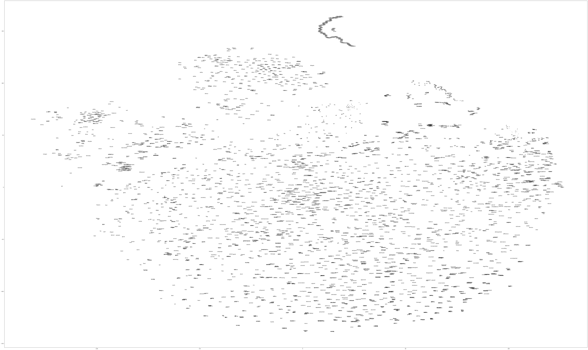
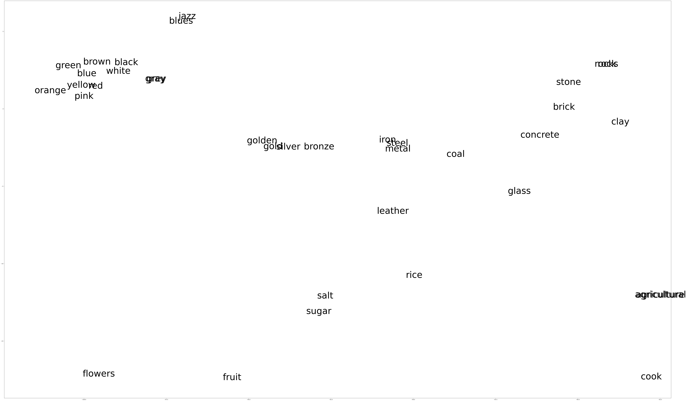
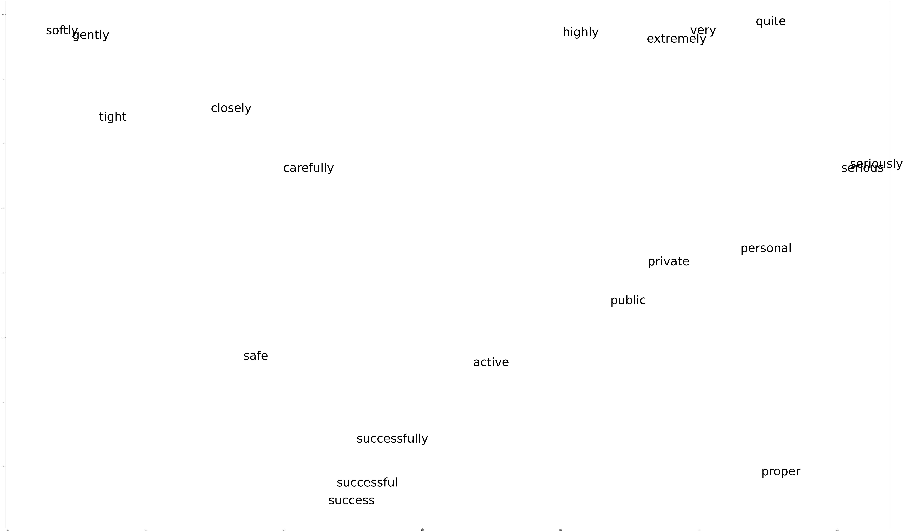

# Session 4: Homework Solutions
Sam Foreman
2025-07-22

<link rel="preconnect" href="https://fonts.googleapis.com">

- [Problem 1: Tokenization](#problem-1-tokenization)
  - [Let’s write an elementary tokenizer that uses words as
    tokens.](#lets-write-an-elementary-tokenizer-that-uses-words-as-tokens)
- [Problem 2: Embedding](#problem-2-embedding)

## Problem 1: Tokenization

*Write a generic Python tokenizer, which takes a set of text lines and
tabulates the different words (that is, the tokens will be simply
English words), keeping track of the frequency of each word. Use the
guidance in the accompanying notebook, ‘Homework_1.ipynb’.*

Here, as a reminder, is the content of ‘Homework_1.ipynb’:

------------------------------------------------------------------------

### Let’s write an elementary tokenizer that uses words as tokens.

We will use Mark Twain’s *Life On The Mississippi* as a test bed. The
text is in the accompanying file ‘Life_On_The_Mississippi.txt’

Here’s a not-terribly-good such tokenizer:

``` python
wdict = {}
with open('Life_On_The_Mississippi.txt', 'r') as L:
    line = L.readline()
    nlines = 1
    while line:

        words = line.split()
        for word in words:
            if wdict.get(word) is not None:
                wdict[word] += 1
            else:
                wdict[word] = 1
        line = L.readline()
        nlines += 1

nitem = 0 ; maxitems = 100
for item in wdict.items():
    nitem += 1
    print(item)
    if nitem == maxitems: break
```

    ('\ufeffThe', 1)
    ('Project', 79)
    ('Gutenberg', 22)
    ('eBook', 4)
    ('of', 4469)
    ('Life', 5)
    ('on', 856)
    ('the', 8443)
    ('Mississippi', 104)
    ('This', 127)
    ('ebook', 2)
    ('is', 1076)
    ('for', 1017)
    ('use', 34)
    ('anyone', 4)
    ('anywhere', 8)
    ('in', 2381)
    ('United', 36)
    ('States', 26)
    ('and', 5692)
    ('most', 119)
    ('other', 223)
    ('parts', 5)
    ('world', 40)
    ('at', 676)
    ('no', 325)
    ('cost', 18)
    ('with', 1053)
    ('almost', 37)
    ('restrictions', 2)
    ('whatsoever.', 2)
    ('You', 92)
    ('may', 85)
    ('copy', 12)
    ('it,', 199)
    ('give', 67)
    ('it', 1382)
    ('away', 107)
    ('or', 561)
    ('re-use', 2)
    ('under', 112)
    ('terms', 22)
    ('License', 8)
    ('included', 2)
    ('this', 591)
    ('online', 4)
    ('www.gutenberg.org.', 4)
    ('If', 85)
    ('you', 813)
    ('are', 361)
    ('not', 680)
    ('located', 9)
    ('States,', 8)
    ('will', 287)
    ('have', 557)
    ('to', 3518)
    ('check', 4)
    ('laws', 13)
    ('country', 50)
    ('where', 152)
    ('before', 150)
    ('using', 10)
    ('eBook.', 2)
    ('Title:', 1)
    ('Author:', 1)
    ('Mark', 2)
    ('Twain', 2)
    ('Release', 1)
    ('date:', 1)
    ('July', 7)
    ('10,', 2)
    ('2004', 1)
    ('[eBook', 1)
    ('#245]', 1)
    ('Most', 4)
    ('recently', 3)
    ('updated:', 1)
    ('January', 2)
    ('1,', 2)
    ('2021', 1)
    ('Language:', 1)
    ('English', 7)
    ('Credits:', 1)
    ('Produced', 2)
    ('by', 623)
    ('David', 2)
    ('Widger.', 2)
    ('Earliest', 2)
    ('PG', 3)
    ('text', 4)
    ('edition', 3)
    ('produced', 15)
    ('Graham', 2)
    ('Allan', 2)
    ('***', 4)
    ('START', 1)
    ('OF', 16)
    ('THE', 29)
    ('PROJECT', 4)
    ('GUTENBERG', 3)

This is unsatisfactory for a few reasons:

- There are non-ASCII (Unicode) characters that should be stripped (the
  so-called “Byte-Order Mark” or BOM at the beginning of the text);

- There are punctuation marks, which we don’t want to concern ourselves
  with;

- The same word can appear capitalized, or lower-case, or with its
  initial letter upper-cased, whereas we want them all to be normalized
  to lower-case.

Part 1 of this assignment: insert code in this loop to operate on the
str variable ‘line’ so as to fix these problems before ‘line’ is split
into words.

A hint to one possible way to do this: use the ‘punctuation’ character
definition in the Python ‘string’ module, the ‘maketrans’ and
‘translate’ methods of Python’s str class, to eliminate punctuation, and
the regular expression (‘re’) Python module to eliminate any Unicode—it
is useful to know that the regular expression r’\[^\x00-x7f\]’ means
“any character not in the vanilla ASCII set.

Part 2: Add code to sort the contents of wdict by word occurrence
frequency. What are the top 100 most frequent word tokens? Adding up
occurrence frequencies starting from the most frequent words, how many
distinct words make up the top 90% of word occurrences in this “corpus”?

For this part, the docs of Python’s ‘sorted’ and of the helper
‘itemgetter’ from ‘operator’ reward study.

Write your modified code in the cell below.

------------------------------------------------------------------------

``` python
### Part 1:

import string  # For punctuation hygiene
import re # For Unicode hygiene

wdict = {}

# See the docs ('help(str.maketrans)').  Also try 'print(string.punctuation)'.
# Basically, this command makes a translation table that maps all punctuation to None
ttable = str.maketrans("", "", string.punctuation)

with open('Life_On_The_Mississippi.txt', 'r') as L:
    line = L.readline()
    while line:

        # Here we use the translation table to annihilate all punctuation.
        line = line.translate(ttable)

        # Here we remove Unicode.  The regular expression '[^\x00-\x7f]' means "any character not
        # in the vanilla ASCII character set" (codes 0-127, or in hexadecimal, \x00-\x7f). The 'sub'
        # method maps anything outside this range to None. Consult 'help(re)' for more detail.
        line = re.sub(r'[^\x00-\x7f]', r'', line)

        # Everything to lower-case
        line = line.lower()
        
        words = line.split()
        for word in words:
            if wdict.get(word) is not None:
                wdict[word] += 1
            else:
                wdict[word] = 1
        line = L.readline()

nitem = 0 ; maxitems = 100
for item in wdict.items():
    nitem += 1
    print(item)
    if nitem == maxitems: break
```

    ('the', 9255)
    ('project', 90)
    ('gutenberg', 87)
    ('ebook', 13)
    ('of', 4532)
    ('life', 89)
    ('on', 947)
    ('mississippi', 159)
    ('this', 781)
    ('is', 1148)
    ('for', 1095)
    ('use', 48)
    ('anyone', 5)
    ('anywhere', 18)
    ('in', 2593)
    ('united', 37)
    ('states', 54)
    ('and', 5892)
    ('most', 124)
    ('other', 270)
    ('parts', 9)
    ('world', 68)
    ('at', 750)
    ('no', 422)
    ('cost', 25)
    ('with', 1081)
    ('almost', 38)
    ('restrictions', 2)
    ('whatsoever', 2)
    ('you', 1033)
    ('may', 89)
    ('copy', 17)
    ('it', 2293)
    ('give', 81)
    ('away', 172)
    ('or', 581)
    ('reuse', 2)
    ('under', 119)
    ('terms', 26)
    ('license', 24)
    ('included', 3)
    ('online', 4)
    ('wwwgutenbergorg', 5)
    ('if', 381)
    ('are', 387)
    ('not', 722)
    ('located', 9)
    ('will', 301)
    ('have', 571)
    ('to', 3592)
    ('check', 4)
    ('laws', 17)
    ('country', 77)
    ('where', 174)
    ('before', 208)
    ('using', 11)
    ('title', 3)
    ('author', 3)
    ('mark', 24)
    ('twain', 26)
    ('release', 1)
    ('date', 18)
    ('july', 7)
    ('10', 10)
    ('2004', 1)
    ('245', 1)
    ('recently', 4)
    ('updated', 2)
    ('january', 3)
    ('1', 13)
    ('2021', 1)
    ('language', 12)
    ('english', 11)
    ('credits', 1)
    ('produced', 22)
    ('by', 713)
    ('david', 2)
    ('widger', 2)
    ('earliest', 7)
    ('pg', 3)
    ('text', 4)
    ('edition', 4)
    ('graham', 2)
    ('allan', 2)
    ('start', 31)
    ('table', 6)
    ('contents', 6)
    ('chapter', 125)
    ('i', 2205)
    ('well', 191)
    ('worth', 37)
    ('reading', 13)
    ('aboutit', 1)
    ('remarkableinstead', 1)
    ('widening', 2)
    ('towards', 9)
    ('its', 323)
    ('mouth', 53)
    ('grows', 3)
    ('narrowerit', 1)

``` python
### Part 2

from operator import itemgetter # for 'sorted' to sort on the frequency.  See 'help(itemgetter)'.

witems = wdict.items()

# print(list(witems)[:4])
#  [('the', 9255), ('project', 90), ('gutenberg', 87), ('ebook', 13)]

# This call to 'sorted' resorts witems by the second element of each entry, i.e. the frequency count 
witems = sorted(witems, key=itemgetter(1), reverse=True )

for item in list(witems)[:100]:
    print (item)

### Continued in next cell...


```

    ('the', 9255)
    ('and', 5892)
    ('of', 4532)
    ('a', 4053)
    ('to', 3592)
    ('in', 2593)
    ('it', 2293)
    ('i', 2205)
    ('was', 2093)
    ('that', 1724)
    ('he', 1402)
    ('is', 1148)
    ('for', 1095)
    ('with', 1081)
    ('you', 1033)
    ('his', 961)
    ('had', 961)
    ('but', 952)
    ('on', 947)
    ('as', 881)
    ('this', 781)
    ('they', 758)
    ('at', 750)
    ('not', 722)
    ('all', 720)
    ('by', 713)
    ('one', 686)
    ('there', 627)
    ('were', 625)
    ('be', 617)
    ('my', 582)
    ('or', 581)
    ('from', 577)
    ('have', 571)
    ('out', 541)
    ('so', 536)
    ('up', 529)
    ('him', 523)
    ('we', 519)
    ('me', 516)
    ('when', 505)
    ('would', 478)
    ('which', 476)
    ('river', 457)
    ('an', 440)
    ('them', 425)
    ('no', 422)
    ('then', 405)
    ('said', 399)
    ('are', 387)
    ('if', 381)
    ('their', 378)
    ('now', 369)
    ('about', 346)
    ('time', 337)
    ('been', 335)
    ('down', 328)
    ('its', 323)
    ('could', 313)
    ('has', 305)
    ('will', 301)
    ('into', 300)
    ('what', 285)
    ('her', 278)
    ('two', 273)
    ('do', 271)
    ('other', 270)
    ('some', 269)
    ('man', 260)
    ('new', 259)
    ('any', 238)
    ('got', 234)
    ('these', 233)
    ('she', 233)
    ('who', 229)
    ('more', 226)
    ('water', 222)
    ('did', 214)
    ('before', 208)
    ('over', 202)
    ('way', 202)
    ('hundred', 200)
    ('upon', 200)
    ('here', 199)
    ('after', 195)
    ('day', 193)
    ('than', 192)
    ('well', 191)
    ('through', 191)
    ('get', 190)
    ('old', 186)
    ('every', 186)
    ('can', 185)
    ('boat', 184)
    ('went', 183)
    ('never', 182)
    ('good', 181)
    ('years', 181)
    ('see', 176)
    ('know', 175)

``` python
# We will let numpy handle looping/sums for us
import numpy as np


# Get the total number of tokens in the corpus. We do this by converting the frequency counts
# to a numpy array, and letting numpy handle the looping ops. This is _much_ faster than writing
# our own python loops. But you knew that already, right?
freq = np.array(list(witems))[:,1]
freq = np.array(freq, dtype=np.int64)

vocab_size = len(freq) # How many words in the vocabulary
total_tokens = freq.sum() # How many tokens in the corpus

print("Vocabulary size = %d"%vocab_size )
print("Total number of tokens = %d"%total_tokens)

cumulate = freq.cumsum() # This accumulates the counts

# print(cumulate[:10])
#  [ 9255 15147 19679 23732 27324 29917 32210 34415 36508 38232]

threshold = 0.9 * total_tokens
trunc = cumulate[cumulate < threshold]
n_90 = len(trunc)
print("Number of tokens comprising 90%% of the corpus = %d"%n_90)
print("This is (%d / %d) = %f of the vocabulary size."%(n_90, vocab_size, n_90/vocab_size))
```

    Vocabulary size = 14462
    Total number of tokens = 147420
    Number of tokens comprising 90% of the corpus = 3731
    This is (3731 / 14462) = 0.257986 of the vocabulary size.

## Problem 2: Embedding

*Modify the embedding visualization code above to zoom in on various
regions of the projections, and identify at least one interesting
cluster of tokens.*

First, let’s reproduce the embedding code in a single cell.

``` python
%matplotlib inline
import torch
import numpy as np
import matplotlib.pyplot as plt
from sklearn.manifold import TSNE
from transformers import BertTokenizer, BertModel, BertForMaskedLM
import sys
np.set_printoptions(threshold=sys.maxsize)
plt.rcParams['figure.figsize'] = [100, 60]

# Load BERT.
model = BertModel.from_pretrained('bert-large-uncased-whole-word-masking')
# Set the model to eval mode.
model.eval()
# This notebook assumes CPU execution. If you want to use GPUs, put the model on cuda and modify subsequent code blocks.
#model.to('cuda')
# Load tokenizer.
tokenizer = BertTokenizer.from_pretrained('bert-large-uncased-whole-word-masking')

# Save the BERT vocabulary to a file -- by default it will name this file "vocab.txt".
tokenizer.save_vocabulary(save_directory='.')

print("The vocabulary size is: ", model.config.vocab_size) # Size of the vocabulary


# Get BERT's vocabulary embeddings.
wordembs = model.get_input_embeddings()

# Convert the vocabulary embeddings to numpy.
allinds = np.arange(0,model.config.vocab_size,1)
inputinds = torch.LongTensor(allinds)
bertwordembs = wordembs(inputinds).detach().numpy()
print(bertwordembs.shape)


# Read in the vocabulary
filename = "vocab.txt"
with open(filename,'r') as f:
    bertwords = np.array([])
    for line in f:
        bertwords = np.append(bertwords, line.rstrip())

# Determine vocabulary to use for t-SNE/visualization. The indices are hard-coded based partially on inspection:
bert_char_indices_to_use = np.arange(999, 1063, 1)
bert_voc_indices_to_plot = np.append(bert_char_indices_to_use, np.arange(1996, 5932, 1))
bert_voc_indices_to_use = np.append(bert_char_indices_to_use, np.arange(1996, 11932, 1))

bert_voc_indices_to_use_tensor = torch.LongTensor(bert_voc_indices_to_use)
bert_word_embs_to_use = wordembs(bert_voc_indices_to_use_tensor).detach().numpy()
bert_words_to_plot = bertwords[bert_voc_indices_to_plot]


print(len(bert_voc_indices_to_plot))
print(len(bert_voc_indices_to_use))


# Run t-SNE on the BERT vocabulary embeddings we selected:
mytsne_words = TSNE(n_components=2,early_exaggeration=12,verbose=2,metric='cosine',init='pca',n_iter=2500)
bert_word_embs_to_use_tsne = mytsne_words.fit_transform(bert_word_embs_to_use)


```

    The vocabulary size is:  30522
    (30522, 1024)
    4000
    10000
    [t-SNE] Computing 91 nearest neighbors...
    [t-SNE] Indexed 10000 samples in 0.003s...
    [t-SNE] Computed neighbors for 10000 samples in 3.170s...
    [t-SNE] Computed conditional probabilities for sample 1000 / 10000
    [t-SNE] Computed conditional probabilities for sample 2000 / 10000
    [t-SNE] Computed conditional probabilities for sample 3000 / 10000
    [t-SNE] Computed conditional probabilities for sample 4000 / 10000
    [t-SNE] Computed conditional probabilities for sample 5000 / 10000
    [t-SNE] Computed conditional probabilities for sample 6000 / 10000
    [t-SNE] Computed conditional probabilities for sample 7000 / 10000
    [t-SNE] Computed conditional probabilities for sample 8000 / 10000
    [t-SNE] Computed conditional probabilities for sample 9000 / 10000
    [t-SNE] Computed conditional probabilities for sample 10000 / 10000
    [t-SNE] Mean sigma: 0.267747
    [t-SNE] Computed conditional probabilities in 0.225s
    [t-SNE] Iteration 50: error = 97.8630905, gradient norm = 0.0063367 (50 iterations in 2.096s)
    [t-SNE] Iteration 100: error = 96.0425186, gradient norm = 0.0002231 (50 iterations in 2.847s)
    [t-SNE] Iteration 150: error = 96.0316772, gradient norm = 0.0001323 (50 iterations in 2.884s)
    [t-SNE] Iteration 200: error = 96.0300140, gradient norm = 0.0002012 (50 iterations in 3.026s)
    [t-SNE] Iteration 250: error = 96.0261307, gradient norm = 0.0004180 (50 iterations in 3.435s)
    [t-SNE] KL divergence after 250 iterations with early exaggeration: 96.026131
    [t-SNE] Iteration 300: error = 3.7248163, gradient norm = 0.0118625 (50 iterations in 3.242s)
    [t-SNE] Iteration 350: error = 3.2195456, gradient norm = 0.0108424 (50 iterations in 3.114s)
    [t-SNE] Iteration 400: error = 2.9652765, gradient norm = 0.0102236 (50 iterations in 2.694s)
    [t-SNE] Iteration 450: error = 2.8028884, gradient norm = 0.0096932 (50 iterations in 3.046s)
    [t-SNE] Iteration 500: error = 2.6894069, gradient norm = 0.0093035 (50 iterations in 2.840s)
    [t-SNE] Iteration 550: error = 2.6054118, gradient norm = 0.0087935 (50 iterations in 2.760s)
    [t-SNE] Iteration 600: error = 2.5420735, gradient norm = 0.0081159 (50 iterations in 2.787s)
    [t-SNE] Iteration 650: error = 2.4932556, gradient norm = 0.0075155 (50 iterations in 2.853s)
    [t-SNE] Iteration 700: error = 2.4545426, gradient norm = 0.0069476 (50 iterations in 2.758s)
    [t-SNE] Iteration 750: error = 2.4239745, gradient norm = 0.0063734 (50 iterations in 3.085s)
    [t-SNE] Iteration 800: error = 2.3987682, gradient norm = 0.0059483 (50 iterations in 2.974s)
    [t-SNE] Iteration 850: error = 2.3779438, gradient norm = 0.0055000 (50 iterations in 2.947s)
    [t-SNE] Iteration 900: error = 2.3605390, gradient norm = 0.0051190 (50 iterations in 3.005s)
    [t-SNE] Iteration 950: error = 2.3458681, gradient norm = 0.0047010 (50 iterations in 3.166s)
    [t-SNE] Iteration 1000: error = 2.3333766, gradient norm = 0.0044142 (50 iterations in 3.257s)
    [t-SNE] Iteration 1050: error = 2.3226175, gradient norm = 0.0040574 (50 iterations in 3.191s)
    [t-SNE] Iteration 1100: error = 2.3136184, gradient norm = 0.0037781 (50 iterations in 3.037s)
    [t-SNE] Iteration 1150: error = 2.3056273, gradient norm = 0.0034893 (50 iterations in 2.649s)
    [t-SNE] Iteration 1200: error = 2.2985494, gradient norm = 0.0032903 (50 iterations in 2.676s)
    [t-SNE] Iteration 1250: error = 2.2921538, gradient norm = 0.0031051 (50 iterations in 2.658s)
    [t-SNE] Iteration 1300: error = 2.2863860, gradient norm = 0.0030337 (50 iterations in 2.603s)
    [t-SNE] Iteration 1350: error = 2.2811816, gradient norm = 0.0028680 (50 iterations in 2.627s)
    [t-SNE] Iteration 1400: error = 2.2763476, gradient norm = 0.0026533 (50 iterations in 2.643s)
    [t-SNE] Iteration 1450: error = 2.2722008, gradient norm = 0.0024671 (50 iterations in 2.648s)
    [t-SNE] Iteration 1500: error = 2.2683768, gradient norm = 0.0023232 (50 iterations in 2.866s)
    [t-SNE] Iteration 1550: error = 2.2649071, gradient norm = 0.0022500 (50 iterations in 3.168s)
    [t-SNE] Iteration 1600: error = 2.2616940, gradient norm = 0.0021450 (50 iterations in 3.311s)
    [t-SNE] Iteration 1650: error = 2.2587450, gradient norm = 0.0020107 (50 iterations in 3.011s)
    [t-SNE] Iteration 1700: error = 2.2561145, gradient norm = 0.0019056 (50 iterations in 2.994s)
    [t-SNE] Iteration 1750: error = 2.2536240, gradient norm = 0.0017927 (50 iterations in 3.382s)
    [t-SNE] Iteration 1800: error = 2.2513769, gradient norm = 0.0017245 (50 iterations in 3.223s)
    [t-SNE] Iteration 1850: error = 2.2492456, gradient norm = 0.0017383 (50 iterations in 3.053s)
    [t-SNE] Iteration 1900: error = 2.2471912, gradient norm = 0.0017167 (50 iterations in 3.133s)
    [t-SNE] Iteration 1950: error = 2.2452946, gradient norm = 0.0014949 (50 iterations in 3.253s)
    [t-SNE] Iteration 2000: error = 2.2435069, gradient norm = 0.0014818 (50 iterations in 2.934s)
    [t-SNE] Iteration 2050: error = 2.2417929, gradient norm = 0.0017434 (50 iterations in 3.180s)
    [t-SNE] Iteration 2100: error = 2.2402472, gradient norm = 0.0012868 (50 iterations in 3.245s)
    [t-SNE] Iteration 2150: error = 2.2388918, gradient norm = 0.0012237 (50 iterations in 3.123s)
    [t-SNE] Iteration 2200: error = 2.2377245, gradient norm = 0.0011501 (50 iterations in 3.370s)
    [t-SNE] Iteration 2250: error = 2.2366202, gradient norm = 0.0011345 (50 iterations in 3.288s)
    [t-SNE] Iteration 2300: error = 2.2354372, gradient norm = 0.0010986 (50 iterations in 2.758s)
    [t-SNE] Iteration 2350: error = 2.2343924, gradient norm = 0.0009945 (50 iterations in 3.266s)
    [t-SNE] Iteration 2400: error = 2.2334530, gradient norm = 0.0009421 (50 iterations in 3.041s)
    [t-SNE] Iteration 2450: error = 2.2324953, gradient norm = 0.0009431 (50 iterations in 2.663s)
    [t-SNE] Iteration 2500: error = 2.2317801, gradient norm = 0.0008016 (50 iterations in 2.901s)
    [t-SNE] KL divergence after 2500 iterations: 2.231780

``` python
# Plot the transformed BERT vocabulary embeddings:
fig = plt.figure()

for i, txt in enumerate(bert_words_to_plot):
    plt.scatter(bert_word_embs_to_use_tsne[i,0], bert_word_embs_to_use_tsne[i,1], s=0)
    plt.text(bert_word_embs_to_use_tsne[i,0], bert_word_embs_to_use_tsne[i,1], txt, family='sans-serif')
plt.show()
```



Now we write a little code to help us zoom in on a desired section of
this plot.

``` python
nplotted = len(bert_words_to_plot)

# Get the limits of the embedding region
x_left = np.min(bert_word_embs_to_use_tsne[:nplotted,0])
x_right = np.max(bert_word_embs_to_use_tsne[:nplotted,0])
y_left = np.min(bert_word_embs_to_use_tsne[:nplotted,1])
y_right = np.max(bert_word_embs_to_use_tsne[:nplotted,1])

# Width of embedding region
xwidth = x_right - x_left ; ywidth = y_right - y_left


def plotwindow(window_xfrac, window_yfrac, window_xoff, window_yoff):
    """
    Plot a requested window on the embedding.

    window_xfrac (float): Fraction of the X-window size to plot
    window_yfrac (float): Fraction of the Y-window size to plot
    window_xoff (float): X-offset of window center, from the left. Should be in [0.0, 1.0],
        and is interpreted as a fraction of the window X-width
    window_yoff (float): Y-offset of window center, from the bottom. Should be in [0.0, 1.0],
        and is interpreted as a fraction of the window Y-width
    
    """

    ## Bounds on window coordinates
    newxl_center = x_left + xwidth * window_xoff
    newxl_left = newxl_center - 0.5*window_xfrac * xwidth
    newxl_right =  newxl_center + 0.5*window_xfrac * xwidth

    newyl_center = y_left + ywidth * window_yoff
    newyl_left = newyl_center - 0.5*window_yfrac * ywidth
    newyl_right =  newyl_center + 0.5*window_yfrac * ywidth

    # Make arrays including only words inside the requested window, using numpy
    # logical indexing
    nplotted = len(bert_words_to_plot)
    x_inds_r = bert_word_embs_to_use_tsne[:nplotted,0] < newxl_right 
    x_inds_l = bert_word_embs_to_use_tsne[:nplotted,0] > newxl_left
    x_inds = np.logical_and(x_inds_l, x_inds_r)

    y_inds_r = bert_word_embs_to_use_tsne[:nplotted,1] < newyl_right
    y_inds_l = bert_word_embs_to_use_tsne[:nplotted,1] > newyl_left
    y_inds = np.logical_and(y_inds_l, y_inds_r)

    inds = np.logical_and(x_inds, y_inds)

    # Index the word and embedding arrays by the window-restricted indices
    bwtp = bert_words_to_plot[inds]
    bwembs = bert_word_embs_to_use_tsne[:nplotted,:][inds,:]

    # Plot away
    for i, txt in enumerate(bwtp):
        plt.scatter(bwembs[i,0], bwembs[i,1], s=0)
        plt.text(bwembs[i,0], bwembs[i,1], txt, family='sans-serif', size=75)

    plt.show()

window_xfrac = 0.1 ; window_yfrac = 0.1
window_xoff = 0.14 ; window_yoff = 0.45  ## Place names
print("Place Names")
plotwindow(window_xfrac, window_yfrac, window_xoff, window_yoff)

window_xfrac = 0.05 ; window_yfrac = 0.05
window_xoff = 0.92 ; window_yoff = 0.42  ## Time relations
print("Time relations")
plotwindow(window_xfrac, window_yfrac, window_xoff, window_yoff)
```

    Place Names



    Time relations


