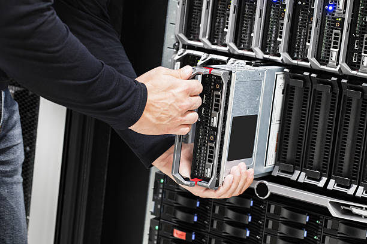
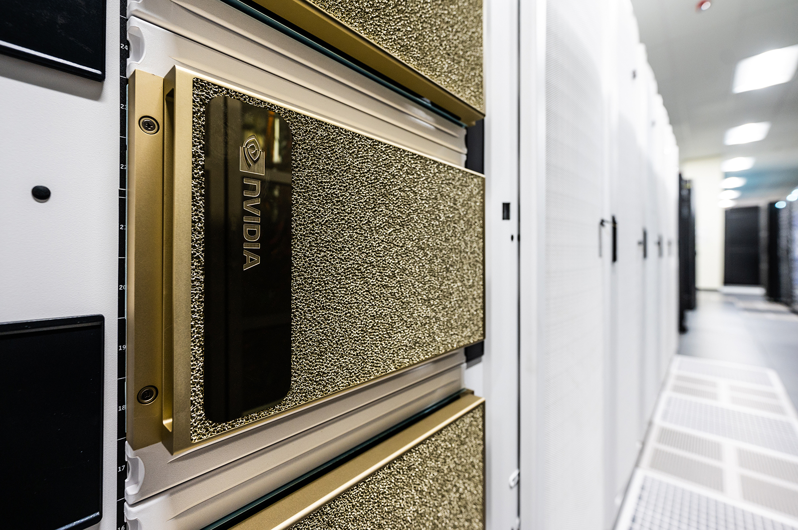
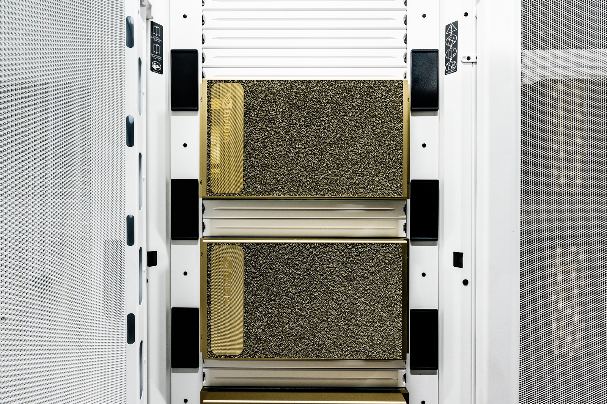
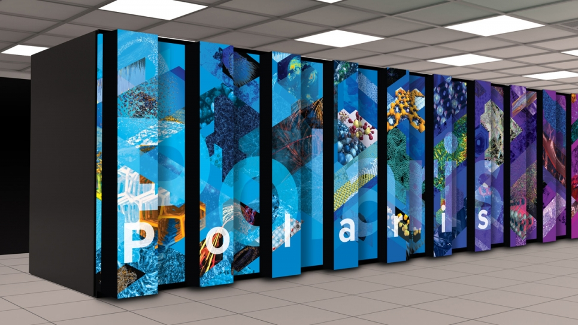
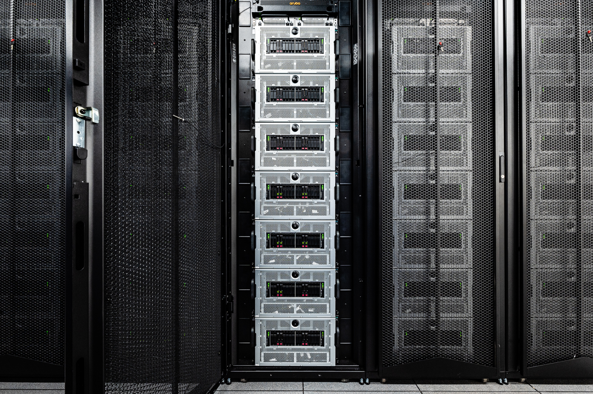

# What is a Supercomputer?
Sam Foreman
2025-08-01

<link rel="preconnect" href="https://fonts.googleapis.com">

- [Overview](#overview)
- [A Compute Node](#a-compute-node)
- [Cluster/HPC Computing Hardware
  Setup](#clusterhpc-computing-hardware-setup)
- [Supercomputers are Big!](#supercomputers-are-big)
- [ALCF Computing System Overview](#alcf-computing-system-overview)
  - [Aurora](#aurora)
  - [Sophia](#sophia)
  - [Polaris](#polaris)
- [📓 References](#notebook-references)

## Overview

Argonne hosts DOE supercomputers for use by research scientists in need
of large computational resources. Supercomputers are composed of many
computing *nodes* (1 *node* = 1 physical computer) that are connected by
a high-speed communications network so that groups of nodes can share
information quickly, effectively operating together as a larger
computer.

## A Compute Node

If you look inside your Desktop or Laptop you’ll find these parts:

Figure 1: Typical computer parts

A computing node of a supercomputer is very similar, each has simliar
parts, but it is designed as a single unit that can be inserted and
removed from large closet-sized racks with many others:

Figure 2: Blade

In large supercomputers multiple computer processors (CPUs) and/or
graphics processors (GPUs) are combined into a single node. It has a CPU
on which the local operating system runs. It has local memory for
running software. It may have GPUs for doing intensive calculations.
Each node has a high-speed network connection that allows it to
communicate with other nodes and to a large shared filesystem.

## Cluster/HPC Computing Hardware Setup

Figure 3: Network diagram of a typical supercomputer

Large computer systems typically have *worker* nodes and *login* nodes.
*login* nodes are the nodes on which every user arrives when they login
to the system. *login* nodes should not be used for computation, but for
compiling code, writing/editing code, and launching *jobs* on the
system. A *job* is the application that will be launched on the *worker*
nodes of the supercomputer.

## Supercomputers are Big!

These supercomputers occupy a lot of space in the ACLF data center. Here
is our staff (and interns! from summer 2023) in front of Aurora.

Figure 4: ALCF Staff

## ALCF Computing System Overview

### Aurora

> Aurora is a supercomputer at Argonne National Laboratory, housed in
> the Argonne Leadership Computing Facility (ALCF). It is the first
> exascale supercomputer in the United States and is designed to deliver
> unprecedented performance for scientific research and simulations.  
> See [Aurora](https://www.alcf.anl.gov/aurora) for more information.

At this time (August 2025), Aurora is *open for business*! It is amongst
the most power supercomputers in thew world, [currently sitting at \#2
on the Top500](https://www.top500.org/lists/top500/list/2024/06/).

Here you can see one of the many rows of Aurora *nodes* with their Red &
Blue water cooling conduits visible.

Figure 5: Aurora

In this photo you see a close up of the 16 *nodes* installed
side-by-side:

Figure 6: Aurora

### [Sophia](https://www.alcf.anl.gov/sophia)

Inside Sophia, you’ll see repetition, though NVidia placed these fancy
plates over the hardware so you only see their logo.

However, each plate covers 1 computer *node*.

|          Sophia Racks           |          Sophia Inside          |
|:-------------------------------:|:-------------------------------:|
|  |  |

Sophia is an NVIDIA DGX A100-based system. The DGX A100 comprises eight
NVIDIA A100 GPUs that provide a total of 320 gigabytes of memory for
training AI datasets, as well as high-speed NVIDIA Mellanox ConnectX-6
network interfaces.

**Sophia Machine Specs**

- Speed: 3.9 petaflops
- Each Node has:
  - 8 NVIDIA (A100) GPUs each with 40GB onboard memory
  - 2 AMD EPYC (7742) CPUs
  - 1 TB DDR4 Memory
- 24 Total Nodes installed in 7 Racks

### [Polaris](https://www.alcf.anl.gov/polaris)

The inside of Polaris again shows the *nodes* stacked up in a closet.

Polaris is an NVIDIA A100-based system.

Polaris Machine Specs

- Speed: 44 petaflops
- Each Node has:
  - 4 NVIDIA (A100) GPUs
  - 1 AMD EPYC (Milan) CPUs
- ~560 Total Nodes

## 📓 References

- [Awesome
  HPC](https://github.com/trevor-vincent/awesome-high-performance-computing)
- [ALCF User Guides](https://docs.alcf.anl.gov)
