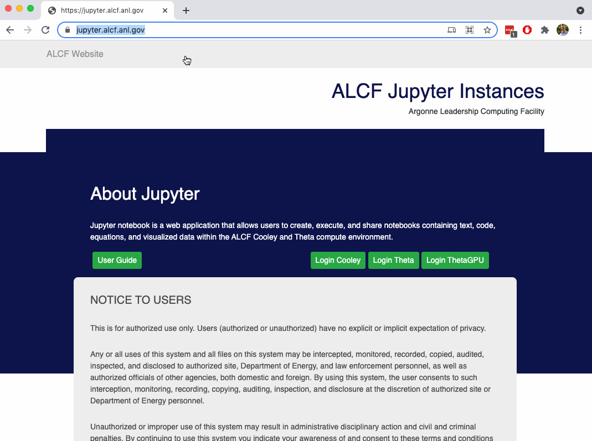
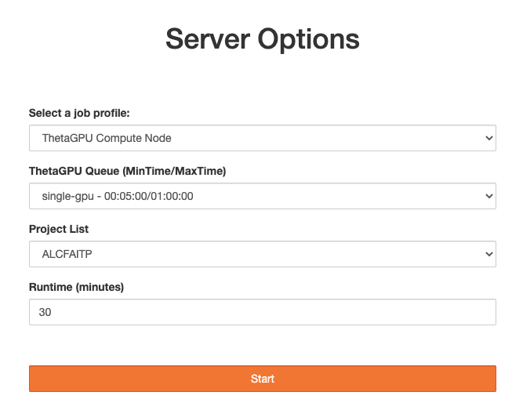
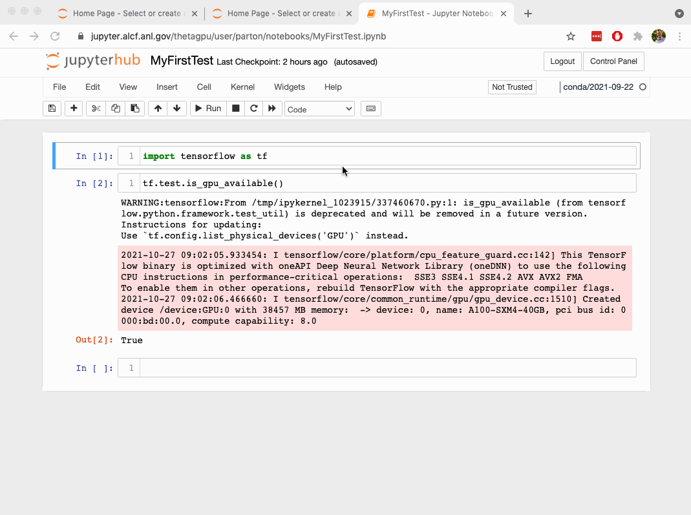

# Jupyter Notebooks on Supercomputers
Sam Foreman
2025-07-15

<link rel="preconnect" href="https://fonts.googleapis.com">

- [NERSC Instructions](#nersc-instructions)

## NERSC Instructions

1.  **Project Setup**:

    - Login to Perlmutter:

      ``` bash
      ssh <your_nersc_username>@perlmutter.nersc.gov
      mkdir -p /global/cfs/cdirs/m4388/$USER/
      cd /global/cfs/cdirs/m4388/$USER
      ```

2.  **Using Jupyter on Perlmutter @ NERSC**

    - [jupyter.nersc.gov](https://jupyter.nersc.gov/)

    <iframe src="perlmutter.pdf" width="100%" height="800px">
      <p>Your browser does not support iframes.</p>
    </iframe>

<details closed>

<summary>

<h2>

ALCF Instructions
</h2>

</summary>

1.  **Logging In**: <https://jupyter.alcf.anl.gov/>

    Select “Login Polaris” and use your ALCF credentials and
    Multi-Factor Authentication.

    > [!NOTE]
    >
    > ### 📝 Note
    >
    > Some of the images below show “ThetaGPU” being used, however,
    > similar instructions apply to “Polaris” or “Sophia”.

    

2.  **Server settings & start up**

    

    You’ll want to set your server options to the following:

    - job profile: ThetaGPU Compute Node
    - Sophia Queue: by-gpu
    - Project List: ALCFAITP
    - Runtime: can be 5 to 60 minutes

    When you click “start” you are submitting a job to the batch queue
    and waiting for the job to begin.

3.  **Server shutdown & logout**

    ALCF’s guiding policy is:

    > “We ask that all users follow good etiquette and be excellent to
    > one another.”

    If you simply close your browser window, or logout without shutting
    down the jupyter server, your job will continue to occupy the worker
    node. Be considerate and shutdown your job when you finish.

    

</details>
