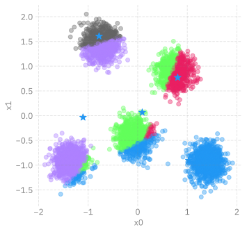
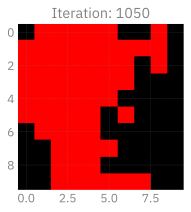

# Statistical Learning
Sam Foreman
2025-08-06

<link rel="preconnect" href="https://fonts.googleapis.com">

- [Introduction to Statistical
  Learning](#introduction-to-statistical-learning)
  - [Import Python packages](#import-python-packages)
  - [Learning to Cluster Data](#learning-to-cluster-data)
  - [Toy dataset (2-D blobs)](#toy-dataset-2-d-blobs)
  - [K-means Clustering](#k-means-clustering)
    - [Step 1: Pick random starting centroids from
      data](#step-1-pick-random-starting-centroids-from-data)
    - [Step 2a: Calculate distance to each
      centroid](#step-2a-calculate-distance-to-each-centroid)
    - [Step 2b: Find nearest cluster for each
      point](#step-2b-find-nearest-cluster-for-each-point)
    - [Step 3: Calculate new centroids](#step-3-calculate-new-centroids)
    - [Step 4: Repeat until
      convergence](#step-4-repeat-until-convergence)
    - [Run example:](#run-example)
- [K-means on a breast cancer
  dataset](#k-means-on-a-breast-cancer-dataset)
  - [Self-organizing maps](#self-organizing-mapssom)
    - [Generating “Color” data and
      normalizing](#generating-color-data-and-normalizing)
    - [Defining SOM](#defining-som)
    - [Initial state of SOM color
      network](#initial-state-of-som-color-network)
    - [Training SOM](#training-som)
    - [Visualization of trained colormap
      SOM](#visualization-of-trained-colormap-som)
    - [1.3.5 SOM on Cancer data](#135-som-on-cancer-data)
    - [Training SOM on Cancer data](#training-som-on-cancer-data)
    - [Visualization of trained SOM](#visualization-of-trained-som)
- [Keep learning](#keep-learning)

# Introduction to Statistical Learning

This is a quick introduction to some statistical learning methods you
may have encountered that will help us understand how modern deep
learning methods operate.

[](https://colab.research.google.com/github/saforem2/intro-hpc-bootcamp-2025/blob/main/content/00-intr-AI-HPC/8-clustering/index.ipynb)
[](https://github.com/saforem2/intro-hpc-bootcamp-2025/blob/main/docs/00-intro-AI-HPC/8-clustering/index.md)

## Import Python packages

Fortunately a lot of common data science tools are freely available in
the python ecosystem (look at PyPi for details).

- [Scikit-learn](https://scikit-learn.org/stable/): `import sklearn`
- [Matplotlib](https://matplotlib.org/):
  `import matplotlib.pyplot as plt`, `import matplotlib as mpl`
- [Seaborn](https://seaborn.pydata.org/): `import seaborn as sns`

We can use `matplotlib` and `seaborn` for plotting data.

``` python
%load_ext autoreload
%autoreload 2
import matplotlib_inline.backend_inline
matplotlib_inline.backend_inline.set_matplotlib_formats('retina', 'svg', 'png')
import matplotlib.pyplot as plt
import ambivalent
plt.style.use(ambivalent.STYLES['ambivalent'])
plt.rcParams["figure.figsize"] = plt.rcParamsDefault["figure.figsize"]
```

``` python
import os
import time

import IPython.display as ipydis
import matplotlib.cm as cm
import matplotlib.pyplot as plt
import numpy as np
import pandas as pd
import seaborn as sns
import sklearn
from sklearn import datasets  # Cancer dataset
from sklearn.cluster import KMeans
from sklearn.preprocessing import (
    MinMaxScaler,
    RobustScaler,
    # Data processors
    StandardScaler,
)

# set random seed for reproducibility
SEED = 42
DFIGSIZE = plt.rcParamsDefault["figure.figsize"]

import bootcamp

bootcamp.__file__
```

    '/Users/samforeman/projects/saforem2/intro-hpc-bootcamp-2025/src/bootcamp/__init__.py'

## Learning to Cluster Data

Next we if have data with distinct groupings, the objective is to devise
a method for labeling our data by its group in an automated way. We will
demonstrate this, first, on a toy dataset that we *design* to have a
lower inherent dimensionality, then we move to a higher dimensional
dataset.

## Toy dataset (2-D blobs)

Define 3 blobs of data on a 2D plane

``` python
from bootcamp.plots import COLORS, scatter
from matplotlib.colors import ListedColormap
from rich import print

plt.rcParams["figure.facecolor"] = "none"
plt.rcParams["axes.facecolor"] = "none"
plt.rcParams["grid.linewidth"] = 1.0
plt.rcParams["grid.alpha"] = 1.0


n_samples = 1000  # 300 2D data points
n_features = 2  # 2D data
n_clusters = 4  # 3 unique blobs

# https://scikit-learn.org/stable/modules/generated/sklearn.datasets.make_blobs.html
# -- Returns --------------------------------------------------------
# x (n_samples, n_features): The generated samples.
# y (n_samples,): Int labels for cluster membership of each sample.
# -------------------------------------------------------------------
cmap = ListedColormap(list(COLORS.values()))
x, y = datasets.make_blobs(
    n_samples=n_samples, n_features=n_features, centers=n_clusters, random_state=SEED
)
scatter_kwargs = {
    "xlabel": "x0",
    "ylabel": "x1",
    "cmap": cmap,
    "plot_kwargs": {
        "alpha": 0.4,
        "edgecolor": "#222",
    },
}
_ = scatter(x, y, **scatter_kwargs)
```

<pre style="white-space:pre;overflow-x:auto;line-height:normal;font-family:Menlo,'DejaVu Sans Mono',consolas,'Courier New',monospace">[<span style="color: #7f7f7f; text-decoration-color: #7f7f7f">2025-08-06 13:36:50,596076</span>][<span style="color: #008000; text-decoration-color: #008000">I</span>][<span style="color: #008080; text-decoration-color: #008080; font-style: italic">ezpz</span>/<span style="color: #000080; text-decoration-color: #000080">__init__</span><span style="color: #0000ff; text-decoration-color: #0000ff">:</span><span style="color: #800080; text-decoration-color: #800080">265</span><span style="color: #0000ff; text-decoration-color: #0000ff">:</span><span style="color: #00ff00; text-decoration-color: #00ff00; font-style: italic">ezpz</span>]<span style="color: #c0c0c0; text-decoration-color: #c0c0c0"> </span>Setting logging level to <span style="color: #008000; text-decoration-color: #008000">'INFO'</span> on <span style="color: #008000; text-decoration-color: #008000">'RANK == 0'</span>
</pre>

<pre style="white-space:pre;overflow-x:auto;line-height:normal;font-family:Menlo,'DejaVu Sans Mono',consolas,'Courier New',monospace">[<span style="color: #7f7f7f; text-decoration-color: #7f7f7f">2025-08-06 13:36:50,598134</span>][<span style="color: #008000; text-decoration-color: #008000">I</span>][<span style="color: #008080; text-decoration-color: #008080; font-style: italic">ezpz</span>/<span style="color: #000080; text-decoration-color: #000080">__init__</span><span style="color: #0000ff; text-decoration-color: #0000ff">:</span><span style="color: #800080; text-decoration-color: #800080">266</span><span style="color: #0000ff; text-decoration-color: #0000ff">:</span><span style="color: #00ff00; text-decoration-color: #00ff00; font-style: italic">ezpz</span>]<span style="color: #c0c0c0; text-decoration-color: #c0c0c0"> </span>Setting logging level to <span style="color: #008000; text-decoration-color: #008000">'CRITICAL'</span> on all others <span style="color: #008000; text-decoration-color: #008000">'RANK != 0'</span>
</pre>


Normalizing the data features is always a good practice.

``` python
# Normalize features
# https://scikit-learn.org/stable/modules/generated/sklearn.preprocessing.StandardScaler.html
x_sc = StandardScaler().fit_transform(x)
```

Plot the normalized data

``` python
fig, (ax1, ax2) = plt.subplots(
    figsize=(1.5 * DFIGSIZE[0], 0.8 * DFIGSIZE[1]),
    ncols=2,
    subplot_kw={
        "aspect": "equal",
    },
)
fig, ax1 = scatter(x, y, fig=fig, ax=ax1, title="Original", **scatter_kwargs)
fig.subplots_adjust(wspace=0.2)
fig, ax2 = scatter(x_sc, y, fig=fig, ax=ax2, title="Normalized", **scatter_kwargs)
```


## K-means Clustering

K-means clustering aims to partition n observations into k clusters in
which each observation belongs to the cluster with the nearest mean,
serving as a prototype of the cluster. This results in a partitioning of
the data space into Voronoi cells.

1.  Pick random starting centroids from data
    - $k$ initial “means” (in this case, $k = 3$) are randomly generated
      within the data domain (shown in color)
2.  Calculate distance to each centroid
    - $k$ clusters are created by associating every observation with the
      nearest mean. The partitions here represent the Voroni diagram
      generated by the means
    - Find nearest cluster for each point
3.  Calculate new centroids
    - The **centroid** of each of the $k$ clusters becomes the new mean
4.  Steps 2 and 3 are repeated until convergence has been reached

<div class="flex-container">

![\[1.\]](https://raw.githubusercontent.com/saforem2/ATPESC_MachineLearning/master/00_statisticalLearning/assets/atpesc-k-means-step1.svg)

![\[2.\]](https://raw.githubusercontent.com/saforem2/ATPESC_MachineLearning/master/00_statisticalLearning/assets/atpesc-k-means-step2.svg)

![\[3.\]](https://raw.githubusercontent.com/saforem2/ATPESC_MachineLearning/master/00_statisticalLearning/assets/atpesc-k-means-step3.svg)

![\[4.\]](https://raw.githubusercontent.com/saforem2/ATPESC_MachineLearning/master/00_statisticalLearning/assets/atpesc-k-means-step4.svg)

</div>

### Step 1: Pick random starting centroids from data

- $k$ initial “means” (in this case, $k=3$) are randomly generated
  within the data domain (shown in color)

  <div id="fig-kmeans-1">

  

  Figure 1

  </div>

``` python
def initialize_centroids(x: np.ndarray, n_clusters: int, seed: int = 123) -> np.ndarray:
    """Initialize centroids.

    Inputs:
      - x (np.ndarray): Data of shape (num_points, num_features)
      - n_clusters (int): Number of clusters to use
      - seed (int): Random seed.

    Outputs:
      - centroids (np.ndarray): Randomly chosen from the data
        with shape: (num_clusters, num_features).
    """
    np.random.RandomState(seed)
    # 1. Randomly permute data points
    # 2. From this, pick the first `n_clusters` indices
    # 3. Return these as our initial centroids
    random_idx = np.random.permutation(x.shape[0])
    centroids = x[random_idx[:n_clusters]]
    return centroids
```

### Step 2a: Calculate distance to each centroid

- Calculate distance to each centroid
  - $k$ clusters are created by associating every observation with the
    nearest mean. The partitions here represent the Voroni diagram
    generated by the means
  - Find nearest cluster for each point

  <div id="fig-kmeans-2">

  

  Figure 2

  </div>

``` python
def compute_distance(
    x: np.ndarray, centroids: np.ndarray, n_clusters: int
) -> np.ndarray:
    """Compute distance.

    Inputs:
      - x (np.ndarray): Input data of shape
        (num_points, num_features)
      - centroids (np.ndarray): Cluster centroids  with shape
        (num_clusters, num_features)
      - n_clusters (int): Number of clusters being used.

    Outputs:
      - distance (np.ndarray): Distance of each point
        to each centroid with shape
        (num_points, num_clusters)
    """
    # distance vector
    distance = np.zeros((x.shape[0], n_clusters))
    # loop over each centroid
    for k in range(n_clusters):
        # calculate distance for each point from centroid
        kcentroid_distance = x - centroids[k, :]
        # apply normalization for stability
        row_norm = np.linalg.norm(kcentroid_distance, axis=1)
        # return distance squared
        distance[:, k] = np.square(row_norm)

    return distance
```

### Step 2b: Find nearest cluster for each point

``` python
def find_closest_centroid(distance: np.ndarray) -> np.ndarray:
    """Find closest centroid.

    Inputs:
      - distance (np.ndarray): Distance of each point to each centroid with shape
        (num_points, num_clusters)

    Outputs:
      - nearest_centroid_indices (np.ndarray): Index of nearest centroid with shape
        (num_points,)
    """
    nearest_centroid_indices = np.argmin(distance, axis=1)
    return nearest_centroid_indices
```

### Step 3: Calculate new centroids

- Calculate new centroids
  - The **centroid** of each of the $k$ clusters becomes the new mean

  <div id="fig-kmeans-3">

  

  Figure 3

  </div>

``` python
def compute_centroids(
    x: np.ndarray, nearest_centroid_indices: np.ndarray, n_clusters: int
) -> np.ndarray:
    """Compute centroids.

    Inputs:
      - x (np.ndarray): Input data of shape
        (num_points, num_features)
      - nearest_centroid_indices: Index of nearest centroid of shape
        (num_points,)
      - n_clusters (int): Number of clusters being used

    Outputs:
      - centroids (np.ndarray): Cluster centroids with shape
        (num_clusters, num_features)
    """
    # new centroids vector
    centroids = np.zeros((n_clusters, x.shape[1]))
    # loop over each centroids
    for k in range(n_clusters):
        # calculate the mean of all points assigned to this centroid
        centroids[k, :] = np.mean(x[nearest_centroid_indices == k, :], axis=0)
    return centroids
```

### Step 4: Repeat until convergence

- Steps 2 and 3 are repeated until convergence has been reached

  <div id="fig-kmeans-4">

  

  Figure 4

  </div>

``` python
from __future__ import absolute_import, annotations, division, print_function

from typing import Optional

from bootcamp.plots import plot_kmeans_points


def apply_kmeans(
    x: np.ndarray,
    n_clusters: int,
    iterations: int = 100,
    seed: int = 123,
    cmap: Optional[str] = None,
) -> tuple[np.ndarray, np.ndarray]:
    """Returns (centroids, cluster_id)."""
    # ┏━━━━━━━━━━━━━━━━━━━━━━━━━━━━━━━━━━━━━┓
    # ┃ initialize centroids:               ┃
    # ┃   - shape: (n_clusters, x.shape[1]) ┃
    # ┗━━━━━━━━━━━━━━━━━━━━━━━━━━━━━━━━━━━━━┛
    centroids = initialize_centroids(
        x,  # (n_points, n_features)
        n_clusters=n_clusters,
        seed=seed,
    )
    # ┏━━━━━━━━━━━━━━━━━━━━━━━━━━━━━━━━━━━━━━━━━━━━━━━━━━━━━━━━━━━━┓
    # ┃ -- Iteratively improve centroid location ----------------- ┃
    # ┗━━━━━━━━━━━━━━━━━━━━━━━━━━━━━━━━━━━━━━━━━━━━━━━━━━━━━━━━━━━━┛
    # ┏━━━━━━━━━━━━━━━━━━━━━━━━━━━━━━━━━━━━━━━━━━━━━━━━━━━━━━━━━━━━┓
    # ┃ 1. Compute the distance from entries in x to each centroid ┃
    # ┃    - distance.shape: (n_points, n_clusters)                ┃
    # ┃ 2. Return the closest cluster (0, 1, ..., n_clusters-1)    ┃
    # ┃    - cluster_id.shape: (n_points)                          ┃
    # ┃ 3. Calculate the mean position of each labeled cluster     ┃
    # ┃    - centroids.shape: (n_clusters, n_features)             ┃
    # ┗━━━━━━━━━━━━━━━━━━━━━━━━━━━━━━━━━━━━━━━━━━━━━━━━━━━━━━━━━━━━┛
    for i in range(iterations):
        # save old centroids
        old_centroids = centroids
        distance = compute_distance(x, old_centroids, n_clusters)
        cluster_id = find_closest_centroid(distance)
        centroids = compute_centroids(x, cluster_id, n_clusters)

        # plotting for visual comprehension
        ipydis.clear_output("wait")
        print(f"Iteration: {i}")
        plot_kmeans_points(x, centroids, cluster_id, cmap=cmap)
        time.sleep(0.5)

        # if our points are the same as the old centroids, then we can stop
        if np.all(old_centroids == centroids):
            print(f"No change in centroids! Exiting!")
            break

    return centroids, cluster_id
```

### Run example:

``` python
# from bootcamp.plots import COLORS

cmap = ListedColormap(list(COLORS.values()))

n_samples = 5000
n_features = 2  # 2D data
n_clusters_true = 5  # unique blobs
n_clusters_guess = 5
SEED = 74512
iterations = 20

# https://scikit-learn.org/stable/modules/generated/sklearn.datasets.make_blobs.html
x, y = datasets.make_blobs(
    n_samples=n_samples,
    n_features=n_features,
    centers=n_clusters_true,
    # cluster_std=0.75,
    random_state=SEED,
)

x_sc = StandardScaler().fit_transform(x)

centroids, cluster_id = apply_kmeans(
    x_sc,
    n_clusters_guess,
    iterations,
    SEED,
    cmap=cmap,
)
```

<pre style="white-space:pre;overflow-x:auto;line-height:normal;font-family:Menlo,'DejaVu Sans Mono',consolas,'Courier New',monospace">Iteration: <span style="color: #008080; text-decoration-color: #008080; font-weight: bold">0</span>
</pre>



<pre style="white-space:pre;overflow-x:auto;line-height:normal;font-family:Menlo,'DejaVu Sans Mono',consolas,'Courier New',monospace">Iteration: <span style="color: #008080; text-decoration-color: #008080; font-weight: bold">1</span>
</pre>


<pre style="white-space:pre;overflow-x:auto;line-height:normal;font-family:Menlo,'DejaVu Sans Mono',consolas,'Courier New',monospace">Iteration: <span style="color: #008080; text-decoration-color: #008080; font-weight: bold">2</span>
</pre>


<pre style="white-space:pre;overflow-x:auto;line-height:normal;font-family:Menlo,'DejaVu Sans Mono',consolas,'Courier New',monospace">Iteration: <span style="color: #008080; text-decoration-color: #008080; font-weight: bold">3</span>
</pre>


<pre style="white-space:pre;overflow-x:auto;line-height:normal;font-family:Menlo,'DejaVu Sans Mono',consolas,'Courier New',monospace">No change in centroids! Exiting!
</pre>

# K-means on a breast cancer dataset

Now we use more realistic data that cannot be easily plotted on a 2D
grid. This dataset has 30 features (columns) for 569 patients (rows). In
addition, there is a *target* feature that indicates if the cancer was
*malignant* (0) or *benign* (1). In the ideal case, our 30 features
would provide easy deliniation between these two classes.

Let’s extract our data into $x$ and our truth labels into $y$

``` python
import pandas as pd


def load_cancer_data() -> dict:
    """Return cancer dataset (unscaled)."""
    from sklearn import datasets

    data = datasets.load_breast_cancer()
    return data


def sort_cancer_data(data: dict) -> tuple[pd.DataFrame, pd.Series]:
    # Get features and target
    x = pd.DataFrame(
        data["data"],
        columns=data["feature_names"],
    )
    x = x[sorted(x.columns)]
    y = data["target"]
    return x, y
```

``` python
data = load_cancer_data()
x, y = sort_cancer_data(data)
```

``` python
print(data.keys())
print("data size:", len(data["data"]))
print("number of features:", len(data["feature_names"]))
print(data["feature_names"])
# more information can be see by uncommenting this line:
# print(data['DESCR'])
```

<pre style="white-space:pre;overflow-x:auto;line-height:normal;font-family:Menlo,'DejaVu Sans Mono',consolas,'Courier New',monospace"><span style="color: #800080; text-decoration-color: #800080; font-weight: bold">dict_keys</span><span style="font-weight: bold">([</span><span style="color: #008000; text-decoration-color: #008000">'data'</span>, <span style="color: #008000; text-decoration-color: #008000">'target'</span>, <span style="color: #008000; text-decoration-color: #008000">'frame'</span>, <span style="color: #008000; text-decoration-color: #008000">'target_names'</span>, <span style="color: #008000; text-decoration-color: #008000">'DESCR'</span>, <span style="color: #008000; text-decoration-color: #008000">'feature_names'</span>, <span style="color: #008000; text-decoration-color: #008000">'filename'</span>, <span style="color: #008000; text-decoration-color: #008000">'data_module'</span><span style="font-weight: bold">])</span>
</pre>

<pre style="white-space:pre;overflow-x:auto;line-height:normal;font-family:Menlo,'DejaVu Sans Mono',consolas,'Courier New',monospace">data size: <span style="color: #008080; text-decoration-color: #008080; font-weight: bold">569</span>
</pre>

<pre style="white-space:pre;overflow-x:auto;line-height:normal;font-family:Menlo,'DejaVu Sans Mono',consolas,'Courier New',monospace">number of features: <span style="color: #008080; text-decoration-color: #008080; font-weight: bold">30</span>
</pre>

<pre style="white-space:pre;overflow-x:auto;line-height:normal;font-family:Menlo,'DejaVu Sans Mono',consolas,'Courier New',monospace"><span style="font-weight: bold">[</span><span style="color: #008000; text-decoration-color: #008000">'mean radius'</span> <span style="color: #008000; text-decoration-color: #008000">'mean texture'</span> <span style="color: #008000; text-decoration-color: #008000">'mean perimeter'</span> <span style="color: #008000; text-decoration-color: #008000">'mean area'</span>
 <span style="color: #008000; text-decoration-color: #008000">'mean smoothness'</span> <span style="color: #008000; text-decoration-color: #008000">'mean compactness'</span> <span style="color: #008000; text-decoration-color: #008000">'mean concavity'</span>
 <span style="color: #008000; text-decoration-color: #008000">'mean concave points'</span> <span style="color: #008000; text-decoration-color: #008000">'mean symmetry'</span> <span style="color: #008000; text-decoration-color: #008000">'mean fractal dimension'</span>
 <span style="color: #008000; text-decoration-color: #008000">'radius error'</span> <span style="color: #008000; text-decoration-color: #008000">'texture error'</span> <span style="color: #008000; text-decoration-color: #008000">'perimeter error'</span> <span style="color: #008000; text-decoration-color: #008000">'area error'</span>
 <span style="color: #008000; text-decoration-color: #008000">'smoothness error'</span> <span style="color: #008000; text-decoration-color: #008000">'compactness error'</span> <span style="color: #008000; text-decoration-color: #008000">'concavity error'</span>
 <span style="color: #008000; text-decoration-color: #008000">'concave points error'</span> <span style="color: #008000; text-decoration-color: #008000">'symmetry error'</span> <span style="color: #008000; text-decoration-color: #008000">'fractal dimension error'</span>
 <span style="color: #008000; text-decoration-color: #008000">'worst radius'</span> <span style="color: #008000; text-decoration-color: #008000">'worst texture'</span> <span style="color: #008000; text-decoration-color: #008000">'worst perimeter'</span> <span style="color: #008000; text-decoration-color: #008000">'worst area'</span>
 <span style="color: #008000; text-decoration-color: #008000">'worst smoothness'</span> <span style="color: #008000; text-decoration-color: #008000">'worst compactness'</span> <span style="color: #008000; text-decoration-color: #008000">'worst concavity'</span>
 <span style="color: #008000; text-decoration-color: #008000">'worst concave points'</span> <span style="color: #008000; text-decoration-color: #008000">'worst symmetry'</span> <span style="color: #008000; text-decoration-color: #008000">'worst fractal dimension'</span><span style="font-weight: bold">]</span>
</pre>

Let’s extract our data into $x$ and our truth labels into $y$

``` python
# wrap data in pandas DataFrame
# y = data['target'] # value: 0 = 'Malignant' 1 = 'Benign'
x = data["data"]
y = data["target"]
print(f"(malignant, benign): {np.bincount(y)}")
print(f"x.shape: {x.shape}")
print(f"y.shape: {y.shape}")
```

<pre style="white-space:pre;overflow-x:auto;line-height:normal;font-family:Menlo,'DejaVu Sans Mono',consolas,'Courier New',monospace"><span style="font-weight: bold">(</span>malignant, benign<span style="font-weight: bold">)</span>: <span style="font-weight: bold">[</span><span style="color: #008080; text-decoration-color: #008080; font-weight: bold">212</span> <span style="color: #008080; text-decoration-color: #008080; font-weight: bold">357</span><span style="font-weight: bold">]</span>
</pre>

<pre style="white-space:pre;overflow-x:auto;line-height:normal;font-family:Menlo,'DejaVu Sans Mono',consolas,'Courier New',monospace">x.shape: <span style="font-weight: bold">(</span><span style="color: #008080; text-decoration-color: #008080; font-weight: bold">569</span>, <span style="color: #008080; text-decoration-color: #008080; font-weight: bold">30</span><span style="font-weight: bold">)</span>
</pre>

<pre style="white-space:pre;overflow-x:auto;line-height:normal;font-family:Menlo,'DejaVu Sans Mono',consolas,'Courier New',monospace">y.shape: <span style="font-weight: bold">(</span><span style="color: #008080; text-decoration-color: #008080; font-weight: bold">569</span>,<span style="font-weight: bold">)</span>
</pre>

Normalize our features by column:

``` python
# normalize
x_sc = StandardScaler().fit_transform(x)
```

Define K-means model and train, this time we’ll just use the one from
scikit-learn library. We use `n_clusters=2` since our target dataset has
these two distinct classifications.

Plot histogram of number of true class labels (malignant/benign) and
number of k-means cluster labels.

This gives an indication of how well we did in clustering our data, but
is not a “correctness” or “accuracy” metric.

> [!NOTE]
>
> ### Note
>
> Keep in mind, k-means is not a classifier.
>
> Cluster label 0 given from k-means, does not correspond to cluster
> label 0 in the truth.

``` python
from bootcamp.plots import plot_hists

# for seed in range(10):
CSEED = 42
kmeans = KMeans(n_clusters=2, random_state=CSEED)
# fit the data
kfit = kmeans.fit(x_sc)
cluster_ids = kmeans.labels_
print(
    f"seed: {CSEED}\nNumber of samples in each cluster: {np.bincount(kmeans.labels_)}"
)
k_means_bins = np.bincount(cluster_ids)
y_bins = np.bincount(y)
plt.rcParams["figure.figsize"] = [1.5 * DFIGSIZE[0], 0.8 * DFIGSIZE[1]]
plt.rcParams["grid.alpha"] = 0.5
plt.rcParams["grid.linewidth"] = 0.33
plot_hists(k_means_bins, y_bins, xlabels=["Malignant", "Benign"])
```

<pre style="white-space:pre;overflow-x:auto;line-height:normal;font-family:Menlo,'DejaVu Sans Mono',consolas,'Courier New',monospace">seed: <span style="color: #008080; text-decoration-color: #008080; font-weight: bold">42</span>
Number of samples in each cluster: <span style="font-weight: bold">[</span><span style="color: #008080; text-decoration-color: #008080; font-weight: bold">188</span> <span style="color: #008080; text-decoration-color: #008080; font-weight: bold">381</span><span style="font-weight: bold">]</span>
</pre>


This plot shows the normalized inertia as we vary the number
`n_clusters` used in our k-means fit to the breast cancer data.

This value essentially indicates the mean distance of a point to the
cluster centroids.

Obviously more clusters result in data points being nearer to a
centroid.

If our dataset easily split into 2 clusters, we would see a step
function behavior going from 1 to 2, then only very minor improvements
above 2.

What we see here tells us our data does not easily cluster.

``` python
from bootcamp.plots import plot_kmeans_obj

plt.rcParams["figure.figsize"] = [DFIGSIZE[0], 0.6 * DFIGSIZE[1]]
_ = plot_kmeans_obj(x_sc, nclusters=10, plot_points=False)
```


For example, if we return to our blob data with 2 clusters, it become
clear.

``` python
n_samples = 300  # 300 2D data points
n_features = 2  # 2D data
n_clusters = 2  # unique blobs
seed = 456
iterations = 10
x, y = datasets.make_blobs(
    n_samples=n_samples, n_features=n_features, centers=n_clusters, random_state=seed
)
plot_kmeans_obj(x, nclusters=10, plot_points=True)
```


    array([71.2677332 ,  2.06848282,  1.66362399,  1.29123125,  1.09050754,
            0.98096718,  0.77864451,  0.67736526,  0.63142328])


## Self-organizing maps[^1]

Self Organizing Maps (SOM) were proposed and became widespread in the
1980s, by a Finnish professor named Teuvo Kohonen and are also called
‘Kohonen maps’.

The idea behind a SOM is that you’re mapping high-dimensional vectors
onto a smaller dimensional (typically 2D) space. Vectors that are close
in the high-dimensional space also end up being mapped to nodes that are
close in 2D space thus preserving the “topology” of the original data.

``` python
# finding best matching unit
def find_bmu(t, net, n):
    """
    Find the best matching unit for a given vector, t, in the SOM
    Returns: a (bmu, bmu_idx) tuple where bmu is the high-dimensional BMU
             and bmu_idx is the index of this vector in the SOM
    """
    bmu_idx = np.array([0, 0])
    # set the initial minimum distance to a huge number
    # min_dist = #np.iinfo(np.int).max
    min_dist = np.inf
    # calculate the high-dimensional distance between each neuron and the input
    for x in range(net.shape[0]):
        for y in range(net.shape[1]):
            w = net[x, y, :].reshape(n, 1)
            # don't bother with actual Euclidean distance, to avoid expensive sqrt operation
            sq_dist = np.sum((w - t) ** 2)
            if sq_dist < min_dist:
                min_dist = sq_dist
                bmu_idx = np.array([x, y])
    # get vector corresponding to bmu_idx
    bmu = net[bmu_idx[0], bmu_idx[1], :].reshape(n, 1)
    # return the (bmu, bmu_idx) tuple
    return (bmu, bmu_idx)


# Decaying radius of influence
def decay_radius(initial_radius, i, time_constant):
    return initial_radius * np.exp(-i / time_constant)


# Decaying learning rate
def decay_learning_rate(initial_learning_rate, i, n_iterations):
    return initial_learning_rate * np.exp(-i / n_iterations)


# Influence in 2D space
def calculate_influence(distance, radius):
    return np.exp(-distance / (2.0 * (radius**2)))


# Update weights
def update_weights(net, bmu_idx, r, l):
    wlen = net.shape[2]
    for x in range(net.shape[0]):
        for y in range(net.shape[1]):
            w = net[x, y, :].reshape(wlen, 1)
            # get the 2-D distance (again, not the actual Euclidean distance)
            w_dist = np.sum((np.array([x, y]) - bmu_idx) ** 2)
            # if the distance is within the current neighbourhood radius
            if w_dist <= r**2:
                # calculate the degree of influence (based on the 2-D distance)
                influence = calculate_influence(w_dist, r)
                # now update the neuron's weight using the formula:
                # new w = old w + (learning rate * influence * delta)
                # where delta = input vector (t) - old w
                new_w = w + (l * influence * (t - w))
                # commit the new weight
                net[x, y, :] = new_w.reshape(1, wlen)
    return net
```

### Generating “Color” data and normalizing

``` python
raw_data = np.random.randint(0, 255, (10000, 3))  # JPEG like data
# raw_data = np.random.uniform(size=(500, 3))
data = StandardScaler().fit_transform(raw_data)  # Normalized
```

### Defining SOM

Defining network size, number of iterations and learning rate

``` python
network_dimensions = np.array([50, 50])
n_iterations = 2500
init_learning_rate = 0.075
```

Establish size variables based on data

``` python
m = data.shape[0]
n = data.shape[1]
```

Weight matrix (i.e. the SOM) needs to be one n-dimensional vector for
each neuron in the SOM

``` python
net = np.random.random(
    (network_dimensions[0], network_dimensions[1], n)
)  # 25 neurons each with a 3D vector
```

Initial neighbourhood radius and decay parameter

``` python
init_radius = max(network_dimensions[0], network_dimensions[1]) / 2.0
time_constant = n_iterations / np.log(init_radius)
```

### Initial state of SOM color network

``` python
plt.rcParams["image.cmap"] = "rainbow"
fig, ax = plt.subplots(figsize=(4, 4))
image = ax.matshow(net)
# _ = fig.colorbar(image)
_ = plt.show()
```


### Training SOM

``` python
def normalize(x: np.ndarray) -> np.ndarray:
    return (x - np.min(x)) / (np.max(x) - np.min(x))


plt.rcParams["figure.figsize"] = [
    i / 2.0 for i in plt.rcParamsDefault["figure.figsize"]
]
init_learning_rate = 0.1
# net = np.random.uniform(size=net.shape)
# net = (255 * ((net + 1.) / 2.))
images = []
for iteration in range(250):
    # select a training example at random - shape of 1x3
    t = data[np.random.randint(0, m), :].reshape(np.array([n, 1]))
    # find its Best Matching Unit
    bmu, bmu_idx = find_bmu(t, net, n)  # Gives the row, column of the best neuron
    # decay the SOM parameters
    r = decay_radius(init_radius, iteration, time_constant)
    l = decay_learning_rate(init_learning_rate, iteration, n_iterations)
    # Update SOM weights
    net = update_weights(net, bmu_idx, r, l)
    if iteration % 10 == 0:
        # print(f"Iteration: {iteration}")
        ipydis.clear_output("wait")
        fig, ax = plt.subplots(figsize=(4, 4))
        net_img = normalize(net)
        _ = fig.suptitle(f"Iteration: {iteration}", y=1.0)
        _ = plt.tight_layout()
        image = ax.matshow(net_img, cmap="rainbow")
        # if iteration % 50 == 0:
        images.append(net_img)
        # if iteration % 100 == 0:
        #    _ = plt.show()
        time.sleep(0.5)
```


### Visualization of trained colormap SOM

``` python
len(images)
```

    25

``` python
fig, axes = plt.subplots(
    figsize=(2.0 * DFIGSIZE[0], 1.5 * DFIGSIZE[1]),
    nrows=5,
    ncols=5,
    tight_layout=True,
)
fig.subplots_adjust(wspace=0.1)
axes = axes.flatten()
for idx, (img, ax) in enumerate(zip(images, axes)):
    _ = ax.matshow(img, cmap="rainbow")
    _ = ax.set_title(f"Iteration: {100 * idx}")
    _ = ax.set_xticks([])
    _ = ax.set_xticklabels([])
    _ = ax.set_yticks([])
    _ = ax.set_yticklabels([])

_ = plt.show()
```


``` python
from matplotlib import cm

fig, ax = plt.subplots(figsize=(4, 4))
image = ax.imshow(normalize(net), cmap="rainbow")
_ = ax.set_title("Final SOM")
_ = plt.show()
```


### 1.3.5 SOM on Cancer data

``` python
# Load data
data = datasets.load_breast_cancer()
# Get features and target
X = data["data"]  # pd.DataFrame(data['data'], columns=data['feature_names'])
Y = data["target"]
print(X.shape, Y.shape)
```

<pre style="white-space:pre;overflow-x:auto;line-height:normal;font-family:Menlo,'DejaVu Sans Mono',consolas,'Courier New',monospace"><span style="font-weight: bold">(</span><span style="color: #008080; text-decoration-color: #008080; font-weight: bold">569</span>, <span style="color: #008080; text-decoration-color: #008080; font-weight: bold">30</span><span style="font-weight: bold">)</span>
<span style="font-weight: bold">(</span><span style="color: #008080; text-decoration-color: #008080; font-weight: bold">569</span>,<span style="font-weight: bold">)</span>
</pre>

``` python
network_dimensions = np.array([10, 10])
n_iterations = 2000
init_learning_rate = 0.01
# establish size variables based on data
n_points = X.shape[0]  # number of points
n_features = X.shape[1]  # 30 features per point

# weight matrix (i.e. the SOM) needs to be one n-dimensional vector for each neuron in the SOM
net = np.random.random((network_dimensions[0], network_dimensions[1], n_features))

# initial neighbourhood radius
init_radius = max(network_dimensions[0], network_dimensions[1]) / 2
# radius decay parameter
time_constant = n_iterations / np.log(init_radius)
```

``` python
# convert the network to something we can visualize
net_vis = np.zeros(
    shape=(net.shape[0], net.shape[1], 3),
    dtype=np.float32,
)  # Array for SOM color map visualization

for sample in range(n_points):
    t = X[sample, :].reshape(np.array([n_features, 1]))
    # find its Best Matching Unit for this data point
    bmu, bmu_idx = find_bmu(t, net, n_features)
    # set that unit to the label of this data point
    net_vis[bmu_idx[0], bmu_idx[1], 0] = Y[sample]  # Red if benign


fig, ax = plt.subplots()
im = ax.matshow(normalize(net_vis))
# _ = plt.colorbar(im1, ax=ax1)
plt.show()
```


### Training SOM on Cancer data

``` python
for iteration in range(n_iterations):
    # select a training example at random - shape of 1x3
    t = X[np.random.randint(0, n_points), :].reshape(np.array([n_features, 1]))
    # find its Best Matching Unit
    bmu, bmu_idx = find_bmu(t, net, n_features)
    # decay the SOM parameters
    r = decay_radius(init_radius, iteration, time_constant)
    l = decay_learning_rate(init_learning_rate, iteration, n_iterations)
    # Update SOM weights
    net = update_weights(net, bmu_idx, r, l)

    if iteration % 50 == 0:
        ipydis.clear_output("wait")
        net_vis = np.zeros(
            shape=(np.shape(net)[0], np.shape(net)[1], 3), dtype="double"
        )  # Array for SOM color map visualization
        for sample in range(n_points):
            t = X[sample, :].reshape(np.array([n_features, 1]))
            # find its Best Matching Unit
            bmu, bmu_idx = find_bmu(t, net, n_features)
            net_vis[bmu_idx[0], bmu_idx[1], 0] = Y[sample]  # Red if benign

        fig, ax = plt.subplots(figsize=(3, 3))
        _ = ax.set_title(f"Iteration: {iteration}")
        _ = ax.imshow(normalize(net_vis), cmap="rainbow")
        _ = plt.show()
        time.sleep(0.25)
```





### Visualization of trained SOM

``` python
net_vis = np.zeros(
    shape=(net.shape[0], net.shape[1], 3), dtype="double"
)  # Array for SOM color map visualization

for sample in range(n_points):
    t = X[sample, :].reshape(np.array([n_features, 1]))
    # find its Best Matching Unit
    bmu, bmu_idx = find_bmu(t, net, n_features)
    net_vis[bmu_idx[0], bmu_idx[1], 0] = Y[sample]  # Red if benign

_ = plt.imshow(normalize(net_vis))
_ = plt.show()
```


# Keep learning

1.  lagunita.stanford.edu/courses/HumanitiesSciences/StatLearning/Winter2016/course/
2.  www.coursera.org/learn/ml-clustering-and-retrieval/
3.  www.coursera.org/learn/machine-learning/home/week/8

[^1]: [Self Organizing
    Maps](https://en.wikipedia.org/wiki/Self-organizing_map)
