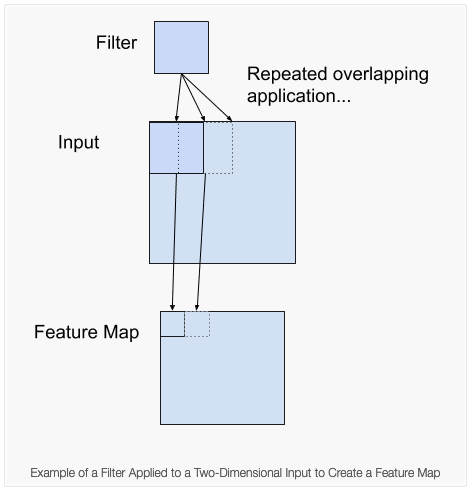
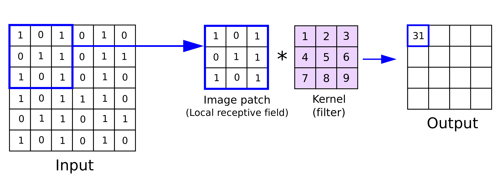
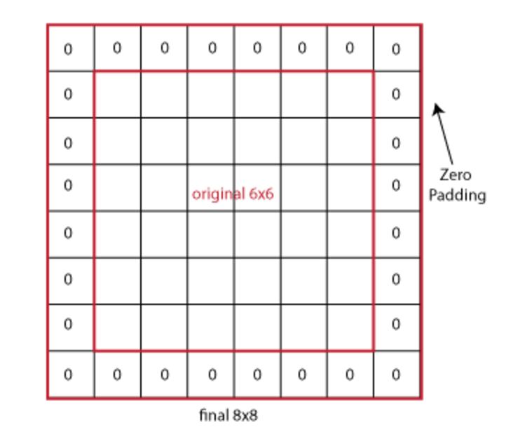
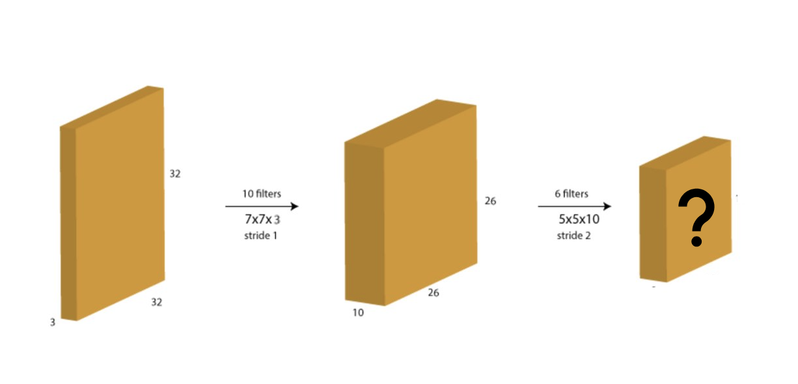
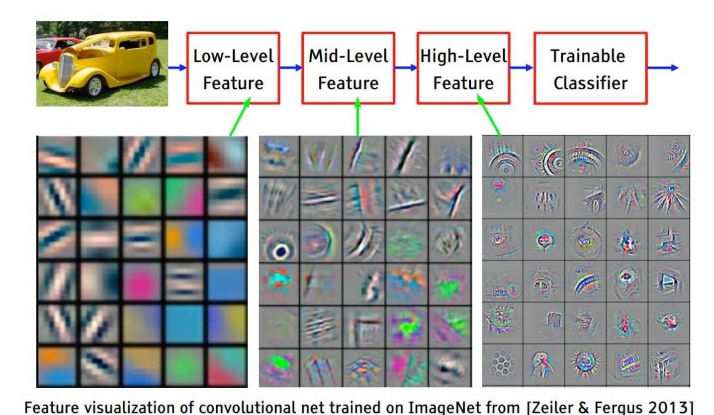
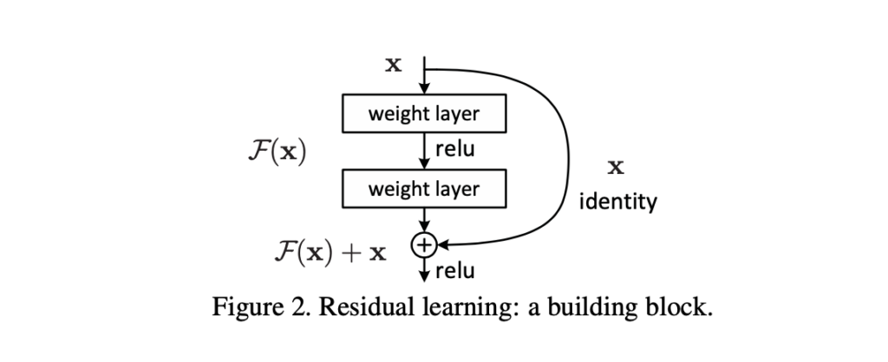

# MNIST handwritten digits classification with CNNs
Sam Foreman
2025-07-22

<link rel="preconnect" href="https://fonts.googleapis.com">

- [MNIST data set](#mnist-data-set)
- [Convolutional neural network
  (CNN)](#convolutional-neural-network-cnn)
  - [Convolutional Basics](#convolutional-basics)
  - [Padding](#padding)
  - [**What is the output size ?**](#what-is-the-output-size-)
  - [Max Pooling](#max-pooling)
  - [Multiple Channels](#multiple-channels)
  - [Visualizing learned features from
    CNNs](#visualizing-learned-features-from-cnns)
- [Advanced networks](#advanced-networks)
  - [ResNet](#resnet)
  - [U-Nets](#u-nets)
  - [ViTs](#vits)

Author: Bethany Lusch (blusch@anl.gov), adapting codes from Varuni
Sastry, Prasanna Balprakash, Corey Adams, and Kyle Felker

In this notebook, we’ll continue the MNIST problem but incorporate
convolutional layers.

First, we will import the required library and frameworks.

``` python
%matplotlib inline

import torch
import torchvision
from torch import nn

import numpy
import matplotlib.pyplot as plt
import time
```

## MNIST data set

Again we’ll load the MNIST handwritten digits data set.

``` python
training_data = torchvision.datasets.MNIST(
    root="data",
    train=True,
    download=True,
    transform=torchvision.transforms.ToTensor()
)

test_data = torchvision.datasets.MNIST(
    root="data",
    train=False,
    download=True,
    transform=torchvision.transforms.ToTensor()
)
```

``` python
training_data, validation_data = torch.utils.data.random_split(training_data, [0.8, 0.2], generator=torch.Generator().manual_seed(55))
```

This time we won’t flatten the images.

The training data input is a 3rd-order tensor of size (48000, 28, 28),
i.e. it consists of 48,000 images of size 28x28 pixels.

The labels for the training data are in a 48,000-dimensional vector
containing the correct classes (“0”, “1”, …, “9”) for each training
sample.

## Convolutional neural network (CNN)

CNN is a type of deep learning model for processing data that has a grid
pattern, such as images. They are very similar to any other neural
network being built with neurons that have learnable weights and biases.
Each neuron receives a input, then a dot product with the weights and
bias followed with some non-linear operation. The network still
represents a function mapping from raw input (pixels in case of images)
to a class score. All is good for small resolution images. What happens
when the image is 256x256x3 ? The very first hiddden layer in a fully
connected neural network will have 196K parameters! So fully connected
neural networks do not scale well for images.

A typical convolutional neural network architecture consists of : \*
Convolutional Layer, \* Pooling Layer, and \* Fully-Connected Layer

 Image credit: [Sumit
Saha](https://saturncloud.io/blog/a-comprehensive-guide-to-convolutional-neural-networks-the-eli5-way/)

Let’s use a small model that includes convolutional layers

- The Conv2d layers operate on 2D matrices so we input the digit images
  directly to the model.
  - The two Conv2d layers below learn 32 and 64 filters respectively.
  - They are learning filters for 3x3 windows.
- The MaxPooling 2D layer reduces the spatial dimensions, that is, makes
  the image smaller.
  - It downsamples by taking the maximum value in the window
  - The pool size of 2 below means the windows are 2x2.
  - Helps in extracting important features and reduce computation
- The Flatten layer flattens the 2D matrices into vectors, so we can
  then switch to Dense layers as in the MLP model.

``` python
class MNISTClassifier(nn.Module):

    def __init__(self):
        super().__init__()

        self.conv_1 = nn.Conv2d(in_channels=1, out_channels=32, kernel_size=3)
        self.conv_2 = nn.Conv2d(in_channels=32, out_channels=64, kernel_size=3)
        self.drop_3 = nn.Dropout(p=0.25)
        self.dense_4 = nn.Linear(in_features=9216, out_features=128)
        self.drop_5 = nn.Dropout(p=0.5)
        self.dense_6 = nn.Linear(in_features=128, out_features=10)

    def forward(self, inputs):

        x = self.conv_1(inputs)
        x = nn.functional.relu(x)
        
        x = self.conv_2(x)
        x = nn.functional.relu(x)
        x = nn.functional.max_pool2d(x, kernel_size=2)
        
        x = self.drop_3(x)
        x = torch.flatten(x, start_dim=1)
        
        x = self.dense_4(x)
        x = nn.functional.relu(x)
        
        x = self.drop_5(x)
        
        x = self.dense_6(x)
        x = nn.functional.softmax(x, dim=1)

        return x
```

### Convolutional Basics

A convolution layer is formed by convolving a filter (usually 5x5 or
3x3) repeatedly over the input image to create a feature map, meaning
the filter slides over spatially from the top left corner of the image
to the bottom right corner of the image. Filters learn different
features and detect the patterns in an image.

 Image credit: [Jason
Brownlee](https://machinelearningmastery.com/convolutional-layers-for-deep-learning-neural-networks/)

 Image credit: [Anh H.
Reynolds](https://anhreynolds.com/blogs/cnn.html)

### Padding

Adds zeros along the corners of the image to preserve the dimensionality
of the input.



### **What is the output size ?**

( N - F + 2P) / S + 1

where \* N = dimension of the input image. (ex, for an image of 28x28x1,
N=28) \* F = dimension of the filter (F=3 for a filter of 3x3) \* S =
Stride value \* P = Size of the zero padding used

### Max Pooling

Pooling reduces the dimensionality of the images, with max-pooling being
one of the most widely used.


### Multiple Channels

Usually colored images have multiple channels with RGB values. What
happens to the filter sizes and activation map dimensions in those
cases?



### Visualizing learned features from CNNs

The filters from the initial hidden layers tend to learn low level
features like edges, corners, shapes, colors etc. Filters from the
deeper layers tend to learn high-level features detecting patterns like
wheel, car, etc.



Now we can train the network, similarly to the previous notebook.

``` python
def train_one_epoch(dataloader, model, loss_fn, optimizer):
    model.train()
    for batch, (X, y) in enumerate(dataloader):
        # forward pass
        pred = model(X)
        loss = loss_fn(pred, y)
        
        # backward pass calculates gradients
        loss.backward()
        
        # take one step with these gradients
        optimizer.step()
        
        # resets the gradients 
        optimizer.zero_grad()
```

``` python
def evaluate(dataloader, model, loss_fn):
    # Set the model to evaluation mode - some NN pieces behave differently during training
    model.eval()
    size = len(dataloader.dataset)
    num_batches = len(dataloader)
    loss, correct = 0, 0

    # We can save computation and memory by not calculating gradients here - we aren't optimizing 
    with torch.no_grad():
        # loop over all of the batches
        for X, y in dataloader:
            pred = model(X)
            loss += loss_fn(pred, y).item()
            # how many are correct in this batch? Tracking for accuracy 
            correct += (pred.argmax(1) == y).type(torch.float).sum().item()

    loss /= num_batches
    correct /= size
    
    accuracy = 100*correct
    return accuracy, loss
```

``` python
def train_network(batch_size, epochs, lr):
    
    cnn_model = MNISTClassifier()
    train_dataloader = torch.utils.data.DataLoader(training_data, batch_size=batch_size)
    val_dataloader = torch.utils.data.DataLoader(validation_data, batch_size=batch_size)
    optimizer = torch.optim.Adam(cnn_model.parameters(), lr=lr)
    loss_fn = nn.CrossEntropyLoss()
    
    history = numpy.zeros((epochs,4))

    for j in range(epochs):
        train_one_epoch(train_dataloader, cnn_model, loss_fn, optimizer)

        # checking on the training & val loss and accuracy once per epoch
        acc_train, loss_train = evaluate(train_dataloader, cnn_model, loss_fn)
        acc_val, loss_val = evaluate(val_dataloader, cnn_model, loss_fn)
        print(f"Epoch {j}: val. loss: {loss_val:.4f}, val. accuracy: {acc_val:.4f}")
        history[j,:] = [acc_train, loss_train, acc_val, loss_val]
        
    return history, cnn_model
```

``` python
%%time 

batch_size = 512
epochs = 3
lr = .01
history, cnn_model = train_network(batch_size, epochs, lr)
```

The model should be better than the non-convolutional model even if
you’re only patient enough for three epochs.

``` python
plt.figure(figsize=(5,3))
plt.plot(range(epochs),history[:,1], label='training loss')
plt.plot(range(epochs),history[:,3], label='val. loss')
plt.title('loss')
plt.xlabel('epochs')
plt.ylabel('loss')
plt.legend()

plt.figure(figsize=(5,3))
plt.plot(range(epochs),history[:,0], label='training accuracy')
plt.plot(range(epochs),history[:,2], label='val. accuracy')
plt.title('accuracy');
plt.xlabel('epochs')
plt.ylabel('accuracy')
```

You can compare your result with the state-of-the art
[here](http://rodrigob.github.io/are_we_there_yet/build/classification_datasets_results.html).
Even more results can be found
[here](http://yann.lecun.com/exdb/mnist/).

## Advanced networks

### ResNet

Deeper and deeper networks that stack convolutions end up with smaller
and smaller gradients in early layers. ResNets use additional skip
connections where the output layer is f(x) + x instead of f(w x + b) or
f(x). This avoids vanishing gradient problem and results in smoother
loss functions. Refer to the [ResNet
paper](https://arxiv.org/pdf/1512.03385.pdf) and [ResNet loss
visualization paper](https://arxiv.org/pdf/1712.09913.pdf) for more
information.

 Image credit: [ResNet
paper](https://arxiv.org/pdf/1512.03385.pdf)

### U-Nets

U-NET is a convolution based neural network architecture orginally
developed for biomedical image segmentation tasks. It has an
encoder-decoder architecture with skip connections in between them.

 Image credit: [ResNet
paper](https://arxiv.org/pdf/1505.04597.pdf)

### ViTs

You’ll learn about language models today, which use “transformer”
models. There has been some success applying transformers to images
(“vision transformers”). To make images sequential, they are split into
patches and flattened. Then apply linear embeddings and positional
embeddings and feed it to a encoder-based transformer model.
 Image credit: [Google
Blog](https://ai.googleblog.com/2020/12/transformers-for-image-recognition-at.html)
