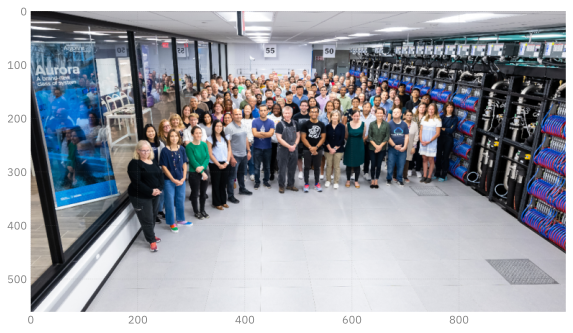
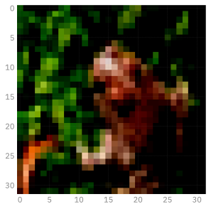
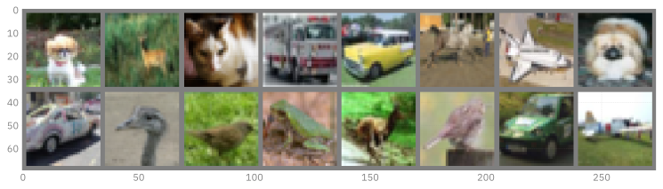

# Convolutional Neural Networks
Sam Foreman, Huihuo Zheng, Corey Adams, Bethany Lusch
2025-07-22

<link rel="preconnect" href="https://fonts.googleapis.com">

- [Convolutional Networks: A brief historical
  context](#convolutional-networks-a-brief-historical-context)
- [Convolutional Building Blocks](#convolutional-building-blocks)
  - [Convolutions](#convolutions)
  - [Normalization](#normalization)
  - [Downsampling (And upsampling)](#downsampling-and-upsampling)
  - [Residual Connections](#residual-connections)
- [Building a ConvNet](#building-a-convnet)
- [Training for Multiple Epochs](#training-for-multiple-epochs)
- [Homework 1:](#homework-1)

[](https://colab.research.google.com/github/saforem2/intro-hpc-bootcamp-2025/blob/main/docs/01-neural-networks/3-conv-nets/index.ipynb)

Up until transformers, convolutions were *the* state of the art in
computer vision.

In many ways and applications they still are!

Large Language Models, which are what we’ll focus on the rest of the
series after this lecture, are really good at ordered, \*tokenized data.
But there is lots of data that isn’t *implicitly* ordered like `images`,
and their more general cousins `graphs`.

Today’s lecture focuses on computer vision models, and particularly on
convolutional neural networks. There are a ton of applications you can
do with these, and not nearly enough time to get into them. Check out
the extra references file to see some publications to get you started if
you want to learn more.

Tip: this notebook is much faster on the GPU!

## Convolutional Networks: A brief historical context

Performance on ImageNet over time[^1]

``` python
%load_ext autoreload
%autoreload 2
%matplotlib inline
# settings for jupyter book: svg for html version, high-resolution png for pdf
import matplotlib_inline.backend_inline
matplotlib_inline.backend_inline.set_matplotlib_formats('retina', 'svg', 'png')
import matplotlib as mpl
# mpl.rcParams['figure.dpi'] = 400
```

``` python
import ambivalent
import ezpz
import matplotlib.pyplot as plt
import seaborn as sns

logger = ezpz.get_logger(__name__)
if logger.hasHandlers():
    logger.handlers.clear()

for child in logger.getChildren():
    if child.hasHandlers():
        child.handlers.clear()

logger.propagate = True

sns.set_context("notebook")
sns.set(rc={"figure.dpi": 400, "savefig.dpi": 400})
plt.style.use(ambivalent.STYLES["ambivalent"])
plt.rcParams["figure.figsize"] = [6.4, 4.8]
plt.rcParams["figure.facecolor"] = "none"
```

``` python
# Data
data = {2010: 28, 2011: 26, 2012: 16, 2013: 12, 2014: 7, 2015: 3, 2016: 2.3, 2017: 2.1}
human_error_rate = 5

# Create bar plot
plt.bar(list(data.keys()), list(data.values()), color="blue")

# Add human error rate line
plt.axhline(y=human_error_rate, color="red", linestyle="--", label="Human error rate")

# Labels and title
plt.xlabel("Year")
plt.ylabel("ImageNet Visual Recognition Error Rate (%)")
plt.title("ImageNet Error Rates Over Time")
plt.legend()

# Display plot
plt.show()
```


## Convolutional Building Blocks

``` python
import torch
import torchvision
```

We’re going to go through some examples of building blocks for
convolutional networks. To help illustate some of these, let’s use an
image for examples:

``` python
from PIL import Image

# wget line useful in Google Colab
! wget https://raw.githubusercontent.com/argonne-lcf/ai-science-training-series/main/03_advanced_neural_networks/ALCF-Staff.jpg 2>&1 >/dev/null
alcf_image = Image.open("ALCF-Staff.jpg")
```

``` python
from matplotlib import pyplot as plt

fx, fy = plt.rcParamsDefault["figure.figsize"]
figure = plt.figure(figsize=(1.5 * fx, 1.5 * fy))
_ = plt.imshow(alcf_image)
```


### Convolutions

Convolutions are a restriction of - and a specialization of - dense
linear layers. A convolution of an image produces another image, and
each output pixel is a function of only it’s local neighborhood of
points. This is called an *inductive bias* and is a big reason why
convolutions work for image data: neighboring pixels are correlated and
you can operate on just those pixels at a time.

See examples of convolutions
[here](https://github.com/vdumoulin/conv_arithmetic)


``` python
# Let's apply a convolution to the ALCF Staff photo:
alcf_tensor = torchvision.transforms.ToTensor()(alcf_image)

# Reshape the tensor to have a batch size of 1:
alcf_tensor = alcf_tensor.reshape((1,) + alcf_tensor.shape)

# Create a random convolution:
# shape is: (channels_in, channels_out, kernel_x, kernel_y)
conv_random = torch.rand((3, 3, 15, 15))

alcf_rand = torch.nn.functional.conv2d(alcf_tensor, conv_random)
alcf_rand = (1.0 / alcf_rand.max()) * alcf_rand
logger.info(alcf_rand.shape)
alcf_rand = alcf_rand.reshape(alcf_rand.shape[1:])

logger.info(alcf_tensor.shape)

rand_image = alcf_rand.permute((1, 2, 0)).cpu()
fx, fy = plt.rcParamsDefault["figure.figsize"]
figure = plt.figure(figsize=(1.5 * fx, 1.5 * fy))
_ = plt.imshow(rand_image)
```

    [2025-07-25 10:47:35,840022][I][ipykernel_68449/3575795754:13:__main__] torch.Size([1, 3, 1111, 1986])
    [2025-07-25 10:47:35,844010][I][ipykernel_68449/3575795754:16:__main__] torch.Size([1, 3, 1125, 2000])


### Normalization

 Reference:
[Normalizations](https://arxiv.org/pdf/1903.10520.pdf)

Normalization is the act of transforming the mean and moment of your
data to standard values (usually 0.0 and 1.0). It’s particularly useful
in machine learning since it stabilizes training, and allows higher
learning rates.


Reference: [Batch Norm](https://arxiv.org/pdf/1502.03167.pdf)

``` python
# Let's apply a normalization to the ALCF Staff photo:
alcf_tensor = torchvision.transforms.ToTensor()(alcf_image)

# Reshape the tensor to have a batch size of 1:
alcf_tensor = alcf_tensor.reshape((1,) + alcf_tensor.shape)


alcf_rand = torch.nn.functional.normalize(alcf_tensor)
alcf_rand = alcf_rand.reshape(alcf_rand.shape[1:])

logger.info(alcf_tensor.shape)

rand_image = alcf_rand.permute((1, 2, 0)).cpu()

fx, fy = plt.rcParamsDefault["figure.figsize"]
figure = plt.figure(figsize=(1.5 * fx, 1.5 * fy))
_ = plt.imshow(rand_image)
```

    [2025-07-25 10:47:39,496234][I][ipykernel_68449/378276982:11:__main__] torch.Size([1, 3, 1125, 2000])


### Downsampling (And upsampling)

Downsampling is a critical component of convolutional and many vision
models. Because of the local-only nature of convolutional filters,
learning large-range features can be too slow for convergence.
Downsampling of layers can bring information from far away closer,
effectively changing what it means to be “local” as the input to a
convolution.


[Reference](https://www.researchgate.net/publication/333593451_Application_of_Transfer_Learning_Using_Convolutional_Neural_Network_Method_for_Early_Detection_of_Terry's_Nail)

``` python
# Let's apply a normalization to the ALCF Staff photo:
alcf_tensor = torchvision.transforms.ToTensor()(alcf_image)

# Reshape the tensor to have a batch size of 1:
alcf_tensor = alcf_tensor.reshape((1,) + alcf_tensor.shape)


alcf_rand = torch.nn.functional.max_pool2d(alcf_tensor, 2)
alcf_rand = alcf_rand.reshape(alcf_rand.shape[1:])

logger.info(alcf_tensor.shape)

rand_image = alcf_rand.permute((1, 2, 0)).cpu()

fx, fy = plt.rcParamsDefault["figure.figsize"]
figure = plt.figure(figsize=(1.5 * fx, 1.5 * fy))
_ = plt.imshow(rand_image)
```

    [2025-07-25 10:47:45,570548][I][ipykernel_68449/2241832520:11:__main__] torch.Size([1, 3, 1125, 2000])



### Residual Connections

One issue, quickly encountered when making convolutional networks deeper
and deeper, is the “Vanishing Gradients” problem. As layers were stacked
on top of each other, the size of updates dimished at the earlier layers
of a convolutional network. The paper “Deep Residual Learning for Image
Recognition” solved this by introduction “residual connections” as skip
layers.

Reference: [Deep Residual Learning for Image
Recognition](https://arxiv.org/pdf/1512.03385.pdf)


Compare the performance of the models before and after the introduction
of these layers:


If you have time to read only one paper on computer vision, make it this
one! Resnet was the first model to beat human accuracy on ImageNet and
is one of the most impactful papers in AI ever published.

## Building a ConvNet

In this section we’ll build and apply a conv net to the mnist dataset.
The layers here are loosely based off of the ConvNext architecture. Why?
Because we’re getting into LLM’s soon, and this ConvNet uses LLM
features. ConvNext is an update to the ResNet architecture that
outperforms it.

[ConvNext](https://arxiv.org/abs/2201.03545)

The dataset here is CIFAR-10 - slightly harder than MNIST but still
relatively easy and computationally tractable.

``` python
batch_size = 256


from torchvision import transforms

transform = transforms.Compose(
    [
        transforms.ToTensor(),
        transforms.Normalize((0.5, 0.5, 0.5), (0.5, 0.5, 0.5))
    ],
)

training_data = torchvision.datasets.CIFAR10(
    # Polaris: root="/lus/eagle/projects/datasets/CIFAR-10/",
    # Polaris: download=False,
    root="data",
    download=True,
    train=True,
    transform=transform,
)

test_data = torchvision.datasets.CIFAR10(
    # Polaris: root="/lus/eagle/projects/datasets/CIFAR-10/",
    # Polaris: download=False,
    root="data",
    download=True,
    train=False,
    transform=transform,
    # transform=v2.Compose(
    #     [
    #         torchvision.transforms.ToTensor(),
    #         v2.ConvertImageDtype(torch.bfloat16),
    #     ]
    # )
)

training_data, validation_data = torch.utils.data.random_split(
    training_data,
    [0.8, 0.2],
    generator=torch.Generator().manual_seed(55)
)


# The dataloader makes our dataset iterable
train_dataloader = torch.utils.data.DataLoader(
    training_data,
    batch_size=batch_size,
    pin_memory=True,
    shuffle=True,
    num_workers=0,
)
val_dataloader = torch.utils.data.DataLoader(
    validation_data,
    batch_size=batch_size,
    pin_memory=True,
    shuffle=False,
    num_workers=0,
)
classes = (
    'plane',
    'car',
    'bird',
    'cat',
    'deer',
    'dog',
    'frog',
    'horse',
    'ship',
    'truck'
)
```

``` python
batch, (X, Y) = next(enumerate(train_dataloader))
plt.imshow(X[0].cpu().permute((1, 2, 0)))
plt.show()
```

    [2025-07-25 10:47:50,714398][W][matplotlib/image:661] Clipping input data to the valid range for imshow with RGB data ([0..1] for floats or [0..255] for integers). Got range [-0.7882353..0.9137255].



``` python
import numpy as np

def imshow(img):
    img = img / 2 + 0.5     # unnormalize
    npimg = img.numpy()
    plt.imshow(np.transpose(npimg, (1, 2, 0)))
    plt.show()


# get some random training images
images, labels = next(iter(train_dataloader))

fx, fy= plt.rcParamsDefault['figure.figsize']
fig = plt.figure(figsize=(2 * fx, 4 * fy))
# show images
imshow(torchvision.utils.make_grid(images))
# print labels
logger.info("\n" + " ".join(f"{classes[labels[j]]:5s}" for j in range(batch_size)))
```



    [2025-07-25 10:47:59,002453][I][ipykernel_68449/2917342340:18:__main__] 
    truck car   truck bird  dog   deer  bird  car   plane truck cat   frog  ship  horse horse deer  car   bird  plane frog  cat   bird  cat   truck cat   bird  dog   bird  truck horse plane bird  horse car   frog  horse car   frog  plane plane truck dog   plane plane horse ship  truck frog  cat   deer  ship  truck horse ship  horse dog   bird  deer  horse dog   frog  cat   deer  deer  ship  bird  deer  horse ship  truck bird  frog  ship  horse dog   ship  frog  dog   plane bird  cat   frog  car   bird  frog  cat   cat   ship  truck cat   car   truck ship  car   ship  car   bird  deer  dog   frog  dog   ship  horse car   horse dog   deer  deer  truck dog   frog  horse truck horse ship  frog  dog   cat   dog   ship  plane truck plane cat   truck bird  ship  truck car   deer  plane ship  horse car   cat   plane dog   frog  cat   car   ship  cat   frog  car   cat   bird  frog  truck ship  horse dog   bird  ship  horse frog  bird  cat   frog  horse plane horse deer  bird  car   ship  cat   bird  horse deer  bird  truck deer  car   bird  bird  ship  cat   truck cat   ship  cat   ship  dog   frog  horse plane dog   deer  dog   deer  ship  truck ship  cat   cat   frog  truck car   ship  plane car   frog  plane bird  ship  bird  horse frog  car   cat   dog   dog   horse truck deer  car   cat   horse horse deer  car   horse cat   horse car   bird  truck dog   ship  deer  bird  plane car   dog   cat   plane frog  deer  truck cat   ship  horse horse frog  dog   dog   deer  dog   plane cat   ship  bird  car   deer  deer  cat  

This code below is important as our models get bigger: this is wrapping
the pytorch data loaders to put the data onto the GPU!

``` python
dev = torch.device("cuda") if torch.cuda.is_available() else torch.device("cpu")

def preprocess(x, y):
    # CIFAR-10 is *color* images so 3 layers!
    x = x.view(-1, 3, 32, 32)  # .to(dtype)
    #  y = y.to(dtype)
    return (
        x.to(dev),
        y.to(dev)
    )


class WrappedDataLoader:
    def __init__(self, dl, func):
        self.dl = dl
        self.func = func

    def __len__(self):
        return len(self.dl)

    def __iter__(self):
        for b in self.dl:
            yield (self.func(*b))

train_dataloader = WrappedDataLoader(train_dataloader, preprocess)
val_dataloader = WrappedDataLoader(val_dataloader, preprocess)
```

``` python
from typing import Optional

from torch import nn

class Downsampler(nn.Module):
    def __init__(self, in_channels, out_channels, shape, stride=2):
        super(Downsampler, self).__init__()
        self.norm = nn.LayerNorm([in_channels, *shape])
        self.downsample = nn.Conv2d(
            in_channels=in_channels,
            out_channels=out_channels,
            kernel_size=stride,
            stride=stride,
        )

    def forward(self, inputs):
        return self.downsample(self.norm(inputs))


class ConvNextBlock(nn.Module):
    """This block of operations is loosely based on this paper:"""

    def __init__(
        self, in_channels, shape, kernel_size: Optional[None] = None,
    ):
        super(ConvNextBlock, self).__init__()
        # Depthwise, seperable convolution with a large number of output filters:
        kernel_size = [7, 7] if kernel_size is None else kernel_size
        self.conv1 = nn.Conv2d(
            in_channels=in_channels,
            out_channels=in_channels,
            groups=in_channels,
            kernel_size=kernel_size,
            padding="same",
        )
        self.norm = nn.LayerNorm([in_channels, *shape])
        # Two more convolutions:
        self.conv2 = nn.Conv2d(
            in_channels=in_channels, out_channels=4 * in_channels, kernel_size=1
        )
        self.conv3 = nn.Conv2d(
            in_channels=4 * in_channels, out_channels=in_channels, kernel_size=1
        )

    def forward(self, inputs):
        x = self.conv1(inputs)
        # The normalization layer:
        x = self.norm(x)
        x = self.conv2(x)
        # The non-linear activation layer:
        x = torch.nn.functional.gelu(x)
        x = self.conv3(x)
        # This makes it a residual network:
        return x + inputs


class Classifier(nn.Module):
    def __init__(
        self,
        n_initial_filters,
        n_stages,
        blocks_per_stage,
        kernel_size: Optional[None] = None,
    ):
        super(Classifier, self).__init__()
        # This is a downsampling convolution that will produce patches of output.
        # This is similar to what vision transformers do to tokenize the images.
        self.stem = nn.Conv2d(
            in_channels=3,
            out_channels=n_initial_filters,
            kernel_size=1,
            stride=1
        )
        current_shape = [32, 32]
        self.norm1 = nn.LayerNorm([n_initial_filters, *current_shape])
        # self.norm1 = WrappedLayerNorm()
        current_n_filters = n_initial_filters
        self.layers = nn.Sequential()
        for i, n_blocks in enumerate(range(n_stages)):
            # Add a convnext block series:
            for _ in range(blocks_per_stage):
                self.layers.append(
                    ConvNextBlock(
                        in_channels=current_n_filters,
                        shape=current_shape,
                        kernel_size=kernel_size,
                    )
                )
            # Add a downsampling layer:
            if i != n_stages - 1:
                # Skip downsampling if it's the last layer!
                self.layers.append(
                    Downsampler(
                        in_channels=current_n_filters,
                        out_channels=2 * current_n_filters,
                        shape=current_shape,
                    )
                )
                # Double the number of filters:
                current_n_filters = 2 * current_n_filters
                # Cut the shape in half:
                current_shape = [cs // 2 for cs in current_shape]
        self.head = nn.Sequential(
            nn.Flatten(),
            nn.LayerNorm(current_n_filters),
            nn.Linear(current_n_filters, 10),
        )
        # self.norm2 = nn.InstanceNorm2d(current_n_filters)
        # # This brings it down to one channel / class
        # self.bottleneck = nn.Conv2d(in_channels=current_n_filters, out_channels=10,
        #                                   kernel_size=1, stride=1)

    def forward(self, x):
        x = self.stem(x)
        # Apply a normalization after the initial patching:
        x = self.norm1(x)
        # Apply the main chunk of the network:
        x = self.layers(x)
        # Normalize and readout:
        x = nn.functional.avg_pool2d(x, x.shape[2:])
        x = self.head(x)
        return x

        # x = self.norm2(x)
        # x = self.bottleneck(x)

        # # Average pooling of the remaining spatial dimensions (and reshape) makes this label-like:
        # return nn.functional.avg_pool2d(x, kernel_size=x.shape[-2:]).reshape((-1,10))
```

``` python
!pip install torchinfo # if not on Polaris
```

``` python
model = Classifier(32, 4, 2)
#model = model.to(dtype)
model.to(device=dev)
# model.to(torch.bfloat16)

from torchinfo import summary

logger.info(f"\n{summary(model, input_size=(batch_size, 3, 32, 32))}")
```

    [2025-07-25 10:48:42,009962][I][ipykernel_68449/17438744:8:__main__] 
    ==========================================================================================
    Layer (type:depth-idx)                   Output Shape              Param #
    ==========================================================================================
    Classifier                               [256, 10]                 --
    ├─Conv2d: 1-1                            [256, 32, 32, 32]         128
    ├─LayerNorm: 1-2                         [256, 32, 32, 32]         65,536
    ├─Sequential: 1-3                        [256, 256, 4, 4]          --
    │    └─ConvNextBlock: 2-1                [256, 32, 32, 32]         --
    │    │    └─Conv2d: 3-1                  [256, 32, 32, 32]         1,600
    │    │    └─LayerNorm: 3-2               [256, 32, 32, 32]         65,536
    │    │    └─Conv2d: 3-3                  [256, 128, 32, 32]        4,224
    │    │    └─Conv2d: 3-4                  [256, 32, 32, 32]         4,128
    │    └─ConvNextBlock: 2-2                [256, 32, 32, 32]         --
    │    │    └─Conv2d: 3-5                  [256, 32, 32, 32]         1,600
    │    │    └─LayerNorm: 3-6               [256, 32, 32, 32]         65,536
    │    │    └─Conv2d: 3-7                  [256, 128, 32, 32]        4,224
    │    │    └─Conv2d: 3-8                  [256, 32, 32, 32]         4,128
    │    └─Downsampler: 2-3                  [256, 64, 16, 16]         --
    │    │    └─LayerNorm: 3-9               [256, 32, 32, 32]         65,536
    │    │    └─Conv2d: 3-10                 [256, 64, 16, 16]         8,256
    │    └─ConvNextBlock: 2-4                [256, 64, 16, 16]         --
    │    │    └─Conv2d: 3-11                 [256, 64, 16, 16]         3,200
    │    │    └─LayerNorm: 3-12              [256, 64, 16, 16]         32,768
    │    │    └─Conv2d: 3-13                 [256, 256, 16, 16]        16,640
    │    │    └─Conv2d: 3-14                 [256, 64, 16, 16]         16,448
    │    └─ConvNextBlock: 2-5                [256, 64, 16, 16]         --
    │    │    └─Conv2d: 3-15                 [256, 64, 16, 16]         3,200
    │    │    └─LayerNorm: 3-16              [256, 64, 16, 16]         32,768
    │    │    └─Conv2d: 3-17                 [256, 256, 16, 16]        16,640
    │    │    └─Conv2d: 3-18                 [256, 64, 16, 16]         16,448
    │    └─Downsampler: 2-6                  [256, 128, 8, 8]          --
    │    │    └─LayerNorm: 3-19              [256, 64, 16, 16]         32,768
    │    │    └─Conv2d: 3-20                 [256, 128, 8, 8]          32,896
    │    └─ConvNextBlock: 2-7                [256, 128, 8, 8]          --
    │    │    └─Conv2d: 3-21                 [256, 128, 8, 8]          6,400
    │    │    └─LayerNorm: 3-22              [256, 128, 8, 8]          16,384
    │    │    └─Conv2d: 3-23                 [256, 512, 8, 8]          66,048
    │    │    └─Conv2d: 3-24                 [256, 128, 8, 8]          65,664
    │    └─ConvNextBlock: 2-8                [256, 128, 8, 8]          --
    │    │    └─Conv2d: 3-25                 [256, 128, 8, 8]          6,400
    │    │    └─LayerNorm: 3-26              [256, 128, 8, 8]          16,384
    │    │    └─Conv2d: 3-27                 [256, 512, 8, 8]          66,048
    │    │    └─Conv2d: 3-28                 [256, 128, 8, 8]          65,664
    │    └─Downsampler: 2-9                  [256, 256, 4, 4]          --
    │    │    └─LayerNorm: 3-29              [256, 128, 8, 8]          16,384
    │    │    └─Conv2d: 3-30                 [256, 256, 4, 4]          131,328
    │    └─ConvNextBlock: 2-10               [256, 256, 4, 4]          --
    │    │    └─Conv2d: 3-31                 [256, 256, 4, 4]          12,800
    │    │    └─LayerNorm: 3-32              [256, 256, 4, 4]          8,192
    │    │    └─Conv2d: 3-33                 [256, 1024, 4, 4]         263,168
    │    │    └─Conv2d: 3-34                 [256, 256, 4, 4]          262,400
    │    └─ConvNextBlock: 2-11               [256, 256, 4, 4]          --
    │    │    └─Conv2d: 3-35                 [256, 256, 4, 4]          12,800
    │    │    └─LayerNorm: 3-36              [256, 256, 4, 4]          8,192
    │    │    └─Conv2d: 3-37                 [256, 1024, 4, 4]         263,168
    │    │    └─Conv2d: 3-38                 [256, 256, 4, 4]          262,400
    ├─Sequential: 1-4                        [256, 10]                 --
    │    └─Flatten: 2-12                     [256, 256]                --
    │    └─LayerNorm: 2-13                   [256, 256]                512
    │    └─Linear: 2-14                      [256, 10]                 2,570
    ==========================================================================================
    Total params: 2,047,114
    Trainable params: 2,047,114
    Non-trainable params: 0
    Total mult-adds (Units.GIGABYTES): 20.67
    ==========================================================================================
    Input size (MB): 3.15
    Forward/backward pass size (MB): 2072.53
    Params size (MB): 8.19
    Estimated Total Size (MB): 2083.87
    ==========================================================================================

``` python
def evaluate(dataloader, model, loss_fn, val_bar):
    # Set the model to evaluation mode - some NN pieces behave differently during training
    # Unnecessary in this situation but added for best practices
    model.eval()
    size = len(dataloader)
    num_batches = len(dataloader)
    loss, correct = 0, 0

    # We can save computation and memory by not calculating gradients here - we aren't optimizing
    with torch.no_grad():
        # loop over all of the batches
        for X, y in dataloader:
            pred = model(X.to(DTYPE))
            loss += loss_fn(pred, y).item()
            # how many are correct in this batch? Tracking for accuracy
            correct += (pred.argmax(1) == y).type(torch.float).sum().item()
            val_bar.update()

    loss /= num_batches
    correct /= size * batch_size

    accuracy = 100 * correct
    return accuracy, loss
```

``` python
def eval_step(x, y):
    with torch.no_grad():
        t0 = time.perf_counter()
        pred = model(x.to(DTYPE))
        t1 = time.perf_counter()
        loss = loss_fn(pred, y).item()
        correct = (pred.argmax(1) == y).type(torch.float).sum().item()
        t2 = time.perf_counter()
    return {
        "loss": loss,
        "acc": correct / y.shape[0],
        "dtf": t1 - t0,
        "dtm": t2 - t1,
    }
```

``` python
x, y = next(iter(val_dataloader))
eval_step(x, y)
```

    {'loss': 1.8046875,
     'acc': 0.33984375,
     'dtf': 1.5844009169377387,
     'dtm': 0.00018470804207026958}

``` python
import time

DTYPE = torch.bfloat16
DEVICE = ezpz.get_torch_device_type()

def train_step(x, y):
    t0 = time.perf_counter()
    # Forward pass
    with torch.autocast(dtype=DTYPE, device_type=DEVICE):
        pred = model(x.to(DTYPE))
    loss = loss_fn(pred, y)
    t1 = time.perf_counter()

    # Backward pass
    loss.backward()
    t2 = time.perf_counter()

    # Update weights
    optimizer.step()
    t3 = time.perf_counter()

    # Reset gradients
    optimizer.zero_grad()
    t4 = time.perf_counter()

    return loss.item(), {
        "dtf": t1 - t0,
        "dtb": t2 - t1,
        "dtu": t3 - t2,
        "dtz": t4 - t3,
    }


def train_one_epoch(
    dataloader, model, loss_fn, optimizer, progress_bar, history: ezpz.History | None
):
    model.train()
    t0 = time.perf_counter()
    batch_metrics = {}
    for batch, (X, y) in enumerate(dataloader):
        loss, metrics = train_step(x, y)
        progress_bar.update()
        metrics = {"bidx": batch, "loss": loss, **metrics}
        batch_metrics[batch] = metrics
        if history is not None:
            logger.info(history.update(metrics))
    t1 = time.perf_counter()
    batch_metrics |= {"dt_batch": t1 - t0}
    # if history is not None:
    #     _ = history.update({"dt_batch": t1 - t0})
    return batch_metrics
```

``` python
def train_one_epoch1(
    dataloader, model, loss_fn, optimizer, progress_bar, history: ezpz.History | None
):
    model.train()
    t0 = time.perf_counter()
    batch_metrics = {}
    for batch, (X, y) in enumerate(dataloader):
        _t0 = time.perf_counter()
        # forward pass
        pred = model(X)
        _t1 = time.perf_counter()
        loss = loss_fn(pred, y)
        _t2 = time.perf_counter()
        # backward pass calculates gradients
        loss.backward()
        _t3 = time.perf_counter()
        # take one step with these gradients
        optimizer.step()
        _t4 = time.perf_counter()
        # resets the gradients
        optimizer.zero_grad()
        _t5 = time.perf_counter()
        progress_bar.update()
        metrics = {
            "bidx": batch,
            "loss": loss.item(),
            "dtf": (_t1 - _t0),
            "dtl": (_t2 - _t1),
            "dtb": (_t3 - _t2),
            "dto": (_t4 - _t3),
            "dtz": (_t5 - _t4),
        }
        batch_metrics[batch] = metrics
        if history is not None:
            summary = history.update(metrics)
    t1 = time.perf_counter()
    batch_metrics |= {
        "dt_batch": t1 - t0,
    }
    return batch_metrics
```

``` python
from torch import nn
loss_fn = nn.CrossEntropyLoss()
optimizer = torch.optim.AdamW(model.parameters(), lr=2.5e-4)
```

``` python
mods = list(model.modules())
m = mods[0]
m.layers[0].conv1.weight.dtype
```

    torch.float32

``` python
model = model.to(torch.bfloat16)
```

``` python
mods = list(model.modules())
m = mods[0]
m.layers[0].conv1.weight.dtype
```

    torch.bfloat16

``` python
import ezpz
from tqdm.notebook import tqdm

history = ezpz.History()
model.train()
for i in range(50):
    t0 = time.perf_counter()
    # with torch.autocast(dtype=dtype, device_type=ezpz.get_torch_device_type()):
    x, y = next(iter(train_dataloader))
    t1 = time.perf_counter()
    loss, dt = train_step(x, y)
    if i % 1 == 0:
        logger.info(
            history.update(
                {
                    "train/iter": i,
                    "train/loss": loss,
                    "train/dtd": t1 - t0,
                    **{f"train/{k}": v for k, v in dt.items()},
                },
            ).replace("/", ".")
        )
```

    [2025-07-25 10:50:21,628313][I][ipykernel_68449/3527010418:13:__main__] iter=0 loss=2.421875 dtd=0.021916 dtf=1.580341 dtb=10.576610 dtu=0.014125 dtz=0.000502
    [2025-07-25 10:51:22,510258][I][ipykernel_68449/3527010418:13:__main__] iter=5 loss=2.187500 dtd=0.016378 dtf=1.411603 dtb=10.132870 dtu=0.009500 dtz=0.000703
    2:21,007111][I][ipykernel_68449/3527010418:13:__main__] iter=10 loss=2.078125 dtd=0.016103 dtf=1.390593 dtb=10.057865 dtu=0.010181 dtz=0.000129
    [2025-07-25 10:53:20,446971][I][ipykernel_68449/3527010418:13:__main__] iter=15 loss=1.992188 dtd=0.015710 dtf=1.609723 dtb=10.541161 dtu=0.012944 dtz=0.000289
    4:23,601683][I][ipykernel_68449/3527010418:13:__main__] iter=20 loss=2.000000 dtd=0.016148 dtf=1.445901 dtb=10.827955 dtu=0.011244 dtz=0.000299

    [2025-07-25 10:55:23,313828][I][ipykernel_68449/3527010418:13:__main__] iter=25 loss=1.843750 dtd=0.015878 dtf=1.457208 dtb=10.546727 dtu=0.011322 dtz=0.000575
    6:27,418086][I][ipykernel_68449/3527010418:13:__main__] iter=30 loss=1.921875 dtd=0.016462 dtf=1.631031 dtb=10.736835 dtu=0.008251 dtz=0.000409

    [2025-07-25 10:57:31,966431][I][ipykernel_68449/3527010418:13:__main__] iter=35 loss=1.882812 dtd=0.015924 dtf=1.969321 dtb=11.700845 dtu=0.015265 dtz=0.001005
    8:39,620914][I][ipykernel_68449/3527010418:13:__main__] iter=40 loss=1.960938 dtd=0.018660 dtf=1.655817 dtb=10.908982 dtu=0.010158 dtz=0.000986

    [2025-07-25 10:59:47,983432][I][ipykernel_68449/3527010418:13:__main__] iter=45 loss=1.789062 dtd=0.019028 dtf=1.661933 dtb=11.770528 dtu=0.011402 dtz=0.000997

``` python
model.eval()

with tqdm(
    total=len(val_dataloader), position=0, leave=True, desc=f"Validate Epoch {i}"
) as val_bar:
    for bidx, (x, y) in enumerate(val_dataloader):
        metrics = eval_step(x, y)
        logger.info(history.update({f"val/{k}": v for k, v in metrics.items()}).replace("/", "."))
    #acc_val, loss_val = evaluate(val_dataloader, model, loss_fn, val_bar)
    #logger.info(
    #    history.update(
    #        {
    #            "eval": {
    #                "bidx": i,
    #                "acc": acc_val,
    #                "loss": loss_val
    #            }
    #        }
    #    )
    #)

model.train()
```

    Validate Epoch 49:   0%|          | 0/40 [00:00<?, ?it/s]

    [2025-07-25 11:30:24,255490][I][ipykernel_68449/811502054:8:__main__] val.loss=1.804688 val.acc=0.339844 val.dtf=1.610429 val.dtm=0.000202
    [2025-07-25 11:30:25,798366][I][ipykernel_68449/811502054:8:__main__] val.loss=1.718750 val.acc=0.343750 val.dtf=1.523210 val.dtm=0.000146
    7,545834][I][ipykernel_68449/811502054:8:__main__] val.loss=1.820312 val.acc=0.339844 val.dtf=1.719166 val.dtm=0.000147

    [2025-07-25 11:30:29,160015][I][ipykernel_68449/811502054:8:__main__] val.loss=1.875000 val.acc=0.343750 val.dtf=1.596140 val.dtm=0.000146
    30,718020][I][ipykernel_68449/811502054:8:__main__] val.loss=1.781250 val.acc=0.343750 val.dtf=1.539155 val.dtm=0.000134

    [2025-07-25 11:30:32,206820][I][ipykernel_68449/811502054:8:__main__] val.loss=1.906250 val.acc=0.335938 val.dtf=1.471677 val.dtm=0.000124
    3,600922][I][ipykernel_68449/811502054:8:__main__] val.loss=1.796875 val.acc=0.382812 val.dtf=1.376897 val.dtm=0.000130

    [2025-07-25 11:30:35,074969][I][ipykernel_68449/811502054:8:__main__] val.loss=1.773438 val.acc=0.382812 val.dtf=1.456687 val.dtm=0.000138
    6,736265][I][ipykernel_68449/811502054:8:__main__] val.loss=1.867188 val.acc=0.296875 val.dtf=1.644234 val.dtm=0.000148

    [2025-07-25 11:30:38,192265][I][ipykernel_68449/811502054:8:__main__] val.loss=1.820312 val.acc=0.328125 val.dtf=1.437212 val.dtm=0.000143
    9,840678][I][ipykernel_68449/811502054:8:__main__] val.loss=1.890625 val.acc=0.347656 val.dtf=1.629672 val.dtm=0.000138

    [2025-07-25 11:30:41,416175][I][ipykernel_68449/811502054:8:__main__] val.loss=1.882812 val.acc=0.300781 val.dtf=1.557706 val.dtm=0.000159
    3,016495][I][ipykernel_68449/811502054:8:__main__] val.loss=1.781250 val.acc=0.335938 val.dtf=1.582202 val.dtm=0.000139

    [2025-07-25 11:30:44,534872][I][ipykernel_68449/811502054:8:__main__] val.loss=1.843750 val.acc=0.320312 val.dtf=1.500838 val.dtm=0.000150
    6,012840][I][ipykernel_68449/811502054:8:__main__] val.loss=1.835938 val.acc=0.304688 val.dtf=1.459839 val.dtm=0.000132

    [2025-07-25 11:30:47,485086][I][ipykernel_68449/811502054:8:__main__] val.loss=1.750000 val.acc=0.355469 val.dtf=1.453627 val.dtm=0.000155
    9,860086][I][ipykernel_68449/811502054:8:__main__] val.loss=1.843750 val.acc=0.316406 val.dtf=2.354781 val.dtm=0.000880

    [2025-07-25 11:30:51,721101][I][ipykernel_68449/811502054:8:__main__] val.loss=1.898438 val.acc=0.281250 val.dtf=1.830436 val.dtm=0.000152
    3,309170][I][ipykernel_68449/811502054:8:__main__] val.loss=1.789062 val.acc=0.332031 val.dtf=1.570592 val.dtm=0.000141

    [2025-07-25 11:30:54,918029][I][ipykernel_68449/811502054:8:__main__] val.loss=1.828125 val.acc=0.347656 val.dtf=1.587720 val.dtm=0.000147
    6,705117][I][ipykernel_68449/811502054:8:__main__] val.loss=1.867188 val.acc=0.351562 val.dtf=1.763741 val.dtm=0.000143

    [2025-07-25 11:30:58,543002][I][ipykernel_68449/811502054:8:__main__] val.loss=1.695312 val.acc=0.421875 val.dtf=1.817837 val.dtm=0.000141
    1:00,366991][I][ipykernel_68449/811502054:8:__main__] val.loss=1.718750 val.acc=0.402344 val.dtf=1.805208 val.dtm=0.000201

    [2025-07-25 11:31:02,569105][I][ipykernel_68449/811502054:8:__main__] val.loss=1.804688 val.acc=0.343750 val.dtf=2.173251 val.dtm=0.000210
    4,367726][I][ipykernel_68449/811502054:8:__main__] val.loss=1.789062 val.acc=0.371094 val.dtf=1.776008 val.dtm=0.000178

    [2025-07-25 11:31:06,630731][I][ipykernel_68449/811502054:8:__main__] val.loss=1.804688 val.acc=0.351562 val.dtf=2.239091 val.dtm=0.000165
    8,384001][I][ipykernel_68449/811502054:8:__main__] val.loss=1.781250 val.acc=0.347656 val.dtf=1.735725 val.dtm=0.000132

    [2025-07-25 11:31:10,324647][I][ipykernel_68449/811502054:8:__main__] val.loss=1.789062 val.acc=0.332031 val.dtf=1.922228 val.dtm=0.000196
    2,331567][I][ipykernel_68449/811502054:8:__main__] val.loss=1.804688 val.acc=0.324219 val.dtf=1.982720 val.dtm=0.000147

    [2025-07-25 11:31:14,186348][I][ipykernel_68449/811502054:8:__main__] val.loss=1.742188 val.acc=0.363281 val.dtf=1.836562 val.dtm=0.000148
    5,966462][I][ipykernel_68449/811502054:8:__main__] val.loss=1.867188 val.acc=0.363281 val.dtf=1.761468 val.dtm=0.000140

    [2025-07-25 11:31:18,196129][I][ipykernel_68449/811502054:8:__main__] val.loss=1.843750 val.acc=0.351562 val.dtf=2.205095 val.dtm=0.000195
    20,086596][I][ipykernel_68449/811502054:8:__main__] val.loss=1.835938 val.acc=0.316406 val.dtf=1.863650 val.dtm=0.000152

    [2025-07-25 11:31:22,086167][I][ipykernel_68449/811502054:8:__main__] val.loss=1.921875 val.acc=0.308594 val.dtf=1.980314 val.dtm=0.000307
    3,814547][I][ipykernel_68449/811502054:8:__main__] val.loss=1.781250 val.acc=0.394531 val.dtf=1.709047 val.dtm=0.000132

    [2025-07-25 11:31:25,757759][I][ipykernel_68449/811502054:8:__main__] val.loss=1.820312 val.acc=0.304688 val.dtf=1.926247 val.dtm=0.000147
    7,401149][I][ipykernel_68449/811502054:8:__main__] val.loss=1.757812 val.acc=0.371094 val.dtf=1.625319 val.dtm=0.000158

    [2025-07-25 11:31:28,976020][I][ipykernel_68449/811502054:8:__main__] val.loss=1.828125 val.acc=0.351562 val.dtf=1.551885 val.dtm=0.000121
    30,465276][I][ipykernel_68449/811502054:8:__main__] val.loss=1.781250 val.acc=0.347656 val.dtf=1.473042 val.dtm=0.000124

    [2025-07-25 11:31:30,657442][I][ipykernel_68449/811502054:8:__main__] val.loss=2.093750 val.acc=0.250000 val.dtf=0.188793 val.dtm=0.000129

    Classifier(
      (stem): Conv2d(3, 32, kernel_size=(1, 1), stride=(1, 1))
      (norm1): LayerNorm((32, 32, 32), eps=1e-05, elementwise_affine=True)
      (layers): Sequential(
        (0): ConvNextBlock(
          (conv1): Conv2d(32, 32, kernel_size=(7, 7), stride=(1, 1), padding=same, groups=32)
          (norm): LayerNorm((32, 32, 32), eps=1e-05, elementwise_affine=True)
          (conv2): Conv2d(32, 128, kernel_size=(1, 1), stride=(1, 1))
          (conv3): Conv2d(128, 32, kernel_size=(1, 1), stride=(1, 1))
        )
        (1): ConvNextBlock(
          (conv1): Conv2d(32, 32, kernel_size=(7, 7), stride=(1, 1), padding=same, groups=32)
          (norm): LayerNorm((32, 32, 32), eps=1e-05, elementwise_affine=True)
          (conv2): Conv2d(32, 128, kernel_size=(1, 1), stride=(1, 1))
          (conv3): Conv2d(128, 32, kernel_size=(1, 1), stride=(1, 1))
        )
        (2): Downsampler(
          (norm): LayerNorm((32, 32, 32), eps=1e-05, elementwise_affine=True)
          (downsample): Conv2d(32, 64, kernel_size=(2, 2), stride=(2, 2))
        )
        (3): ConvNextBlock(
          (conv1): Conv2d(64, 64, kernel_size=(7, 7), stride=(1, 1), padding=same, groups=64)
          (norm): LayerNorm((64, 16, 16), eps=1e-05, elementwise_affine=True)
          (conv2): Conv2d(64, 256, kernel_size=(1, 1), stride=(1, 1))
          (conv3): Conv2d(256, 64, kernel_size=(1, 1), stride=(1, 1))
        )
        (4): ConvNextBlock(
          (conv1): Conv2d(64, 64, kernel_size=(7, 7), stride=(1, 1), padding=same, groups=64)
          (norm): LayerNorm((64, 16, 16), eps=1e-05, elementwise_affine=True)
          (conv2): Conv2d(64, 256, kernel_size=(1, 1), stride=(1, 1))
          (conv3): Conv2d(256, 64, kernel_size=(1, 1), stride=(1, 1))
        )
        (5): Downsampler(
          (norm): LayerNorm((64, 16, 16), eps=1e-05, elementwise_affine=True)
          (downsample): Conv2d(64, 128, kernel_size=(2, 2), stride=(2, 2))
        )
        (6): ConvNextBlock(
          (conv1): Conv2d(128, 128, kernel_size=(7, 7), stride=(1, 1), padding=same, groups=128)
          (norm): LayerNorm((128, 8, 8), eps=1e-05, elementwise_affine=True)
          (conv2): Conv2d(128, 512, kernel_size=(1, 1), stride=(1, 1))
          (conv3): Conv2d(512, 128, kernel_size=(1, 1), stride=(1, 1))
        )
        (7): ConvNextBlock(
          (conv1): Conv2d(128, 128, kernel_size=(7, 7), stride=(1, 1), padding=same, groups=128)
          (norm): LayerNorm((128, 8, 8), eps=1e-05, elementwise_affine=True)
          (conv2): Conv2d(128, 512, kernel_size=(1, 1), stride=(1, 1))
          (conv3): Conv2d(512, 128, kernel_size=(1, 1), stride=(1, 1))
        )
        (8): Downsampler(
          (norm): LayerNorm((128, 8, 8), eps=1e-05, elementwise_affine=True)
          (downsample): Conv2d(128, 256, kernel_size=(2, 2), stride=(2, 2))
        )
        (9): ConvNextBlock(
          (conv1): Conv2d(256, 256, kernel_size=(7, 7), stride=(1, 1), padding=same, groups=256)
          (norm): LayerNorm((256, 4, 4), eps=1e-05, elementwise_affine=True)
          (conv2): Conv2d(256, 1024, kernel_size=(1, 1), stride=(1, 1))
          (conv3): Conv2d(1024, 256, kernel_size=(1, 1), stride=(1, 1))
        )
        (10): ConvNextBlock(
          (conv1): Conv2d(256, 256, kernel_size=(7, 7), stride=(1, 1), padding=same, groups=256)
          (norm): LayerNorm((256, 4, 4), eps=1e-05, elementwise_affine=True)
          (conv2): Conv2d(256, 1024, kernel_size=(1, 1), stride=(1, 1))
          (conv3): Conv2d(1024, 256, kernel_size=(1, 1), stride=(1, 1))
        )
      )
      (head): Sequential(
        (0): Flatten(start_dim=1, end_dim=-1)
        (1): LayerNorm((256,), eps=1e-05, elementwise_affine=True)
        (2): Linear(in_features=256, out_features=10, bias=True)
      )
    )

``` python
logger.info(history.history['loss'])
```

    [2025-07-25 11:09:45,498960][I][ipykernel_68449/1607943937:1:__main__] [2.421875, 2.1875, 2.078125, 1.9921875, 2.0, 1.84375, 1.921875, 1.8828125, 1.9609375, 1.7890625]

``` python
```

    Validate Epoch 49:   0%|          | 0/40 [00:00<?, ?it/s]

    TypeError: unsupported format string passed to dict.__format__
    ---------------------------------------------------------------------------
    TypeError                                 Traceback (most recent call last)
    Cell In[32], line 8
          3 with tqdm(
          4     total=len(val_dataloader), position=0, leave=True, desc=f"Validate Epoch {i}"
          5 ) as val_bar:
          6     acc_val, loss_val = evaluate(val_dataloader, model, loss_fn, val_bar)
          7     logger.info(
    ----> 8         history.update(
          9             {
         10                 "eval": {
         11                     "bidx": i,
         12                     "acc": acc_val,
         13                     "loss": loss_val
         14                 }
         15             }
         16         )
         17     )
         19 model.train()

    File ~/projects/saforem2/ezpz/src/ezpz/dist.py:142, in timeitlogit.<locals>.decorator.<locals>.wrapper(*args, **kwargs)
        140 t0 = time.perf_counter()
        141 assert isinstance(rank, int)
    --> 142 result = func(*args, **kwargs)
        143 dt = time.perf_counter() - t0
        144 fname = getattr(
        145     func, "__qualname__", getattr(func, "__name__", "unknown")
        146 )

    File ~/projects/saforem2/ezpz/src/ezpz/history.py:202, in History.update(self, metrics, precision, use_wandb, commit, summarize)
        200     wandb.log(metrics, commit=commit)
        201 if summarize:
    --> 202     return summarize_dict(metrics, precision=precision)
        203 return ""

    File ~/projects/saforem2/ezpz/src/ezpz/utils.py:103, in summarize_dict(d, precision)
         91 def summarize_dict(d: dict, precision: int = 6) -> str:
         92     """
         93     Summarize a dictionary into a string with formatted key-value pairs.
         94 
       (...)    100         str: A string representation of the dictionary with formatted key-value pairs.
        101     """
        102     return " ".join(
    --> 103         [format_pair(k, v, precision=precision) for k, v in d.items()]
        104     )

    File ~/projects/saforem2/ezpz/src/ezpz/utils.py:88, in format_pair(k, v, precision)
         86     return f"{k}={v}"
         87 # return f'{k}={v:<3.4f}'
    ---> 88 return f"{k}={v:<.{precision}f}"

    TypeError: unsupported format string passed to dict.__format__

``` python
model.train()

from tqdm.notebook import tqdm

for epoch in range(1):
    model.train()
    t0 = time.perf_counter()
    with tqdm(
        total=len(train_dataloader),
        position=0,
        leave=True,
        desc=f"Train Epoch {epoch}"
    ) as train_bar:
        # x, y = next(iter(train_dataloader))
        for batch, (x, y) in enumerate(train_dataloader):
            loss, metrics = train_step(x, y)
            metrics = {
                "train/bidx": batch,
                "train/loss": loss,
                **{f"train/{k}": v for k, v in metrics.items()},
            }
            logger.info(history.update(metrics).replace("train/", ""))
            train_bar.update()
    t1 = time.perf_counter()
    model.eval()
    with tqdm(
        total=len(val_dataloader), position=0, leave=True, desc=f"Validate Epoch {j}"
    ) as val_bar:
        acc_val, loss_val = evaluate(val_dataloader, model, loss_fn, val_bar)
        logger.info(history.update({"eval": {"bidx": bidx, "acc": acc_val, "loss": loss_val}}))
        # logger.info(
        #     f"Epoch {j}: validation loss: {loss_val:.3f}, accuracy: {acc_val:.3f}"
        #)
```

``` python
history.plot_all()
```

## Training for Multiple Epochs

``` python
epochs = 1
train_history = ezpz.History()
for j in range(epochs):
    with tqdm(
        total=len(train_dataloader), position=0, leave=True, desc=f"Train Epoch {j}"
    ) as train_bar:
        bmetrics = train_one_epoch(
            train_dataloader,
            model,
            loss_fn,
            optimizer,
            train_bar,
            history=train_history,
        )

    # checking on the training & validation loss & accuracy
    # for training data - only once every 5 epochs (takes a while)
    if j % 5 == 0:
        with tqdm(
            total=len(train_dataloader),
            position=0,
            leave=True,
            desc=f"Validate (train) Epoch {j}",
        ) as train_eval:
            acc, loss = evaluate(train_dataloader, model, loss_fn, train_eval)
            logger.info(f"Epoch {j}: training loss: {loss:.3f}, accuracy: {acc:.3f}")

    with tqdm(
        total=len(val_dataloader), position=0, leave=True, desc=f"Validate Epoch {j}"
    ) as val_bar:
        acc_val, loss_val = evaluate(val_dataloader, model, loss_fn, val_bar)
        logger.info(
            f"Epoch {j}: validation loss: {loss_val:.3f}, accuracy: {acc_val:.3f}"
        )
```

## Homework 1:

In this notebook, we’ve learned about some basic convolutional networks
and trained one on CIFAR-10 images. It did … OK. There is significant
overfitting of this model. There are some ways to address that, but we
didn’t have time to get into that in this session.

Meanwhile, your homework (part 1) for this week is to try to train the
model again but with a different architecture. Change one or more of the
following: - The number of convolutions between downsampling - The
number of filters in each layer - The initial “patchify” layer - Another
hyper-parameter of your choosing

And compare your final validation accuracy to the accuracy shown here.
Can you beat the validation accuracy shown?

For full credit on the homework, you need to show (via text, or make a
plot) the training and validation data sets’ performance (loss and
accuracy) for all the epochs you train. You also need to explain, in
several sentences, what you changed in the network and why you think it
makes a difference.

[^1]: \| [A Roadmap for Foundational Research on Artificial Intelligence
    in Medical Imaging From the 2018
    NIHRSNAACR](https://www.researchgate.net/publication/332452649_A_Roadmap_for_Foundational_Research_on_Artificial_Intelligence_in_Medical_Imaging_From_the_2018_NIHRSNAACRThe_Academy_Workshop)
