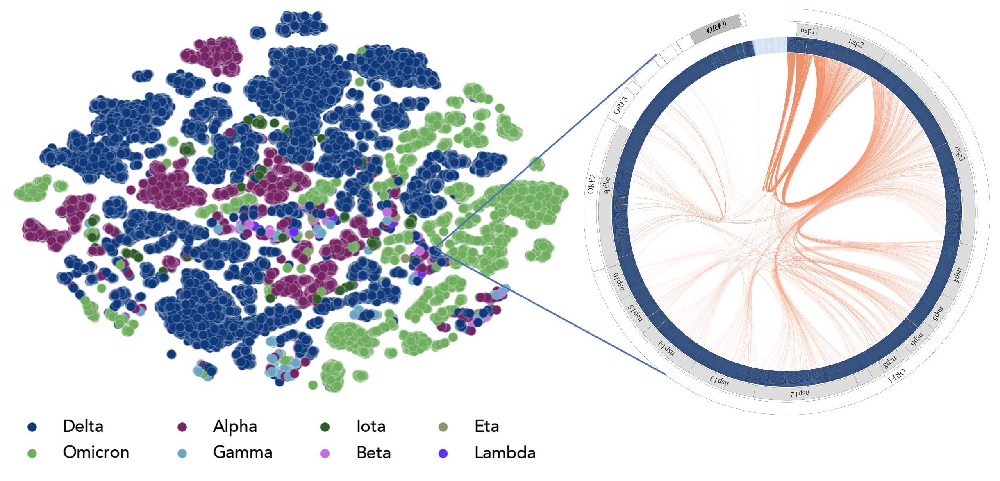
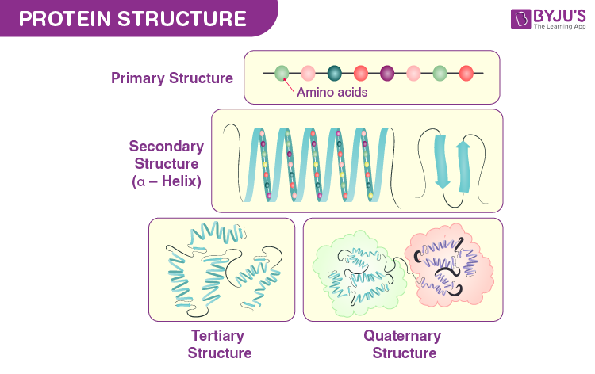
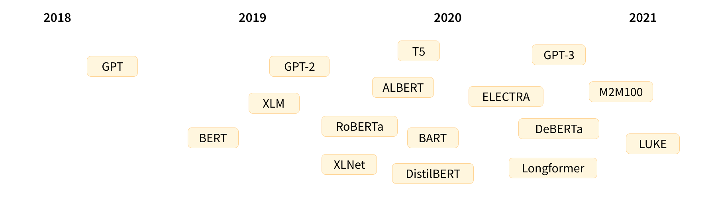
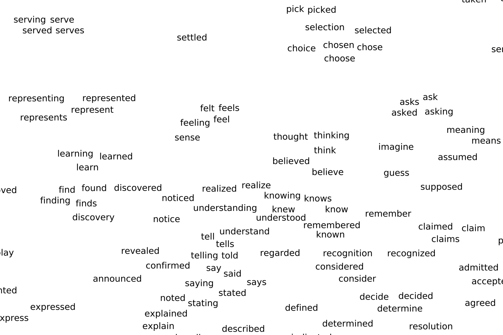
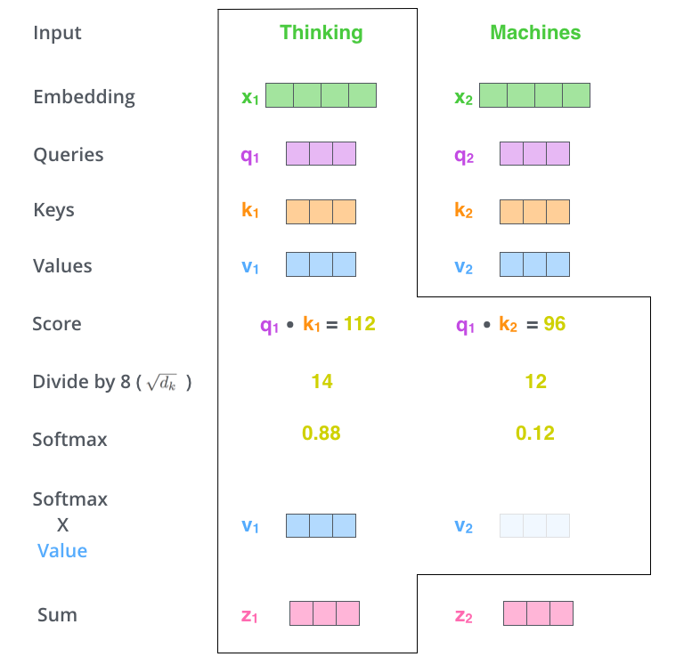
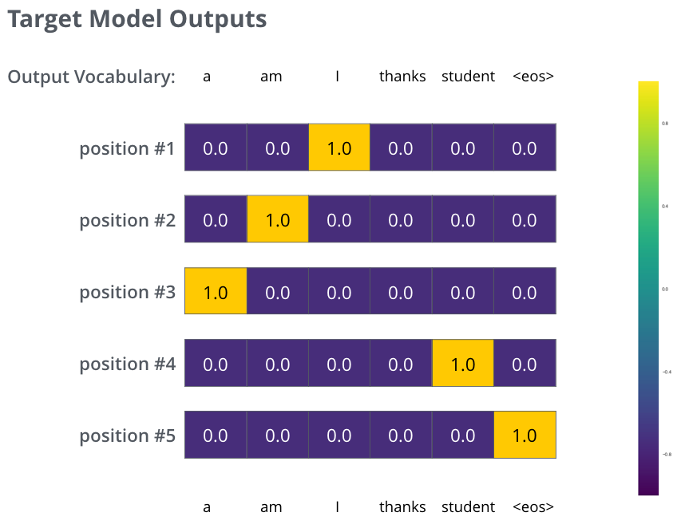
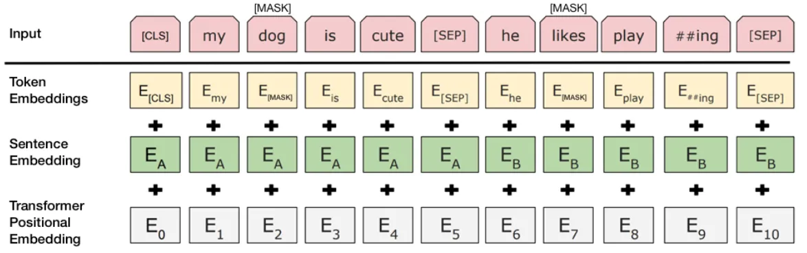
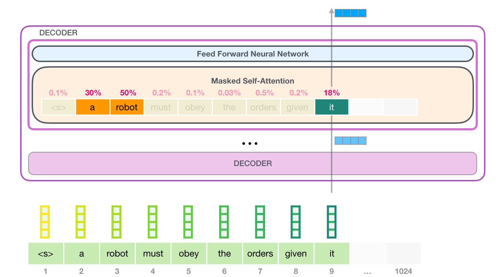
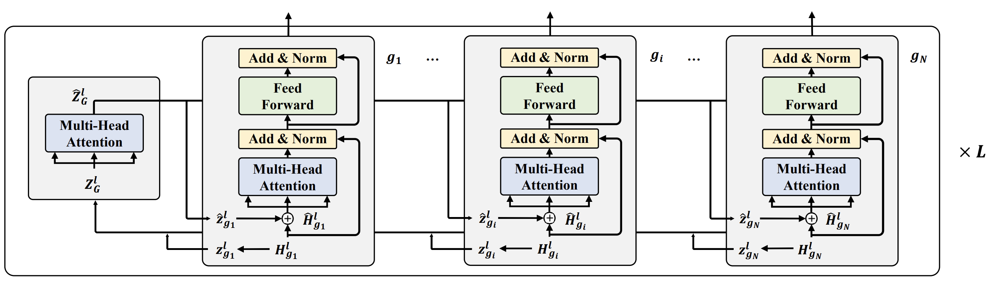

# Language models (LMs)
Sam Foreman
2025-08-05

<link rel="preconnect" href="https://fonts.googleapis.com">

- [Overview](#overview)
- [Modeling Sequential Data](#modeling-sequential-data)
- [Scientific sequential data modeling
  examples](#scientific-sequential-data-modeling-examples)
  - [Nucleic acid sequences + genomic
    data](#nucleic-acid-sequences--genomic-data)
  - [Protein sequences](#protein-sequences)
  - [Other applications:](#other-applications)
- [Overview of Language models](#overview-of-language-models)
  - [RNNs](#rnns)
  - [Transformers](#transformers)
- [Coding example of LLMs in action!](#coding-example-of-llms-in-action)
- [What’s going on under the hood?](#whats-going-on-under-the-hood)
  - [Tokenization](#tokenization)
  - [Token embedding:](#token-embedding)
  - [We can visualize these embeddings of the popular BERT model using
    PCA!](#we-can-visualize-these-embeddings-of-the-popular-bert-model-using-pca)
- [Elements of a Transformer](#elements-of-a-transformer)
- [Attention mechanisms](#attention-mechanisms)
  - [Multi-head attention](#multi-head-attention)
  - [Let’s see attention mechanisms in
    action!](#lets-see-attention-mechanisms-in-action)
- [Positional encoding](#positional-encoding)
- [Output layers](#output-layers)
- [Training](#training)
- [Let’s train a mini-LLM from
  scratch](#lets-train-a-mini-llm-from-scratch)
  - [Set up hyperparameters:](#set-up-hyperparameters)
  - [Load in data and create train and test
    datasets](#load-in-data-and-create-train-and-test-datasets)
  - [Set up the components of the Decoder
    block:](#set-up-the-components-of-the-decoder-block)
  - [Combine components into the Decoder
    block](#combine-components-into-the-decoder-block)
  - [Set up the full Transformer
    model](#set-up-the-full-transformer-model)
- [Homework](#homework)
- [Different types of Transformers](#different-types-of-transformers)
  - [Encoder-Decoder architecture](#encoder-decoder-architecture)
  - [Encoder-only Transformers](#encoder-only-transformers)
  - [Bidirectional Encoder Representations from Transformers (BERT)
    model](#bidirectional-encoder-representations-from-transformers-bert-model)
  - [Decoder-only models](#decoder-only-models)
  - [Advantages and disadvantages](#advantages-and-disadvantages-1)
- [Additional architectures](#additional-architectures)
  - [Vision Transformers](#vision-transformers)
  - [Graph Transformers](#graph-transformers)
- [References](#references)

> [!NOTE]
>
> ### Authors
>
> Author: Archit Vasan , including materials on LLMs by Varuni Sastri
> and Carlo Graziani at Argonne, and discussion/editorial work by Taylor
> Childers, Bethany Lusch, and Venkat Vishwanath (Argonne)
>
> Modification by Huihuo Zheng on August 1, 2025

Inspiration from the blog posts “The Illustrated Transformer” and “The
Illustrated GPT2” by Jay Alammar, highly recommended reading.

Although the name “language models” is derived from Natural Language
Processing, the models used in these approaches can be applied to
diverse scientific applications as illustrated below.

This session is dedicated to setting out the basics of sequential data
modeling, and introducing a few key elements required for DL approaches
to such modeling—principally Transformers.

## Overview

During this session I will cover:

1.  Scientific applications modeling sequential data
2.  Brief History of Language Models
3.  Tokenization and embedding of sequential data
4.  Elements of a Transformer
5.  Attention mechanisms
6.  Output layers
7.  Training loops
8.  Different types of Transformers

## Modeling Sequential Data

Sequences are variable-length lists with data in subsequent iterations
that depends on previous iterations (or tokens).

Mathematically: A sequence is a list of tokens:

$$T = [t_1, t_2, t_3,...,t_N]$$

where each token within the list depends on the others with a particular
probability:

$$P(t_2 | t_1, t_3, t_4, ..., t_N)$$

The purpose of sequential modeling is to learn these probabilities for
possible tokens in a distribution to perform various tasks including:

- Sequence generation based on a prompt
- Language translation (e.g. English –\> French)
- Property prediction (predicting a property based on an entire
  sequence)
- Identifying mistakes or missing elements in sequential data

## Scientific sequential data modeling examples

### Nucleic acid sequences + genomic data

Nucleic acid sequences can be used to predict translation of proteins,
mutations, and gene expression levels.

<div id="fig-rna-sequences">


Figure 1: RNA sequences

</div>

Here is an image of GenSLM. This is a language model developed by
Argonne researchers that can model genomic information in a single
model. It was shown to model the evolution of SARS-COV2 without
expensive experiments.

<div id="fig-genslm">



Figure 2: GenSLM. Image credit: Zvyagin et. al 2022. BioRXiv

</div>

### Protein sequences

Protein sequences can be used to predict folding structure,
protein-protein interactions, chemical/binding properties, protein
function and many more properties.

<div id="fig-protein-sequences">



Figure 3: Protein sequences

</div>

### Other applications:

- Biomedical text
- SMILES strings
- Weather predictions
- Interfacing with simulations such as molecular dynamics simulation

## Overview of Language models

We will now briefly talk about the progression of language models.

### RNNs

Recurrent Neural Newtorks(RNNs) were a traditional model used to
determine temporal dependencies within data.

In RNNs, the hidden state from the previous time step is fed back into
the network, allowing it to maintain a “memory” of past inputs.

They were ideal for tasks with short sequences such as natural language
processing and time-series prediction.

<div id="fig-rnn">


Figure 4: RNN

</div>

However, these networks had significant challenges.

- **Slow to train**: RNNs process data one element at a time,
  maintaining an internal hidden state that is updated at each step.
  They operate recurrently, where each output depends on the previous
  hidden state and the current input; thus, parallel computation is not
  possible.
- **Cannot handle large sequences**: Exploding and vanishing gradients
  limit the RNN modelling of long sequences. Some variants of RNNs such
  as LSTM and GRU addressed this problem, they cannot engage with very
  large sequences.

### Transformers

The newest LMs referred to as “large language models” (since they have
large parameter size) were developed to address many of these
challenges.

These new models base their desin on the Transformer architecture that
was introduced in 2017 in the “Attention is all you need” paper.

Since then a multitude of LLM architectures have been designed.

<div id="fig-chapter1-transformers-chrono">



Figure 5

</div>

The power of these models comes from the “attention mechanism” defined
in the Vaswani 2017 seminal paper.

<div id="fig-transformer-arch">


Figure 6: Transformer architecture

</div>

## Coding example of LLMs in action!

Let’s look at an example of running inference with a LLM as a block box
to generate text given a prompt and we will also initiate a training
loop for an LLM:

Here, we will use the `transformers` library which is as part of
HuggingFace, a repository of different models, tokenizers and
information on how to apply these models

*Warning: Large Language Models are only as good as their training data.
They have no ethics, no judgement, or editing ability. We will be using
some pretrained models from Hugging Face which used wide samples of
internet hosted text. The datasets have not been strictly filtered to
restrict all malign content so the generated text may be surprisingly
dark or questionable. They do not reflect our core values and are only
used for demonstration purposes.*

``` python
# !pip install transformers
# !pip install pandas
# !pip install torch
```

``` python
%load_ext autoreload
%autoreload 2
%matplotlib inline
# settings for jupyter book: svg for html version, high-resolution png for pdf
import matplotlib_inline.backend_inline
matplotlib_inline.backend_inline.set_matplotlib_formats('retina', 'svg', 'png')
import matplotlib as mpl
# mpl.rcParams['figure.dpi'] = 400
from rich import print
```

    The autoreload extension is already loaded. To reload it, use:
      %reload_ext autoreload

``` python
from transformers import AutoConfig, AutoModelForCausalLM, AutoTokenizer

input_text = "I got an A+ in my final exam; I am very"
from transformers import pipeline

generator = pipeline("text-generation", model="openai-community/gpt2")
print(
    [
        i["generated_text"]
        for i in generator(input_text, max_length=20, num_return_sequences=5)
    ]
)
```

<pre style="white-space:pre;overflow-x:auto;line-height:normal;font-family:Menlo,'DejaVu Sans Mono',consolas,'Courier New',monospace"><span style="font-weight: bold">[</span>
    <span style="color: #008000; text-decoration-color: #008000">"I got an A+ in my final exam; I am very proud of my accomplishment in that year. I think I'm going to do well </span>
<span style="color: #008000; text-decoration-color: #008000">and I am excited about this year.\n\nFor some reason, I think I have the most realistic view of my abilities as a </span>
<span style="color: #008000; text-decoration-color: #008000">player. I am a very good athlete, but you can't really put your foot on the gas and not be able to perform. I was </span>
<span style="color: #008000; text-decoration-color: #008000">just surprised how much I could learn from my older brother. He was a big inspiration to me. He was a great mentor </span>
<span style="color: #008000; text-decoration-color: #008000">and a good coach. I really enjoy watching the game.\n\nI have been a big proponent of the philosophy that all </span>
<span style="color: #008000; text-decoration-color: #008000">things are secondary to player development. If you know you're going to be asked to do some things, you better get </span>
<span style="color: #008000; text-decoration-color: #008000">creative. I would love to see players learn to play the game like I did. I hope I can help them find their way to a</span>
<span style="color: #008000; text-decoration-color: #008000">better place. I'm very proud of my play. I'm not going to lie to you, it's a different game.\n\nYou can read more </span>
<span style="color: #008000; text-decoration-color: #008000">about that here.\n\nI'm a fan of the NFL because it's fun and competitive. I really like watching the game and I </span>
<span style="color: #008000; text-decoration-color: #008000">appreciate the challenge it brings. It's a lot of fun to watch. I'd love to go out and"</span>,
    <span style="color: #008000; text-decoration-color: #008000">'I got an A+ in my final exam; I am very lucky. This is my first time doing this and I am very happy that I got</span>
<span style="color: #008000; text-decoration-color: #008000">it."\n\nGone are the days of relying on your spouse to make sure you\'re happy, especially when the world is about </span>
<span style="color: #008000; text-decoration-color: #008000">to change.\n\nWhat would you say to a spouse who finds themselves stressed out?'</span>,
    <span style="color: #008000; text-decoration-color: #008000">"I got an A+ in my final exam; I am very proud of my decision to go back to the lab – I found the best lab in </span>
<span style="color: #008000; text-decoration-color: #008000">my entire life.\n\nI have a BA in Science, Technology, Engineering or Mathematics from the University of Toronto </span>
<span style="color: #008000; text-decoration-color: #008000">and a Ph.D. from the University of Toronto.\n\nI have a Masters in Information Science from the University of </span>
<span style="color: #008000; text-decoration-color: #008000">Toronto.\n\nI have a Bachelor of Science in Computer Science from the University of Toronto.\n\nI have a Doctorate </span>
<span style="color: #008000; text-decoration-color: #008000">in the Computer Science of Computer Systems from the University of Toronto.\n\nI have a Doctorate in Data Science </span>
<span style="color: #008000; text-decoration-color: #008000">from the University of Toronto.\n\nI have a Doctorate in Computer Science from the University of Toronto.\n\nI have</span>
<span style="color: #008000; text-decoration-color: #008000">a Doctorate in Computer Science from the University of Toronto.\n\nI have a Master's Degree in Information Science </span>
<span style="color: #008000; text-decoration-color: #008000">from the University of Toronto.\n\nI have a Master's Degree in Information Science from the University of </span>
<span style="color: #008000; text-decoration-color: #008000">Toronto.\n\nI have a Doctorate in Computer Science from the University of Toronto.\n\nI have a Doctorate in </span>
<span style="color: #008000; text-decoration-color: #008000">Computer Science from the University of Toronto.\n\nI have a Master's Degree in Information Science from the </span>
<span style="color: #008000; text-decoration-color: #008000">University of Toronto.\n\nI have a Master's Degree in Information Science from the University of Toronto.\n\nI </span>
<span style="color: #008000; text-decoration-color: #008000">have"</span>,
    <span style="color: #008000; text-decoration-color: #008000">'I got an A+ in my final exam; I am very proud of my accomplishments. I am proud of my family, friends and the </span>
<span style="color: #008000; text-decoration-color: #008000">quality of our family."\n\nThe family of G.M.K.\'s second wife, Kathy, is not known for her self-confidence. Her </span>
<span style="color: #008000; text-decoration-color: #008000">father, former Republican congressman Ron Paul, was raised in a conservative family and has been a Republican for </span>
<span style="color: #008000; text-decoration-color: #008000">23 years. He is also an ex-convert and has a daughter, Jamey, who graduated from Georgetown University.\n\nThe </span>
<span style="color: #008000; text-decoration-color: #008000">family of the slain soldier, Lt. Col. Jeffrey Lee G. Moore, who was 21, died July 1 amid a prolonged shootout in a </span>
<span style="color: #008000; text-decoration-color: #008000">local church. The two were reported to be in a relationship.\n\nG.M.K.\'s father, the former congressman from </span>
<span style="color: #008000; text-decoration-color: #008000">Texas, was at the base, according to his LinkedIn page, and his stepfather, Rep. Rick Perry, was in the </span>
<span style="color: #008000; text-decoration-color: #008000">area.\n\nThe family\'s attorney, Thomas Miller, said his client was a decorated military veteran who had been </span>
<span style="color: #008000; text-decoration-color: #008000">deployed to Iraq for four months.\n\nThe family of the shooter, Michael Brown, is also not known to have had </span>
<span style="color: #008000; text-decoration-color: #008000">anything to do with the shooting in Ferguson, Mo.\n\nThis story was updated to include comments from U.S. Rep. Mike</span>
<span style="color: #008000; text-decoration-color: #008000">Lee'</span>,
    <span style="color: #008000; text-decoration-color: #008000">'I got an A+ in my final exam; I am very happy with the results. I have no regrets.\n\nP.S. The final exam was </span>
<span style="color: #008000; text-decoration-color: #008000">a fun one. I have no regrets.'</span>
<span style="font-weight: bold">]</span>
</pre>

We can also train a language model given input data:

## What’s going on under the hood?

There are two components that are “black-boxes” here:

1.  The method for tokenization
2.  The model that generates novel text.

Image credit: https://blog.floydhub.com/tokenization-nlp/

### Tokenization

``` python
from transformers import AutoTokenizer

# A utility function to tokenize a sequence and print out some information about it.


def tokenization_summary(tokenizer, sequence):
    # get the vocabulary
    vocab = tokenizer.vocab
    # Number of entries to print
    n = 10

    # Print subset of the vocabulary
    print("Subset of tokenizer.vocab:")
    for i, (token, index) in enumerate(tokenizer.vocab.items()):
        print(f"{token}: {index}")
        if i >= n - 1:
            break

    print("Vocab size of the tokenizer = ", len(vocab))
    print("------------------------------------------")

    # .tokenize chunks the existing sequence into different tokens based on the rules and vocab of the tokenizer.
    tokens = tokenizer.tokenize(sequence)
    print("Tokens : ", tokens)
    print("------------------------------------------")

    # .convert_tokens_to_ids or .encode or .tokenize converts the tokens to their corresponding numerical representation.
    #  .convert_tokens_to_ids has a 1-1 mapping between tokens and numerical representation
    # ids = tokenizer.convert_tokens_to_ids(tokens)
    # print("encoded Ids: ", ids)

    # .encode also adds additional information like Start of sequence tokens and End of sequene
    print("tokenized sequence : ", tokenizer.encode(sequence))

    # .tokenizer has additional information about attention_mask.
    # encode = tokenizer(sequence)
    # print("Encode sequence : ", encode)
    # print("------------------------------------------")

    # .decode decodes the ids to raw text
    ids = tokenizer.convert_tokens_to_ids(tokens)
    decode = tokenizer.decode(ids)
    print("Decode sequence : ", decode)


tokenizer_1 = AutoTokenizer.from_pretrained(
    "gpt2"
)  # GPT-2 uses "Byte-Pair Encoding (BPE)"

sequence = "I got an A+ in my final exam; I am very"

tokenization_summary(tokenizer_1, sequence)
```

<pre style="white-space:pre;overflow-x:auto;line-height:normal;font-family:Menlo,'DejaVu Sans Mono',consolas,'Courier New',monospace">Subset of tokenizer.vocab:
</pre>

<pre style="white-space:pre;overflow-x:auto;line-height:normal;font-family:Menlo,'DejaVu Sans Mono',consolas,'Courier New',monospace"><span style="color: #800080; text-decoration-color: #800080">/</span>: <span style="color: #008080; text-decoration-color: #008080; font-weight: bold">14</span>
</pre>

<pre style="white-space:pre;overflow-x:auto;line-height:normal;font-family:Menlo,'DejaVu Sans Mono',consolas,'Courier New',monospace">Nine: <span style="color: #008080; text-decoration-color: #008080; font-weight: bold">37603</span>
</pre>

<pre style="white-space:pre;overflow-x:auto;line-height:normal;font-family:Menlo,'DejaVu Sans Mono',consolas,'Courier New',monospace">opic: <span style="color: #008080; text-decoration-color: #008080; font-weight: bold">16603</span>
</pre>

<pre style="white-space:pre;overflow-x:auto;line-height:normal;font-family:Menlo,'DejaVu Sans Mono',consolas,'Courier New',monospace">raction: <span style="color: #008080; text-decoration-color: #008080; font-weight: bold">7861</span>
</pre>

<pre style="white-space:pre;overflow-x:auto;line-height:normal;font-family:Menlo,'DejaVu Sans Mono',consolas,'Courier New',monospace">istence: <span style="color: #008080; text-decoration-color: #008080; font-weight: bold">13274</span>
</pre>

<pre style="white-space:pre;overflow-x:auto;line-height:normal;font-family:Menlo,'DejaVu Sans Mono',consolas,'Courier New',monospace">ĠSX: <span style="color: #008080; text-decoration-color: #008080; font-weight: bold">44205</span>
</pre>

<pre style="white-space:pre;overflow-x:auto;line-height:normal;font-family:Menlo,'DejaVu Sans Mono',consolas,'Courier New',monospace">Value: <span style="color: #008080; text-decoration-color: #008080; font-weight: bold">11395</span>
</pre>

<pre style="white-space:pre;overflow-x:auto;line-height:normal;font-family:Menlo,'DejaVu Sans Mono',consolas,'Courier New',monospace">ĠSir: <span style="color: #008080; text-decoration-color: #008080; font-weight: bold">7361</span>
</pre>

<pre style="white-space:pre;overflow-x:auto;line-height:normal;font-family:Menlo,'DejaVu Sans Mono',consolas,'Courier New',monospace">Ġoffers: <span style="color: #008080; text-decoration-color: #008080; font-weight: bold">4394</span>
</pre>

<pre style="white-space:pre;overflow-x:auto;line-height:normal;font-family:Menlo,'DejaVu Sans Mono',consolas,'Courier New',monospace">Ġportfolios: <span style="color: #008080; text-decoration-color: #008080; font-weight: bold">47837</span>
</pre>

<pre style="white-space:pre;overflow-x:auto;line-height:normal;font-family:Menlo,'DejaVu Sans Mono',consolas,'Courier New',monospace">Vocab size of the tokenizer =  <span style="color: #008080; text-decoration-color: #008080; font-weight: bold">50257</span>
</pre>

<pre style="white-space:pre;overflow-x:auto;line-height:normal;font-family:Menlo,'DejaVu Sans Mono',consolas,'Courier New',monospace">------------------------------------------
</pre>

<pre style="white-space:pre;overflow-x:auto;line-height:normal;font-family:Menlo,'DejaVu Sans Mono',consolas,'Courier New',monospace">Tokens : 
<span style="font-weight: bold">[</span><span style="color: #008000; text-decoration-color: #008000">'I'</span>, <span style="color: #008000; text-decoration-color: #008000">'Ġgot'</span>, <span style="color: #008000; text-decoration-color: #008000">'Ġan'</span>, <span style="color: #008000; text-decoration-color: #008000">'ĠA'</span>, <span style="color: #008000; text-decoration-color: #008000">'+'</span>, <span style="color: #008000; text-decoration-color: #008000">'Ġin'</span>, <span style="color: #008000; text-decoration-color: #008000">'Ġmy'</span>, <span style="color: #008000; text-decoration-color: #008000">'Ġfinal'</span>, <span style="color: #008000; text-decoration-color: #008000">'Ġexam'</span>, <span style="color: #008000; text-decoration-color: #008000">';'</span>, <span style="color: #008000; text-decoration-color: #008000">'ĠI'</span>, <span style="color: #008000; text-decoration-color: #008000">'Ġam'</span>, <span style="color: #008000; text-decoration-color: #008000">'Ġvery'</span><span style="font-weight: bold">]</span>
</pre>

<pre style="white-space:pre;overflow-x:auto;line-height:normal;font-family:Menlo,'DejaVu Sans Mono',consolas,'Courier New',monospace">------------------------------------------
</pre>

<pre style="white-space:pre;overflow-x:auto;line-height:normal;font-family:Menlo,'DejaVu Sans Mono',consolas,'Courier New',monospace">tokenized sequence : 
<span style="font-weight: bold">[</span><span style="color: #008080; text-decoration-color: #008080; font-weight: bold">40</span>, <span style="color: #008080; text-decoration-color: #008080; font-weight: bold">1392</span>, <span style="color: #008080; text-decoration-color: #008080; font-weight: bold">281</span>, <span style="color: #008080; text-decoration-color: #008080; font-weight: bold">317</span>, <span style="color: #008080; text-decoration-color: #008080; font-weight: bold">10</span>, <span style="color: #008080; text-decoration-color: #008080; font-weight: bold">287</span>, <span style="color: #008080; text-decoration-color: #008080; font-weight: bold">616</span>, <span style="color: #008080; text-decoration-color: #008080; font-weight: bold">2457</span>, <span style="color: #008080; text-decoration-color: #008080; font-weight: bold">2814</span>, <span style="color: #008080; text-decoration-color: #008080; font-weight: bold">26</span>, <span style="color: #008080; text-decoration-color: #008080; font-weight: bold">314</span>, <span style="color: #008080; text-decoration-color: #008080; font-weight: bold">716</span>, <span style="color: #008080; text-decoration-color: #008080; font-weight: bold">845</span><span style="font-weight: bold">]</span>
</pre>

<pre style="white-space:pre;overflow-x:auto;line-height:normal;font-family:Menlo,'DejaVu Sans Mono',consolas,'Courier New',monospace">Decode sequence :  I got an A+ in my final exam; I am very
</pre>

### Token embedding:

Words are turned into vectors based on their location within a
vocabulary.

The strategy of choice for learning language structure from tokenized
text is to find a clever way to map each token into a moderate-dimension
vector space, adjusting the mapping so that

Similar, or associated tokens take up residence nearby each other, and
different regions of the space correspond to different position in the
sequence. Such a mapping from token ID to a point in a vector space is
called a token embedding. The dimension of the vector space is often
high (e.g. 1024-dimensional), but much smaller than the vocabulary size
(30,000–500,000).

Various approaches have been attempted for generating such embeddings,
including static algorithms that operate on a corpus of tokenized data
as preprocessors for NLP tasks. Transformers, however, adjust their
embeddings during training.

### We can visualize these embeddings of the popular BERT model using PCA!

``` python
# !pip install umap
# !pip install plotly
# !pip install scikit-learn
# !pip install nltk
```

``` python
import nltk
import numpy as np
import pandas as pd
import plotly.express as px
import umap
from nltk.corpus import stopwords
from sklearn.decomposition import PCA
from sklearn.manifold import TSNE
from transformers import BertModel, BertTokenizer

nltk.download("stopwords")
import torch

# Load BERT model and tokenizer
model_name = "bert-base-uncased"
tokenizer = BertTokenizer.from_pretrained(model_name)
model = BertModel.from_pretrained(model_name)

if True:
    text = "The diligent student diligently studied hard for his upcoming exams He was incredibly conscientious in his efforts and committed himself to mastering every subject"

    # Tokenize and get BERT embeddings
    tokens = tokenizer(text, return_tensors="pt", padding=True, truncation=True)
    with torch.no_grad():
        outputs = model(**tokens)
        embeddings = outputs.last_hidden_state.squeeze(
            0
        ).numpy()  # Shape: (num_tokens, 768) for BERT-base

    # Get the list of token labels without special tokens and subword tokens
    labels = [
        tokenizer.convert_ids_to_tokens(id) for id in tokens.input_ids[0].tolist()
    ]
    filtered_labels = [
        label
        for label in labels
        if not (label.startswith("[") and label.endswith("]")) and "##" not in label
    ]

    # Remove stopwords from labels and embeddings
    stop_words = set(stopwords.words("english"))
    filtered_labels = [
        label for label in filtered_labels if label.lower() not in stop_words
    ]
    filtered_embeddings = embeddings[: len(filtered_labels)]

    # Perform PCA for dimensionality reduction (3D)
    pca = PCA(n_components=3)
    embeddings_pca = pca.fit_transform(filtered_embeddings)

    # Convert embeddings and labels to DataFrame for Plotly
    data_pca = {
        "x": embeddings_pca[:, 0],
        "y": embeddings_pca[:, 1],
        "z": embeddings_pca[:, 2],
        "label": filtered_labels,
    }
    df_pca = pd.DataFrame(data_pca)

    # Plot PCA in 3D with Plotly (interactive)
    fig_pca = px.scatter_3d(
        df_pca,
        x="x",
        y="y",
        z="z",
        text="label",
        title="PCA 3D Visualization of Token Embeddings",
        labels={"x": "Dimension 1", "y": "Dimension 2", "z": "Dimension 3"},
        hover_name="label",
    )
    fig_pca.update_traces(marker=dict(size=5), textfont=dict(size=8))
    fig_pca.show()
```

    [nltk_data] Downloading package stopwords to
    [nltk_data]     /Users/samforeman/nltk_data...
    [nltk_data]   Package stopwords is already up-to-date!

        <script type="text/javascript">
        window.PlotlyConfig = {MathJaxConfig: 'local'};
        if (window.MathJax && window.MathJax.Hub && window.MathJax.Hub.Config) {window.MathJax.Hub.Config({SVG: {font: "STIX-Web"}});}
        </script>
        <script type="module">import "https://cdn.plot.ly/plotly-3.0.1.min"</script>
        

<div>            <script src="https://cdnjs.cloudflare.com/ajax/libs/mathjax/2.7.5/MathJax.js?config=TeX-AMS-MML_SVG"></script><script type="text/javascript">if (window.MathJax && window.MathJax.Hub && window.MathJax.Hub.Config) {window.MathJax.Hub.Config({SVG: {font: "STIX-Web"}});}</script>                <script type="text/javascript">window.PlotlyConfig = {MathJaxConfig: 'local'};</script>
        <script charset="utf-8" src="https://cdn.plot.ly/plotly-3.0.1.min.js" integrity="sha256-oy6Be7Eh6eiQFs5M7oXuPxxm9qbJXEtTpfSI93dW16Q=" crossorigin="anonymous"></script>                <div id="b49ce94b-a6c2-488a-9f7b-fd24cb54d663" class="plotly-graph-div" style="height:525px; width:100%;"></div>            <script type="text/javascript">                window.PLOTLYENV=window.PLOTLYENV || {};                                if (document.getElementById("b49ce94b-a6c2-488a-9f7b-fd24cb54d663")) {                    Plotly.newPlot(                        "b49ce94b-a6c2-488a-9f7b-fd24cb54d663",                        [{"hovertemplate":"\u003cb\u003e%{hovertext}\u003c\u002fb\u003e\u003cbr\u003e\u003cbr\u003eDimension 1=%{x}\u003cbr\u003eDimension 2=%{y}\u003cbr\u003eDimension 3=%{z}\u003cbr\u003elabel=%{text}\u003cextra\u003e\u003c\u002fextra\u003e","hovertext":["dil","student","dil","studied","hard","upcoming","exams","incredibly","con","efforts","committed","mastering","every","subject"],"legendgroup":"","marker":{"color":"#636efa","symbol":"circle","size":5},"mode":"markers+text","name":"","scene":"scene","showlegend":false,"text":["dil","student","dil","studied","hard","upcoming","exams","incredibly","con","efforts","committed","mastering","every","subject"],"x":{"dtype":"f4","bdata":"5j4hwThOgMC\u002fdQBBhqLVQAfUc0BwlyLAvoz2QMZ+4kAJ+bY\u002flzE\u002fwM86+b\u002fQ9pfAgZJ2wHoCksA="},"y":{"dtype":"f4","bdata":"0LoPwWmP\u002fsDmpIXA9oY3vYqWp7\u002fkNDNAOXGYv3AIxz87wma\u002fqWCHQEktHkCFyJFAUa+BQIGnnEA="},"z":{"dtype":"f4","bdata":"MLTqP4SCXj+K54y\u002fJggLQfE\u002fdMBc87i\u002f0jWqwKLTk0C3XGrAK+Jwv8edDsAeRSW\u002fD5TtP4chpT8="},"type":"scatter3d","textfont":{"size":8}}],                        {"template":{"data":{"histogram2dcontour":[{"type":"histogram2dcontour","colorbar":{"outlinewidth":0,"ticks":""},"colorscale":[[0.0,"#0d0887"],[0.1111111111111111,"#46039f"],[0.2222222222222222,"#7201a8"],[0.3333333333333333,"#9c179e"],[0.4444444444444444,"#bd3786"],[0.5555555555555556,"#d8576b"],[0.6666666666666666,"#ed7953"],[0.7777777777777778,"#fb9f3a"],[0.8888888888888888,"#fdca26"],[1.0,"#f0f921"]]}],"choropleth":[{"type":"choropleth","colorbar":{"outlinewidth":0,"ticks":""}}],"histogram2d":[{"type":"histogram2d","colorbar":{"outlinewidth":0,"ticks":""},"colorscale":[[0.0,"#0d0887"],[0.1111111111111111,"#46039f"],[0.2222222222222222,"#7201a8"],[0.3333333333333333,"#9c179e"],[0.4444444444444444,"#bd3786"],[0.5555555555555556,"#d8576b"],[0.6666666666666666,"#ed7953"],[0.7777777777777778,"#fb9f3a"],[0.8888888888888888,"#fdca26"],[1.0,"#f0f921"]]}],"heatmap":[{"type":"heatmap","colorbar":{"outlinewidth":0,"ticks":""},"colorscale":[[0.0,"#0d0887"],[0.1111111111111111,"#46039f"],[0.2222222222222222,"#7201a8"],[0.3333333333333333,"#9c179e"],[0.4444444444444444,"#bd3786"],[0.5555555555555556,"#d8576b"],[0.6666666666666666,"#ed7953"],[0.7777777777777778,"#fb9f3a"],[0.8888888888888888,"#fdca26"],[1.0,"#f0f921"]]}],"contourcarpet":[{"type":"contourcarpet","colorbar":{"outlinewidth":0,"ticks":""}}],"contour":[{"type":"contour","colorbar":{"outlinewidth":0,"ticks":""},"colorscale":[[0.0,"#0d0887"],[0.1111111111111111,"#46039f"],[0.2222222222222222,"#7201a8"],[0.3333333333333333,"#9c179e"],[0.4444444444444444,"#bd3786"],[0.5555555555555556,"#d8576b"],[0.6666666666666666,"#ed7953"],[0.7777777777777778,"#fb9f3a"],[0.8888888888888888,"#fdca26"],[1.0,"#f0f921"]]}],"surface":[{"type":"surface","colorbar":{"outlinewidth":0,"ticks":""},"colorscale":[[0.0,"#0d0887"],[0.1111111111111111,"#46039f"],[0.2222222222222222,"#7201a8"],[0.3333333333333333,"#9c179e"],[0.4444444444444444,"#bd3786"],[0.5555555555555556,"#d8576b"],[0.6666666666666666,"#ed7953"],[0.7777777777777778,"#fb9f3a"],[0.8888888888888888,"#fdca26"],[1.0,"#f0f921"]]}],"mesh3d":[{"type":"mesh3d","colorbar":{"outlinewidth":0,"ticks":""}}],"scatter":[{"fillpattern":{"fillmode":"overlay","size":10,"solidity":0.2},"type":"scatter"}],"parcoords":[{"type":"parcoords","line":{"colorbar":{"outlinewidth":0,"ticks":""}}}],"scatterpolargl":[{"type":"scatterpolargl","marker":{"colorbar":{"outlinewidth":0,"ticks":""}}}],"bar":[{"error_x":{"color":"#2a3f5f"},"error_y":{"color":"#2a3f5f"},"marker":{"line":{"color":"#E5ECF6","width":0.5},"pattern":{"fillmode":"overlay","size":10,"solidity":0.2}},"type":"bar"}],"scattergeo":[{"type":"scattergeo","marker":{"colorbar":{"outlinewidth":0,"ticks":""}}}],"scatterpolar":[{"type":"scatterpolar","marker":{"colorbar":{"outlinewidth":0,"ticks":""}}}],"histogram":[{"marker":{"pattern":{"fillmode":"overlay","size":10,"solidity":0.2}},"type":"histogram"}],"scattergl":[{"type":"scattergl","marker":{"colorbar":{"outlinewidth":0,"ticks":""}}}],"scatter3d":[{"type":"scatter3d","line":{"colorbar":{"outlinewidth":0,"ticks":""}},"marker":{"colorbar":{"outlinewidth":0,"ticks":""}}}],"scattermap":[{"type":"scattermap","marker":{"colorbar":{"outlinewidth":0,"ticks":""}}}],"scattermapbox":[{"type":"scattermapbox","marker":{"colorbar":{"outlinewidth":0,"ticks":""}}}],"scatterternary":[{"type":"scatterternary","marker":{"colorbar":{"outlinewidth":0,"ticks":""}}}],"scattercarpet":[{"type":"scattercarpet","marker":{"colorbar":{"outlinewidth":0,"ticks":""}}}],"carpet":[{"aaxis":{"endlinecolor":"#2a3f5f","gridcolor":"white","linecolor":"white","minorgridcolor":"white","startlinecolor":"#2a3f5f"},"baxis":{"endlinecolor":"#2a3f5f","gridcolor":"white","linecolor":"white","minorgridcolor":"white","startlinecolor":"#2a3f5f"},"type":"carpet"}],"table":[{"cells":{"fill":{"color":"#EBF0F8"},"line":{"color":"white"}},"header":{"fill":{"color":"#C8D4E3"},"line":{"color":"white"}},"type":"table"}],"barpolar":[{"marker":{"line":{"color":"#E5ECF6","width":0.5},"pattern":{"fillmode":"overlay","size":10,"solidity":0.2}},"type":"barpolar"}],"pie":[{"automargin":true,"type":"pie"}]},"layout":{"autotypenumbers":"strict","colorway":["#636efa","#EF553B","#00cc96","#ab63fa","#FFA15A","#19d3f3","#FF6692","#B6E880","#FF97FF","#FECB52"],"font":{"color":"#2a3f5f"},"hovermode":"closest","hoverlabel":{"align":"left"},"paper_bgcolor":"white","plot_bgcolor":"#E5ECF6","polar":{"bgcolor":"#E5ECF6","angularaxis":{"gridcolor":"white","linecolor":"white","ticks":""},"radialaxis":{"gridcolor":"white","linecolor":"white","ticks":""}},"ternary":{"bgcolor":"#E5ECF6","aaxis":{"gridcolor":"white","linecolor":"white","ticks":""},"baxis":{"gridcolor":"white","linecolor":"white","ticks":""},"caxis":{"gridcolor":"white","linecolor":"white","ticks":""}},"coloraxis":{"colorbar":{"outlinewidth":0,"ticks":""}},"colorscale":{"sequential":[[0.0,"#0d0887"],[0.1111111111111111,"#46039f"],[0.2222222222222222,"#7201a8"],[0.3333333333333333,"#9c179e"],[0.4444444444444444,"#bd3786"],[0.5555555555555556,"#d8576b"],[0.6666666666666666,"#ed7953"],[0.7777777777777778,"#fb9f3a"],[0.8888888888888888,"#fdca26"],[1.0,"#f0f921"]],"sequentialminus":[[0.0,"#0d0887"],[0.1111111111111111,"#46039f"],[0.2222222222222222,"#7201a8"],[0.3333333333333333,"#9c179e"],[0.4444444444444444,"#bd3786"],[0.5555555555555556,"#d8576b"],[0.6666666666666666,"#ed7953"],[0.7777777777777778,"#fb9f3a"],[0.8888888888888888,"#fdca26"],[1.0,"#f0f921"]],"diverging":[[0,"#8e0152"],[0.1,"#c51b7d"],[0.2,"#de77ae"],[0.3,"#f1b6da"],[0.4,"#fde0ef"],[0.5,"#f7f7f7"],[0.6,"#e6f5d0"],[0.7,"#b8e186"],[0.8,"#7fbc41"],[0.9,"#4d9221"],[1,"#276419"]]},"xaxis":{"gridcolor":"white","linecolor":"white","ticks":"","title":{"standoff":15},"zerolinecolor":"white","automargin":true,"zerolinewidth":2},"yaxis":{"gridcolor":"white","linecolor":"white","ticks":"","title":{"standoff":15},"zerolinecolor":"white","automargin":true,"zerolinewidth":2},"scene":{"xaxis":{"backgroundcolor":"#E5ECF6","gridcolor":"white","linecolor":"white","showbackground":true,"ticks":"","zerolinecolor":"white","gridwidth":2},"yaxis":{"backgroundcolor":"#E5ECF6","gridcolor":"white","linecolor":"white","showbackground":true,"ticks":"","zerolinecolor":"white","gridwidth":2},"zaxis":{"backgroundcolor":"#E5ECF6","gridcolor":"white","linecolor":"white","showbackground":true,"ticks":"","zerolinecolor":"white","gridwidth":2}},"shapedefaults":{"line":{"color":"#2a3f5f"}},"annotationdefaults":{"arrowcolor":"#2a3f5f","arrowhead":0,"arrowwidth":1},"geo":{"bgcolor":"white","landcolor":"#E5ECF6","subunitcolor":"white","showland":true,"showlakes":true,"lakecolor":"white"},"title":{"x":0.05},"mapbox":{"style":"light"},"margin":{"b":0,"l":0,"r":0,"t":30}}},"scene":{"domain":{"x":[0.0,1.0],"y":[0.0,1.0]},"xaxis":{"title":{"text":"Dimension 1"}},"yaxis":{"title":{"text":"Dimension 2"}},"zaxis":{"title":{"text":"Dimension 3"}}},"legend":{"tracegroupgap":0},"title":{"text":"PCA 3D Visualization of Token Embeddings"}},                        {"responsive": true}                    ).then(function(){
                            &#10;var gd = document.getElementById('b49ce94b-a6c2-488a-9f7b-fd24cb54d663');
var x = new MutationObserver(function (mutations, observer) {{
        var display = window.getComputedStyle(gd).display;
        if (!display || display === 'none') {{
            console.log([gd, 'removed!']);
            Plotly.purge(gd);
            observer.disconnect();
        }}
}});
&#10;// Listen for the removal of the full notebook cells
var notebookContainer = gd.closest('#notebook-container');
if (notebookContainer) {{
    x.observe(notebookContainer, {childList: true});
}}
&#10;// Listen for the clearing of the current output cell
var outputEl = gd.closest('.output');
if (outputEl) {{
    x.observe(outputEl, {childList: true});
}}
&#10;                        })                };            </script>        </div>

You should see common words grouped together!

## Elements of a Transformer

Now let’s look at the base elements that make up a Transformer by
dissecting the popular GPT2 model

``` python
from transformers import GPT2LMHeadModel, GPT2Tokenizer

model = GPT2LMHeadModel.from_pretrained("gpt2")
print(model)
```

<pre style="white-space:pre;overflow-x:auto;line-height:normal;font-family:Menlo,'DejaVu Sans Mono',consolas,'Courier New',monospace"><span style="color: #800080; text-decoration-color: #800080; font-weight: bold">GPT2LMHeadModel</span><span style="font-weight: bold">(</span>
  <span style="font-weight: bold">(</span>transformer<span style="font-weight: bold">)</span>: <span style="color: #800080; text-decoration-color: #800080; font-weight: bold">GPT2Model</span><span style="font-weight: bold">(</span>
    <span style="font-weight: bold">(</span>wte<span style="font-weight: bold">)</span>: <span style="color: #800080; text-decoration-color: #800080; font-weight: bold">Embedding</span><span style="font-weight: bold">(</span><span style="color: #008080; text-decoration-color: #008080; font-weight: bold">50257</span>, <span style="color: #008080; text-decoration-color: #008080; font-weight: bold">768</span><span style="font-weight: bold">)</span>
    <span style="font-weight: bold">(</span>wpe<span style="font-weight: bold">)</span>: <span style="color: #800080; text-decoration-color: #800080; font-weight: bold">Embedding</span><span style="font-weight: bold">(</span><span style="color: #008080; text-decoration-color: #008080; font-weight: bold">1024</span>, <span style="color: #008080; text-decoration-color: #008080; font-weight: bold">768</span><span style="font-weight: bold">)</span>
    <span style="font-weight: bold">(</span>drop<span style="font-weight: bold">)</span>: <span style="color: #800080; text-decoration-color: #800080; font-weight: bold">Dropout</span><span style="font-weight: bold">(</span><span style="color: #808000; text-decoration-color: #808000">p</span>=<span style="color: #008080; text-decoration-color: #008080; font-weight: bold">0.1</span>, <span style="color: #808000; text-decoration-color: #808000">inplace</span>=<span style="color: #ff0000; text-decoration-color: #ff0000; font-style: italic">False</span><span style="font-weight: bold">)</span>
    <span style="font-weight: bold">(</span>h<span style="font-weight: bold">)</span>: <span style="color: #800080; text-decoration-color: #800080; font-weight: bold">ModuleList</span><span style="font-weight: bold">(</span>
      <span style="font-weight: bold">(</span><span style="color: #008080; text-decoration-color: #008080; font-weight: bold">0</span>-<span style="color: #008080; text-decoration-color: #008080; font-weight: bold">11</span><span style="font-weight: bold">)</span>: <span style="color: #008080; text-decoration-color: #008080; font-weight: bold">12</span> x <span style="color: #800080; text-decoration-color: #800080; font-weight: bold">GPT2Block</span><span style="font-weight: bold">(</span>
        <span style="font-weight: bold">(</span>ln_1<span style="font-weight: bold">)</span>: <span style="color: #800080; text-decoration-color: #800080; font-weight: bold">LayerNorm</span><span style="font-weight: bold">((</span><span style="color: #008080; text-decoration-color: #008080; font-weight: bold">768</span>,<span style="font-weight: bold">)</span>, <span style="color: #808000; text-decoration-color: #808000">eps</span>=<span style="color: #008080; text-decoration-color: #008080; font-weight: bold">1e-05</span>, <span style="color: #808000; text-decoration-color: #808000">elementwise_affine</span>=<span style="color: #00ff00; text-decoration-color: #00ff00; font-style: italic">True</span><span style="font-weight: bold">)</span>
        <span style="font-weight: bold">(</span>attn<span style="font-weight: bold">)</span>: <span style="color: #800080; text-decoration-color: #800080; font-weight: bold">GPT2Attention</span><span style="font-weight: bold">(</span>
          <span style="font-weight: bold">(</span>c_attn<span style="font-weight: bold">)</span>: <span style="color: #800080; text-decoration-color: #800080; font-weight: bold">Conv1D</span><span style="font-weight: bold">(</span><span style="color: #808000; text-decoration-color: #808000">nf</span>=<span style="color: #008080; text-decoration-color: #008080; font-weight: bold">2304</span>, <span style="color: #808000; text-decoration-color: #808000">nx</span>=<span style="color: #008080; text-decoration-color: #008080; font-weight: bold">768</span><span style="font-weight: bold">)</span>
          <span style="font-weight: bold">(</span>c_proj<span style="font-weight: bold">)</span>: <span style="color: #800080; text-decoration-color: #800080; font-weight: bold">Conv1D</span><span style="font-weight: bold">(</span><span style="color: #808000; text-decoration-color: #808000">nf</span>=<span style="color: #008080; text-decoration-color: #008080; font-weight: bold">768</span>, <span style="color: #808000; text-decoration-color: #808000">nx</span>=<span style="color: #008080; text-decoration-color: #008080; font-weight: bold">768</span><span style="font-weight: bold">)</span>
          <span style="font-weight: bold">(</span>attn_dropout<span style="font-weight: bold">)</span>: <span style="color: #800080; text-decoration-color: #800080; font-weight: bold">Dropout</span><span style="font-weight: bold">(</span><span style="color: #808000; text-decoration-color: #808000">p</span>=<span style="color: #008080; text-decoration-color: #008080; font-weight: bold">0.1</span>, <span style="color: #808000; text-decoration-color: #808000">inplace</span>=<span style="color: #ff0000; text-decoration-color: #ff0000; font-style: italic">False</span><span style="font-weight: bold">)</span>
          <span style="font-weight: bold">(</span>resid_dropout<span style="font-weight: bold">)</span>: <span style="color: #800080; text-decoration-color: #800080; font-weight: bold">Dropout</span><span style="font-weight: bold">(</span><span style="color: #808000; text-decoration-color: #808000">p</span>=<span style="color: #008080; text-decoration-color: #008080; font-weight: bold">0.1</span>, <span style="color: #808000; text-decoration-color: #808000">inplace</span>=<span style="color: #ff0000; text-decoration-color: #ff0000; font-style: italic">False</span><span style="font-weight: bold">)</span>
        <span style="font-weight: bold">)</span>
        <span style="font-weight: bold">(</span>ln_2<span style="font-weight: bold">)</span>: <span style="color: #800080; text-decoration-color: #800080; font-weight: bold">LayerNorm</span><span style="font-weight: bold">((</span><span style="color: #008080; text-decoration-color: #008080; font-weight: bold">768</span>,<span style="font-weight: bold">)</span>, <span style="color: #808000; text-decoration-color: #808000">eps</span>=<span style="color: #008080; text-decoration-color: #008080; font-weight: bold">1e-05</span>, <span style="color: #808000; text-decoration-color: #808000">elementwise_affine</span>=<span style="color: #00ff00; text-decoration-color: #00ff00; font-style: italic">True</span><span style="font-weight: bold">)</span>
        <span style="font-weight: bold">(</span>mlp<span style="font-weight: bold">)</span>: <span style="color: #800080; text-decoration-color: #800080; font-weight: bold">GPT2MLP</span><span style="font-weight: bold">(</span>
          <span style="font-weight: bold">(</span>c_fc<span style="font-weight: bold">)</span>: <span style="color: #800080; text-decoration-color: #800080; font-weight: bold">Conv1D</span><span style="font-weight: bold">(</span><span style="color: #808000; text-decoration-color: #808000">nf</span>=<span style="color: #008080; text-decoration-color: #008080; font-weight: bold">3072</span>, <span style="color: #808000; text-decoration-color: #808000">nx</span>=<span style="color: #008080; text-decoration-color: #008080; font-weight: bold">768</span><span style="font-weight: bold">)</span>
          <span style="font-weight: bold">(</span>c_proj<span style="font-weight: bold">)</span>: <span style="color: #800080; text-decoration-color: #800080; font-weight: bold">Conv1D</span><span style="font-weight: bold">(</span><span style="color: #808000; text-decoration-color: #808000">nf</span>=<span style="color: #008080; text-decoration-color: #008080; font-weight: bold">768</span>, <span style="color: #808000; text-decoration-color: #808000">nx</span>=<span style="color: #008080; text-decoration-color: #008080; font-weight: bold">3072</span><span style="font-weight: bold">)</span>
          <span style="font-weight: bold">(</span>act<span style="font-weight: bold">)</span>: <span style="color: #800080; text-decoration-color: #800080; font-weight: bold">NewGELUActivation</span><span style="font-weight: bold">()</span>
          <span style="font-weight: bold">(</span>dropout<span style="font-weight: bold">)</span>: <span style="color: #800080; text-decoration-color: #800080; font-weight: bold">Dropout</span><span style="font-weight: bold">(</span><span style="color: #808000; text-decoration-color: #808000">p</span>=<span style="color: #008080; text-decoration-color: #008080; font-weight: bold">0.1</span>, <span style="color: #808000; text-decoration-color: #808000">inplace</span>=<span style="color: #ff0000; text-decoration-color: #ff0000; font-style: italic">False</span><span style="font-weight: bold">)</span>
        <span style="font-weight: bold">)</span>
      <span style="font-weight: bold">)</span>
    <span style="font-weight: bold">)</span>
    <span style="font-weight: bold">(</span>ln_f<span style="font-weight: bold">)</span>: <span style="color: #800080; text-decoration-color: #800080; font-weight: bold">LayerNorm</span><span style="font-weight: bold">((</span><span style="color: #008080; text-decoration-color: #008080; font-weight: bold">768</span>,<span style="font-weight: bold">)</span>, <span style="color: #808000; text-decoration-color: #808000">eps</span>=<span style="color: #008080; text-decoration-color: #008080; font-weight: bold">1e-05</span>, <span style="color: #808000; text-decoration-color: #808000">elementwise_affine</span>=<span style="color: #00ff00; text-decoration-color: #00ff00; font-style: italic">True</span><span style="font-weight: bold">)</span>
  <span style="font-weight: bold">)</span>
  <span style="font-weight: bold">(</span>lm_head<span style="font-weight: bold">)</span>: <span style="color: #800080; text-decoration-color: #800080; font-weight: bold">Linear</span><span style="font-weight: bold">(</span><span style="color: #808000; text-decoration-color: #808000">in_features</span>=<span style="color: #008080; text-decoration-color: #008080; font-weight: bold">768</span>, <span style="color: #808000; text-decoration-color: #808000">out_features</span>=<span style="color: #008080; text-decoration-color: #008080; font-weight: bold">50257</span>, <span style="color: #808000; text-decoration-color: #808000">bias</span>=<span style="color: #ff0000; text-decoration-color: #ff0000; font-style: italic">False</span><span style="font-weight: bold">)</span>
<span style="font-weight: bold">)</span>
</pre>

GPT2 is an example of a Transformer Decoder which is used to generate
novel text.

Decoder models use only the decoder of a Transformer model. At each
stage, for a given word the attention layers can only access the words
positioned before it in the sentence. These models are often called
auto-regressive models.

The pretraining of decoder models usually revolves around predicting the
next word in the sentence.

These models are best suited for tasks involving text generation.

Examples of these include: \* CTRL \* GPT \* GPT-2 \* Transformer XL

Let’s discuss one of the most popular models, GPT-2 in a little more
detail.

The architecture of GPT-2 is inspired by the paper: “Generating
Wikipedia by Summarizing Long Sequences” which is another arrangement of
the transformer block that can do language modeling. This model threw
away the encoder and thus is known as the “Transformer-Decoder”.


Image credit: https://jalammar.github.io/illustrated-gpt2/

The Transformer-Decoder is composed of Decoder blocks stacked ontop of
each other where each contains two types of layers: 1. Masked
Self-Attention and 2. Feed Forward Neural Networks.

In this lecture, we will \* First, discuss attention mechanisms at
length as this is arguably the greatest contribution by Transformers. \*
Second, extend the discussion from last week
(https://github.com/argonne-lcf/ai-science-training-series/blob/main/04_intro_to_llms/Sequential_Data_Models.ipynb)
on embedding input data while taking into account position. \* Third,
discuss outputting real text/sequences from the models. \* Fourth, build
a training loop for a mini-LLM.

``` python
## IMPORTS

import torch
import torch.nn as nn
from torch.nn import functional as F

torch.manual_seed(1337)
# hyperparameters
batch_size = 16  # how many independent sequences will we process in parallel?
block_size = 32  # what is the maximum context length for predictions?
max_iters = 5000
eval_interval = 100
learning_rate = 1e-3
device = "cuda" if torch.cuda.is_available() else "cpu"
eval_iters = 200
n_embd = 64
n_head = 4  ## so head_size = 16
n_layer = 4
dropout = 0.0
# ------------

torch.manual_seed(1337)
```

    <torch._C.Generator at 0x122ce6d50>

## Attention mechanisms

Suppose the following sentence is an input sentence we want to translate
using an LLM:

`”The animal didn't cross the street because it was too tired”`

Earlier, we mentioned that the Transformer learns an embedding of all
words allowing interpretation of meanings of words.



So, if the model did a good job in token embedding, it will “know” what
all the words in this sentence mean.

But to understand a full sentence, the model also need to understand
what each word means in relation to other words.

For example, when we read the sentence:
`”The animal didn't cross the street because it was too tired”` we know
intuitively that the word `"it"` refers to `"animal"`, the state for
`"it"` is `"tired"`, and the associated action is `"didn't cross"`.

However, the model needs a way to learn all of this information in a
simple yet generalizable way. What makes Transformers particularly
powerful compared to earlier sequential architectures is how it encodes
context with the **self-attention mechanism**.

As the model processes each word in the input sequence, attention looks
at other positions in the input sequence for clues to a better
understanding for this word.


Image credit: https://jalammar.github.io/illustrated-transformer/

Self-attention mechanisms use 3 vectors to encode the context of a word
in a sequence with another word: 1. Query: the word representation we
score other words against using the other word’s keys 2. Key: labels for
the words in a sequence that we match against the query 3. Value: actual
word representation. We will use the queries and keys to score the
word’s relevance to the query, and multiply this by the value.

An analogy provided by Jay Alammar is thinking about attention as
choosing a file from a file cabinet according to information on a
post-it note. You can use the post-it note (query) to identify the
folder (key) that most matches the topic you are looking up. Then you
access the contents of the file (value) according to its relevance to
your query.


Image credit: https://jalammar.github.io/illustrated-gpt2/

In our models, we can encode queries, keys, and values using simple
linear layers with the same size (`sequence length, head_size`). During
the training process, these layers will be updated to best encode
context.

``` python
C = 32  # channels
head_size = 16

key = nn.Linear(C, head_size, bias=False)
query = nn.Linear(C, head_size, bias=False)
value = nn.Linear(C, head_size, bias=False)
```

The algorithm for self-attention is as follows:

1.  Generate query, key and value vectors for each word
2.  Calculate a score for each word in the input sentence against each
    other.
3.  Divide the scores by the square root of the dimension of the key
    vectors to stabilize the gradients. This is then passed through a
    softmax operation.
4.  Multiply each value vector by the softmax score.
5.  Sum up the weighted value vectors to produce the output.



Image credit: https://jalammar.github.io/illustrated-transformer/

Let’s see how attention is performed in the code.

``` python
import torch
import torch.nn as nn
from torch.nn import functional as F

torch.manual_seed(1337)
B, T, C = 4, 8, 32  # batch, time, channels
x = torch.randn(B, T, C)

# Here we want the wei to be data dependent - ie gather info from the past but in a data dependant way

head_size = 16
key = nn.Linear(C, head_size, bias=False)
query = nn.Linear(C, head_size, bias=False)
value = nn.Linear(C, head_size, bias=False)
k = key(
    x
)  # (B, T, 16) # each token here (totally B*T) produce a key and query in parallel and independently
q = query(x)  # (B, T, 16)
v = value(x)

wei = (
    q @ k.transpose(-2, -1) * head_size**-0.5
)  # (B, T, 16) @ (B, 16, T) ---> (B, T, T). #
wei = F.softmax(
    wei, dim=-1
)  # exponentiate and normalize giving a nice distibution that sums to 1 and
# now it tells us that in a data dependent manner how much of info to aggregate from

out = wei @ v  # aggregate the attention scores and value vector.
```

``` python
print(out[0])
```

<pre style="white-space:pre;overflow-x:auto;line-height:normal;font-family:Menlo,'DejaVu Sans Mono',consolas,'Courier New',monospace"><span style="color: #800080; text-decoration-color: #800080; font-weight: bold">tensor</span><span style="font-weight: bold">([[</span> <span style="color: #008080; text-decoration-color: #008080; font-weight: bold">0.0618</span>, <span style="color: #008080; text-decoration-color: #008080; font-weight: bold">-0.0091</span>, <span style="color: #008080; text-decoration-color: #008080; font-weight: bold">-0.3488</span>,  <span style="color: #008080; text-decoration-color: #008080; font-weight: bold">0.3208</span>,  <span style="color: #008080; text-decoration-color: #008080; font-weight: bold">0.2971</span>, <span style="color: #008080; text-decoration-color: #008080; font-weight: bold">-0.1573</span>, <span style="color: #008080; text-decoration-color: #008080; font-weight: bold">-0.0561</span>,  <span style="color: #008080; text-decoration-color: #008080; font-weight: bold">0.1068</span>,
          <span style="color: #008080; text-decoration-color: #008080; font-weight: bold">0.0368</span>,  <span style="color: #008080; text-decoration-color: #008080; font-weight: bold">0.0139</span>, <span style="color: #008080; text-decoration-color: #008080; font-weight: bold">-0.0017</span>,  <span style="color: #008080; text-decoration-color: #008080; font-weight: bold">0.3110</span>,  <span style="color: #008080; text-decoration-color: #008080; font-weight: bold">0.1404</span>, <span style="color: #008080; text-decoration-color: #008080; font-weight: bold">-0.0158</span>,  <span style="color: #008080; text-decoration-color: #008080; font-weight: bold">0.1853</span>,  <span style="color: #008080; text-decoration-color: #008080; font-weight: bold">0.4290</span><span style="font-weight: bold">]</span>,
        <span style="font-weight: bold">[</span> <span style="color: #008080; text-decoration-color: #008080; font-weight: bold">0.1578</span>, <span style="color: #008080; text-decoration-color: #008080; font-weight: bold">-0.0971</span>, <span style="color: #008080; text-decoration-color: #008080; font-weight: bold">-0.4256</span>,  <span style="color: #008080; text-decoration-color: #008080; font-weight: bold">0.3538</span>,  <span style="color: #008080; text-decoration-color: #008080; font-weight: bold">0.3621</span>, <span style="color: #008080; text-decoration-color: #008080; font-weight: bold">-0.2392</span>, <span style="color: #008080; text-decoration-color: #008080; font-weight: bold">-0.0536</span>,  <span style="color: #008080; text-decoration-color: #008080; font-weight: bold">0.1759</span>,
          <span style="color: #008080; text-decoration-color: #008080; font-weight: bold">0.1115</span>,  <span style="color: #008080; text-decoration-color: #008080; font-weight: bold">0.0282</span>, <span style="color: #008080; text-decoration-color: #008080; font-weight: bold">-0.0649</span>,  <span style="color: #008080; text-decoration-color: #008080; font-weight: bold">0.3641</span>,  <span style="color: #008080; text-decoration-color: #008080; font-weight: bold">0.1928</span>,  <span style="color: #008080; text-decoration-color: #008080; font-weight: bold">0.0261</span>,  <span style="color: #008080; text-decoration-color: #008080; font-weight: bold">0.2162</span>,  <span style="color: #008080; text-decoration-color: #008080; font-weight: bold">0.3758</span><span style="font-weight: bold">]</span>,
        <span style="font-weight: bold">[</span> <span style="color: #008080; text-decoration-color: #008080; font-weight: bold">0.1293</span>,  <span style="color: #008080; text-decoration-color: #008080; font-weight: bold">0.0759</span>, <span style="color: #008080; text-decoration-color: #008080; font-weight: bold">-0.2946</span>,  <span style="color: #008080; text-decoration-color: #008080; font-weight: bold">0.2292</span>,  <span style="color: #008080; text-decoration-color: #008080; font-weight: bold">0.2215</span>, <span style="color: #008080; text-decoration-color: #008080; font-weight: bold">-0.0710</span>, <span style="color: #008080; text-decoration-color: #008080; font-weight: bold">-0.0107</span>,  <span style="color: #008080; text-decoration-color: #008080; font-weight: bold">0.1616</span>,
         <span style="color: #008080; text-decoration-color: #008080; font-weight: bold">-0.0930</span>, <span style="color: #008080; text-decoration-color: #008080; font-weight: bold">-0.0877</span>,  <span style="color: #008080; text-decoration-color: #008080; font-weight: bold">0.0567</span>,  <span style="color: #008080; text-decoration-color: #008080; font-weight: bold">0.1899</span>,  <span style="color: #008080; text-decoration-color: #008080; font-weight: bold">0.0311</span>, <span style="color: #008080; text-decoration-color: #008080; font-weight: bold">-0.0894</span>,  <span style="color: #008080; text-decoration-color: #008080; font-weight: bold">0.0309</span>,  <span style="color: #008080; text-decoration-color: #008080; font-weight: bold">0.5471</span><span style="font-weight: bold">]</span>,
        <span style="font-weight: bold">[</span> <span style="color: #008080; text-decoration-color: #008080; font-weight: bold">0.1247</span>,  <span style="color: #008080; text-decoration-color: #008080; font-weight: bold">0.1400</span>, <span style="color: #008080; text-decoration-color: #008080; font-weight: bold">-0.2436</span>,  <span style="color: #008080; text-decoration-color: #008080; font-weight: bold">0.1819</span>,  <span style="color: #008080; text-decoration-color: #008080; font-weight: bold">0.1976</span>,  <span style="color: #008080; text-decoration-color: #008080; font-weight: bold">0.0338</span>, <span style="color: #008080; text-decoration-color: #008080; font-weight: bold">-0.0028</span>,  <span style="color: #008080; text-decoration-color: #008080; font-weight: bold">0.1124</span>,
         <span style="color: #008080; text-decoration-color: #008080; font-weight: bold">-0.1477</span>, <span style="color: #008080; text-decoration-color: #008080; font-weight: bold">-0.0748</span>,  <span style="color: #008080; text-decoration-color: #008080; font-weight: bold">0.0650</span>,  <span style="color: #008080; text-decoration-color: #008080; font-weight: bold">0.1392</span>, <span style="color: #008080; text-decoration-color: #008080; font-weight: bold">-0.0314</span>, <span style="color: #008080; text-decoration-color: #008080; font-weight: bold">-0.0989</span>,  <span style="color: #008080; text-decoration-color: #008080; font-weight: bold">0.0613</span>,  <span style="color: #008080; text-decoration-color: #008080; font-weight: bold">0.5433</span><span style="font-weight: bold">]</span>,
        <span style="font-weight: bold">[</span> <span style="color: #008080; text-decoration-color: #008080; font-weight: bold">0.0667</span>,  <span style="color: #008080; text-decoration-color: #008080; font-weight: bold">0.1845</span>, <span style="color: #008080; text-decoration-color: #008080; font-weight: bold">-0.2135</span>,  <span style="color: #008080; text-decoration-color: #008080; font-weight: bold">0.2813</span>,  <span style="color: #008080; text-decoration-color: #008080; font-weight: bold">0.2064</span>,  <span style="color: #008080; text-decoration-color: #008080; font-weight: bold">0.0873</span>,  <span style="color: #008080; text-decoration-color: #008080; font-weight: bold">0.0084</span>,  <span style="color: #008080; text-decoration-color: #008080; font-weight: bold">0.2055</span>,
         <span style="color: #008080; text-decoration-color: #008080; font-weight: bold">-0.1130</span>, <span style="color: #008080; text-decoration-color: #008080; font-weight: bold">-0.1466</span>,  <span style="color: #008080; text-decoration-color: #008080; font-weight: bold">0.0459</span>,  <span style="color: #008080; text-decoration-color: #008080; font-weight: bold">0.1923</span>, <span style="color: #008080; text-decoration-color: #008080; font-weight: bold">-0.0275</span>, <span style="color: #008080; text-decoration-color: #008080; font-weight: bold">-0.1107</span>,  <span style="color: #008080; text-decoration-color: #008080; font-weight: bold">0.0065</span>,  <span style="color: #008080; text-decoration-color: #008080; font-weight: bold">0.4674</span><span style="font-weight: bold">]</span>,
        <span style="font-weight: bold">[</span> <span style="color: #008080; text-decoration-color: #008080; font-weight: bold">0.1924</span>,  <span style="color: #008080; text-decoration-color: #008080; font-weight: bold">0.1693</span>, <span style="color: #008080; text-decoration-color: #008080; font-weight: bold">-0.1568</span>,  <span style="color: #008080; text-decoration-color: #008080; font-weight: bold">0.2284</span>,  <span style="color: #008080; text-decoration-color: #008080; font-weight: bold">0.1620</span>,  <span style="color: #008080; text-decoration-color: #008080; font-weight: bold">0.0737</span>,  <span style="color: #008080; text-decoration-color: #008080; font-weight: bold">0.0443</span>,  <span style="color: #008080; text-decoration-color: #008080; font-weight: bold">0.2519</span>,
         <span style="color: #008080; text-decoration-color: #008080; font-weight: bold">-0.1912</span>, <span style="color: #008080; text-decoration-color: #008080; font-weight: bold">-0.1979</span>,  <span style="color: #008080; text-decoration-color: #008080; font-weight: bold">0.0832</span>,  <span style="color: #008080; text-decoration-color: #008080; font-weight: bold">0.0713</span>, <span style="color: #008080; text-decoration-color: #008080; font-weight: bold">-0.0826</span>, <span style="color: #008080; text-decoration-color: #008080; font-weight: bold">-0.0848</span>, <span style="color: #008080; text-decoration-color: #008080; font-weight: bold">-0.1047</span>,  <span style="color: #008080; text-decoration-color: #008080; font-weight: bold">0.6089</span><span style="font-weight: bold">]</span>,
        <span style="font-weight: bold">[</span> <span style="color: #008080; text-decoration-color: #008080; font-weight: bold">0.1184</span>,  <span style="color: #008080; text-decoration-color: #008080; font-weight: bold">0.0884</span>, <span style="color: #008080; text-decoration-color: #008080; font-weight: bold">-0.2652</span>,  <span style="color: #008080; text-decoration-color: #008080; font-weight: bold">0.2560</span>,  <span style="color: #008080; text-decoration-color: #008080; font-weight: bold">0.1840</span>,  <span style="color: #008080; text-decoration-color: #008080; font-weight: bold">0.0284</span>, <span style="color: #008080; text-decoration-color: #008080; font-weight: bold">-0.0621</span>,  <span style="color: #008080; text-decoration-color: #008080; font-weight: bold">0.1181</span>,
         <span style="color: #008080; text-decoration-color: #008080; font-weight: bold">-0.0880</span>,  <span style="color: #008080; text-decoration-color: #008080; font-weight: bold">0.0104</span>,  <span style="color: #008080; text-decoration-color: #008080; font-weight: bold">0.1123</span>,  <span style="color: #008080; text-decoration-color: #008080; font-weight: bold">0.1850</span>,  <span style="color: #008080; text-decoration-color: #008080; font-weight: bold">0.0369</span>, <span style="color: #008080; text-decoration-color: #008080; font-weight: bold">-0.0730</span>,  <span style="color: #008080; text-decoration-color: #008080; font-weight: bold">0.0663</span>,  <span style="color: #008080; text-decoration-color: #008080; font-weight: bold">0.5242</span><span style="font-weight: bold">]</span>,
        <span style="font-weight: bold">[</span> <span style="color: #008080; text-decoration-color: #008080; font-weight: bold">0.1243</span>,  <span style="color: #008080; text-decoration-color: #008080; font-weight: bold">0.0453</span>, <span style="color: #008080; text-decoration-color: #008080; font-weight: bold">-0.3412</span>,  <span style="color: #008080; text-decoration-color: #008080; font-weight: bold">0.2709</span>,  <span style="color: #008080; text-decoration-color: #008080; font-weight: bold">0.2335</span>, <span style="color: #008080; text-decoration-color: #008080; font-weight: bold">-0.0948</span>, <span style="color: #008080; text-decoration-color: #008080; font-weight: bold">-0.0421</span>,  <span style="color: #008080; text-decoration-color: #008080; font-weight: bold">0.2143</span>,
         <span style="color: #008080; text-decoration-color: #008080; font-weight: bold">-0.0330</span>, <span style="color: #008080; text-decoration-color: #008080; font-weight: bold">-0.0313</span>,  <span style="color: #008080; text-decoration-color: #008080; font-weight: bold">0.0520</span>,  <span style="color: #008080; text-decoration-color: #008080; font-weight: bold">0.2378</span>,  <span style="color: #008080; text-decoration-color: #008080; font-weight: bold">0.1084</span>, <span style="color: #008080; text-decoration-color: #008080; font-weight: bold">-0.0959</span>,  <span style="color: #008080; text-decoration-color: #008080; font-weight: bold">0.0300</span>,  <span style="color: #008080; text-decoration-color: #008080; font-weight: bold">0.4707</span><span style="font-weight: bold">]]</span>,
       <span style="color: #808000; text-decoration-color: #808000">grad_fn</span>=<span style="font-weight: bold">&lt;</span><span style="color: #ff00ff; text-decoration-color: #ff00ff; font-weight: bold">SelectBackward0</span><span style="font-weight: bold">&gt;)</span>
</pre>

### Multi-head attention

In practice, multiple attention heads are used which 1. Expands the
model’s ability to focus on different positions and prevent the
attention to be dominated by the word itself. 2. Have multiple
“representation subspaces”. Have multiple sets of Query/Key/Value weight
matrices


Image credit: https://jalammar.github.io/illustrated-transformer/

### Let’s see attention mechanisms in action!

We are going to use the powerful visualization tool bertviz, which
allows an interactive experience of the attention mechanisms. Normally
these mechanisms are abstracted away but this will allow us to inspect
our model in more detail.

``` python
!pip install bertviz
```

    huggingface/tokenizers: The current process just got forked, after parallelism has already been used. Disabling parallelism to avoid deadlocks...
    To disable this warning, you can either:
        - Avoid using `tokenizers` before the fork if possible
        - Explicitly set the environment variable TOKENIZERS_PARALLELISM=(true | false)

    Requirement already satisfied: bertviz in /Users/samforeman/projects/saforem2/intro-hpc-bootcamp-2025/.venv/lib/python3.13/site-packages (1.4.1)
    Requirement already satisfied: transformers>=2.0 in /Users/samforeman/projects/saforem2/intro-hpc-bootcamp-2025/.venv/lib/python3.13/site-packages (from bertviz) (4.53.3)
    Requirement already satisfied: torch>=1.0 in /Users/samforeman/projects/saforem2/intro-hpc-bootcamp-2025/.venv/lib/python3.13/site-packages (from bertviz) (2.7.1)
    Requirement already satisfied: tqdm in /Users/samforeman/projects/saforem2/intro-hpc-bootcamp-2025/.venv/lib/python3.13/site-packages (from bertviz) (4.67.1)
    Requirement already satisfied: boto3 in /Users/samforeman/projects/saforem2/intro-hpc-bootcamp-2025/.venv/lib/python3.13/site-packages (from bertviz) (1.39.11)
    Requirement already satisfied: requests in /Users/samforeman/projects/saforem2/intro-hpc-bootcamp-2025/.venv/lib/python3.13/site-packages (from bertviz) (2.32.4)
    Requirement already satisfied: regex in /Users/samforeman/projects/saforem2/intro-hpc-bootcamp-2025/.venv/lib/python3.13/site-packages (from bertviz) (2024.11.6)
    Requirement already satisfied: sentencepiece in /Users/samforeman/projects/saforem2/intro-hpc-bootcamp-2025/.venv/lib/python3.13/site-packages (from bertviz) (0.2.0)
    Requirement already satisfied: IPython>=7.14 in /Users/samforeman/projects/saforem2/intro-hpc-bootcamp-2025/.venv/lib/python3.13/site-packages (from bertviz) (9.4.0)
    Requirement already satisfied: decorator in /Users/samforeman/projects/saforem2/intro-hpc-bootcamp-2025/.venv/lib/python3.13/site-packages (from IPython>=7.14->bertviz) (5.2.1)
    Requirement already satisfied: ipython-pygments-lexers in /Users/samforeman/projects/saforem2/intro-hpc-bootcamp-2025/.venv/lib/python3.13/site-packages (from IPython>=7.14->bertviz) (1.1.1)
    Requirement already satisfied: jedi>=0.16 in /Users/samforeman/projects/saforem2/intro-hpc-bootcamp-2025/.venv/lib/python3.13/site-packages (from IPython>=7.14->bertviz) (0.19.2)
    Requirement already satisfied: matplotlib-inline in /Users/samforeman/projects/saforem2/intro-hpc-bootcamp-2025/.venv/lib/python3.13/site-packages (from IPython>=7.14->bertviz) (0.1.7)
    Requirement already satisfied: pexpect>4.3 in /Users/samforeman/projects/saforem2/intro-hpc-bootcamp-2025/.venv/lib/python3.13/site-packages (from IPython>=7.14->bertviz) (4.9.0)
    Requirement already satisfied: prompt_toolkit<3.1.0,>=3.0.41 in /Users/samforeman/projects/saforem2/intro-hpc-bootcamp-2025/.venv/lib/python3.13/site-packages (from IPython>=7.14->bertviz) (3.0.51)
    Requirement already satisfied: pygments>=2.4.0 in /Users/samforeman/projects/saforem2/intro-hpc-bootcamp-2025/.venv/lib/python3.13/site-packages (from IPython>=7.14->bertviz) (2.19.2)
    Requirement already satisfied: stack_data in /Users/samforeman/projects/saforem2/intro-hpc-bootcamp-2025/.venv/lib/python3.13/site-packages (from IPython>=7.14->bertviz) (0.6.3)
    Requirement already satisfied: traitlets>=5.13.0 in /Users/samforeman/projects/saforem2/intro-hpc-bootcamp-2025/.venv/lib/python3.13/site-packages (from IPython>=7.14->bertviz) (5.14.3)
    Requirement already satisfied: wcwidth in /Users/samforeman/projects/saforem2/intro-hpc-bootcamp-2025/.venv/lib/python3.13/site-packages (from prompt_toolkit<3.1.0,>=3.0.41->IPython>=7.14->bertviz) (0.2.13)
    Requirement already satisfied: parso<0.9.0,>=0.8.4 in /Users/samforeman/projects/saforem2/intro-hpc-bootcamp-2025/.venv/lib/python3.13/site-packages (from jedi>=0.16->IPython>=7.14->bertviz) (0.8.4)
    Requirement already satisfied: ptyprocess>=0.5 in /Users/samforeman/projects/saforem2/intro-hpc-bootcamp-2025/.venv/lib/python3.13/site-packages (from pexpect>4.3->IPython>=7.14->bertviz) (0.7.0)
    Requirement already satisfied: filelock in /Users/samforeman/projects/saforem2/intro-hpc-bootcamp-2025/.venv/lib/python3.13/site-packages (from torch>=1.0->bertviz) (3.18.0)
    Requirement already satisfied: typing-extensions>=4.10.0 in /Users/samforeman/projects/saforem2/intro-hpc-bootcamp-2025/.venv/lib/python3.13/site-packages (from torch>=1.0->bertviz) (4.14.1)
    Requirement already satisfied: setuptools in /Users/samforeman/projects/saforem2/intro-hpc-bootcamp-2025/.venv/lib/python3.13/site-packages (from torch>=1.0->bertviz) (80.9.0)
    Requirement already satisfied: sympy>=1.13.3 in /Users/samforeman/projects/saforem2/intro-hpc-bootcamp-2025/.venv/lib/python3.13/site-packages (from torch>=1.0->bertviz) (1.14.0)
    Requirement already satisfied: networkx in /Users/samforeman/projects/saforem2/intro-hpc-bootcamp-2025/.venv/lib/python3.13/site-packages (from torch>=1.0->bertviz) (3.5)
    Requirement already satisfied: jinja2 in /Users/samforeman/projects/saforem2/intro-hpc-bootcamp-2025/.venv/lib/python3.13/site-packages (from torch>=1.0->bertviz) (3.1.6)
    Requirement already satisfied: fsspec in /Users/samforeman/projects/saforem2/intro-hpc-bootcamp-2025/.venv/lib/python3.13/site-packages (from torch>=1.0->bertviz) (2025.7.0)
    Requirement already satisfied: mpmath<1.4,>=1.1.0 in /Users/samforeman/projects/saforem2/intro-hpc-bootcamp-2025/.venv/lib/python3.13/site-packages (from sympy>=1.13.3->torch>=1.0->bertviz) (1.3.0)
    Requirement already satisfied: huggingface-hub<1.0,>=0.30.0 in /Users/samforeman/projects/saforem2/intro-hpc-bootcamp-2025/.venv/lib/python3.13/site-packages (from transformers>=2.0->bertviz) (0.33.4)
    Requirement already satisfied: numpy>=1.17 in /Users/samforeman/projects/saforem2/intro-hpc-bootcamp-2025/.venv/lib/python3.13/site-packages (from transformers>=2.0->bertviz) (2.3.1)
    Requirement already satisfied: packaging>=20.0 in /Users/samforeman/projects/saforem2/intro-hpc-bootcamp-2025/.venv/lib/python3.13/site-packages (from transformers>=2.0->bertviz) (25.0)
    Requirement already satisfied: pyyaml>=5.1 in /Users/samforeman/projects/saforem2/intro-hpc-bootcamp-2025/.venv/lib/python3.13/site-packages (from transformers>=2.0->bertviz) (6.0.2)
    Requirement already satisfied: tokenizers<0.22,>=0.21 in /Users/samforeman/projects/saforem2/intro-hpc-bootcamp-2025/.venv/lib/python3.13/site-packages (from transformers>=2.0->bertviz) (0.21.2)
    Requirement already satisfied: safetensors>=0.4.3 in /Users/samforeman/projects/saforem2/intro-hpc-bootcamp-2025/.venv/lib/python3.13/site-packages (from transformers>=2.0->bertviz) (0.5.3)
    Requirement already satisfied: hf-xet<2.0.0,>=1.1.2 in /Users/samforeman/projects/saforem2/intro-hpc-bootcamp-2025/.venv/lib/python3.13/site-packages (from huggingface-hub<1.0,>=0.30.0->transformers>=2.0->bertviz) (1.1.5)
    Requirement already satisfied: botocore<1.40.0,>=1.39.11 in /Users/samforeman/projects/saforem2/intro-hpc-bootcamp-2025/.venv/lib/python3.13/site-packages (from boto3->bertviz) (1.39.11)
    Requirement already satisfied: jmespath<2.0.0,>=0.7.1 in /Users/samforeman/projects/saforem2/intro-hpc-bootcamp-2025/.venv/lib/python3.13/site-packages (from boto3->bertviz) (1.0.1)
    Requirement already satisfied: s3transfer<0.14.0,>=0.13.0 in /Users/samforeman/projects/saforem2/intro-hpc-bootcamp-2025/.venv/lib/python3.13/site-packages (from boto3->bertviz) (0.13.1)
    Requirement already satisfied: python-dateutil<3.0.0,>=2.1 in /Users/samforeman/projects/saforem2/intro-hpc-bootcamp-2025/.venv/lib/python3.13/site-packages (from botocore<1.40.0,>=1.39.11->boto3->bertviz) (2.9.0.post0)
    Requirement already satisfied: urllib3!=2.2.0,<3,>=1.25.4 in /Users/samforeman/projects/saforem2/intro-hpc-bootcamp-2025/.venv/lib/python3.13/site-packages (from botocore<1.40.0,>=1.39.11->boto3->bertviz) (2.5.0)
    Requirement already satisfied: six>=1.5 in /Users/samforeman/projects/saforem2/intro-hpc-bootcamp-2025/.venv/lib/python3.13/site-packages (from python-dateutil<3.0.0,>=2.1->botocore<1.40.0,>=1.39.11->boto3->bertviz) (1.17.0)
    Requirement already satisfied: MarkupSafe>=2.0 in /Users/samforeman/projects/saforem2/intro-hpc-bootcamp-2025/.venv/lib/python3.13/site-packages (from jinja2->torch>=1.0->bertviz) (3.0.2)
    Requirement already satisfied: charset_normalizer<4,>=2 in /Users/samforeman/projects/saforem2/intro-hpc-bootcamp-2025/.venv/lib/python3.13/site-packages (from requests->bertviz) (3.4.2)
    Requirement already satisfied: idna<4,>=2.5 in /Users/samforeman/projects/saforem2/intro-hpc-bootcamp-2025/.venv/lib/python3.13/site-packages (from requests->bertviz) (3.10)
    Requirement already satisfied: certifi>=2017.4.17 in /Users/samforeman/projects/saforem2/intro-hpc-bootcamp-2025/.venv/lib/python3.13/site-packages (from requests->bertviz) (2025.8.3)
    Requirement already satisfied: executing>=1.2.0 in /Users/samforeman/projects/saforem2/intro-hpc-bootcamp-2025/.venv/lib/python3.13/site-packages (from stack_data->IPython>=7.14->bertviz) (2.2.0)
    Requirement already satisfied: asttokens>=2.1.0 in /Users/samforeman/projects/saforem2/intro-hpc-bootcamp-2025/.venv/lib/python3.13/site-packages (from stack_data->IPython>=7.14->bertviz) (3.0.0)
    Requirement already satisfied: pure-eval in /Users/samforeman/projects/saforem2/intro-hpc-bootcamp-2025/.venv/lib/python3.13/site-packages (from stack_data->IPython>=7.14->bertviz) (0.2.3)

Let’s load in the model, GPT2 and look at the attention mechanisms.

**Hint… click on the different blocks in the visualization to see the
attention**

``` python
from bertviz import model_view
from transformers import AutoModel, AutoModelForCausalLM, AutoTokenizer, utils

utils.logging.set_verbosity_error()  # Suppress standard warnings

model_name = "openai-community/gpt2"
input_text = "The animal didn't cross the street because it was too tired"
model = AutoModelForCausalLM.from_pretrained(model_name, output_attentions=True)
tokenizer = AutoTokenizer.from_pretrained(model_name)
inputs = tokenizer.encode(input_text, return_tensors="pt")  # Tokenize input text
outputs = model(inputs)  # Run model
attention = outputs[-1]  # Retrieve attention from model outputs
tokens = tokenizer.convert_ids_to_tokens(
    inputs[0]
)  # Convert input ids to token strings
model_view(attention, tokens)  # Display model view
```

<script src="https://cdnjs.cloudflare.com/ajax/libs/require.js/2.3.6/require.min.js"></script>

      
        <div id="bertviz-58d0f55c93f1482483c2a9b30fb0650f" style="font-family:'Helvetica Neue', Helvetica, Arial, sans-serif;">
            <span style="user-select:none">
                &#10;            </span>
            <div id='vis'></div>
        </div>
    &#10;

    <IPython.core.display.Javascript object>

## Positional encoding

We just discussed attention mechanisms which account for context between
words. Another question we should ask is how do we account for the order
of words in an input sentence

Consider the following two sentences to see why this is important:

`The man ate the sandwich.`

`The sandwich ate the man.`

Clearly, these are two vastly different situations even though they have
the same words. The Transformer can

Transformers differentiate between these situations by adding a
**Positional encoding** vector to each input embedding. These vectors
follow a specific pattern that the model learns, which helps it
determine the position of each word.

<div id="fig-positional-encoding">


Figure 7: Positional encoding

</div>

Image credit:
<https://medium.com/@xuer.chen.human/llm-study-notes-positional-encoding-0639a1002ec0>

We set up positional encoding similarly as token embedding using the
`nn.Embedding` tool. We use a simple embedding here but there are more
complex positional encodings used such as sinusoidal.

For an explanation of different positional encodings, refer to this
post:
https://machinelearningmastery.com/a-gentle-introduction-to-positional-encoding-in-transformer-models-part-1/

``` python
vocab_size = 65
n_embd = 64

token_embedding_table = nn.Embedding(vocab_size, n_embd)
block_size = 32  # what is the maximum context length for predictions?
position_embedding_table = nn.Embedding(block_size, n_embd)
```

You will notice the positional encoding size is `(block_size, n_embed)`
because it encodes for the postion of a token within the sequence of
size `block_size`

Then, the position embedding used is simply added to the token embedding
to apply positional embedding.

Let’s look at token embedding alone:

``` python
x = torch.tensor([1, 3, 15, 4, 7, 1, 4, 9])
x = token_embedding_table(x)
print(x[0])
```

<pre style="white-space:pre;overflow-x:auto;line-height:normal;font-family:Menlo,'DejaVu Sans Mono',consolas,'Courier New',monospace"><span style="color: #800080; text-decoration-color: #800080; font-weight: bold">tensor</span><span style="font-weight: bold">([</span> <span style="color: #008080; text-decoration-color: #008080; font-weight: bold">0.7221</span>, <span style="color: #008080; text-decoration-color: #008080; font-weight: bold">-0.9629</span>, <span style="color: #008080; text-decoration-color: #008080; font-weight: bold">-2.0578</span>,  <span style="color: #008080; text-decoration-color: #008080; font-weight: bold">1.9740</span>,  <span style="color: #008080; text-decoration-color: #008080; font-weight: bold">0.7434</span>,  <span style="color: #008080; text-decoration-color: #008080; font-weight: bold">1.1139</span>,  <span style="color: #008080; text-decoration-color: #008080; font-weight: bold">0.6926</span>,  <span style="color: #008080; text-decoration-color: #008080; font-weight: bold">0.0296</span>,
         <span style="color: #008080; text-decoration-color: #008080; font-weight: bold">0.6405</span>, <span style="color: #008080; text-decoration-color: #008080; font-weight: bold">-1.6464</span>,  <span style="color: #008080; text-decoration-color: #008080; font-weight: bold">0.4935</span>,  <span style="color: #008080; text-decoration-color: #008080; font-weight: bold">0.7485</span>,  <span style="color: #008080; text-decoration-color: #008080; font-weight: bold">0.9238</span>, <span style="color: #008080; text-decoration-color: #008080; font-weight: bold">-0.4940</span>,  <span style="color: #008080; text-decoration-color: #008080; font-weight: bold">0.4814</span>, <span style="color: #008080; text-decoration-color: #008080; font-weight: bold">-0.3859</span>,
        <span style="color: #008080; text-decoration-color: #008080; font-weight: bold">-0.3094</span>,  <span style="color: #008080; text-decoration-color: #008080; font-weight: bold">1.1066</span>, <span style="color: #008080; text-decoration-color: #008080; font-weight: bold">-0.2891</span>,  <span style="color: #008080; text-decoration-color: #008080; font-weight: bold">0.1891</span>,  <span style="color: #008080; text-decoration-color: #008080; font-weight: bold">2.0440</span>, <span style="color: #008080; text-decoration-color: #008080; font-weight: bold">-0.7945</span>, <span style="color: #008080; text-decoration-color: #008080; font-weight: bold">-0.4331</span>,  <span style="color: #008080; text-decoration-color: #008080; font-weight: bold">0.3007</span>,
         <span style="color: #008080; text-decoration-color: #008080; font-weight: bold">1.4317</span>,  <span style="color: #008080; text-decoration-color: #008080; font-weight: bold">0.2881</span>, <span style="color: #008080; text-decoration-color: #008080; font-weight: bold">-0.4343</span>,  <span style="color: #008080; text-decoration-color: #008080; font-weight: bold">0.4280</span>,  <span style="color: #008080; text-decoration-color: #008080; font-weight: bold">1.2469</span>,  <span style="color: #008080; text-decoration-color: #008080; font-weight: bold">1.4047</span>, <span style="color: #008080; text-decoration-color: #008080; font-weight: bold">-0.3404</span>, <span style="color: #008080; text-decoration-color: #008080; font-weight: bold">-2.2190</span>,
         <span style="color: #008080; text-decoration-color: #008080; font-weight: bold">0.4893</span>,  <span style="color: #008080; text-decoration-color: #008080; font-weight: bold">0.0398</span>, <span style="color: #008080; text-decoration-color: #008080; font-weight: bold">-0.2717</span>, <span style="color: #008080; text-decoration-color: #008080; font-weight: bold">-2.2400</span>, <span style="color: #008080; text-decoration-color: #008080; font-weight: bold">-0.0029</span>, <span style="color: #008080; text-decoration-color: #008080; font-weight: bold">-1.4251</span>,  <span style="color: #008080; text-decoration-color: #008080; font-weight: bold">0.7330</span>,  <span style="color: #008080; text-decoration-color: #008080; font-weight: bold">0.3551</span>,
         <span style="color: #008080; text-decoration-color: #008080; font-weight: bold">0.1472</span>, <span style="color: #008080; text-decoration-color: #008080; font-weight: bold">-1.1895</span>, <span style="color: #008080; text-decoration-color: #008080; font-weight: bold">-0.8407</span>,  <span style="color: #008080; text-decoration-color: #008080; font-weight: bold">0.3134</span>, <span style="color: #008080; text-decoration-color: #008080; font-weight: bold">-0.6709</span>, <span style="color: #008080; text-decoration-color: #008080; font-weight: bold">-0.8176</span>,  <span style="color: #008080; text-decoration-color: #008080; font-weight: bold">0.6929</span>, <span style="color: #008080; text-decoration-color: #008080; font-weight: bold">-0.6374</span>,
         <span style="color: #008080; text-decoration-color: #008080; font-weight: bold">0.3174</span>,  <span style="color: #008080; text-decoration-color: #008080; font-weight: bold">0.4837</span>, <span style="color: #008080; text-decoration-color: #008080; font-weight: bold">-0.0073</span>, <span style="color: #008080; text-decoration-color: #008080; font-weight: bold">-1.5924</span>,  <span style="color: #008080; text-decoration-color: #008080; font-weight: bold">1.8606</span>, <span style="color: #008080; text-decoration-color: #008080; font-weight: bold">-1.2910</span>, <span style="color: #008080; text-decoration-color: #008080; font-weight: bold">-0.1594</span>,  <span style="color: #008080; text-decoration-color: #008080; font-weight: bold">0.3111</span>,
        <span style="color: #008080; text-decoration-color: #008080; font-weight: bold">-0.1536</span>, <span style="color: #008080; text-decoration-color: #008080; font-weight: bold">-0.3414</span>, <span style="color: #008080; text-decoration-color: #008080; font-weight: bold">-0.0170</span>, <span style="color: #008080; text-decoration-color: #008080; font-weight: bold">-0.1633</span>,  <span style="color: #008080; text-decoration-color: #008080; font-weight: bold">0.2794</span>,  <span style="color: #008080; text-decoration-color: #008080; font-weight: bold">0.6755</span>,  <span style="color: #008080; text-decoration-color: #008080; font-weight: bold">0.7066</span>, <span style="color: #008080; text-decoration-color: #008080; font-weight: bold">-1.6665</span><span style="font-weight: bold">]</span>,
       <span style="color: #808000; text-decoration-color: #808000">grad_fn</span>=<span style="font-weight: bold">&lt;</span><span style="color: #ff00ff; text-decoration-color: #ff00ff; font-weight: bold">SelectBackward0</span><span style="font-weight: bold">&gt;)</span>
</pre>

And token + positional embeddings:

``` python
x = torch.tensor([1, 3, 15, 4, 7, 1, 4, 9])
x = position_embedding_table(x) + token_embedding_table(x)
print(x[0])
```

<pre style="white-space:pre;overflow-x:auto;line-height:normal;font-family:Menlo,'DejaVu Sans Mono',consolas,'Courier New',monospace"><span style="color: #800080; text-decoration-color: #800080; font-weight: bold">tensor</span><span style="font-weight: bold">([</span> <span style="color: #008080; text-decoration-color: #008080; font-weight: bold">0.4326</span>, <span style="color: #008080; text-decoration-color: #008080; font-weight: bold">-1.6287</span>, <span style="color: #008080; text-decoration-color: #008080; font-weight: bold">-0.8684</span>,  <span style="color: #008080; text-decoration-color: #008080; font-weight: bold">3.0704</span>,  <span style="color: #008080; text-decoration-color: #008080; font-weight: bold">0.3646</span>,  <span style="color: #008080; text-decoration-color: #008080; font-weight: bold">1.9826</span>,  <span style="color: #008080; text-decoration-color: #008080; font-weight: bold">0.7582</span>, <span style="color: #008080; text-decoration-color: #008080; font-weight: bold">-0.1918</span>,
         <span style="color: #008080; text-decoration-color: #008080; font-weight: bold">1.0491</span>, <span style="color: #008080; text-decoration-color: #008080; font-weight: bold">-2.2562</span>, <span style="color: #008080; text-decoration-color: #008080; font-weight: bold">-0.4931</span>, <span style="color: #008080; text-decoration-color: #008080; font-weight: bold">-0.7808</span>,  <span style="color: #008080; text-decoration-color: #008080; font-weight: bold">1.7206</span>, <span style="color: #008080; text-decoration-color: #008080; font-weight: bold">-1.0297</span>,  <span style="color: #008080; text-decoration-color: #008080; font-weight: bold">2.0798</span>, <span style="color: #008080; text-decoration-color: #008080; font-weight: bold">-1.3427</span>,
        <span style="color: #008080; text-decoration-color: #008080; font-weight: bold">-0.7896</span>, <span style="color: #008080; text-decoration-color: #008080; font-weight: bold">-0.1746</span>,  <span style="color: #008080; text-decoration-color: #008080; font-weight: bold">0.0926</span>,  <span style="color: #008080; text-decoration-color: #008080; font-weight: bold">0.0543</span>,  <span style="color: #008080; text-decoration-color: #008080; font-weight: bold">2.3831</span>, <span style="color: #008080; text-decoration-color: #008080; font-weight: bold">-0.6208</span>,  <span style="color: #008080; text-decoration-color: #008080; font-weight: bold">0.3902</span>,  <span style="color: #008080; text-decoration-color: #008080; font-weight: bold">0.1097</span>,
         <span style="color: #008080; text-decoration-color: #008080; font-weight: bold">1.0455</span>, <span style="color: #008080; text-decoration-color: #008080; font-weight: bold">-1.4557</span>,  <span style="color: #008080; text-decoration-color: #008080; font-weight: bold">0.3402</span>,  <span style="color: #008080; text-decoration-color: #008080; font-weight: bold">2.6717</span>,  <span style="color: #008080; text-decoration-color: #008080; font-weight: bold">1.8380</span>,  <span style="color: #008080; text-decoration-color: #008080; font-weight: bold">1.2628</span>, <span style="color: #008080; text-decoration-color: #008080; font-weight: bold">-0.4831</span>, <span style="color: #008080; text-decoration-color: #008080; font-weight: bold">-4.6023</span>,
         <span style="color: #008080; text-decoration-color: #008080; font-weight: bold">0.6959</span>,  <span style="color: #008080; text-decoration-color: #008080; font-weight: bold">1.0347</span>,  <span style="color: #008080; text-decoration-color: #008080; font-weight: bold">0.5903</span>, <span style="color: #008080; text-decoration-color: #008080; font-weight: bold">-0.7541</span>,  <span style="color: #008080; text-decoration-color: #008080; font-weight: bold">0.4682</span>, <span style="color: #008080; text-decoration-color: #008080; font-weight: bold">-0.3895</span>,  <span style="color: #008080; text-decoration-color: #008080; font-weight: bold">2.1526</span>,  <span style="color: #008080; text-decoration-color: #008080; font-weight: bold">0.6272</span>,
        <span style="color: #008080; text-decoration-color: #008080; font-weight: bold">-0.8558</span>, <span style="color: #008080; text-decoration-color: #008080; font-weight: bold">-0.8434</span>,  <span style="color: #008080; text-decoration-color: #008080; font-weight: bold">0.1311</span>, <span style="color: #008080; text-decoration-color: #008080; font-weight: bold">-1.0272</span>, <span style="color: #008080; text-decoration-color: #008080; font-weight: bold">-2.0580</span>,  <span style="color: #008080; text-decoration-color: #008080; font-weight: bold">0.0584</span>,  <span style="color: #008080; text-decoration-color: #008080; font-weight: bold">0.3442</span>, <span style="color: #008080; text-decoration-color: #008080; font-weight: bold">-0.3464</span>,
        <span style="color: #008080; text-decoration-color: #008080; font-weight: bold">-0.3444</span>,  <span style="color: #008080; text-decoration-color: #008080; font-weight: bold">2.3134</span>, <span style="color: #008080; text-decoration-color: #008080; font-weight: bold">-1.1142</span>, <span style="color: #008080; text-decoration-color: #008080; font-weight: bold">-1.4629</span>,  <span style="color: #008080; text-decoration-color: #008080; font-weight: bold">3.3503</span>, <span style="color: #008080; text-decoration-color: #008080; font-weight: bold">-2.0594</span>,  <span style="color: #008080; text-decoration-color: #008080; font-weight: bold">1.4105</span>,  <span style="color: #008080; text-decoration-color: #008080; font-weight: bold">0.4558</span>,
        <span style="color: #008080; text-decoration-color: #008080; font-weight: bold">-1.3366</span>,  <span style="color: #008080; text-decoration-color: #008080; font-weight: bold">1.9283</span>,  <span style="color: #008080; text-decoration-color: #008080; font-weight: bold">1.5187</span>,  <span style="color: #008080; text-decoration-color: #008080; font-weight: bold">0.3906</span>,  <span style="color: #008080; text-decoration-color: #008080; font-weight: bold">1.1448</span>, <span style="color: #008080; text-decoration-color: #008080; font-weight: bold">-0.8422</span>,  <span style="color: #008080; text-decoration-color: #008080; font-weight: bold">2.2692</span>, <span style="color: #008080; text-decoration-color: #008080; font-weight: bold">-0.7949</span><span style="font-weight: bold">]</span>,
       <span style="color: #808000; text-decoration-color: #808000">grad_fn</span>=<span style="font-weight: bold">&lt;</span><span style="color: #ff00ff; text-decoration-color: #ff00ff; font-weight: bold">SelectBackward0</span><span style="font-weight: bold">&gt;)</span>
</pre>

You can see a clear offset between these two embeddings.

During the training process, these embeddings will be learned to best
encode the token and positional embeddings of the sequences.

## Output layers

At the end of our Transformer model, we are left with a vector, so how
do we turn this into a word?


Using a final Linear layer and a Softmax Layer. The Linear layer
projects the vector produced by the stack of decoders, into a larger
vector called a logits vector.

If our model knows 10,000 unique English words learned from its training
dataset the logits vector is 10,000 cells wide – each cell corresponds
to the score of a unique word.

The softmax layer turns those scores into probabilities. The cell with
the highest probability is chosen, and the word associated with it is
produced as the output for this time step.

<div id="fig-transformer-decoder-output-softmax">


Figure 8: Transformer decoder output softmax

</div>

Image credit: https://jalammar.github.io/illustrated-transformer/

## Training

How does an LLM improve over time? We want to compare the probabilitiy
distribution for each token generated by our model to the ground truths.
Our model produces a probability distribution for each token. We want to
compare these probability distributions to the ground truths. For
example, when translating the sentence: “je suis étudiant” into “i am a
student” as can be seen in the example:

<div id="fig-output-target-probability-distribution">



Figure 9: Output target probability distributions

</div>

Image credit: https://jalammar.github.io/illustrated-transformer/

The model can calculate the loss between the vector it generates and the
ground truth vector seen in this example. A commonly used loss function
is cross entropy loss:

$$CE = -\sum_{x \in X} p(x) log q(x)$$

where p(x) represents the true distribution and q(x) represents the
predicted distribution.

``` python
from torch.nn import functional as F

logits = torch.tensor([0.5, 0.1, 0.3])
targets = torch.tensor([1.0, 0.0, 0.0])
loss = F.cross_entropy(logits, targets)
print(loss)
```

<pre style="white-space:pre;overflow-x:auto;line-height:normal;font-family:Menlo,'DejaVu Sans Mono',consolas,'Courier New',monospace"><span style="color: #800080; text-decoration-color: #800080; font-weight: bold">tensor</span><span style="font-weight: bold">(</span><span style="color: #008080; text-decoration-color: #008080; font-weight: bold">0.9119</span><span style="font-weight: bold">)</span>
</pre>

Another important metric commonly used in LLMs is **perplexity**.

Intuitively, perplexity means to be surprised. We measure how much the
model is surprised by seeing new data. The lower the perplexity, the
better the training is.

Mathematically, perplexity is just the exponent of the negative cross
entropy loss:

$$\text{perplexity} = exp(\text{CE})$$

``` python
perplexity = torch.exp(loss)
print(perplexity)
```

<pre style="white-space:pre;overflow-x:auto;line-height:normal;font-family:Menlo,'DejaVu Sans Mono',consolas,'Courier New',monospace"><span style="color: #800080; text-decoration-color: #800080; font-weight: bold">tensor</span><span style="font-weight: bold">(</span><span style="color: #008080; text-decoration-color: #008080; font-weight: bold">2.4891</span><span style="font-weight: bold">)</span>
</pre>

## Let’s train a mini-LLM from scratch

### Set up hyperparameters:

``` python
# hyperparameters
batch_size = 4  # how many independent sequences will we process in parallel?
block_size = 32  # what is the maximum context length for predictions?
max_iters = 500
eval_interval = 50
learning_rate = 1e-3
device = "cuda" if torch.cuda.is_available() else "cpu"
eval_iters = 200
n_embd = 64
n_head = 4  ## so head_size = 16
n_layer = 4
dropout = 0.0
# ------------
```

### Load in data and create train and test datasets

We’re going to be using the tiny Shakespeare dataset. Data is tokenized
according to a simple character based tokenizer. Data is split into a
train and test set so we have something to test after performing
training (9:1 split).

``` python
! [ ! -f "input.txt" ] && wget https://raw.githubusercontent.com/argonne-lcf/ATPESC_MachineLearning/refs/heads/master/02_intro_to_LLMs/dataset/input.txt
```

    huggingface/tokenizers: The current process just got forked, after parallelism has already been used. Disabling parallelism to avoid deadlocks...
    To disable this warning, you can either:
        - Avoid using `tokenizers` before the fork if possible
        - Explicitly set the environment variable TOKENIZERS_PARALLELISM=(true | false)

``` python
with open("input.txt", "r", encoding="utf-8") as f:
    text = f.read()

# here are all the unique characters that occur in this text
chars = sorted(list(set(text)))
vocab_size = len(chars)
# create a mapping from characters to integers
stoi = {ch: i for i, ch in enumerate(chars)}
itos = {i: ch for i, ch in enumerate(chars)}
encode = lambda s: [
    stoi[c] for c in s
]  # encoder: take a string, output a list of integers
decode = lambda l: "".join(
    [itos[i] for i in l]
)  # decoder: take a list of integers, output a string

# Train and test splits
data = torch.tensor(encode(text), dtype=torch.long)
n = int(0.9 * len(data))  # first 90% will be train, rest val
train_data = data[:n]
val_data = data[n:]


# data loading
def get_batch(split):
    # generate a small batch of data of inputs x and targets y
    data = train_data if split == "train" else val_data
    ix = torch.randint(len(data) - block_size, (batch_size,))
    x = torch.stack([data[i : i + block_size] for i in ix])
    y = torch.stack([data[i + 1 : i + block_size + 1] for i in ix])
    x, y = x.to(device), y.to(device)
    return x, y
```

``` python
print(text[:1000])
```

<pre style="white-space:pre;overflow-x:auto;line-height:normal;font-family:Menlo,'DejaVu Sans Mono',consolas,'Courier New',monospace">First Citizen:
Before we proceed any further, hear me speak.
&#10;All:
Speak, speak.
&#10;First Citizen:
You are all resolved rather to die than to famish?
&#10;All:
Resolved. resolved.
&#10;First Citizen:
First, you know Caius Marcius is chief enemy to the people.
&#10;All:
We know't, we know't.
&#10;First Citizen:
Let us kill him, and we'll have corn at our own price.
Is't a verdict?
&#10;All:
No more talking on't; let it be done: away, away!
&#10;Second Citizen:
One word, good citizens.
&#10;First Citizen:
We are accounted poor citizens, the patricians good.
What authority surfeits on would relieve us: if they
would yield us but the superfluity, while it were
wholesome, we might guess they relieved us humanely;
but they think we are too dear: the leanness that
afflicts us, the object of our misery, is as an
inventory to particularise their abundance; our
sufferance is a gain to them Let us revenge this with
our pikes, ere we become rakes: for the gods know I
speak this in hunger for bread, not in thirst for revenge.
&#10;
</pre>

### Set up the components of the Decoder block:

- MultiHeadAttention
- FeedForward Network

``` python
class Head(nn.Module):
    """one head of self-attention"""

    def __init__(self, head_size):
        super().__init__()
        self.key = nn.Linear(n_embd, head_size, bias=False)
        self.query = nn.Linear(n_embd, head_size, bias=False)
        self.value = nn.Linear(n_embd, head_size, bias=False)
        self.register_buffer("tril", torch.tril(torch.ones(block_size, block_size)))

        self.dropout = nn.Dropout(dropout)

    def forward(self, x):
        B, T, C = x.shape
        k = self.key(x)  # (B,T,C) 16,32,16
        q = self.query(x)  # (B,T,C)
        # compute attention scores ("affinities")
        wei = q @ k.transpose(-2, -1) * C**-0.5  # (B, T, C) @ (B, C, T) -> (B, T, T)
        wei = wei.masked_fill(self.tril[:T, :T] == 0, float("-inf"))  # (B, T, T)
        wei = F.softmax(wei, dim=-1)  # (B, T, T)
        wei = self.dropout(wei)
        # perform the weighted aggregation of the values
        v = self.value(x)  # (B,T,C)
        out = wei @ v  # (B, T, T) @ (B, T, C) -> (B, T, C)
        return out


class MultiHeadAttention(nn.Module):
    """multiple heads of self-attention in parallel"""

    def __init__(self, num_heads, head_size):
        super().__init__()
        self.heads = nn.ModuleList([Head(head_size) for _ in range(num_heads)])
        self.proj = nn.Linear(n_embd, n_embd)
        self.dropout = nn.Dropout(dropout)

    def forward(self, x):
        out = torch.cat([h(x) for h in self.heads], dim=-1)
        out = self.dropout(self.proj(out))
        return out


class FeedFoward(nn.Module):
    """a simple linear layer followed by a non-linearity"""

    def __init__(self, n_embd):
        super().__init__()
        self.net = nn.Sequential(
            nn.Linear(n_embd, 4 * n_embd),
            nn.ReLU(),
            nn.Linear(
                4 * n_embd, n_embd
            ),  # Projection layer going back into the residual pathway
            nn.Dropout(dropout),
        )

    def forward(self, x):
        return self.net(x)
```

### Combine components into the Decoder block

``` python
class Block(nn.Module):
    """Transformer block: communication followed by computation"""

    def __init__(self, n_embd, n_head):
        # n_embd: embedding dimension, n_head: the number of heads we'd like
        super().__init__()
        head_size = n_embd // n_head
        self.sa = MultiHeadAttention(n_head, head_size)
        self.ffwd = FeedFoward(n_embd)
        self.ln1 = nn.LayerNorm(n_embd)
        self.ln2 = nn.LayerNorm(n_embd)

    def forward(self, x):
        x = x + self.sa(self.ln1(x))  # Communication
        x = x + self.ffwd(self.ln2(x))  # Computation
        return x
```

### Set up the full Transformer model

This is a combination of the Token embeddings, Positional embeddings, a
stack of Transformer blocks and an output block.

``` python
# super simple language model
class LanguageModel(nn.Module):
    def __init__(self):
        super().__init__()
        # each token directly reads off the logits for the next token from a lookup table
        self.token_embedding_table = nn.Embedding(vocab_size, n_embd)
        self.position_embedding_table = nn.Embedding(block_size, n_embd)
        self.blocks = nn.Sequential(
            *[Block(n_embd, n_head=n_head) for _ in range(n_layer)]
        )
        self.ln_f = nn.LayerNorm(n_embd)  # final layer norm
        self.lm_head = nn.Linear(n_embd, vocab_size)

    def forward(self, idx, targets=None):
        B, T = idx.shape

        # idx and targets are both (B,T) tensor of integers
        tok_emb = self.token_embedding_table(idx)  # (B,T,C)
        pos_emb = self.position_embedding_table(torch.arange(T, device=device))  # (T,C)
        x = tok_emb + pos_emb  # (B,T,C)
        x = self.blocks(x)  # (B,T,C)
        x = self.ln_f(x)  # (B,T,C)
        logits = self.lm_head(x)  # (B,T,vocab_size)

        if targets is None:
            loss = None
        else:
            B, T, C = logits.shape
            logits = logits.view(B * T, C)
            targets = targets.view(B * T)
            loss = F.cross_entropy(logits, targets)

        return logits, loss

    def generate(self, idx, max_new_tokens):
        # idx is (B, T) array of indices in the current context
        for _ in range(max_new_tokens):
            # crop idx to the last block_size tokens
            idx_cond = idx[:, -block_size:]
            # get the predictions
            logits, loss = self(idx_cond)
            # focus only on the last time step
            logits = logits[:, -1, :]  # becomes (B, C)
            # apply softmax to get probabilities
            probs = F.softmax(logits, dim=-1)  # (B, C)
            # sample from the distribution
            idx_next = torch.multinomial(probs, num_samples=1)  # (B, 1)
            # append sampled index to the running sequence
            idx = torch.cat((idx, idx_next), dim=1)  # (B, T+1)
        return idx
```

## Homework

1.  In this notebook, we learned the various components of an LLM.  
    Take the mini LLM we created from scratch and run your own training
    loop. Show how the training and validation perplexity change over
    the steps.  
    Hint: this function might be useful for you:

``` python
@torch.no_grad()
def estimate_loss():
    out = {}
    model.eval()
    for split in ["train", "val"]:
        losses = torch.zeros(eval_iters)
        for k in range(eval_iters):
            X, Y = get_batch(split)
            logits, loss = model(X, Y)
            losses[k] = loss.item()
        out[split] = losses.mean()
    model.train()
    return out
```

2.  Run the same training loop but modify one of the hyperparameters
    from the below list. Run this at least 4 times with a different
    value and plot each perplexity over training step.

``` python
# hyperparameters
n_embd = 64
n_head = 4  ## so head_size = 16
n_layer = 4
```

3.  Output some generated text from each model you trained. Did the
    output make more sense with some hyperparameters than others?

4.  We saw a cool visualization of attention mechanisms with BertViz.
    Take a more complicated model than GPT2 such as
    “meta-llama/Llama-2-7b-chat-hf” and see how the attention mechanisms
    are different

## Different types of Transformers

### Encoder-Decoder architecture

Incorporates both an encoder + decoder architecture

The output of the top encoder is then transformed into a set of
attention vectors K and V. These are to be used by each decoder in its
“encoder-decoder attention” layer which helps the decoder focus on
appropriate places in the input sequence.

In the decoder, the self-attention layer only attends to earlier
positions in the output sequence. The future positions are masked
(setting them to -inf) before the softmax step in the self-attention
calculation.

The “Encoder-Decoder Attention” layer creates its Queries matrix from
the layer below it, and takes the Keys and Values matrix from the output
of the encoder stack.

The following steps repeat the process until a special symbol is reached
indicating the transformer decoder has completed its output.

The output of each step is fed to the bottom decoder in the next time
step, and the decoders bubble up their decoding results just like the
encoders did.

And just like we did with the encoder inputs, we embed and add
positional encoding to those decoder inputs to indicate the position of
each word.

<div id="fig-animated-transformer">


Figure 10: Illustration of the Encoder-Decoder architecture

</div>

Image credit: https://jalammar.github.io/illustrated-transformer/

### Encoder-only Transformers

In addition to the encoder-decoder architecture shown here there various
other architectures which are either only encoder or decoder models.

### Bidirectional Encoder Representations from Transformers (BERT) model

Encoder-only models only use the encoder layer of the Transformer.

These models are usually used for “understanding” natural language;
however, they typically are not used for text generation. Examples of
uses for these models are:

1.  Determining how positive or negative a movie’s reviews are.
    (Sentiment Analysis)
2.  Summarizing long legal contracts. (Summarization)
3.  Differentiating words that have multiple meanings (like ‘bank’)
    based on the surrounding text. (Polysemy resolution)

These models are often characterized as having “bi-directional”
attention, and are often called auto-encoding models. The attention
mechanisms of these models can access all the words in the initial
sentence.

The most common encoder only architectures are:

- ALBERT
- BERT
- DistilBERT
- ELECTRA
- RoBERTa

As example, let’s consider BERT model in a little more detail.

<div id="fig-bert-explanation">


Figure 11: BERT Explanation

</div>

Image credit:
https://towardsdatascience.com/bert-explained-state-of-the-art-language-model-for-nlp-f8b21a9b6270

The BERT model is bidirectionally trained to have a deeper sense of
language context and flow than single-direction language models.

The Transformer encoder reads the entire sequence of words at once.
Therefore it is considered bidirectional. This characteristic allows the
model to learn the context of a word based on all of its surroundings
(left and right of the word).

In the BERT training process, the model receives pairs of sentences as
input and learns to predict if the second sentence in the pair is the
subsequent sentence in the original document. During training, 50% of
the inputs are a pair in which the second sentence is the subsequent
sentence in the original document, while in the other 50% a random
sentence from the corpus is chosen as the second sentence.

To help the model distinguish between the two sentences in training, the
input is processed in the following way before entering the model:

1.  A \[CLS\] token is inserted at the beginning of the first sentence
    and a \[SEP\] token is inserted at the end of each sentence.
2.  A sentence embedding indicating Sentence A or Sentence B is added to
    each token. Sentence embeddings are similar in concept to token
    embeddings with a vocabulary of 2.
3.  A positional embedding is added to each token to indicate its
    position in the sequence. The concept and implementation of
    positional embedding are presented in the Transformer paper.

<div id="fig-bert-input">



Figure 12: Illustration of BERT input

</div>

Image credit:
https://towardsdatascience.com/bert-explained-state-of-the-art-language-model-for-nlp-f8b21a9b6270

To predict if the second sentence is indeed connected to the first, the
following steps are performed:

1.  The entire input sequence goes through the Transformer model.
2.  The output of the \[CLS\] token is transformed into a 2×1 shaped
    vector, using a simple classification layer (learned matrices of
    weights and biases).
3.  Calculating the probability of IsNextSequence with softmax.

#### Advantages and disadvantages:

**Advantages**:

- Contextualized embeddings: Good for tasks where contextualized
  embeddings of input tokens are crucial, such as natural language
  understanding.
- Parallel processing: Allows for parallel processing of input tokens,
  making it computationally efficient.

**Disadvantages:**

- Not designed for sequence generation: Might not perform well on tasks
  that require sequential generation of output, as there is no inherent
  mechanism for auto-regressive decoding.

Here is an example of a BERT code that can be used to

### Decoder-only models

An important difference of the GPT-2 architecture compared to the
encoder-Transformer architecture has to do with the type of attention
mechanism used.

In models such as BERT, the self-attention mechanism has access to
tokens to the left and right of the query token. However, in
decoder-based models such as GPT-2, masked self-attention is used
instead which allows access only to tokens to the left of the query.

The masked self-attention mechanism is important for GPT-2 since it
allows the model to be trained for token-by-token generation without
simply “memorizing” the future tokens.

<div id="fig-self-attention-and-masked-self-attention">


Figure 13

</div>

Image credit: https://jalammar.github.io/illustrated-gpt2/

The masked self-attention adds understanding of associated words to
explain contexts of certain words before passing it through a neural
network. It assigns scores to how relevant each word in the segment is,
and then adds up the vector representation. This is then passed through
the feed-forward network resulting in an output vector.

<div id="fig-gpt2-self-attention">



Figure 14

</div>

Image credit: https://jalammar.github.io/illustrated-gpt2/

The resulting vector then needs to be converted to an output token. A
common method of obtaining this output token is known as top-k.

Here, the output vector is multiplied by the token embeddings which
results in probabilities for each token in the vocabulary. Then the
output token is sampled according to this probability.

<div id="fig-gpt2-output">


Figure 15

</div>

Image credit: https://jalammar.github.io/illustrated-gpt2/

### Advantages and disadvantages

**Advantages:**

- Auto-regressive generation: Well-suited for tasks that require
  sequential generation, as the model can generate one token at a time
  based on the previous tokens.
- Variable-length output: Can handle tasks where the output sequence
  length is not fixed.

**Disadvantages:**

- No direct access to input context: The decoder doesn’t directly
  consider the input context during decoding, which might be a
  limitation for certain tasks.
- Potential for inefficiency: Decoding token by token can be less
  computationally efficient compared to parallel processing.

## Additional architectures

In addition to text, LLMs have also been applied on other data sources
such as images and graphs. Here I will describe two particular
architectures: 1. Vision Transformers 2. Graph Transformers

### Vision Transformers

Vision Transformers (ViT) is an architecture that uses self-attention
mechanisms to process images.

The way this works is:

1.  Split image into patches (size is fixed)
2.  Flatten the image patches
3.  Create lower-dimensional linear embeddings from these flattened
    image patches and include positional embeddings
4.  Feed the sequence as an input to a transformer encoder
5.  Pre-train the ViT model with image labels, which is then fully
    supervised on a big dataset Fine-tune the downstream dataset for
    image classification


Image credit: Dosovitskiy, Alexey, et al. “An image is worth 16x16
words: Transformers for image recognition at scale.” arXiv preprint
arXiv:2010.11929 (2020).

### Graph Transformers



## References

Here are some recommendations for further reading and additional code
for review.

- “The Illustrated Transformer” by Jay Alammar
- “Visualizing A Neural Machine Translation Model (Mechanics of Seq2seq
  Models With Attention)”
- “The Illustrated GPT-2 (Visualizing Transformer Language Models)”
- “A gentle introduction to positional encoding”
- “LLM Tutorial Workshop (Argonne National Laboratory)”
- “LLM Tutorial Workshop Part 2 (Argonne National Laboratory)”
